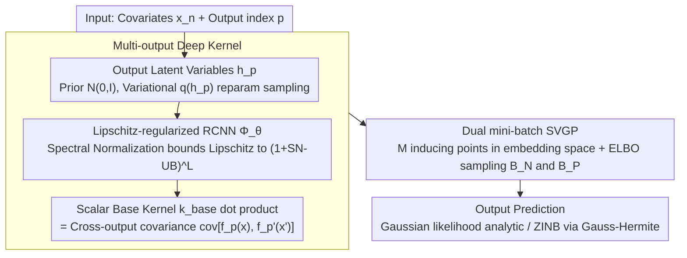

# Transformed Latent Variable Multi-Output Gaussian Processes

**Conference**: ICML 2026  
**arXiv**: [2605.05133](https://arxiv.org/abs/2605.05133)  
**Code**: The paper does not provide an explicit repository address in the main text  
**Area**: Computational Biology  
**Keywords**: Multi-output Gaussian Processes, Deep Kernels, Lipschitz Regularization, SVGP, Spectral Normalization

## TL;DR
This paper proposes T-LVMOGP: it transforms the core modeling problem of Multi-output Gaussian Processes (MOGP)—constructing the cross-output covariance $k_{p,p'}(x, x')$—into "computing dot products with a single scalar base kernel in a Lipschitz-regularized RCNN embedding space." Fully integrated into the SVGP framework, it enables MOGPs to handle $P > 10,000$ outputs (including spatial transcriptomics data with ZINB likelihoods) with high expressivity and scalability for the first time, consistently outperforming baselines such as SV-LMC, OILMM, and GS-LVMOGP.

## Background & Motivation
**Background**: Multi-output Gaussian Processes (MOGP) extend single-output GPs to vector-valued observations, widely used in medical time series, climate modeling, spatial transcriptomics, and robot inverse dynamics. The classic Linear Model of Coregionalization (LMC) expresses each output $f_p$ as a linear combination of shared latent GPs $f_p = \sum_{q,r} \alpha_{p,r}^{(q)} g_r^{(q)}$, making the cross-output covariance equivalent to a linear kernel on latent output embeddings, which is structurally low-rank. LV-MOGP further assigns a latent variable $h_p$ to each output and applies any valid kernel over $\{h_p\}$, which was extended to sum-of-separable kernels in GS-LVMOGP.

**Limitations of Prior Work**: The complexity of standard MOGP is $O(P^3)$ with respect to the number of outputs $P$, which becomes prohibitive in high-dimensional scenarios like climate ($P \sim 10^4$) and spatial transcriptomics ($P \sim 5,000$ genes). Existing scalable solutions either enforce rigid structural assumptions like Kronecker, low-rank, or sum-of-separable forms, or use naive neural deep kernels which suffer from feature collapse, loss of distance awareness, and overconfident predictions.

**Key Challenge**: Scalability, structural flexibility, and uncertainty reliability are difficult to satisfy simultaneously—LMC/OILMM sacrifice expressivity for scalability, naive deep kernel GPs sacrifice uncertainty for expressivity, and GS-LVMOGP remains limited by fixed kernel-like structures despite using sum-of-separable forms.

**Goal**: Construct an MOGP framework that achieves (i) scalability with respect to $P$ (mini-batching over both inputs and outputs); (ii) a cross-output covariance free of structural assumptions; (iii) preservation of GP distance awareness and uncertainty credibility; and (iv) natural compatibility with non-Gaussian likelihoods and recent tighter variational bounds.

**Key Insight**: Decouple two tasks in MOGP—"assigning an embedding to each output" and "calculating covariance over those embeddings." The former is handled by learnable latent variables $h_p$ and a neural mapping, while the latter is handled by a standard single-output SVGP inference pipeline. As long as the embedding space satisfies Lipschitz continuity, the pitfalls of deep kernels can be mitigated.

**Core Idea**: Concatenate $(x, h_p)$ and map them to an embedding space via a Lipschitz-regularized RCNN $\Phi_\theta$. The cross-output covariance is defined as $\text{cov}[f_p(x), f_{p'}(x')] = k_{\text{base}}(\Phi_\theta(x, h_p), \Phi_\theta(x', h_{p'}))$. This reduces MOGP to a scalar GP with inducing points in the embedding space, enabling standard SVGP mini-batch training.

## Method

### Overall Architecture
T-LVMOGP addresses the issue of scaling MOGP to tens of thousands of outputs without relying on rigid structural assumptions. It decomposes MOGP into two independent components: learning a latent variable embedding for each output, and then calculating similarity using a standard scalar GP in the embedding space. The architecture consists of three layers: the Latent Variable Layer provides a Gaussian prior $p(h_p) = \mathcal{N}(0, I)$ for each output $p$, approximated by a variational distribution $q(h_p) = \mathcal{N}(m_p, \Sigma_p)$; the Embedding Layer uses a Lipschitz-regularized Residual CNN $\Phi_\theta : \mathbb{R}^{D_X} \times \mathbb{R}^{D_H} \to \mathbb{R}^{D_T}$ to encode $(x_n, h_p)$ into $\tilde{x}_{n,p}$; the GP Layer places $M$ inducing points $Z$ in the embedding space, calculating $q(f_p(x_n)) = \int q(u) p(f_p(x_n) | u) du$ via standard SVGP. The entire pipeline remains differentiable through reparameterization $h_p^{(j)} = m_p + \Sigma_p^{1/2} \epsilon^{(j)}$, enabling simultaneous mini-batching over inputs $\mathcal{B}_N$ and outputs $\mathcal{B}_P$.

### Key Designs

**1. Multi-output Deep Kernel constructed via Latent Variables and Neural Embeddings: Breaking the Low-rank/Kronecker chains**

A long-standing criticism of MOGPs is that cross-output covariances $k_{p,p'}(x, x')$ are either modeled as low-rank linear combinations (LMC/OILMM) or forced into a sum-of-separable form (GS-LVMOGP), restricting expressivity. Ours assigns a learnable latent variable $h_p$ to each output, concatenates the "output ID" and "input," and passes them into $\Phi_\theta$ to obtain embedding $\tilde{x}_{n,p}$. All cross-output covariances are then written as a scalar base kernel dot product in the embedding space: $k_{p,p'}(x, x') = k_{\text{base}}(\Phi_\theta(x, h_p), \Phi_\theta(x', h_{p'}))$ (defaulting to ARD-RBF). This step compresses the $P$-dimensional multi-output GP into a single scalar GP in the embedding space. This bypasses $O(P^3)$ complexity via SVGP and retains uncertainty regarding output relationships by treating $h_p$ Bayesly. Appendix D proves this kernel class strictly contains the separable and sum-of-separable kernels of LV-MOGP as special cases.

**2. Lipschitz-regularized RCNN: A safety valve for Deep Kernels**

Deep kernels using standard neural networks for embeddings suffer from feature collapse, loss of distance awareness, and overconfidence on OOD inputs because the network can arbitrarily "squash" distant points. Ours uses a Residual CNN (RCNN) with a controllable Lipschitz constant as $\Phi_\theta$. Residual connections preserve expressivity, while spectral normalization (estimating the maximum singular value via power iteration) constrains the spectral norm of each layer's weights within an upper bound SN-UB. Consequently, the overall Lipschitz constant of an $L$-layer network is bounded by $(1 + \text{SN-UB})^L$. This ensures the embedding map does not collapse distant inputs, preserving the "close is similar, far is different" property of GPs. Results from Bartlett et al. guarantee that this restricted parameterization can still represent a wide class of smooth Lipschitz maps. This constraint is crucial; removing spectral normalization causes the EEG NLL to jump from 0.814 to 4.109, the most significant impact in the ablation study.

**3. Dual mini-batch SVGP: Enabling $P>10^4$ and non-Gaussian Likelihoods**

Scaling to tens of thousands of outputs requires inference that is scalable to both $N$ inputs and $P$ outputs. This paper places $M$ inducing points $Z$ in the embedding space and optimizes the ELBO:

$$\mathcal{L}_3 = \sum_n \sum_p \mathbb{E}_{q(h_p) q(f_p(x_n))}[\log p(y_{n,p}|f_p(x_n))] - \mathrm{KL}[q(u)\|p(u)] - \sum_p \mathrm{KL}[q(h_p)\|p(h_p)]$$

The key is treating the $P$-dimensional output space as a "sampleable dimension." Unlike previous SVGP-on-MOGP methods that only mini-batch over inputs, ours simultaneously samples $\mathcal{B}_N$ and $\mathcal{B}_P$ to estimate $\tilde{\mathcal{L}}_3$, making training for $P>10^4$ feasible within memory constraints. The complexity reduces to $O(N_b P_b M^2 + M^3)$, plus $O(Tmn)$ for spectral normalization (negligible given RCNN width $\sim 10$ and depth $\sim 5$). The framework is likelihood-agnostic: Gaussian likelihoods are analytic, while non-Gaussian likelihoods like ZINB use Gauss-Hermite quadrature or MC estimation. Tighter variational bounds (Titsias 2025 / Bui 2025) can be integrated by adding a term $\Delta = \frac{1}{2} \sum_n [d_n / \sigma_y^2 - \log(1 + d_n/\sigma_y^2)]$.

### Loss & Training
The training objective is the negative ELBO $-\mathcal{L}_3$. Expectations are computed analytically for Gaussian likelihoods and via Gauss-Hermite quadrature or MC with reparameterization for non-Gaussian likelihoods. Mini-batches are sampled from both inputs and outputs. Primary hyperparameters include the number of inducing points $M$, the spectral norm upper bound SN-UB, latent dimension $D_H$, and embedding dimension $D_T$. SN-UB exhibits a clear trade-off (too strict loses expressivity, too loose leads to overfitting) and must be tuned per dataset—approximately $0.005$ for EEG and $1.0$ for SARCOS.

## Key Experimental Results

### Main Results

| Dataset | Metric | T-LVMOGP (Ours) | Next Best Baseline | Remarks |
|---|---|---|---|---|
| EEG ($P=7$) | MSE / NLL | **0.115 / 0.814** | SV-LMC 0.282 / 0.857 | Electrode voltage prediction |
| SARCOS ($P=7, N \approx 5 \times 10^4$) | MSE / NLL / Time | **0.022 / -0.485 / 5.26 s** | G-MOGP 0.023 / -0.483 / 5.89 s | Robot arm inverse dynamics |
| ERA5 ($P=3395$) | MSE / NLL | **0.002 / -1.564** | GS-LVMOGP 0.014 / -0.699 | UK 2m temperature (30 months) |
| Copernicus Marine ($P=21679$) | MSE / NLL / Time | **0.029 / -0.439 / 1.23 s** | GS-LVMOGP($Q=3$) 0.035 / 4.975 / 2.08 s | Sea surface temp, output extrapolation |
| Spatial Transcriptomics ($P=5000$, ZINB) | MSE / NLL | **9.189 / 0.674** | GS-LVMOGP($Q=3$) 11.024 / 0.674 | $\approx 2.18 \times 10^7$ observations |

### Ablation Study

| Configuration | EEG NLL | SARCOS NLL | ERA5 (random) NLL |
|---|---|---|---|
| Full T-LVMOGP | **0.814** | **-0.485** | **-1.564** |
| w/o Spectral Norm (SN) | 4.109 | 0.112 | -1.401 |
| w/o Neural Network (Identity) | 1.153 | -0.336 | -1.554 |
| SN-UB at 0.001 (EEG) / 0.1 (SARCOS) | 1.371 | -0.363 | — |
| Tighter variational bound | — | -0.502 | — |

### Key Findings
- Spectral normalization is an indispensable "safety valve" for deep kernel GPs: EEG NLL dropped from 4.109 to 0.814, the largest impact among all ablations. On larger datasets like ERA5, the impact is smaller but consistent, indicating that smaller data poses higher overfitting risks, making Lipschitz constraints more critical.
- SN-UB follows an "optimum in the middle" curve: excessive strictness (0.001) lacks expressivity, while excessive looseness (no SN) degrades to a standard deep kernel.
- In the Copernicus Marine output extrapolation task, T-LVMOGP's NLL is significantly better than GS-LVMOGP's 4.975 (-0.439, a ~5.4 nat difference), demonstrating the flexibility of deep kernels for generalizing to new outputs.
- The combination of a single-layer GP and complex embeddings outperforms multi-kernel GPs in wall-clock time on large problems (SARCOS 5.26s/epoch vs G-MOGP 5.89s), suggesting that shifting complexity from kernel stacking to embedding networks is a high-value design.

## Highlights & Insights
- The abstraction of "using a single scalar GP in embedding space to represent any MOGP" is elegant—it liberates MOGP from Kronecker/low-rank constraints into "geometric deep kernel GP + output embedding," sharing methodology with metric learning and CLIP.
- Applying Lipschitz constraints to deep kernels is a known technique (DUE/SNGP), but its application to MOGP is insightful: MOGP inherently requires output-to-output distance preservation, which spectral normalization maintains.
- Dual mini-batching (simultaneously sampling $N$ and $P$) is the key engineering factor for pushing MOGP to $P > 10^4$.
- Compatibility with ZINB likelihoods allows spatial transcriptomics data (zero-inflated counts) to be handled by the same model, extending MOGP from Gaussian regression to biomedical scenarios.

## Limitations & Future Work
- The latent variable posterior uses a mean-field factorization $q(H) = \prod_p q(h_p)$, which cannot capture posterior correlations between outputs. The authors suggest structured variational or amortized inference for future work.
- SN-UB requires tuning per dataset (EEG 0.005 vs SARCOS 1.0), and an automatic selection strategy is missing, which reduces "out-of-the-box" usability.
- Rules for choosing embedding dimension $D_T$ and latent dimension $D_H$ lack theoretical guidance beyond empirical values.
- Lipschitz constraints ensure distance awareness but do not directly guarantee calibration, especially for reliability on highly OOD inputs.
- For outputs with highly non-smooth structures (e.g., jumps in time series), a single stationary base kernel may be insufficient, requiring the embedding layer to capture all non-stationarity, which might demand larger $\Phi_\theta$ capacity or looser SN-UB.

## Related Work & Insights
- **vs LMC / OILMM / SV-LMC**: These structure cross-output covariance as low-rank matrices; Ours completely abandons low-rank assumptions using deep kernels, showing significant MSE improvements on EEG/ERA5.
- **vs LV-MOGP / GS-LVMOGP (Dai 2017 / Jiang 2025)**: Direct predecessors; Appendix D proves Ours strictly contains sum-of-separable kernels as special cases and outperforms GS-LVMOGP across multiple datasets.
- **vs G-MOGP (Dai 2024)**: G-MOGP uses an attention-based graph model to construct expressive priors; T-LVMOGP achieves similar goals via deep kernel embeddings with shorter training times.
- **vs DUE / SNGP (Van Amersfoort 2021 / Liu 2020)**: Ours adapts the core idea of Lipschitz-regularized deep kernels from single-output GPs to the MOGP setting with SVGP integration.
- **vs Tighter Variational Bounds (Titsias 2025 / Bui 2025)**: The authors demonstrate that these bounds can be seamlessly integrated, yielding a small NLL improvement on SARCOS.

## Rating
- Novelty: ⭐⭐⭐⭐ Abstracting arbitrary MOGP into an embedding space scalar GP + Lipschitz deep kernel is a clean and original combination.
- Experimental Thoroughness: ⭐⭐⭐⭐ Covers a wide range from $P=7$ (EEG) to $P > 21,000$ (Marine Temp) and ZINB spatial transcriptomics.
- Writing Quality: ⭐⭐⭐⭐ Clear formulas and alignment with Figures 1/2; strong structural sense.
- Value: ⭐⭐⭐⭐ Unshackles MOGPs from low-rank/Kronecker constraints, providing practical utility for large-scale multi-output modeling.

<!-- RELATED:START -->

## Related Papers

- [\[ICML 2026\] Flow Sampling: Learning to Sample from Unnormalized Densities via Denoising Conditional Processes](flow_sampling_learning_to_sample_from_unnormalized_densities_via_denoising_condi.md)
- [\[ICML 2025\] MF-LAL: Drug Compound Generation Using Multi-Fidelity Latent Space Active Learning](../../ICML2025/computational_biology/mf-lal_drug_compound_generation_using_multi-fidelity_latent_space_active_learnin.md)
- [\[ICML 2026\] Scalable Single-Cell Gene Expression Generation with Latent Diffusion Models](scalable_single-cell_gene_expression_generation_with_latent_diffusion_models.md)
- [\[ICML 2026\] iLoRA: Bayesian Low-Rank Adaptation with Latent Interaction Graphs for Microbiome Diagnosis](ilora_bayesian_low-rank_adaptation_with_latent_interaction_graphs_for_microbiome.md)
- [\[ICML 2026\] Routing by Reaching: Composition of Pre-trained GFlowNets for Multi-Objective Generation](routing_by_reaching_composition_of_pre-trained_gflownets_for_multi-objective_gen.md)

<!-- RELATED:END -->
