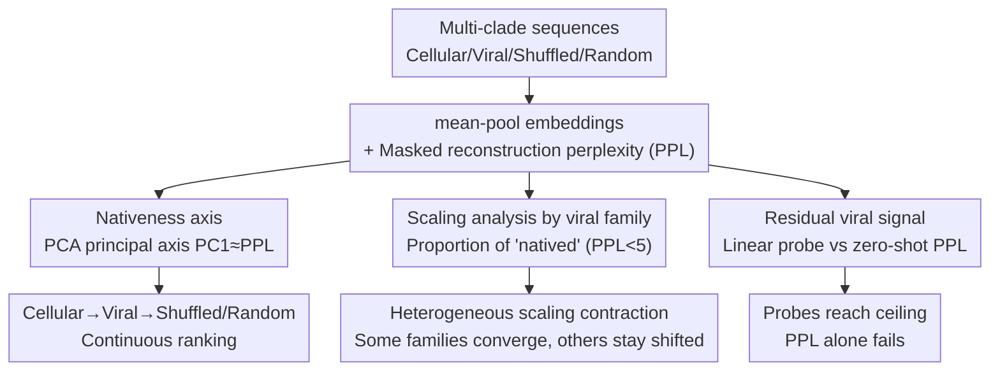

# Viral Proteins Reveal Geometry of Protein Language Models

**Conference**: ICML 2026  
**arXiv**: [2606.12609](https://arxiv.org/abs/2606.12609)  
**Code**: Available (Authors provide open-source scripts for embedding extraction and reproduction)  
**Area**: Computational Biology / Interpretability  
**Keywords**: Protein Language Models, Viral Proteins, Nativeness Axis, Linear Probing, Representation Geometry

## TL;DR
Using viral proteins as probes, this paper discovers a "nativeness axis" (PC1) in the embedding space of ESM-series protein language models (pLMs), dominated by masked reconstruction perplexity. This axis ranks sequences from well-modeled cellular proteins, through viral proteins, to shuffled/random sequences. It further demonstrates that embeddings retain "residual viral signals" beyond perplexity—linear probes can distinguish viral from cellular proteins near performance ceilings, whereas perplexity alone cannot.

## Background & Motivation
**Background**: pLMs trained on massive sequence databases have become universal representation tools for structure prediction, inverse folding, and functional prediction. Recently, mechanistic interpretability has emerged to deconstruct what these models learn. However, training data is extremely imbalanced, and mainstream analysis almost exclusively focuses on cellular proteins.

**Limitations of Prior Work**: Little is known about how pLMs represent biological clades that are functional but severely under-represented in pre-training data and evolutionarily distinct from cellular proteins. Viral proteins are typical examples—they are shaped by host dependence, high mutation rates, compact genomes, and multifunctionality, and pLMs perform significantly worse on benchmarks like viral mutation effect prediction.

**Key Challenge**: While viral proteins are clearly separated from cellular proteins in pLM representation space (prior work found mean-pooled ESM2 embeddings can linearly distinguish them), the driver of this "separation" remains unclear—is it simply because viral proteins are "harder for the model to reconstruct" (i.e., less native), or do embeddings truly encode viral-specific biological information?

**Goal**: To decompose this problem into two questions. First, can the viral separation be primarily explained by "low nativeness" (viral proteins being poorly modeled relative to the pre-training distribution)? Second, does the embedding retain viral-specific information beyond nativeness?

**Key Insight**: The authors utilize "masked reconstruction perplexity" (PPL) as a **model-relative** measure of nativeness—it directly aligns with the training objectives of ESM2/ESMC, where lower values indicate sequences that better fit the statistical patterns learned during pre-training. Geometry is analyzed via PCA, while information sources are deconstructed using linear probes vs. zero-shot PPL classifiers.

**Core Idea**: A "nativeness axis" is used to unify the explanation of the viral-cellular displacement, while the "AUC gap where the probe exceeds PPL" quantifies the residual viral-specific signal. The former represents the primary geometric axis, and the latter represents information not captured by that axis.

## Method

### Overall Architecture
Ours does not propose a new model but rather an analysis framework for representation geometry using "viral proteins as probes." The input consists of protein sequences from multiple clades across the Tree of Life (six cellular + four viral) plus three "non-biological" controls (shuffled cellular, shuffled viral, i.i.d. random). Models span three ESM families across three orders of magnitude in parameter scale. For each sequence, the last-layer residue embeddings are mean-pooled to obtain a sequence vector, and a masked reconstruction perplexity (PPL) is calculated. Three parallel analysis lines are conducted: ① Joint PCA on embeddings of all clades to see if viral separation concentrates on a single principal axis; ② Scaling analysis at the human viral family level to see how "natived proportions" change; ③ Comparison of AUCs between linear probes, zero-shot PPL classifiers, and shallow sequence baselines on homology-de-leaked viral/cellular classification sets to isolate residual signals.

### Key Designs

**1. Masked Reconstruction Perplexity: Defining "Nativeness" as Model-Relative Reconstruction Difficulty**

To answer whether viral separation is due to modeling difficulty, a scalar quantifying "nativeness" is required. The authors reuse the pLM training objective: for each sequence $\mathbf{x}$, a proportion $p=0.15$ of residue positions (excluding BOS/EOS) is randomly masked, and the log-likelihood of masked tokens is calculated to obtain the perplexity:

$$\mathrm{PPL}(\mathbf{x}) = \exp\!\left(\frac{1}{|\mathcal{M}|}\sum_{i\in\mathcal{M}} -\log p_\theta\!\left(x_i \mid \mathbf{x}_{\setminus\mathcal{M}}\right)\right)$$

where $\mathcal{M}$ is the set of masked positions. Results are averaged over three independent maskings per sequence. The key is that this definition is "model-relative": whether a sequence is native depends on how well it matches the statistical patterns learned by that specific model, rather than a fixed external standard. This aligns with the objectives of ESM2/ESMC and the sequence branch of ESM3, such that lower PPL $\approx$ more "native."

**2. Nativeness Axis: A Dominant Geometric Direction in Embedding Space Aligned with PPL**

Performing joint PCA on sequence embeddings from ten biological clades and three controls reveals that viral separation is highly concentrated on **PC1**. In ESMC-600M, PC1 explains 73.1% of the variance and has a Spearman correlation of $\rho=+0.961$ with PPL. This axis ranks sequences from "well-reconstructed cellular proteins (low PPL, left)," through the "viral zone," to "hard-to-reconstruct shuffled/random controls (high PPL, right)." Viral proteins occupy the middle ground—less native than cellular proteins, but more structured than non-biological sequences. The authors name PC1 the **nativeness axis**. This axis is not an artifact of a specific model: it remains strongly correlated in ESM2-650M (PC1 explains 54.3%, $\rho=+0.926$) and ESM3-open ($\rho=+0.935$). It even extends beyond the masked LM objective—autoregressive ProGen2 and discrete diffusion EvoDiff also exhibit PC1≈PPL alignment and the five-tier ranking of "Cellular→Viral→Shuffled→Random." A control against "data exposure" shows that 1723 cellular proteins released **after** the ESMC-600M checkpoint have a median PPL of 5.3, which is closer to the cellular reference (3.2) than the viral reference (15.3)—indicating the displacement reflects "compatibility with cellular-dominant priors" rather than simple presence in the training set.

**3. Scaling Analysis by Viral Family: Heterogeneous rather than Uniform Contraction of the Nativeness Axis**

Analyzing the "viral set" as a whole masks internal differences. The authors downsample to the human viral **family** level and define "natived proportion" as the percentage of sequences in a family with $\mathrm{PPL}<5$. Scaling the model size only slightly increases the nativeness of human viruses on average (climbing from ~5% at 300M to ~17% at 6B), but **variance between families is extreme**. *Papillomaviridae* and *Retroviridae* show ~60% Gain with scaling, while *Orthomyxoviridae*, *Orthoherpesviridae*, and *Sedoreoviridae* remain largely outside the native zone even at 6B. The interpretation is that scaling primarily reduces reconstruction difficulty for families that are "already closer to the learned protein priors." Families that can be "natived" often have **cellular homologs** (e.g., reverse transcriptase in *Retroviridae* also exists in eukaryotic retrotransposons); their protein domains are already present in the cellular-dominated training distribution, making them more compatible with the pLM.

**4. Linear Probing vs. Zero-shot PPL: Isolating Residual Viral Signals Beyond Reconstruction Difficulty**

This is the core decomposition for the second question. On a **homology-de-leaked** human viral/cellular classification set (10,400 sequences clustered via MMseqs2 at 30% identity and 80% coverage), the authors compare two readouts: an $\ell_2$-regularized logistic regression **linear probe** trained on mean-pooled embeddings, and a **zero-shot PPL classifier** using only negative perplexity $s(\mathbf{x})=-\mathrm{PPL}(\mathbf{x})$ (reporting $\max(\mathrm{AUC}, 1-\mathrm{AUC})$ for comparability). Three shallow sequence baselines (length, amino acid composition, dipeptide composition) provide the lower bound for the performance "ceiling." The key finding is that the two curves **diverge with scale**: linear probes exceed shallow baselines at all scales and reach a ceiling of AUC∈[0.97, 1.00] on large models, while the PPL classifier is weaker and non-monotonic—it improves at intermediate scales but declines for ESM2-15B and ESM3-large. This is because scaling makes some viral proteins "more native" (moving into the low PPL zone), thereby weakening the discriminative power of PPL alone. In other words, large models allow viral proteins to "look more native" under the reconstruction objective, yet **still retain a linearly accessible viral signal in the embeddings**—this signal is the part that the nativeness axis cannot account for.

### Loss & Training
Ours does not train the pLM backbone but fits lightweight classification heads on frozen embeddings: linear probes are $\ell_2$-regularized logistic regressions on standardized embeddings. Zero-shot classifiers require no training (direct ranking by $-\mathrm{PPL}$). Shallow baselines use logistic regression on length (1D), AA composition (20D), or dipeptide composition (400D). All metrics are reported as AUC-ROC on a held-out test split.

## Key Experimental Results

### Main Results
Pre-training data imbalance is the premise of the study (Adapted from Table 1):

| Clade | UniRef50 Clusters | Description |
|------|--------------|------|
| All Cellular Proteins | 46.3 M | Dominates pre-training distribution |
| All Viral Proteins | 390.3 k | Includes phage/plant/invertebrate/human viruses |
| Cellular : Viral Ratio | **119×** | Extreme imbalance |

Viral/Cellular Classification AUC (human virus set, homology-de-leaked test split; representative scales):

| Readout Method | Typical AUC | Behavior with Scale |
|----------|---------|--------------|
| Embedding Linear Probe | 0.97–1.00 (Ceiling for large models) | Monotonic increase, near ceiling |
| Zero-shot PPL Classifier | Significantly lower | Non-monotonic, drops for ESM2-15B / ESM3-large |
| Best Shallow Baseline (Dipeptide) | Upper edge of the "gray zone" | Linear probe always superior |

Cross-Architecture Robustness: ProGen2 and EvoDiff achieve probe AUCs of 0.984 and 0.986, respectively, and the PC1–PPL alignment ($\rho=+0.90, +0.95$) also holds.

### Low False Positive Scenarios (Biosecurity Screening)
In the low FPR region relevant for screening, the probe's advantage over PPL is most acute:

| Model | TPR at FPR=1% (Probe) | TPR at FPR=1% (PPL) |
|------|----------------|----------------|
| ESM2-15B | 88.3% | 26.9% |
| ESMC-6B | 96.7% | 39.2% |
| ESM3-large | 90.6% | 36.1% |

At 0.1% FPR, the probe TPR rises from 6.2% for ESM2-8M to 55.4% for ESM2-15B, and from 47.9% for ESMC-300M to 83.4% for ESMC-6B—scaling enhances the practical screening utility of embeddings even while PPL alone becomes less reliable.

### Key Findings
- **The Nativeness Axis is a Unified Interpreter**: A single axis (PC1, explaining 54%–73% of variance) captures the majority of the cellular-viral displacement and positions viral proteins between "native cellular proteins" and "meaningless controls."
- **Scaling Contraction is Selective**: Families with cellular homologs (*Papillomaviridae*, *Retroviridae*) nativize significantly with scaling (~+60% Gain), while families without such support (*Orthomyxoviridae*, etc.) remain displaced even at 6B.
- **Residual Signals are Independent of Reconstruction Difficulty**: Probes and PPL classifiers diverge with scale, and probes outperform dipeptide composition baselines, indicating they do not merely exploit simple sequence statistics.
- **Direct Viral Exposure is Not Required**: ESM3-open contains zero viral training sequences yet still exhibits a nativeness axis and linear viral separability—the displacement is a result of "relative distance to cellular priors" rather than "exposure history."

## Highlights & Insights
- **The Training Objective as a Metric**: Defining "model-relative nativeness" via PPL is clean and transferable; it requires no labels and naturally aligns with the ESM objective. This approach of "PPL as nativeness" can be applied to any masked sequence model.
- **Geometric Primary Axis ≈ Loss Proxy**: The correlation $\rho > 0.92$ between PC1 and PPL across architectures suggests that masked pLMs may spontaneously develop a dominant direction aligned with model fit—a strong empirical phenomenon worthy of theorization.
- **"Probe minus PPL" = Residual Signal**: Using the AUC gap between two readouts of the same model cleanly separates "reconstruction difficulty" from "viral-specific information," offering a more convincing methodology than simply observing successful classification.
- **Analogy to Multilingual Models**: The authors suggest that low-resource languages/dialects in multilingual LMs are counterparts to viral proteins in pLMs—a cross-domain hypothesis to test if the nativeness axis is a universal property of large masked sequence models.

## Limitations & Future Work
- The main analysis focuses on the ESM family; evidence for ProGen2/EvoDiff is preliminary. Systematic surveys across architectures and scales remain for future work, as family rankings under scaling are objective-dependent.
- Observation: The fixed threshold $\mathrm{PPL}<5$ for "nativeness" is an empirical choice; since absolute PPL scales vary across model families, cross-family comparisons of "natived proportions" should be cautious. The "homolog explanation" for family nativeness is currently a qualitative attribution rather than a systematic causal test.
- Biosecurity implications are conservatively stated as "potentially supplementing homology screening"; actual deployment systems were not evaluated. Better viral-like discrimination also implies dual-use risks.
- Future work: Fine-tuning on viral sequences could lower viral PPL and push them toward the native zone without damaging probe performance. Understanding the mathematical/statistical origin of the nativeness axis (high-dimensional mixture geometry? general property of masking?) is the most valuable follow-up direction.

## Related Work & Insights
- **vs. Ofer & Linial (Viral/Cellular Linear Separability)**: They proved viral and cellular proteins are linearly separable via mean-pooled ESM2 embeddings but did not explain the driver. Ours uses PPL and the Nativeness Axis to decompose this into "low nativeness + residual signal."
- **vs. Gurev et al. (Viral Mutation Effect Benchmarks)**: They found pLMs lag on viral benchmarks. Ours provides a geometric reason—viruses lie in a displaced zone relative to cellular priors—and proposes "low nativeness" as a diagnostic (caution should be used for zero-shot predictions in low-nativeness families).
- **vs. SAE-based Mechanistic Interpretability (Adams/Simon/Silberg, etc.)**: These works use Sparse Autoencoders to find binding sites or structural motifs but rarely examine viral proteins. Ours fills the gap regarding whether pLMs encode viral-specific signals and provides quantitative answers via linear probing.

## Rating
- Novelty: ⭐⭐⭐⭐⭐ Using viral proteins as probes to discover and name the "nativeness axis" is a fresh and unifying perspective.
- Experimental Thoroughness: ⭐⭐⭐⭐ Spans three ESM families, three orders of scale, involves ProGen2/EvoDiff, and includes homology-de-leaking and low FPR analysis.
- Writing Quality: ⭐⭐⭐⭐⭐ Driven by two clear questions; the geometric findings and biological interpretations are naturally bridged.
- Value: ⭐⭐⭐⭐ Provides a transferable diagnostic (nativeness) for pLM interpretability and offers practical insights for viral screening and biosecurity.

<!-- RELATED:START -->

## Related Papers

- [\[ICML 2026\] Circuit Tracing in Autoregressive Protein Language Models](circuit_tracing_in_autoregressive_protein_language_models.md)
- [\[ICLR 2026\] Controlling Repetition in Protein Language Models](../../ICLR2026/computational_biology/controlling_repetition_in_protein_language_models.md)
- [\[ICML 2026\] Protein Language Model Embeddings Improve Generalization of Implicit Transfer Operators](protein_language_model_embeddings_improve_generalization_of_implicit_transfer_op.md)
- [\[ICLR 2026\] Towards Understanding the Shape of Representations in Protein Language Models](../../ICLR2026/computational_biology/towards_understanding_the_shape_of_representations_in_protein_language_models.md)
- [\[NeurIPS 2025\] Learning Conformational Ensembles of Proteins Based on Backbone Geometry](../../NeurIPS2025/computational_biology/learning_conformational_ensembles_of_proteins_based_on_backbone_geometry.md)

<!-- RELATED:END -->
