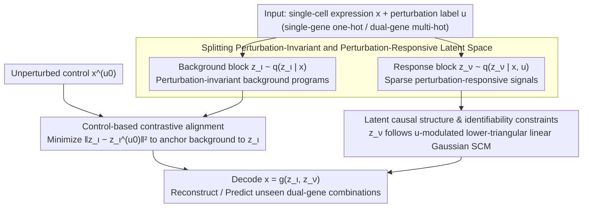

# What Makes a Representation Good for Single-Cell Perturbation Prediction?

**Conference**: ICML2026  
**arXiv**: [2605.19343](https://arxiv.org/abs/2605.19343)  
**Code**: No public code  
**Area**: Scientific Computing / Single-cell Perturbation Prediction  
**Keywords**: Single-cell, Perturbation Prediction, Variational Autoencoder, Causal Representation, Combinatorial Generalization  

## TL;DR
This paper proposes PerturbedVAE, arguing that an effective representation for single-cell perturbation prediction must explicitly separate the dominant perturbation-invariant background programs from the sparse perturbation-response signals, while organizing the latter with a causal structure to better generalize to unseen dual-gene combinatorial perturbations.

## Background & Motivation
**Background**: Single-cell perturbation modeling aims to predict how cellular gene expression profiles change after genes are intervened upon via methods such as CRISPR. Such models are crucial for drug discovery, understanding gene regulation mechanisms, and designing combinatorial perturbations. Existing methods generally follow two paths: causal representation learning, which uses latent variables and structural equations to characterize perturbation mechanisms; and single-cell foundation models, which learn universal representations using large-scale transcriptomic data.

**Limitations of Prior Work**: Single-cell expression data contains an easily overlooked imbalance: most expression changes stem from perturbation-invariant factors like cell type, background programs, and technical noise, while the signals truly induced by specific perturbations are sparse. To fit the overall distribution, universal foundation models often prioritize encoding the dominant background, suppressing perturbation-specific information. Causal representation methods also mix background information into perturbation-related latent variables without explicit separation, leading to impure representation semantics.

**Key Challenge**: Perturbation prediction must both preserve the background cellular state and extract sparse but critical perturbation-specific signals. Emphasizing only reconstruction allows the model to explain everything via background variables; emphasizing only perturbation variables results in the loss of the cellular base state. The true difficulty lies in extracting sparse perturbation effects under strong background signals and organizing them into a structure capable of combinatorial generalization.

**Goal**: The authors propose the perturbation suppression hypothesis to explain why foundation models and general causal representation methods fail. Subsequently, PerturbedVAE is designed to split the latent space into perturbation-invariant and perturbation-responsive blocks, supported by contrastive alignment, conditional latent causal models, and identifiability analysis.

**Key Insight**: Starting from the question "What makes a representation good for perturbation prediction?", the answer is not a larger model or a more complex regressor, but that the representation must be perturbation-aware: explicitly extracting perturbation-specific information first, and then utilizing this information with a causal structure to predict unseen combinatorial interventions.

**Core Idea**: Use control cells to align perturbation-invariant latent variables, fixing background programs in $z_\iota$. The remaining perturbation-response signals are placed in $z_\nu$, utilizing a perturbation-conditioned latent causal structure to generate and combine effects of unseen perturbations.

## Method
PerturbedVAE can be viewed as a structured VAE for single-cell perturbation data. While a standard VAE aims to reconstruct expression profiles, the authors here define specific roles for latent variables: $z_\iota$ represents perturbation-invariant background programs, and $z_\nu$ represents perturbation-responsive factors. During training, the model views both perturbed and unperturbed control samples simultaneously, ensuring that $z_\iota$ remains consistent between them. This allows background variations to be absorbed by $z_\iota$, forcing $z_\nu$ to express the residual changes brought by the perturbation. To predict unseen combinatorial perturbations, the model infers $z_\iota$ from control cells and inputs the dual-gene perturbation vector into a learned perturbation-conditioned mechanism to generate $z_\nu$, which is then decoded into an expression profile.

### Overall Architecture
The input consists of a single-cell expression vector $x$ and a perturbation label $u$, where $u$ can be a one-hot single-gene perturbation or a multi-hot vector for dual-gene combinations. The generative model assumes $x=g(z)$, where $z=(z_\iota,z_\nu)$. $z_\iota$ is perturbation-independent and characterizes background cellular programs; $z_\nu$ depends on $u$ and $z_\iota$, following an unknown DAG that represents causal dependencies between perturbation-responsive programs. The variational posterior is factorized as $q(z_\nu,z_\iota|x,u)=q(z_\nu|x,u)q(z_\iota|x)$, corresponding to "perturbation response requires labels, while the background is inferred from expression itself."

### Key Designs

**1. Splitting Perturbation-Invariant and Perturbation-Responsive Latent Space: Pre-defining latent roles to prevent background from overwhelming perturbation signals**

In single-cell expression, background cellular programs, cell types, and technical noise account for the vast majority of variance, while signals truly induced by perturbations are sparse. If the latent space is not specialized, a VAE can achieve good reconstruction by using a large block of background variables, suppressing perturbation-specific information. This work explicitly splits latent variables into two blocks: $z_\iota$ representing background programs stable across perturbations, with a prior independent of label $u$; and $z_\nu$ representing response factors that change with perturbations, with a conditional distribution $p(z_\nu|u,z_\iota)$. The generative model is defined as $x=g(z_\iota,z_\nu)$, and the variational posterior is factorized as $q(z_\nu,z_\iota|x,u)=q(z_\nu|x,u)\,q(z_\iota|x)$—the background utilizes expression only, while the response also considers the perturbation label. The ELBO reconstruction term ensures the combination explains the expression profile, while the KL term constrains latent capacity. This step provides clear semantic division, giving sparse perturbation effects a dedicated "storage space" rather than being drowned by dominant background changes.

**2. Contrastive alignment based on unperturbed controls: Anchoring the background to force out residual perturbation effects**

Splitting the latent space alone is insufficient—optimizing the ELBO might still allow background signals to leak into the perturbation-responsive block. For each perturbed sample $(x,u)$, this work additionally samples an unperturbed control profile $x^{(u_0)}$ and minimizes the distance between their background latent variables: $\mathcal{L}_{contrast}=\|z_\iota-z_\iota^{(u_0)}\|_2^2$. The total objective is $\mathcal{L}=-\mathcal{L}_{ELBO}+\alpha\mathcal{L}_{contrast}$. The intuition is: forcing $z_\iota$ to remain consistent between perturbed and unperturbed samples pins the dominant background variations to $z_\iota$, meaning they do not need to be explained by other latent variables. Consequently, $z_\nu$ is "squeezed" to represent only the residual changes caused by the perturbation. This term is critical for combinatorial generalization—on simulated data, the $R^2$ of the invariant block improved from 0.66 to 0.97, and on real-world dual-gene OOD data, $R^2$ improved from 0.9650 to 0.9865.

**3. Latent causal structure and identifiability constraints: Organizing the response block into a mechanism for combinatorial extrapolation**

After extracting perturbation signals, they must be usable for unseen combinatorial interventions; otherwise, $z_\nu$ is merely a compressed representation incapable of extrapolation. This work models $z_\nu$ as a linear Gaussian Structural Causal Model (SCM) modulated by perturbation label $u$, with the weight matrix restricted to be strictly lower-triangular to correspond to a DAG, allowing causal dependencies between perturbation-responsive programs to be explicitly combinable. Theoretically, identifiability conditions are provided: if the generative mapping is invertible and smooth, environmental (perturbation) changes are sufficiently rich, alignment reaches optimality, and interventions are diverse, then $z_\nu$ can be identified up to permutation and scaling, and $z_\iota$ up to a linear block transformation. Single-cell data often involve partial interventions (perturbing few genes), which do not satisfy traditional assumptions of "rich intervention" in causal representation learning. This analysis demonstrates that with explicit separation and sufficient environmental differences, sparse perturbation variables still have a chance to be recovered. It also explains why predicting unseen combinations requires first inferring $z_\iota$ from controls, feeding the dual-gene perturbation vector into this mechanism to generate $z_\nu$, and finally decoding the expression profile.

### Loss & Training
The training objective consists of the negative ELBO and contrastive alignment. The ELBO includes the reconstruction term $\mathbb{E}_{q}[\log p(x|z_\nu,z_\iota,u)]$ and the KL divergence from $q(z_\nu,z_\iota|x,u)$ to $p(z_\nu,z_\iota|u)$. Real-world experiments use the Norman2019 Perturb-seq: 105,528 K562 cells, 112 target genes, 105 single-gene and 131 dual-gene conditions. The training set includes controls and 105 single-gene perturbations, with 112 dual-gene perturbations reserved entirely for OOD testing. The optimizer is Adam, batch size 64, epoch 100, hidden dimension 256, learning rate $10^{-4}$, and alignment weight $\alpha=0.05$.

## Key Experimental Results

### Main Results

| Dataset / Setting | Metric | Ours | Prev. SOTA / Strong Baseline | Gain |
|--------|------|------|----------|------|
| Norman2019 Dual-gene OOD | RMSE ↓ | 0.4474±0.0007 | KNN 0.4894 / ElasticNet 0.4929 / STATE 0.4981 | 0.0420 lower than KNN |
| Norman2019 Dual-gene OOD | $R^2$ ↑ | 0.9865±0.0009 | UCE 0.9857 / KNN 0.9843 | Slightly better than best FM/baseline |
| Single-gene, z dim 105 | RMSE ↓ | 0.3995±0.0013 | SAMS-VAE 0.4123 / sVAE+ 0.5002 | Significantly lower |
| Dual-gene, z dim 105 | RMSE ↓ | 0.4474±0.0007 | SAMS-VAE 0.4629 / PerturbedVAE w/o Align 0.4623 | OOD more stable after alignment |
| Simulation identifiability | invariant $R^2$ ↑ | 0.97±0.0077 | w/o alignment 0.66±0.0281 | Alignment significantly improves recovery |

### Ablation Study

| Configuration | Key Metric | Description |
|------|---------|------|
| w/o contrastive alignment | Dual-gene RMSE 0.4626±0.0002, $R^2$ 0.9650±0.0002 | Combinatorial generalization drops without alignment |
| with contrastive alignment | Dual-gene RMSE 0.4474±0.0007, $R^2$ 0.9865±0.0009 | Alignment preserves information in $z_\iota$, boosting OOD |
| capacity: $z_\nu<z_\iota$ | Single RMSE 0.3995, Dual RMSE 0.4474 | Best performance with larger background block capacity |
| capacity: equal split | Single RMSE 0.4084, Dual RMSE 0.4627 | Insufficient background capacity hinders prediction |
| PerturbedVAE(MMD) | RMSE 0.5485, $R^2$ 0.9958, MMD 0.3077 | Even with MMD, it outperforms Discrepancy-VAE, showing gains beyond the loss type |

### Key Findings
- Representations from single-cell foundation models do not necessarily preserve linearly decodable perturbation labels. Linear probing shows that UCE, scFoundation, and Geneformer have weaker decodability for perturbation labels than direct PCA, supporting the perturbation suppression hypothesis.
- The alignment term is a key mechanism. In simulations, invariant block $R^2$ increased from 0.66 to 0.97; in real data, dual-gene OOD $R^2$ increased from 0.9650 to 0.9865.
- Background capacity cannot be too small. The optimal configuration is $z_\nu < z_\iota$, suggesting that while the task focuses on perturbation response, adequately modeling the invariant background is a prerequisite for extracting sparse perturbation signals.
- The additive baseline is strong on pseudobulk average response but yields negative $R^2$ at the cell-level; while PerturbedVAE does not always have the lowest pseudobulk error, it preserves explanatory variance at the single-cell level.

## Highlights & Insights
- The best insight is attributing the failure of single-cell perturbation prediction to signal ratio imbalance rather than model size. The perspective that perturbation-specific signals are sparse while background signals are dominant explains the different failure modes of foundation models and general CRL methods.
- The structural division of PerturbedVAE is clear: $z_\iota$ for background, $z_\nu$ for response, and contrastive alignment for separation. This design is more interpretable than simply adding more latent dimensions or deeper encoders.
- There is a tight link between theory and implementation. While the identifiability theorem relies on strong assumptions, it directly justifies the need for environmental diversity, alignment, and the perturbation-conditioned Gaussian SCM.
- The paper does not avoid the strong performance of the simple additive baseline but distinguishes between pseudobulk average response and single-cell variability. This clarifies the value of the method: it is not just regressing to a mean, but learning an interpretable perturbation mechanism.

## Limitations & Future Work
- The identifiability analysis depends on strong assumptions (invertible smooth mapping, sufficient environmental differences, global optimal alignment, shared DAG order) which may not be fully satisfied in real biological data.
- Main experiments focus on Norman2019 and Replogle single-gene screens. Validation across cell types, experimental platforms, drug perturbations, and more complex multi-gene combinations is still required.
- PerturbedVAE requires unperturbed controls as alignment anchors. If the experimental design has few controls, strong batch effects, or if controls are mismatched with perturbed samples, the alignment term may introduce bias.
- Biological validation of the learned causal graph currently relies on plausibility checks. Systemic validation of recovered regulatory edges via external databases or experiments is needed.

## Related Work & Insights
- **vs scFoundation / UCE / Geneformer**: These foundation models learn general expression representations but may suppress perturbation-specific signals. PerturbedVAE is smaller but more robust in dual-gene OOD due to task-matched structural inductive biases.
- **vs Discrepancy-VAE / SENA / sVAE+ / SAMS-VAE**: These causal or VAE methods do not explicitly differentiate background from perturbation response as strictly, often entangling invariant information. PerturbedVAE improves this via alignment and capacity allocation.
- **vs additive linear model / GEARS**: The additive baseline is strong for average response on Norman2019, and GEARS learns a direct graph mapping from perturbation to expression. PerturbedVAE’s advantage lies in simultaneously modeling single-cell variation and latent perturbation mechanisms.
- **Insight**: In other scientific ML intervention prediction tasks (e.g., drug combinations, protein perturbations, or material processing), one can first identify dominant invariant factors and then place sparse intervention effects into a structured latent mechanism.

## Rating
- Novelty: ⭐⭐⭐⭐ Combines the perturbation suppression hypothesis with structured VAEs; problem definition and motivation are clear.
- Experimental Thoroughness: ⭐⭐⭐⭐ Includes simulations, real Perturb-seq, comparisons with FM/baselines/CRL, and multiple ablations, though cross-dataset extrapolation could be stronger.
- Writing Quality: ⭐⭐⭐⭐ Theory and experiments are closely linked; discussion of additive baselines is honest; high-density formulas pose a slight barrier.
- Value: ⭐⭐⭐⭐⭐ Highly enlightening for single-cell perturbation modeling, particularly as a warning against blindly trusting that general foundation model representations preserve sparse intervention signals.

<!-- RELATED:START -->

## Related Papers

- [\[ICLR 2026\] scDFM: Distributional Flow Matching for Robust Single-Cell Perturbation Prediction](../../ICLR2026/computational_biology/scdfm_distributional_flow_matching_model_for_robust_single-cell_perturbation_pre.md)
- [\[ICML 2026\] Scalable Single-Cell Gene Expression Generation with Latent Diffusion Models](scalable_single-cell_gene_expression_generation_with_latent_diffusion_models.md)
- [\[ICML 2026\] scCBGM: Interpretable Single-Cell Counterfactual Editing](sccbgm_interpretable_single-cell_counterfactual_editing.md)
- [\[AAAI 2026\] Gene Incremental Learning for Single-Cell Transcriptomics](../../AAAI2026/computational_biology/gene_incremental_learning_for_single-cell_transcriptomics.md)
- [\[ICML 2026\] Towards Universal Gene Regulatory Network Inference: Unlocking Generalizable Regulatory Knowledge in Single-cell Foundation Models](towards_universal_gene_regulatory_network_inference_unlocking_generalizable_regu.md)

<!-- RELATED:END -->
