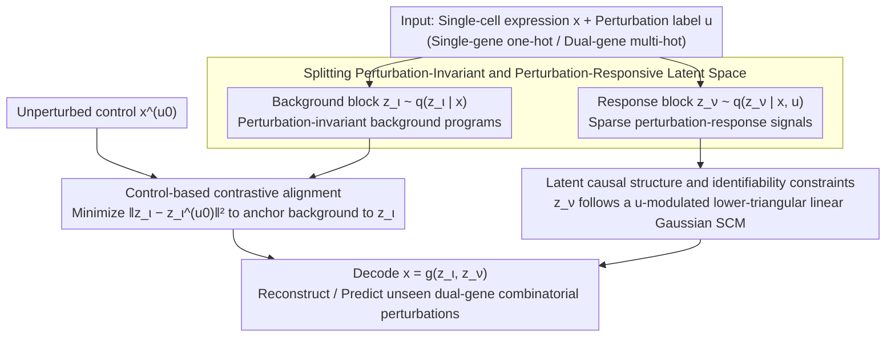

# What Makes a Representation Good for Single-Cell Perturbation Prediction?

**Conference**: ICML2026  
**arXiv**: [2605.19343](https://arxiv.org/abs/2605.19343)  
**Code**: No public code  
**Area**: Scientific Computing / Single-cell Perturbation Prediction  
**Keywords**: Single-cell, perturbation prediction, Variational Autoencoder, causal representation, combinatorial generalization  

## TL;DR
This paper proposes PerturbedVAE, arguing that a good representation for single-cell perturbation prediction must explicitly disentangle dominant perturbation-invariant background programs from sparse perturbation-responsive signals and organize the latter with a causal structure to better generalize to unseen dual-gene combinatorial perturbations.

## Background & Motivation
**Background**: Single-cell perturbation modeling aims to predict how cellular gene expression profiles change after genes are intervened via methods like CRISPR. Such models are critical for drug discovery, understanding gene regulatory mechanisms, and designing combinatorial perturbations. Existing methods generally follow two routes: one is causal representation learning, using latent variables and structural equation models to characterize perturbation mechanisms; the other is single-cell foundation models, using large-scale transcriptomic data to learn general representations.

**Limitations of Prior Work**: There is an easily overlooked imbalance in single-cell expression data: most expression changes originate from perturbation-invariant factors such as cell types, background programs, and technical noise, while signals truly induced by specific perturbations are sparse. General foundation models, in an effort to fit the overall distribution, often prioritize encoding the dominant background and suppress perturbation-specific information. Causal representation methods, if lacking explicit separation, also mix background information into perturbation-related latent variables, leading to impure representation semantics.

**Key Challenge**: Perturbation prediction requires both preserving the background cellular state and extracting the small but critical perturbation-specific signals. Emphasizing only reconstruction leads the model to explain everything with background variables; emphasizing only perturbation variables loses the basic cellular state. The real difficulty lies in extracting sparse perturbation effects under strong background signals and organizing them into a structure capable of combinatorial generalization.

**Goal**: The authors propose the "perturbation suppression hypothesis" to explain why foundation models and general causal representation methods fail. They subsequently design PerturbedVAE, which splits the latent space into perturbation-invariant blocks and perturbation-responsive blocks, supported by contrastive alignment, conditional latent causal models, and identifiability analysis.

**Key Insight**: The paper starts from the question "what makes a representation good for perturbation prediction?" The answer is not a larger model or a more complex regressor, but that the representation must be perturbation-aware: first explicitly extract perturbation-specific information, and then utilize this information via a causal structure to predict unseen combinatorial interventions.

**Core Idea**: Use control cells to align perturbation-invariant latent variables, ensuring background programs are fixed in $z_\iota$; place residual perturbation-responsive signals into $z_\nu$ and use a perturbation-conditioned latent causal structure to generate and combine unseen perturbation effects.

## Method
PerturbedVAE can be viewed as a structured VAE oriented toward single-cell perturbation data. While the goal of a standard VAE is to reconstruct expression profiles, the authors additionally stipulate the roles of latent variables: $z_\iota$ represents perturbation-invariant background programs, and $z_\nu$ represents perturbation-responsive factors. During training, the model views both perturbed samples and unperturbed control samples simultaneously, ensuring $z_\iota$ remains consistent between them. Thus, background variations are absorbed by $z_\iota$, forcing $z_\nu$ to express the residual changes brought by perturbations. When predicting unseen combinatorial perturbations, the model infers $z_\iota$ from control cells, inputs the dual-gene perturbation vector into the learned perturbation-conditioned mechanism to generate $z_\nu$, and decodes it into an expression profile.

### Overall Architecture
The inputs are the single-cell expression vector $x$ and the perturbation label $u$, where $u$ can be a one-hot single-gene perturbation or a multi-hot vector for dual-gene combinations. The generative model assumes $x=g(z)$, where $z=(z_\iota, z_\nu)$. $z_\iota$ is independent of perturbations and characterizes background cellular programs; $z_\nu$ depends on $u$ and $z_\iota$, following an unknown DAG that represents causal dependencies between perturbation-responsive programs. The variational posterior is decomposed as $q(z_\nu, z_\iota | x, u) = q(z_\nu | x, u) q(z_\iota | x)$, corresponding to "perturbation response requires knowing the label, background is inferred only from the expression itself."

### Key Designs

**1. Splitting Perturbation-Invariant and Perturbation-Responsive Latent Space: Assigning roles to latent variables to prevent backgrounds from swallowing perturbation signals**

In single-cell expression, background cellular programs, cell types, and technical noise account for the vast majority of variance, while signals truly induced by perturbations are sparse. If the latent space is not partitioned, a VAE can achieve good reconstruction using a large block of background variables, suppressing perturbation-specific information. This work explicitly splits latent variables into two blocks: $z_\iota$ represents background programs stable across perturbations, with a prior independent of the perturbation label $u$; $z_\nu$ represents response factors that change with perturbations, with a conditional distribution $p(z_\nu | u, z_\iota)$. The generative model is defined as $x = g(z_\iota, z_\nu)$, and the variational posterior is decomposed into $q(z_\nu, z_\iota | x, u) = q(z_\nu | x, u) q(z_\iota | x)$—background only looks at the expression itself, while response also considers the perturbation label. The reconstruction term in the ELBO ensures the two blocks together explain the expression profile, while the KL term constrains latent space capacity. This step provides the model with clear semantic division, giving sparse perturbation effects an exclusive "storage area" rather than being overwhelmed by dominant background changes.

**2. Contrastive alignment based on unperturbed controls: Anchoring the background to force out residual perturbation effects**

Splitting the latent space alone is insufficient—when optimizing only the ELBO, the reconstruction target might still allow $z_\iota$ and $z_\nu$ to bleed into each other, letting background variations leak into the perturbation-responsive block. For each perturbed sample $(x, u)$, this work additionally samples an unperturbed control expression profile $x^{(u_0)}$ and minimizes the distance between their background latent variables $\mathcal{L}_{contrast} = \|z_\iota - z_\iota^{(u_0)}\|_2^2$. The total objective is $\mathcal{L} = -\mathcal{L}_{ELBO} + \alpha \mathcal{L}_{contrast}$. The intuition is: by forcing $z_\iota$ to remain consistent between perturbed and unperturbed samples, the dominant background variations are anchored in $z_\iota$ and do not need to be explained by other latent variables. Consequently, $z_\nu$ is "squeezed" into expressing only the residual changes brought by the perturbation. This term is key to combinatorial generalization—invariant block $R^2$ improved from 0.66 to 0.97 in simulated data, and dual-gene OOD $R^2$ improved from 0.9650 to 0.9865 in real data.

**3. Latent causal structure and identifiability constraints: Organizing the perturbation-responsive block into a mechanism for combinatorial extrapolation**

After extracting perturbation signals, they must be "usable" for unseen combinatorial interventions; otherwise, $z_\nu$ is merely a compressed representation incapable of extrapolating to unseen dual-gene perturbations. This work models $z_\nu$ as a linear Gaussian Structural Causal Model (SCM) modulated by the perturbation label $u$, with the weight matrix restricted to be strictly lower triangular to correspond to a DAG, making causal dependencies between perturbation-responsive programs explicitly combinatorial. Theoretically, identifiability conditions are provided: if the generative mapping is invertible and smooth, environmental (perturbation) changes are sufficiently rich, alignment reaches optimality, and interventions are diverse, then $z_\nu$ can be identified up to permutation and scaling, and $z_\iota$ up to a linear block transformation. Single-cell data often involve partial interventions (perturbing only a few genes), failing typical assumptions of "rich interventions" in causal representation learning. This analysis shows that under explicit separation and sufficient environmental differences, sparse perturbation variables still have a chance to be recovered, explaining why predicting unseen combinations requires first inferring $z_\iota$ from the control, feeding the dual-gene perturbation vector into this mechanism to generate $z_\nu$, and finally decoding into an expression profile.

### Loss & Training
The training objective consists of the negative ELBO and contrastive alignment. The ELBO includes the reconstruction term $\mathbb{E}_{q}[\log p(x|z_\nu,z_\iota,u)]$ and the KL divergence from $q(z_\nu,z_\iota|x,u)$ to $p(z_\nu,z_\iota|u)$. Real-world experiments use the Norman2019 Perturb-seq: 105,528 K562 cells, 112 target genes, 105 single-gene, and 131 dual-gene conditions. The training set includes controls and 105 single-gene perturbations; 112 dual-gene perturbations are entirely reserved for OOD testing. The optimizer is Adam, with batch size 64, 100 epochs, hidden dimension 256, learning rate $10^{-4}$, and alignment weight $\alpha=0.05$.

## Key Experimental Results

### Main Results

| Dataset / Setting | Metric | Ours | Prev. SOTA / Strong Baseline | Gain |
|--------|------|------|----------|------|
| Norman2019 Dual-gene OOD | RMSE ↓ | 0.4474±0.0007 | KNN 0.4894 / ElasticNet 0.4929 / STATE 0.4981 | Reduced by 0.0420 vs KNN |
| Norman2019 Dual-gene OOD | $R^2$ ↑ | 0.9865±0.0009 | UCE 0.9857 / KNN 0.9843 | Slightly better than best FM/simple baseline |
| Single-gene, z dim 105 | RMSE ↓ | 0.3995±0.0013 | SAMS-VAE 0.4123 / sVAE+ 0.5002 | Significantly lower |
| Dual-gene, z dim 105 | RMSE ↓ | 0.4474±0.0007 | SAMS-VAE 0.4629 / PerturbedVAE w/o Align 0.4623 | OOD more stable after alignment |
| Simulated identifiability | Invariant $R^2$ ↑ | 0.97±0.0077 | w/o alignment 0.66±0.0281 | Alignment significantly improves invariant block recovery |

### Ablation Study

| Configuration | Key Metric | Description |
|------|---------|------|
| w/o contrastive alignment | Dual-gene RMSE 0.4626±0.0002, $R^2$ 0.9650±0.0002 | Combinatorial generalization drops significantly without alignment |
| with contrastive alignment | Dual-gene RMSE 0.4474±0.0007, $R^2$ 0.9865±0.0009 | Alignment maintains $z_\iota$ info and improves OOD |
| capacity: $z_\nu < z_\iota$ | Single-gene RMSE 0.3995, Dual-gene RMSE 0.4474 | Best when background block capacity is larger |
| capacity: equal split | Single-gene RMSE 0.4084, Dual-gene RMSE 0.4627 | Insufficient invariant background capacity hinders prediction |
| PerturbedVAE(MMD) | RMSE 0.5485, $R^2$ 0.9958, MMD 0.3077 | Outperforms Discrepancy-VAE even with MMD, showing gains beyond the loss type |

### Key Findings
- Representations from single-cell foundation models do not necessarily preserve linearly decodable perturbation labels. Linear probing shows that UCE, scFoundation, and Geneformer have weaker decodability for perturbation labels compared to direct PCA, supporting the perturbation suppression hypothesis.
- The alignment term is a critical mechanism. In simulations, the $R^2$ of the invariant block increased from 0.66 to 0.97, and in real data, the dual-gene OOD $R^2$ increased from 0.9650 to 0.9865.
- Background capacity should not be too small. The optimal configuration is $z_\nu < z_\iota$, indicating that while the task focuses on perturbation response, fully modeling invariant backgrounds is a prerequisite for extracting sparse perturbation signals.
- The additive baseline is strong on pseudobulk average response but yields negative cell-level $R^2$; although PerturbedVAE does not always yield the lowest pseudobulk error, it preserves explanatory variance at the single-cell level.

## Highlights & Insights
- The best insight of the paper is attributing the failure of single-cell perturbation prediction to signal proportion imbalance rather than simply saying models aren't large enough. The perspective that perturbation-specific signals are sparse while background signals are dominant explains the different failure modes of foundation models and general CRL methods.
- The structural division in PerturbedVAE is very clear: $z_\iota$ is responsible for the background, $z_\nu$ for the response, and contrastive alignment bridges the gap. This design is more interpretable than directly increasing latent size or encoder depth.
- There is a tight connection between theory and implementation. Although the identifiability theorem has strong assumptions, it directly explains the need for environmental diversity, alignment, and perturbation-conditioned Gaussian SCMs.
- The paper does not avoid discussing the strength of simple additive baselines but instead distinguishes between pseudobulk average response and single-cell variability. This discussion accurately defines the value of the method: it is not just regressing the mean but learning an interpretable perturbation mechanism.

## Limitations & Future Work
- Identifiability analysis depends on strong assumptions (e.g., invertible/smooth generative mapping, sufficient environmental diversity, global optimal alignment, shared DAG order), which may not be fully satisfied by real biological data.
- Main real-world experiments focus on Norman2019 and Replogle single-gene screens; validation across cell types, experimental platforms, drug perturbations, and more complex multi-gene combinations is still needed.
- PerturbedVAE requires unperturbed controls as alignment anchors. If the experimental design has few controls, strong batch effects, or if controls do not match perturbed samples, the alignment term may introduce bias.
- Current biological validation of the learned causal graph is mainly a plausibility check; recovered regulatory edges require more systematic experimental or external database validation.

## Related Work & Insights
- **vs scFoundation / UCE / Geneformer**: These foundation models learn general expression representations but may suppress perturbation-specific signals; PerturbedVAE is much smaller but more stable on dual-gene OOD due to task-matched structural inductive biases.
- **vs Discrepancy-VAE / SENA / sVAE+ / SAMS-VAE**: These causal or VAE methods do not equally and explicitly distinguish background from perturbation response, making it easy to entangle invariant information; PerturbedVAE improves this through alignment and capacity allocation.
- **vs additive linear model / GEARS**: Additive baselines are strong on average response in Norman2019, and GEARS directly learns graph mappings from perturbations to expression; PerturbedVAE's strength lies in simultaneously modeling single-cell variation and latent perturbation mechanisms.
- **Insights**: In other scientific ML intervention prediction tasks (e.g., drug combinations, protein perturbations, or material processing interventions), one can first identify dominant invariant factors and then place sparse intervention effects into a structured latent mechanism.

## Rating
- Novelty: ⭐⭐⭐⭐ Combines the perturbation suppression hypothesis with structured VAEs; problem definition and motivation are clear.
- Experimental Thoroughness: ⭐⭐⭐⭐ Includes simulations, real Perturb-seq, comparisons with FMs/simple baselines/CRLs, and multiple ablations, though cross-dataset extrapolation could be stronger.
- Writing Quality: ⭐⭐⭐⭐ Theory and experiments are closely linked; honest discussion of additive baselines; high reading threshold in dense formula sections.
- Value: ⭐⭐⭐⭐⭐ Highly enlightening for single-cell perturbation modeling, especially by warning against blindly trusting that foundation model representations will preserve sparse intervention signals.

<!-- RELATED:START -->

## Related Papers

- [\[ICLR 2026\] scDFM: Distributional Flow Matching for Robust Single-Cell Perturbation Prediction](../../ICLR2026/computational_biology/scdfm_distributional_flow_matching_model_for_robust_single-cell_perturbation_pre.md)
- [\[ICML 2026\] Scalable Single-Cell Gene Expression Generation with Latent Diffusion Models](scalable_single-cell_gene_expression_generation_with_latent_diffusion_models.md)
- [\[AAAI 2026\] Gene Incremental Learning for Single-Cell Transcriptomics](../../AAAI2026/computational_biology/gene_incremental_learning_for_single-cell_transcriptomics.md)
- [\[ICML 2026\] Towards Universal Gene Regulatory Network Inference: Unlocking Generalizable Regulatory Knowledge in Single-cell Foundation Models](towards_universal_gene_regulatory_network_inference_unlocking_generalizable_regu.md)
- [\[ACL 2026\] AROMA: Augmented Reasoning Over a Multimodal Architecture for Virtual Cell Genetic Perturbation Modeling](../../ACL2026/computational_biology/aroma_augmented_reasoning_over_a_multimodal_architecture_for_virtual_cell_geneti.md)

<!-- RELATED:END -->
