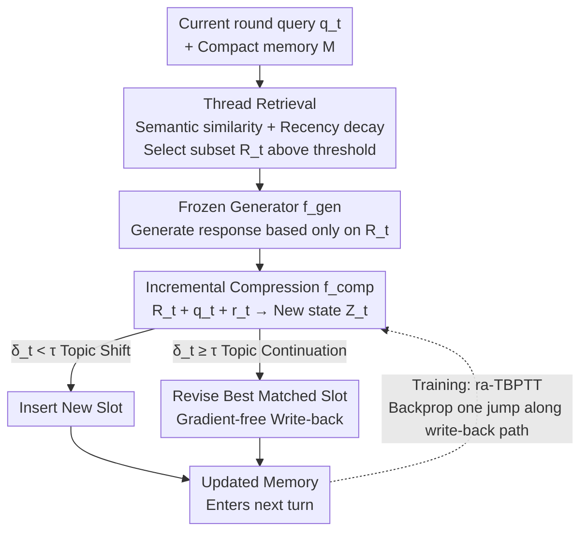

# Context-Driven Incremental Compression for Multi-Turn Dialogue Generation

**Conference**: ICML 2026  
**arXiv**: [2606.12411](https://arxiv.org/abs/2606.12411)  
**Code**: TBD  
**Area**: Dialogue Generation / LLM Efficiency / Context Compression  
**Keywords**: Multi-turn Dialogue, Context Compression, Revisable Latent Memory, Clue Retrieval, Truncated Backpropagation Through Time  

## TL;DR
Concatenating full histories in multi-turn dialogues is expensive and leads to lost clues. This paper proposes **C-DIC**: viewing dialogues as interleaved "topic threads," it stores revisable per-thread compressed states in a compact memory. Each turn follows a lightweight "Retrieval $\to$ Revision $\to$ Write-back" cycle, trained with **retrieval-aware truncated backpropagation through time (ra-TBPTT)**, maintaining stable latency and perplexity over hundreds of turns.

## Background & Motivation
**Background**: LLM-based dialogue assistants are inherently multi-turn. The mainstream approach is to concatenate the **entire dialogue history** into the prompt at each step to generate a response.

**Limitations of Prior Work**: Full history concatenation has two major flaws. First is the **computational explosion**—self-attention grows quadratically with input length. For a dialogue of $T$ turns with an average of $L$ tokens per turn, the cumulative attention cost is $\sum_{t=1}^T O((tL)^2)=O(T^3L^2)$, where cubic growth rapidly exhausts latency and VRAM budgets. Second is **semantic drift**: as dialogues lengthen, models tend to lose earlier clues, showing insufficient attention to key turns outside the range of "recency-based attention" (Figure 1: after 196 turns, baselines fail to answer "How many dinner parties did I attend last month?"). Existing cost-saving solutions have weaknesses: **Truncation** keeps only the most recent $k$ turns, losing long-range dependencies; **Summarization** is often query-agnostic, lossy, and difficult to revise mid-dialogue; and **Static Latent Compressors** (e.g., ICAE, AutoCompressor) that compress long documents into few latent vectors are fragile under multi-turn rollouts—perplexity rises sharply after 3-4 consecutive compressions, with static model PPL jumping by at least ~1900% when switching from single-turn to multi-turn evaluation.

**Key Challenge**: Static, one-shot compressors **lack cross-turn memory sharing and revision mechanisms**, leading to cumulative information loss and snowballing errors. In short: compressed states are treated as "fixed summaries of the past" rather than "revisable, persistent latent memories."

**Goal**: Achieve **incremental, topic-aware inference-time compression** while maintaining efficiency and coherence. This requires addressing three technical challenges: topic-aligned retrieval under drift, incremental revision without re-encoding the full history, and efficient memory management during inference.

**Core Idea**: Treat dialogues as interleaved topic threads and maintain a compact memory where slots store **revisable per-thread compressed states**. Each turn executes a lightweight **Retrieval $\to$ Compression $\to$ Write-back** loop, treating compressed states as persistent, modifiable latent memories rather than fixed summaries.

## Method

### Overall Architecture
C-DIC maintains a dialogue memory $\mathcal{M}_{<t}=\{\mathbf{Z}_i\}$, where each slot $\mathbf{Z}_i\in\mathbb{R}^{n\times d}$ is the compressed state of a specific topic thread that evolves with the dialogue. Memory is initialized with a "compression instruction" as the first thread state. Every subsequent turn $t$ performs three actions: (1) scores existing slots using the current query $q_t$ to retrieve a relevant subset $\mathcal{R}_t$; (2) the frozen generator $f_{\text{gen}}$ generates a response based only on retrieved latent states rather than the full history; (3) the trainable compressor $f_{\text{comp}}$ compresses the current turn into a new state and updates the memory using a **gradient-free write-back strategy** (**insertion** for topic shifts, **revision** of the best match for topic continuation). Training only optimizes the compressor and learnable compression tokens; the generator remains frozen, and **retrieval-aware truncated backpropagation through time (ra-TBPTT)** allocates gradients only along the "actually utilized memory update paths."

### Key Designs

**1. Incremental Compression + Topic-Aligned Retrieval: Paying Only for "Truly Relevant" Context**

Static compressors either re-compress the full history every turn or stack new latent vectors without revision, leading to either high costs or forgetting in long dialogues. C-DIC instead maintains an evolving compact memory without re-encoding the full history. In the base case, the compressor maps $(q_t, r_t)$ and learnable tokens $\mathbf{C}$ to $\mathbf{Z}_t=f_{\text{comp}}([\text{Emb}(q_t);\text{Emb}(r_t);\mathbf{C}];\theta)$. To manage granularity based on actual utility, a **retrieval support set** $\mathcal{R}_t\subset\mathcal{M}_{<t}$ is introduced: each slot is scored using semantic similarity with slight recency decay:

$$S(q_t,\mathbf{Z}_i)=\frac{\langle\psi(f_{\text{comp}}(q_t,C)),\psi(\mathbf{Z}_i)\rangle}{\|\psi(f_{\text{comp}}(q_t,C))\|\,\|\psi(\mathbf{Z}_i)\|}\,e^{-\alpha\Delta t_i}$$

where $\psi(\cdot)$ is pooling (mean or CLS), $\Delta t_i$ is the number of turns since slot $\mathbf{Z}_i$ was last retrieved, and $\alpha$ is the decay rate. Slots with similarity exceeding threshold $\tau$ form $\mathcal{R}_t=\{\mathbf{Z}_i:S(q_t,\mathbf{Z}_i)>\tau\}$, falling back to top-1 if none exceed $\tau$. Response generation $\hat{r}_t=f_{\text{gen}}([\mathcal{R}_t;\text{Emb}(q_t)];\phi)$ and compression $\mathbf{Z}_t=f_{\text{comp}}([\mathcal{R}_t;\text{Emb}(q_t);\text{Emb}(r_t);\mathbf{C}];\theta)$ rely only on the retrieved subset—ensuring per-turn computation is proportional to $|\mathcal{R}_t|$ rather than dialogue length, focusing compression on active threads for better long-range coherence.

**2. Gradient-Free Write-back: Deterministic Selection Between "Insert" and "Revise"**

To keep memory compact and topic-aligned, C-DIC uses a **deterministic, gradient-free** update rule. Each turn calculates peak similarity $\delta_t=\max_i S(q_t,\mathbf{Z}_i)$ and the corresponding slot index $j_t=\arg\max_i S(q_t,\mathbf{Z}_i)$, updating as follows:

$$\mathcal{M}_{<t+1}=\begin{cases}\mathcal{M}_{<t}\cup\{\mathbf{Z}_t\},&\text{if }\delta_t<\tau\ (\text{topic shift, insert new slot})\\\big(\mathcal{M}_{<t}\setminus\{\mathbf{Z}_j\}\big)\cup\{\mathbf{Z}_t\},&\text{otherwise }(\text{topic continuation, revise best match})\end{cases}$$

This revives the best-matched slot when relevant to maintain continuity and opens new slots when relevance is low. Since selection and write-back do not involve gradients, inference remains lightweight and independent of the raw token history. This is the core distinction from static compressors—compressed states are "revisable persistent latent memories" rather than immutable summaries.

**3. Retrieval-Aware Truncated Backpropagation Through Time (ra-TBPTT): Crediting "Truly Consumed Memory Paths"**

In multi-turn compression, the model attends only to a small subset of retrieved states. Standard BPTT backpropagates through all past turns (expensive and misaligned with actual use), while standard TBPTT truncates by fixed windows (ignoring which turns were actually used). C-DIC employs a **retrieval-aware truncated computation graph**, allocating gradients only along selected memory update paths. Training minimizes per-turn negative log-likelihood $\mathcal{L}=\frac{1}{T}\sum_t\ell_t$, with $\ell_t=-\log P_\phi(r_t\mid q_t,\mathcal{R}_t)$, where $r_t$ is the teacher-forcing ground truth. Backpropagation uses **one-hop truncation**: gradients flow into the written-back slot $\mathbf{Z}_{j_t}$ only if $\delta_t\ge\tau$; otherwise, $\partial\ell_t/\partial\mathbf{Z}_s=0$ for $s \neq j_t$. This is controlled by mask $M_{s,t}=\mathbb{1}[s=j_t]\cdot\mathbb{1}[\delta_t\ge\tau]$ such that $\partial\mathcal{L}/\partial\mathbf{Z}_s=\sum_t M_{s,t}\,\partial\ell_t/\partial\mathbf{Z}_s$. Retrieved but non-revised states are treated as stop-gradient contexts; for off-topic turns ($\delta_t<\tau$), the arg-max slot is kept for forward continuity but detached during training, preventing gradients from entering mismatched memories. This sparse, retrieval-aligned credit assignment matches the memory paths actually used by write-back operations, avoiding full history backpropagation and error accumulation.

**4. Initializing Compressor with ICAE Pre-trained Weights**

Instead of training from scratch, the compressor is initialized with ICAE pre-trained checkpoints (trained on large-scale corpora for one-shot document compression) and adapted to the incremental, retrieval-conditioned setting with a frozen generator. This inherits ICAE's high-capacity, context-faithful compression capabilities without additional pre-training, reducing costs while maintaining representation quality.

### Case Study: Tracking References Across 196 Turns
A user mentions "attending dinner parties" sporadically early in a dialogue. After 196 turns of unrelated small talk, they ask, "How many dinner parties did I attend in total last month?" Full history, truncation, and summarization baselines fail as earlier mentions were either pushed out of the attention window or discarded by truncation/summarization. C-DIC succeeds because each mention of "dinner parties" was compressed into the same topic thread slot and repeatedly revised. Upon the final query, semantic similarity (even after hundreds of turns, as recency decay is not absolute) retrieves that specific thread state, allowing for correct aggregation—demonstrating how "revisable per-thread memory + topic-aligned retrieval" recovers evidence across hundreds of rounds.

## Key Experimental Results
Evaluated on two multi-session/long-dialogue corpora: **MSC** (Multi-Session Chat, 1001 training sequences, ~66 turns average) and **REALTALK** (10 real WhatsApp-style dialogues, ~21.9 sessions / 894.4 turns average, **zero-shot** evaluation). All methods share a frozen Llama-2-Chat-7B generator. Learning-based compression baselines are trained for 2 epochs on MSC and evaluated zero-shot on REALTALK.

### Main Results
Perplexity (PPL ↓), BLEU, and ROUGE (R-L/R-1/R-2 ↑) are reported.

| Model (MSC) | PPL↓ | BLEU↑ | R-L↑ | R-1↑ | R-2↑ |
|------|------|------|------|------|------|
| Full prompting | 41.245 | 0.008 | 0.110 | 0.157 | 0.015 |
| Truncation | 30.890 | 0.012 | 0.128 | 0.184 | 0.024 |
| Summarization | 41.849 | 0.013 | 0.128 | 0.172 | 0.024 |
| RAG@20 | 31.179 | 0.013 | 0.111 | 0.156 | 0.014 |
| LLMLingua | 36.211 | 0.012 | 0.105 | 0.157 | 0.011 |
| InfLLM | 27.329 | 0.016 | 0.118 | 0.161 | 0.019 |
| AutoCompressor | 9.285 | 0.012 | 0.121 | 0.145 | 0.019 |
| ICAE (incremental) | 513.774 | 0.006 | 0.057 | 0.069 | 0.005 |
| ICAE (one-shot) | 27.656 | 0.017 | 0.133 | 0.190 | 0.027 |
| ICAE (append) | OOM | — | — | — | — |
| **Ours (C-DIC)** | **8.431** | **0.023** | **0.160** | **0.205** | **0.037** |

C-DIC also leads on REALTALK (zero-shot, per-session): PPL 9.789, BLEU 0.035, R-L 0.134.

### Key Findings
- **Revisable Latent Memory is the Root of Stability**: C-DIC's perplexity **decreases** by ~70% as turns progress, whereas static compressors explode—confirming that "Retrieval + Revision/Write-back" mitigates long-term degradation.
- **Structural Mismatch can be Fatal**: Directly using ICAE's one-shot training objective for repeated incremental compression results in a PPL of 513, highlighting the necessity of matching the training paradigm with the multi-turn compression structure (the motivation for ra-TBPTT).
- **Stable Latency and Perplexity**: Using a 7B backbone, both latency and PPL remain flat over hundreds of turns, supporting scalable, high-quality dialogue modeling.
- **Generalization**: Though only trained on MSC, C-DIC transfers zero-shot to the much longer and more open-ended REALTALK, with minimal performance gap between teacher-forcing and closed-loop generation.

## Highlights & Insights
- **Memory View of "Dialogue = Interleaved Threads"**: Elevating the compression unit from tokens/segments to "dialogue-level revisable thread states"—where each thread occupies a slot that can be retrieved, modified, and written back—is a core abstraction that differentiates it from RMT or AutoCompressor. This logic is transferable to any streaming task requiring long-term state maintenance.
- **Retrieval-Aware One-Hop Truncated Backprop (ra-TBPTT)**: Strictly aligning training credit assignment with inference-time "consumed memory" avoids BPTT overhead while being more accurate than fixed-window TBPTT. This "sparse credit assignment along use paths" is valuable for any differentiable system involving "retrieval-based generation + memory write-back."
- **Gradient-Free Deterministic Write-back**: The rule for switching between insert and revise is simple and requires no learning, yet effectively keeps memory compact and topic-faithful without inference-time gradient overhead.
- **Practical Cold Start via ICAE Weights**: Adapting a pre-existing one-shot compressor for incremental settings rather than pre-training from scratch is a pragmatic engineering choice that preserves representation quality.

## Limitations & Future Work
- **Sensitivity to Threshold $\tau$ and Decay $\alpha$**: The balance between insertion/revision and the size of the retrieval subset depends entirely on $\tau$; poor settings may lead to over-merging threads or memory bloat. Robustness sweeps across these parameters are secondary to the main results.
- **Cost of One-Hop Truncation**: ra-TBPTT backpropagates only one hop along the write-back path, potentially under-assigning credit to long-range dependencies across multiple jumps. This is a "truncated computation graph" rather than full BPTT.
- **Dependency on Retrieval Quality**: If semantic similarity misses related clues (falling below $\tau$), key evidence is lost. The choice of pooling functions (mean/CLS) and similarity metrics significantly impacts long-range reference tracking.
- **Ceiling of Frozen Generator**: Since only the compressor is trained while Llama-2-7B remains frozen, final quality is capped by the base model's inherent capabilities.

## Related Work & Insights
- **vs. Truncation / Summarization (Xu et al. 2022; Packer et al. 2024)**: These lose long-range dependencies or produce query-agnostic, easily outdated summaries. C-DIC's latent memory is retrievable via query and revised mid-turn, ensuring better long-range coherence.
- **vs. Static Latent Compressors (AutoCompressor / ICAE, Chevalier et al. 2023; Ge et al. 2024)**: Designed for one-shot/static input, they suffer from error accumulation in multi-round rollouts (ICAE incremental PPL hits 513). C-DIC introduces cross-turn sharing and revisions, causing PPL to actually decrease as dialogue progresses.
- **vs. Memory-Augmented Long Context Models (RMT / Compressive Transformer, Bulatov et al. 2022; Rae et al. 2019)**: These define memory at the token/segment level. C-DIC performs memory updates at the **dialogue level**—utilizing multi-slot retrieval, incremental latent write-back, and retrieval-aligned credit assignment without re-encoding histories or modifying the base generator.

## Rating
- Novelty: ⭐⭐⭐⭐⭐ Transforming context compression from "static one-shot" to "revisable per-thread latent memory + retrieval-aware backprop" is a novel diagnostic and solution.
- Experimental Thoroughness: ⭐⭐⭐⭐ Covering MSC and REALTALK zero-shot with various baselines and stability tests over hundreds of turns is robust; parameter ablations are primarily in the appendix.
- Writing Quality: ⭐⭐⭐⭐ Motivation via failure cases in Figures 1/2 is clear, and the three designs follow logically; the ra-TBPTT formulation is dense.
- Value: ⭐⭐⭐⭐⭐ Targets the core efficiency and drift pain points of long-turn dialogues; the stability over hundreds of turns is highly relevant for practical deployments.

<!-- RELATED:START -->

## Related Papers

- [\[ACL 2026\] SPASM: Stable Persona-driven Agent Simulation for Multi-turn Dialogue Generation](../../ACL2026/dialogue/spasm_stable_persona-driven_agent_simulation_for_multi-turn_dialogue_generation.md)
- [\[ACL 2026\] Discourse Coherence and Response-Guided Context Rewriting for Multi-Party Dialogue Generation](../../ACL2026/dialogue/discourse_coherence_and_response-guided_context_rewriting_for_multi-party_dialog.md)
- [\[ICML 2026\] Not All Prefills Are Equal: PPD Disaggregation for Multi-turn LLM Serving](not_all_prefills_are_equal_ppd_disaggregation_for_multi-turn_llm_serving.md)
- [\[ACL 2026\] ETHICMIND: A Risk-Aware Framework for Ethical-Emotional Alignment in Multi-Turn Dialogue](../../ACL2026/dialogue/ethicmind_a_risk-aware_framework_for_ethical-emotional_alignment_in_multi-turn_d.md)
- [\[ICML 2026\] From Self-Evolving Synthetic Data to Verifiable-Reward RL: Post-Training Multi-turn Interactive Tool-Using Agents](from_self-evolving_synthetic_data_to_verifiable-reward_rl_post-training_multi-tu.md)

<!-- RELATED:END -->
