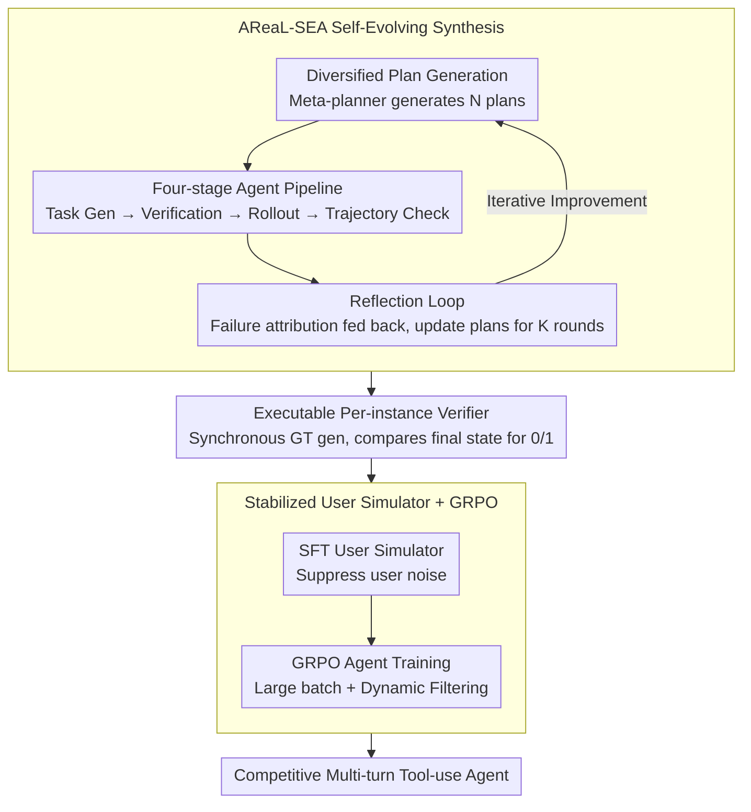

# From Self-Evolving Synthetic Data to Verifiable-Reward RL: Post-Training Multi-turn Interactive Tool-Using Agents

**Conference**: ICML 2026  
**arXiv**: [2601.22607](https://arxiv.org/abs/2601.22607)  
**Code**: https://github.com/inclusionAI/AReaL/tree/main/examples/tau2 (Available)  
**Area**: LLM Agent / Reinforcement Learning / Tool-use  
**Keywords**: Multi-turn Tool-use, Verifiable-Reward RL, Synthetic Data Self-evolution, GRPO, User Simulator Fine-tuning

## TL;DR
Addressing the dual bottlenecks in post-training "multi-turn interactive tool-using agents"—expensive high-quality data and RL signal destruction by user simulation noise—the authors propose "Self-evolving multi-agent data synthesis (AReaL-SEA)" with executable verifiers as rewards. Combined with an RL recipe involving "SFT user models followed by large-batch + dynamic filtering GRPO," Qwen3-235B achieves a $pass^1$ of 73.0 in Airline and 98.3 in Telecom on $\tau^2$-bench, matching or exceeding Claude/Gemini/GPT-5.

## Background & Motivation

**Background**: LLMs are transitioning from "Q&A machines" to "task-completion assistants," requiring simultaneous human communication and environment (API/tool) interaction to complete complex tasks (e.g., the "rebook → query → verify policy → execute" workflow in $\tau^2$-bench Airline). While base models like ReAct/Toolformer/OpenVLA exist for tool-use, multi-turn interactive agents are more challenging due to the constant presence of a user.

**Limitations of Prior Work**: Post-training open-source models into competitive interactive agents faces two bottlenecks. **(1) Data issues**: Multi-turn tool dialogue data is extremely difficult to scale—human annotation is costly, and automated synthesis struggles to simultaneously meet "complex domain rules + simulated user private info + sufficient task difficulty for RL" requirements. **(2) RL instability**: Interactive tasks require user-driven rollouts, necessitating a user simulator. However, the authors found that open-source models are unstable user simulators; in $\tau^2$-bench dual-control scenarios, they often misuse tools or ignore instructions, causing rollout failures and incorrect reward attribution to the agent.

**Key Challenge**: Training an agent with RL requires stable rollouts; stable rollouts require reliable user simulation; user simulation requires good training data; and good training data requires joint rollouts from both agent and user—creating a circular dependency.

**Goal**: (i) Design a scalable, verifiable multi-turn tool-use data synthesis pipeline; (ii) Design an RL recipe for interactive agents that remains robust against unstable user simulation.

**Key Insight**: Data synthesis is structured as a "hierarchical multi-agent system + self-evolving feedback loop," allowing the system to learn from its own failures. User simulators are first SFT-ed with synthetic data before RL rollout to suppress "user noise" at the source, while large batch sizes and dynamic filtering absorb remaining reward variance.

**Core Idea**: Data equals self-evolving multi-agent synthesis + executable verifiers; RL equals stabilizing the user simulator followed by GRPO; together, they form a cyclically improving post-training pipeline.

## Method

### Overall Architecture
The framework addresses the circular dependency of training competitive interactive agents. It is divided into two modules. The first, **AReaL-SEA**, handles data generation: a meta-planner initiates $N$ non-overlapping synthesis plans, each running an "assignment → verification → simulation → dialogue verification" pipeline, with failures fed back to a reflection module for $K$ iterations. The second is the RL recipe: the user simulator is SFT-ed to suppress noise, followed by agent training via GRPO. Rewards are provided by executable verifiers generated during synthesis, which compare the final trajectory state against ground-truth.

### Key Designs

**1. AReaL-SEA Self-Evolving Data Synthesis: Learning from Failure**

Unlike static pipelines (e.g., APIGen-MT), this multi-agent system is evolvable. First, **Diversified Plan Generation** uses a meta-planner to generate non-overlapping (synthesis plan, evaluation plan) pairs, specifying domains, complexity, and user styles. Diversity is constructed rather than random (reducing prompt sets from 64 to 4 drops performance from 56.0 to 42.5). Second, the **Four-stage Agent Pipeline** includes a Task Synthesis Agent producing tuples $q = (u, t, a^*)$, followed by verification and rollout agents. The Trajectory Verification Agent provides attribution tags for failures. Third, the **Reflection Loop** feeds failures into a reflection agent to update plans: $(\mathcal{P}_s^{(n,k+1)}, \mathcal{P}_e^{(n,k+1)}) = \text{Reflect}(\mathcal{P}_s^{(n,k)}, \mathcal{P}_e^{(n,k)}, \{\text{failures}\})$. Removing this loop drops performance from 56.0 to 44.0.

**2. Executable per-instance verifier: Anchoring Reward Signals**

LLM-as-judge is slow and noisy for interactive tasks. Instead, each task is synthesized with a ground-truth final state and an executable verifier function. During RL, the verifier checks the final state $s_T$ against ground-truth entities and actions, providing a binary outcome reward: $\mathcal{R}(s_t, a_t) = R(s_T)$ (where $R(s_T) \in \{0, 1\}$). This adapts the Verifiable-Reward RL (RLVR) paradigm from math/code to agents.

**3. Stabilizing the User Simulator for GRPO: Suppress Noise, Absorb Variance**

Open-source models are unstable users, often misusing tools and causing incorrect reward attribution. First, the **User Model is SFT-ed** using AReaL-SEA data to ensure instruction following and role-playing. This step is critical: using a base user model for RL drops performance from 85.4 to 75.6, while the SFT user model pushes it to 95.6. The agent is then trained via GRPO with **Large Batches** (total samples increased from 256 to 512, raising $pass^1$ from ~65 to 70.5) to stabilize advantage estimation. **Dynamic Filtering** discards tasks where all trajectories in a group either succeed or fail ($\hat{A}=0$), retaining only groups with learning signals; removing this drops performance from 70.5 to 65.0.

### Loss & Training
The RL objective is $\mathcal{J}_\text{RL}(\theta) = \mathbb{E}_{q \sim \mathcal{D}}[\frac{1}{\sum_g N_G}\sum_g \sum_t \sum_i \mathcal{L}_{t,i}^{(g)}(\theta)]$, where $\mathcal{L}_{t,i}^{(g)} = \min(\rho_{t,i}^{(g)} \hat{A}^{(g)}, \text{clip}(\rho_{t,i}^{(g)}, 1-\epsilon, 1+\epsilon)\hat{A}^{(g)})$ and $\rho_{t,i}^{(g)} = \pi_\theta / \pi_{\theta_\text{old}}$. SFT uses standard cross-entropy. 30B models were trained on 64 H200 GPUs; 235B on 80 H200s.

## Key Experimental Results

### Main Results
On $\tau^2$-bench across three domains, where $pass^k$ requires $k$ independent attempts to all succeed:

| Model | Airline $pass^1$ | Retail $pass^1$ | Telecom $pass^1$ |
|-------|----------------|----------------|----------------|
| Claude-Sonnet-4.5 | 70.0 | 86.2 | 98.0 |
| Gemini 3.0 Pro | 73.0 | 85.3 | 98.0 |
| GPT-5 | 62.5 | 81.6 | 95.8 |
| Qwen3-235B baseline | 58.0 | 59.9 | 53.7 |
| Qwen3-235B + SFT | 64.0 | 71.5 | 87.9 |
| **Qwen3-235B + RL** | **73.0** | 75.0 | **98.3** |
| Qwen3-30B-A3B-2507 baseline | 56.0 | 54.2 | 28.5 |
| Qwen3-30B-A3B-2507 + SFT | 60.0 | 69.1 | 85.4 |
| **Qwen3-30B-A3B-2507 + RL** | 70.5 | 75.0 | 95.6 |

The 235B version ties Gemini 3.0 Pro in Airline and exceeds all frontier models in Telecom. The 30B version is also highly competitive, nearing GPT-5 in Telecom.

### Ablation Study

| Configuration | Airline $pass^1$ (SFT) | Description |
|------|----------------------|------|
| Qwen3-30B baseline | 38.0 | Starting point |
| Human Expert data | 52.0 | Manual workflow design |
| **AReaL-SEA Full** | **56.0** | Exceeds human performance |
| w/o Evolution | 44.0 | Loss of 12 pts without feedback |

| User Model | Telecom $pass^1$ (RL) | Description |
|------------|---------------------|------|
| Start from SFT | 85.4 | Pre-RL |
| RL + base user model | 75.6 | **10 pt drop** |
| RL + SFT user model | **95.6** | 10 pt gain |

### Key Findings
- **Automated Synth $\ge$ Human Experts**: AReaL-SEA full (56.0) outperforms human expert data (52.0), proving self-evolution enhances data quality while reducing cost.
- **User SFT is Vital**: Using a base user model caused RL to degrade beyond the SFT checkpoint (75.6 < 85.4). This instability is a critical, previously underemphasized failure mode.
- **Batch Size Matters**: Increasing total batch size from 256 to 512 pushed $pass^1$ from 64 to 70.5, emphasizing advantage estimation stability.
- **Mix Training scaling**: Mix training (combined domains) helped the 235B model but hurt the 30B model (average $pass^1$ dropped from 71.5 to 63.7), suggesting smaller models lack the capacity to absorb multiple domains simultaneously.

## Highlights & Insights
- **User Simulator SFT is a key contribution**: This is the first work to explicitly demonstrate that user simulator quality dictates RL success in interactive settings, showing a 20-point empirical gap.
- **Self-evolving synthesis paradigm**: The closed-loop "synthesis → verification → rollout → reflection" architecture is more scalable than static pipelines and portable to other complex synthesis tasks.
- **Verifiable reward for agents**: Extending RLVR to tool-use agents by generating verifiers during data synthesis avoids the need for expensive LLM judges during training.

## Limitations & Future Work
- Evaluation is limited to three $\tau^2$-bench domains; performance in the Retail domain still lags behind Claude Sonnet 4.5.
- The optimal number of reflection steps $K$ remains an open question.
- Potential distribution gap between synthetic user styles and real-world human behavior.
- High infrastructure costs (80 H200s for 235B) may limit reproducibility for smaller teams.

## Related Work & Insights
- **vs APIGen-MT**: AReaL-SEA adds self-evolution and synchronous verifier generation.
- **vs TOUCAN**: While TOUCAN focuses on scale (1.5M trajectories), this work emphasizes high-quality self-evolution, surpassing human expert data with only 64 plans.
- **vs ToolRL / Search-R1**: Moves beyond single-turn tool-use to the interactive multi-turn setting.

## Rating
- Novelty: ⭐⭐⭐⭐ 
- Experimental Thoroughness: ⭐⭐⭐⭐⭐ 
- Writing Quality: ⭐⭐⭐⭐ 
- Value: ⭐⭐⭐⭐⭐ 

<!-- RELATED:START -->

## Related Papers

- [\[AAAI 2026\] Canoe: Teaching LLMs to Maintain Contextual Faithfulness via Synthetic Tasks and RL](../../AAAI2026/dialogue/teaching_large_language_models_to_maintain_contextual_faithfulness_via_synthetic.md)
- [\[ICML 2026\] Not All Prefills Are Equal: PPD Disaggregation for Multi-turn LLM Serving](not_all_prefills_are_equal_ppd_disaggregation_for_multi-turn_llm_serving.md)
- [\[ACL 2026\] GenesisFunc: Multi-Agent Data Generation for Accurate and Generalizable Function-Calling](../../ACL2026/dialogue/genesisfunc_multi-agent_data_generation_for_accurate_and_generalizable_function-.md)
- [\[ICLR 2026\] Non-Collaborative User Simulators for Tool Agents](../../ICLR2026/dialogue/non-collaborative_user_simulators_for_tool_agents.md)
- [\[ACL 2025\] Sparse Rewards Can Self-Train Dialogue Agents](../../ACL2025/dialogue/sparse_rewards_can_self-train_dialogue_agents.md)

<!-- RELATED:END -->
