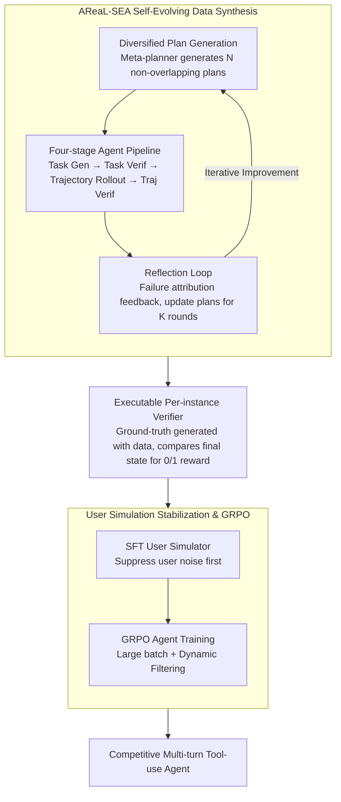

# From Self-Evolving Synthetic Data to Verifiable-Reward RL: Post-Training Multi-turn Interactive Tool-Using Agents

**Conference**: ICML 2026  
**arXiv**: [2601.22607](https://arxiv.org/abs/2601.22607)  
**Code**: https://github.com/inclusionAI/AReaL/tree/main/examples/tau2 (Available)  
**Area**: LLM Agent / Reinforcement Learning / Tool Use  
**Keywords**: Multi-turn Tool Use, Verifiable Reward RL, Synthetic Data Self-Evolution, GRPO, User Simulator Fine-tuning

## TL;DR
Addressing two major bottlenecks in post-training multi-turn interactive tool-using agents—expensive high-quality data and RL signal degradation from user simulation noise—the authors propose "AReaL-SEA," a self-evolving multi-agent data synthesis pipeline that generates executable verifiers as rewards. Combined with an RL recipe featuring user model SFT, large batches, and dynamic filtering GRPO, Qwen3-235B achieves a pass^1 of 73.0 in Airline and 98.3 in Telecom on τ²-bench, matching or exceeding Claude/Gemini/GPT-5.

## Background & Motivation

**Background**: LLMs are transitioning from "Q&A machines" to "task-completion assistants." They must communicate with humans while interacting with environments (APIs/tools) to complete complex tasks, such as the "reschedule → query → verify policy → execute" workflow in τ²-bench. While base models for tool use (ReAct/Toolformer/OpenVLA) exist, multi-turn interactive agents are significant more challenging due to the persistent "human-in-the-loop" dimension.

**Limitations of Prior Work**: Post-training open-source models into competitive interactive agents faces two bottlenecks. **(1) Data Scaling**: Multi-turn tool dialogue data is extremely difficult to scale—human annotation is costly, and automated synthesis struggles to simultaneously satisfy complex domain rules, simulated user private information, and sufficient task difficulty for RL. **(2) RL Instability**: Interactive tasks require user-driven rollouts, necessitating the use of user simulators. The authors found that using open-source models as user simulators is highly unstable; in τ²-bench dual-control scenarios, simulators often issue incorrect tool calls or ignore instructions, causing rollout failures where rewards are misattributed to the Agent.

**Key Challenge**: Training an Agent with RL requires stable rollouts; stable rollouts require stable user simulation; stable user simulation requires high-quality training data; and high-quality data requires joint rollouts from both Agent and User models. This creates a circular dependency.

**Goal**: (i) Design a scalable, verifiable multi-turn tool-use data synthesis pipeline; (ii) develop an RL recipe for interactive agents that is robust against user simulation instability.

**Key Insight**: Data synthesis should be a "hierarchical multi-agent system with a self-evolving feedback loop" to learn from failures. The user simulator should be SFT-ed on synthetic data before RL rollouts to suppress noise at the source, while large batch sizes and dynamic filtering should be used to absorb remaining reward variance.

**Core Idea**: Data = Self-evolving multi-agent + Executable verifiers; RL = User simulator stabilization followed by GRPO; these components form a cyclic, self-improving post-training pipeline.

## Method

### Overall Architecture
The system addresses the circular dependency of post-training competitive interactive agents by decoupling the process into two mutually reinforcing modules. **AReaL-SEA** handles data synthesis: a meta-planner generates $N$ non-overlapping synthesis plans, each running an "item generation → verification → simulated dialogue → dialogue verification" pipeline. Failure cases are fed back into a reflection module to iterate on plans over $K$ rounds. The **RL Recipe** first SFTs the user simulator to suppress noise and then trains the Agent using GRPO. Rewards are derived from executable verifiers generated during synthesis, which compare the final state against the ground truth.

### Key Designs

**1. AReaL-SEA Self-Evolving Data Synthesis: Learning from Pipeline Failures**

Multi-turn dialogue data must satisfy complex domain rules, user private info, and RL-level difficulty. Unlike static pipelines (APIGen-MT/TOUCAN), this system is a self-evolving multi-agent system. First, **Diversified Plan Generation** uses a meta-planner to generate non-overlapping (synthesis plan, evaluation plan) pairs, explicitly specifying different domains, complexities, and styles. Ablations show shortening the prompt set from 64 to 4 reduces performance from 56.0 to 42.5. Second, a **Four-stage Agent Pipeline** executes each plan: Task Synthesis generates a task $q = (u, t, a^*)$, Task Verification ensures quality, Trajectory Rollout executes the dialogue, and Trajectory Verification evaluates and tags attribution (identifying if a failure was due to the task or the dialogue). Third, a **Reflection Loop** feeds failures back to a reflection agent to update plans: $(\mathcal{P}_s^{(n,k+1)}, \mathcal{P}_e^{(n,k+1)}) = \text{Reflect}(\mathcal{P}_s^{(n,k)}, \mathcal{P}_e^{(n,k)}, \{\text{failures}\})$. Removing the evolution loop drops performance from 56.0 to 44.0.

**2. Executable Per-instance Verifier: Anchoring Reward Signals**

Using LLM-as-judge for interactive tasks is slow and noisy. This method generates a ground-truth final state and an executable verifier function alongside each task. After an RL rollout, the verifier checks the final state $s_T$ against key entities and actions. It provides a deterministic binary reward: $\mathcal{R}(s_t, a_t) = R(s_T)$ (1 if correct at $t = T$, else 0). This adapts the verifiable reward (RLVR) paradigm from math/code to the Agent domain, ensuring speed and accuracy without an external LLM judge.

**3. User Simulation Stabilization & GRPO: Suppressing Noise and Absorbing Variance**

The authors observe that using base open-source models as user simulators is highly unstable, leading to misattributed reward signals. Thus, the **User Model is SFT-ed** first using AReaL-SEA data to ensure instruction following and role-consistent tool use. This step is critical: using a base user model for RL caused performance to drop from the SFT baseline of 85.4 to 75.6, while the SFT-ed simulator allowed it to reach 95.6. For the Agent, **GRPO** samples $G$ trajectories per task to calculate group-normalized advantage $\hat{A}(\tau^{(g)}) = \frac{R(\tau^{(g)}) - \mu_G}{\sigma_G}$. Stability is further enhanced via **Large Batches** (increasing total samples from 256 to 512 improved pass^1 from ~65 to 70.5) and **Dynamic Filtering** (discarding tasks where all trajectories succeed or fail, i.e., $\hat{A}=0$).

### Loss & Training
The RL objective is $\mathcal{J}_\text{RL}(\theta) = \mathbb{E}_{q \sim \mathcal{D}}[\frac{1}{\sum_g N_G}\sum_g \sum_t \sum_i \mathcal{L}_{t,i}^{(g)}(\theta)]$, where $\mathcal{L}_{t,i}^{(g)} = \min(\rho_{t,i}^{(g)} \hat{A}^{(g)}, \text{clip}(\rho_{t,i}^{(g)}, 1-\epsilon, 1+\epsilon)\hat{A}^{(g)})$ with token-level importance ratio $\rho_{t,i}^{(g)} = \pi_\theta / \pi_{\theta_\text{old}}$. SFT uses standard cross-entropy. Training used 64 H200 GPUs for 30B models and 80 H200s for 235B.

## Key Experimental Results

### Main Results
Pass^k results on τ²-bench (full success across $k$ independent attempts):

| Model | Airline pass^1 | Retail pass^1 | Telecom pass^1 |
|-------|----------------|----------------|----------------|
| Claude-Sonnet-4.5 | 70.0 | 86.2 | 98.0 |
| Gemini 3.0 Pro | 73.0 | 85.3 | 98.0 |
| GPT-5 | 62.5 | 81.6 | 95.8 |
| Qwen3-235B baseline | 58.0 | 59.9 | 53.7 |
| Qwen3-235B + SFT | 64.0 | 71.5 | 87.9 |
| **Qwen3-235B + RL** | **73.0** | 75.0 | **98.3** |
| Qwen3-30B-A3B-2507 + RL | 70.5 | 75.0 | 95.6 |

Qwen3-235B matches Gemini 3.0 Pro in Airline and outperforms all models in Telecom. Mix Training (combining all domains) resulted in an average pass^1 of 81.3% for Qwen3-235B, exceeding GPT-5 (80.0) and Qwen3-Max-Thinking (80.7).

### Ablation Study

| Configuration | Airline pass^1 (SFT) | Description |
|------|----------------------|------|
| Qwen3-30B baseline | 38.0 | Starting point |
| Human Expert data | 52.0 | Manual workflow design |
| **AReaL-SEA Full** | **56.0** | Outperforms human experts |
| w/o Evolution | 44.0 | 12-point drop without reflection |

| User Model | Telecom pass^1 (RL) | Description |
|------------|---------------------|------|
| RL + base user model | 75.6 | **10-point drop from SFT baseline** |
| RL + SFT user model | **95.6** | 10-point gain |

### Key Findings
- **Automated Synthesis ≥ Human Experts**: AReaL-SEA (56.0) outperforming human expert data (52.0) demonstrates that self-evolution raises the quality ceiling.
- **User SFT is the Hidden Key for RL**: Using base user models leads to catastrophic regression (75.6 vs 85.4 baseline).
- **Total Batch Size Matters**: Increasing the total sample count in GRPO is more critical than the specific ratio of prompts to trajectories for stabilizing advantage estimation.
- **Mix Training scaling law**: Mix training helped the 235B model but hurt the 30B model, suggesting smaller models lack the capacity to absorb multiple complex domains simultaneously.

## Highlights & Insights
- **User Simulator Quality**: This is the first work to explicitly demonstrate that user simulator quality is a primary bottleneck for Agent RL, providing a 20-point empirical gap.
- **Self-Evolving Paradigm**: The "reflection-based plan update" loop is a generic framework applicable to other complex synthesis tasks like reasoning or long-context QA.
- **Verifiable Reward in Agents**: Extending the RLVR paradigm to tool-use by co-generating verifiers with data is highly efficient for post-training.

## Limitations & Future Work
- Evaluation is limited to three domains in τ²-bench; Retail performance still trails Claude Sonnet 4.5.
- The optimal number of evolution steps $K$ remains an open question.
- Potential distribution gap between synthetic user styles and real-world production dialogues.
- High computational requirements (80 H200s for 235B) limit accessibility for smaller teams.

## Related Work & Insights
- **vs APIGen-MT**: APIGen-MT uses static validation; AReaL-SEA adds evolution and co-generated verifiers for RL.
- **vs ToolRL/Search-R1**: These focus on single-turn tool use, whereas this work tackles the multi-turn interactive setting.
- **vs π₀/GR00T**: While those use physical environments for ground truth, this work utilizes synthetic program-based verifiers.

## Rating
- **Novelty**: ⭐⭐⭐⭐ Evolution-based synthesis and user-model stabilization are significant contributions to the Agent RL pipeline.
- **Experimental Thoroughness**: ⭐⭐⭐⭐⭐ Comprehensive coverage across scales, domains, and algorithmic components.
- **Writing Quality**: ⭐⭐⭐⭐ Clear problem-solution narrative with solid technical details.
- **Value**: ⭐⭐⭐⭐⭐ Achieves SOTA on open-source models with reproducible frameworks, offering direct industrial utility.

<!-- RELATED:START -->

## Related Papers

- [\[AAAI 2026\] Canoe: Teaching LLMs to Maintain Contextual Faithfulness via Synthetic Tasks and RL](../../AAAI2026/dialogue/teaching_large_language_models_to_maintain_contextual_faithfulness_via_synthetic.md)
- [\[ICML 2026\] Context-Driven Incremental Compression for Multi-Turn Dialogue Generation](context-driven_incremental_compression_for_multi-turn_dialogue_generation.md)
- [\[ICLR 2026\] Non-Collaborative User Simulators for Tool Agents](../../ICLR2026/dialogue/non-collaborative_user_simulators_for_tool_agents.md)
- [\[ICML 2026\] Not All Prefills Are Equal: PPD Disaggregation for Multi-turn LLM Serving](not_all_prefills_are_equal_ppd_disaggregation_for_multi-turn_llm_serving.md)
- [\[ACL 2026\] GenesisFunc: Multi-Agent Data Generation for Accurate and Generalizable Function-Calling](../../ACL2026/dialogue/genesisfunc_multi-agent_data_generation_for_accurate_and_generalizable_function-.md)

<!-- RELATED:END -->
