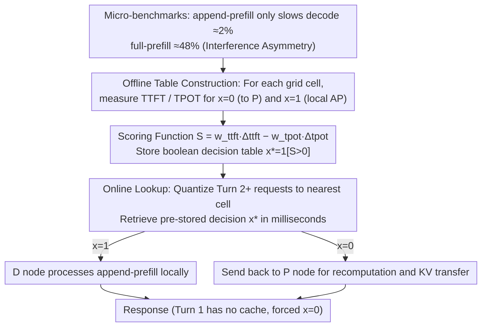

# Not All Prefills Are Equal: PPD Disaggregation for Multi-turn LLM Serving

**Conference**: ICML 2026  
**arXiv**: [2603.13358](https://arxiv.org/abs/2603.13358)  
**Code**: None (Based on vLLM disaggregated serving prototype)  
**Area**: LLM Inference Serving / Dialogue Systems / System Optimization  
**Keywords**: PD Disaggregation, Multi-turn Dialogue, KV cache reuse, Dynamic Routing, SLO

## TL;DR
This paper points out that traditional Prefill-Decode (PD) disaggregated architectures are significantly inefficient in multi-turn dialogue scenarios due to the repeated P→D recomputation and transmission of KV caches for each turn. It proposes PPD (Prefill-capable Decode), a dynamic routing system that allows decode nodes to decide whether to process Turn 2+ append-prefills locally based on SLO weights, reducing Turn 2+ TTFT by approximately 68%.

## Background & Motivation

**Background**: Modern LLM inference engines (vLLM, SGLang, TensorRT-LLM, DeepSeek, Gemini, etc.) commonly adopt the Prefill-Decode (PD) disaggregated architecture. This separates compute-intensive prefill and bandwidth-constrained decode into different GPU pools to prevent interference and support independent scaling. The KV cache is strictly transferred unidirectionally from P nodes to D nodes.

**Limitations of Prior Work**: PD is designed based on independent single-turn queries. In real deployments, however, chatbots and agent systems are almost entirely multi-turn. In multi-turn scenarios, each new turn must send the entire history (previous prompts + responses + new prompt) back to a P node to recompute the KV cache, which is then sent back to a D node. Experiments show that this recomputation accounts for 99% of multi-turn prefill costs; meanwhile, KV transmission saturates network bandwidth, leading to consistently high Turn 2+ TTFT and even service degradation under high loads.

**Key Challenge**: The KV channel in PD is unidirectional (P produces, D consumes, no reverse link). Even if the previous turn's response KV cache is already on D, P cannot access it. To resolve this trade-off, one must either break the unidirectional contract (high engineering cost) or use external distributed KV storage (Mooncake, MemServe, etc.)—but neither changes the routing decision itself.

**Goal**: Without modifying the KV protocols of mainstream engines like vLLM, design a dynamic routing strategy that simultaneously optimizes Turn 2+ TTFT, TPOT, and system throughput, while remaining robust to different P:D ratios.

**Key Insight**: The authors performed micro-benchmarks on H100 GPUs and discovered that **not all prefills cause the same level of interference**. A full prefill (no cache) at batch=200 slows down decode TPOT by 48%, whereas an append-prefill (new tokens only, reusing cached KV) only slows it by about 2%, an order of magnitude difference. This implies that the cost of processing append-prefills locally on D nodes is far lower than intuition suggests.

**Core Idea**: Formulate the decision of "whether to route Turn 2+ append-prefills to the local D node" as a weighted binary decision $x \in \{0,1\}$. Scores are calculated offline based on SLO weights $\mathbf{w}=(w_{ttft},w_{tpot})$ and stored in a lookup table. Traditional PD becomes a special case where $x \equiv 0$.

## Method

### Overall Architecture
The problem PPD addresses is that every Turn 2+ in multi-turn dialogues requires sending the entire history back to P nodes to recompute and retransmit KV caches, which is slow and saturates the network. The approach is to keep the vLLM KV protocol intact but add a binary switch at the scheduling layer—allowing D nodes to decide whether to keep the append-prefill local based on SLO weights. The system is split into offline and online phases: offline, it benchmarks "local processing" vs. "sending to P" across a coarse-grained workload grid and stores boolean decisions based on score gains; online, it quantizes each incoming request to the nearest grid cell and performs a millisecond-level lookup to retrieve the decision. Traditional PD is simply the case where this table always returns $x{=}0$.

### Key Designs

**1. Interference Asymmetry between Append-prefill and Full-prefill: Debunking the premise that "all prefills heavily interfere with decode"**

The PD disaggregated architecture separates prefill and decode into different GPU pools based on the implicit assumption that any prefill will significantly slow down concurrent decodes on the same card. The authors quantify this by splitting prefills into two categories: full prefill calculates attention for $n$ new tokens with $O(n^2)$ complexity, while append-prefill in multi-turn dialogues only calculates attention for $m$ new tokens (though each still attends to $n+m$ keys), with $O(m(n+m))$ complexity. When $m \ll n$, it is $n/m$ times cheaper. On H100 running Llama-3.1-8B at batch=200, full prefill slows decode TPOT by ~48%, while append-prefill only slows it by ~2%. At 32K/64K long contexts, this gap widens to 3-4×. This measurement transforms the intuition that "local append-prefills on D nodes carry negligible cost" into a reliable fact for routing decisions.

**2. Formalizing Routing as a Weighted Optimization Problem via Scoring Function $S$: Placing all strategies on a single spectrum**

With the asymmetry established, the authors unify the "send to P or keep local" decision into a weighted objective. For each Turn 2+ request, the gain of local processing relative to sending to P is defined as $S(\psi;\pi,\mathbf{w}) = w_{ttft}\Delta_{ttft} - w_{tpot}\Delta_{tpot}$, where $\Delta_{ttft}$ is the relative TTFT improvement, $\Delta_{tpot}$ is the relative TPOT degradation, and $\mathbf{w}=(w_{ttft},w_{tpot})$ represents user-defined SLO weights. If $S>0$, the request is processed locally ($x{=}1$); otherwise, it is sent back to P ($x{=}0$). Thus, traditional PD is $x\equiv 0$, full local processing is $x\equiv 1$, and Replica or partial routing are intermediate points. System throughput is not in the objective function but improves naturally as a byproduct of reduced KV transmission. Per-request dynamic decisions are necessary because, across 3,060 scanned configurations (17 configs × 18 workloads × 10 QPS), the optimal configuration for Turn 2 TTFT and TPOT does not overlap in 92.2% of (workload, QPS) pairs—precluding a one-size-fits-all static solution.

**3. Two-stage Routing with Offline Table Construction and Online Lookup: Moving expensive decisions offline**

Solving for $S$ online for every request is too costly, so the authors shift the computation. In the offline phase, they measure the two endpoints ($x{=}0$ and $x{=}1$) for every cell in the grid and store the boolean decision $x^*(\hat\psi)=\mathbb{1}[S>0]$. In the online phase, requests are quantized using three features (cumulative context length, input/output ratio, system QPS) to the nearest cell, and the decision is retrieved in <1ms, incurring nearly zero overhead on the latency-sensitive path. Turn 1 is forced to $x{=}0$ to ensure consistency since no reusable KV cache exists. This design also decouples P:D ratios: in traditional PD, the ratio handles both "Turn 1 capacity planning" and "Turn 2+ latency tuning"; PPD delegates the latter to the weights $\mathbf{w}$, making deployment scale and SLO tuning independent knobs.

### Loss & Training
PPD does not involve model training; it is entirely a system-level scheduling strategy. All decisions are driven by offline measurements. The primary tunable parameters are the user-provided SLO weights $w_{ttft}, w_{tpot}$ and the discretization thresholds of the workload grid.

## Key Experimental Results

### Main Results
Hardware: 4× H100 80GB + NVLink. Models: Primarily Llama-3.1-8B (validated with Qwen2.5-14B/Qwen3-30B). Dataset: 18 workloads × 10 QPS × 17 configurations = 3,060 data points; real-world datasets include ShareGPT and WildChat.

| Configuration | Metric | $x=0$ Baseline | $x=1$ / PPD | Gain |
|------|------|-----------|------------|------|
| 1P_3D Long Context, High QPS | Turn 2 TTFT | Baseline | $x=1$ Improved | -73.3% |
| 2P_2D Long Context, High QPS | Turn 2 TTFT | Baseline | $x=1$ Improved | -56.2% |
| 3P_1D Long Context, High QPS | Turn 2 TTFT | Baseline | $x=1$ Improved | -24.9% |
| 1P_3D ShareGPT | Avg Query Latency | Baseline | PPD | -15~25% |
| 2P_2D / 3P_1D ShareGPT Multi-QPS | Success Rate | <95% (Degraded) | PPD 100% | Restored Usability |

### Ablation Study

| Config Category | TTFT Win Rate | TPOT Win Rate | Throughput Win Rate | Avg Win Rate |
|---------|----------|----------|---------|---------|
| Replica (4R) | 63.3% | 0.6% | 0% | 21.3% |
| $x=0$ (Trad. PD) | 0% | 38.3% | 4.4% | 14.2% |
| $0<x<1$ Partial Routing | 3.3% | 33.3% | 27.8% | 21.5% |
| $x=1$ (Full AP-to-D) | 27.2% | 15.6% | 38.3% | 27.0% |

### Key Findings
- **Higher P resource tension yields higher local processing gains**: 1P_3D achieves up to 73.3% Turn 2 TTFT improvement, whereas 3P_1D shows 24.9%—as $x=1$ bypasses the P bottleneck.
- **No static optimum**: In 92.2% of workload-QPS pairs, the optimal config for TTFT $\neq$ optimal for TPOT, validating the need for dynamic routing.
- **PPD restores unusable configurations**: 2P_2D and 3P_1D frequently had success rates <95% under $x=0$ (KV transfer saturation); PPD stabilized these to 100%.
- **Gains persist across turns and model sizes**: Turn 2+ TTFT improvements remained ~70% across 2-16 turns and 8B/14B/30B models, indicating the benefit is architectural.

## Highlights & Insights
- **Challenging the Meta-hypothesis of PD**: For a long time, PD design was based on the implicit premise that "all prefills heavily interfere with decode." This paper uses a 1024-token micro-benchmark to split this premise into full vs. append categories, revealing an order-of-magnitude difference and opening a new design dimension for the disaggregated architecture family.
- **Elegant Unification via Parameter $x$**: Traditional PD, Replica, partial routing, and full local processing are all unified as special cases of $x \in \{0, \text{frac}, 1\}$, providing theoretical clarity for comparison and analysis.
- **Decoupling Scaling from SLO Tuning**: In traditional PD, the P:D ratio targets both Turn 1 capacity and Turn 2+ latency. PPD isolates Turn 2+ tuning via weights $\mathbf{w}$, which can be adapted to other multi-objective system scheduling problems.
- **Offline Table + Online Lookup Pattern**: Moving expensive decisions to the offline phase while keeping online lookups <1ms is of significant engineering value for latency-sensitive scenarios.

## Limitations & Future Work
- **Grid Discretization Coverage**: The 3D grid accuracy depends on empirical threshold selection; the paper does not discuss adaptive update mechanisms if workload patterns shift.
- **Exclusion of Hybrid R+P/D Configs**: The authors admit hybrid configurations were generally inferior to pure PD in their tests but do not provide a theoretical explanation or explore the potential of R in boundary cases.
- **Experimental Scope**: Benchmarks were primarily within 4×H100 NVLink. Slow-link RDMA/Ethernet was only simulated via bandwidth limits; real-world multi-node robustness needs further validation.
- **Prefix Cache Jitter**: When multiple sessions compete for local KV slots on a D node, the advantages of local processing might be negated by cache thrashing, which was not investigated in depth.

## Related Work & Insights
- **vs. AMPD (he2026)**: Concurrent work sharing the intuition of "routing AP to D" but uses real-time queue states for decisions. This paper’s offline optimization framework is more stable, predictable, and provides theoretical clarity.
- **vs. Mooncake / MemServe / LMCache**: These take the external distributed KV storage route without changing the PD unidirectional protocol. PPD is complementary—it achieves most gains through routing alone without an extra storage layer.
- **vs. DuetServe / Nexus / TaiChi**: These work on internal GPU SM partitioning or dynamic resource reallocation. PPD operates at a higher request-level scheduling and can be layered on top.
- **vs. Chunked-prefill (Splitwise / FastGen)**: Uses chunking to mitigate prefill-decode interference. PPD demonstrates that append-prefill, as a small chunk by nature, already causes minimal interference, aligning with the bottom-up motivation of chunking.

## Rating
- Novelty: ⭐⭐⭐⭐ Re-examined core PD assumptions and formalized findings into a tunable optimization framework.
- Experimental Thoroughness: ⭐⭐⭐⭐⭐ 3,060 configuration scans + synthetic + real data + multi-model/multi-turn validation; rare for complete system evaluations in this field.
- Writing Quality: ⭐⭐⭐⭐ Clear chain of reasoning from micro-benchmarks → formalization → algorithm → results, though some notation is dense.
- Value: ⭐⭐⭐⭐⭐ A "plug-and-play" improvement for production LLM serving, delivering massive TTFT gains without protocol or model changes.

<!-- RELATED:START -->

## Related Papers

- [\[ICML 2026\] From Self-Evolving Synthetic Data to Verifiable-Reward RL: Post-Training Multi-turn Interactive Tool-Using Agents](from_self-evolving_synthetic_data_to_verifiable-reward_rl_post-training_multi-tu.md)
- [\[ACL 2026\] ETHICMIND: A Risk-Aware Framework for Ethical-Emotional Alignment in Multi-Turn Dialogue](../../ACL2026/dialogue/ethicmind_a_risk-aware_framework_for_ethical-emotional_alignment_in_multi-turn_d.md)
- [\[ICML 2026\] Context-Driven Incremental Compression for Multi-Turn Dialogue Generation](context-driven_incremental_compression_for_multi-turn_dialogue_generation.md)
- [\[NeurIPS 2025\] HyGen: Efficient LLM Serving via Elastic Online-Offline Request Co-location](../../NeurIPS2025/dialogue/hygen_efficient_llm_serving_via_elastic_online-offline_request_co-location.md)
- [\[ACL 2026\] SPASM: Stable Persona-driven Agent Simulation for Multi-turn Dialogue Generation](../../ACL2026/dialogue/spasm_stable_persona-driven_agent_simulation_for_multi-turn_dialogue_generation.md)

<!-- RELATED:END -->
