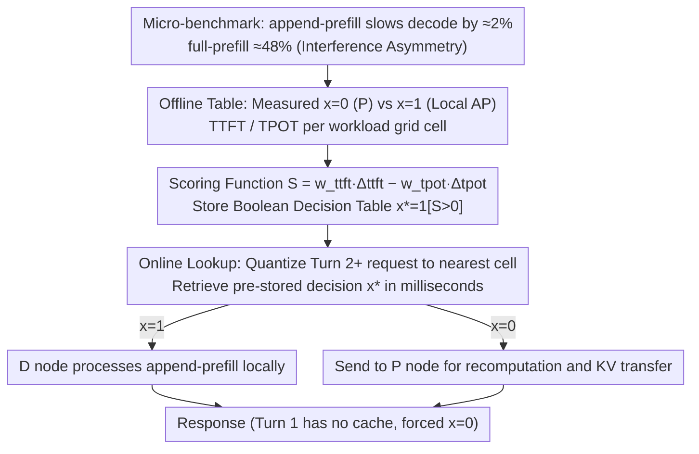

# Not All Prefills Are Equal: PPD Disaggregation for Multi-turn LLM Serving

**Conference**: ICML 2026  
**arXiv**: [2603.13358](https://arxiv.org/abs/2603.13358)  
**Code**: None (Based on vLLM disaggregated serving prototype)  
**Area**: LLM Inference Serving / Dialogue Systems / System Optimization  
**Keywords**: PD Disaggregation, Multi-turn Dialogue, KV cache Reuse, Dynamic Routing, SLO

## TL;DR
This paper points out that the traditional Prefill-Decode (PD) disaggregated architecture is severely inefficient in multi-turn dialogue scenarios due to the repeated P→D KV recomputation and transmission for each turn. It proposes PPD (Prefill-capable Decode), a dynamic routing system that allows decode nodes to decide whether to process Turn 2+ append-prefills locally based on SLO weights, reducing Turn 2+ TTFT by approximately 68%.

## Background & Motivation

**Background**: Modern LLM inference engines (vLLM, SGLang, TensorRT-LLM, DeepSeek, Gemini, etc.) commonly adopt the Prefill-Decode (PD) disaggregated architecture—separating compute-intensive prefill and bandwidth-constrained decode into different GPU pools to prevent interference and support independent scaling. The KV cache is strictly transmitted unidirectionally from P nodes to D nodes.

**Limitations of Prior Work**: PD is designed for individual single-turn queries, but real-world deployments like chatbots and agent systems involve multi-turn dialogues. In multi-turn scenarios, each new turn must send the entire history (previous prompts + responses + new prompt) back to the P node to recompute KV cache before transmitting it back to the D node. Measurements show this recomputation accounts for 99% of multi-turn prefill costs; meanwhile, KV transmission saturates network bandwidth, leading to high Turn 2+ TTFT and service degradation under high loads.

**Key Challenge**: The KV channel in PD is unidirectional (P produces, D consumes, no reverse link), meaning P cannot access the KV cache of the previous response even if it resides on D. Solving this trade-off requires either breaking the unidirectional contract (high engineering cost) or using external distributed KV storage (Mooncake, MemServe, etc.)—but neither addresses the routing decision itself.

**Goal**: To design a dynamic routing strategy that optimizes Turn 2+ TTFT, TPOT, and system throughput simultaneously without modifying the KV protocols of mainstream engines like vLLM, while maintaining robustness across different P:D ratios.

**Key Insight**: The authors conducted micro-benchmarks on H100 and found that **not all prefills have the same degree of interference**. While full prefill (no cache) slows down decode TPOT by 48% at batch=200, append-prefill (new tokens only, reusing cached KV) only causes a ~2% slowdown, a magnitude of difference. This implies the cost of handling append-prefill locally on D nodes is much lower than intuitively assumed.

**Core Idea**: Formalize the decision of "whether to route Turn 2+ append-prefill to the D node for local processing" as a weighted binary decision $x \in \{0,1\}$. Scores are calculated offline based on SLO weights $\mathbf{w}=(w_{ttft},w_{tpot})$ and stored in a lookup table for online use; traditional PD is a special case where $x \equiv 0$.

## Method

### Overall Architecture
The problem PPD addresses is the inefficiency of multi-turn dialogues where every Turn 2+ requires recomputing the entire history's KV on P and transmitting it to D, which is slow and saturates the network. The approach maintains the vLLM KV protocol but adds a binary switch at the scheduling layer—allowing the D node to decide whether to keep the append-prefill local based on SLO weights. The system is split into offline and online phases: the offline phase measures both "local processing" and "route to P" strategies across a coarse-grained workload grid to generate a boolean decision table based on score gains; the online phase quantifies incoming requests into the nearest grid cell and performs a millisecond-level lookup to retrieve the decision. Traditional PD is simply the case where $x{=}0$ is always selected from this table.

### Key Designs

**1. Interference Asymmetry between Append-prefill and Full-prefill: Challenging the premise of "heavy prefill interference"**

The PD disaggregated architecture isolates prefill and decode into different GPU pools based on the implicit assumption that any prefill significantly slows down concurrent decodes on the same card. The authors quantify this by categorizing prefill into two types: full prefill, which computes attention for $n$ new tokens with $O(n^2)$ complexity; and append-prefill in multi-turn dialogues, which computes attention for $m$ new tokens (still attending to $n+m$ keys) with $O(m(n+m))$ complexity. When $m \ll n$, it is $n/m$ times cheaper. On Llama-3.1-8B with H100 at batch=200, full prefill slows decode TPOT by ~48%, while append-prefill only slows it by ~2%. At 32K/64K long contexts, this gap widens to 3-4×. This measurement transforms the intuition that "D nodes can handle append-prefill at almost no cost" into a reliable fact, providing the foundation for the routing decision.

**2. Routing formalized as a weighted optimization problem with $S$: Mapping strategies to a single spectrum**

Building on the asymmetry, the authors unify the decision into a weighted objective. For each Turn 2+ request, a score $S(\psi;\pi,\mathbf{w}) = w_{ttft}\Delta_{ttft} - w_{tpot}\Delta_{tpot}$ is defined, representing the gain of local processing relative to routing to P. $\Delta_{ttft}$ is the relative improvement in TTFT, $\Delta_{tpot}$ is the relative degradation in TPOT, and $\mathbf{w}=(w_{ttft},w_{tpot})$ are user-defined SLO weights. If $S>0$, the request is processed locally ($x{=}1$); otherwise, it is sent to P ($x{=}0$). Traditional PD becomes $x\equiv 0$, full-local becomes $x\equiv 1$, and Replica or partial routing are intermediate points. Throughput is not in the objective function but improves as a byproduct of reduced KV transmission. Per-request dynamic decisions are necessary because, in a scan of 3060 configurations, the optimal configuration for TTFT and TPOT did not overlap in 92.2% of (workload, QPS) pairs, meaning no static one-size-fits-all solution exists.

**3. Offline Construction + Online Lookup: Moving expensive decisions offline**

Solving $S$ online for every request is too costly, so the calculation is shifted forward. During the offline phase, TTFT and TPOT are measured for $x{=}0$ and $x{=}1$ at each grid cell, and the boolean decision $x^*(\hat\psi)=\mathbb{1}[S>0]$ is stored. During the online phase, requests are quantized to the nearest cell based on three features (cumulative context length, input/output ratio, system QPS), and pre-stored decisions are retrieved in <1ms, incurring zero overhead for latency-sensitive paths. Turn 1 is forced to $x{=}0$ for consistency since no KV cache is reusable. This design also decouples P:D scaling: whereas traditional PD uses the P:D ratio for both "Turn 1 capacity planning" and "Turn 2+ latency tuning," PPD delegates the latter to the weight $\mathbf{w}$, allowing scale and SLO tuning to be independent knobs.

### Loss & Training
PPD does not involve model training; it is entirely system-level scheduling. Decisions are driven by offline measurements. The main tunable parameters are the user-defined SLO weights $w_{ttft}, w_{tpot}$ and the discretization thresholds of the workload grid.

## Key Experimental Results

### Main Results
Hardware: 4× H100 80GB + NVLink. Models: Llama-3.1-8B (validated with Qwen2.5-14B/Qwen3-30B). Dataset: Synthetic (18 workloads × 10 QPS × 17 configs = 3060 data points), ShareGPT, and WildChat.

| Config | Metric | $x=0$ Baseline | $x=1$ / PPD | Gain |
|------|------|-----------|------------|------|
| 1P_3D Long Context High QPS | Turn 2 TTFT | Baseline | $x=1$ Improved | -73.3% |
| 2P_2D Long Context High QPS | Turn 2 TTFT | Baseline | $x=1$ Improved | -56.2% |
| 3P_1D Long Context High QPS | Turn 2 TTFT | Baseline | $x=1$ Improved | -24.9% |
| 1P_3D ShareGPT | Avg Query Latency | Baseline | PPD | -15~25% |
| 2P_2D / 3P_1D ShareGPT Multi-QPS | Success Rate | <95% (Degraded) | PPD 100% | Restored |

### Ablation Study

| Config Category | TTFT Win Rate | TPOT Win Rate | Throughput Win Rate | Avg Win Rate |
|---------|----------|----------|---------|---------|
| Replica (4R) | 63.3% | 0.6% | 0% | 21.3% |
| $x=0$ (Trad. PD) | 0% | 38.3% | 4.4% | 14.2% |
| $0<x<1$ Partial Routing | 3.3% | 33.3% | 27.8% | 21.5% |
| $x=1$ (Full AP-to-D) | 27.2% | 15.6% | 38.3% | 27.0% |

### Key Findings
- **Higher P-resource tension leads to greater local processing gains**: 1P_3D achieved up to 73.3% Turn 2 TTFT improvement, while 3P_1D reached 24.9%—when P is the bottleneck, $x=1$ bypasses it effectively.
- **No static optimum**: In 92.2% of cases, the optimal config for TTFT was not optimal for TPOT, validating the need for dynamic routing.
- **PPD restores unusable configurations**: 2P_2D and 3P_1D had success rates <95% under $x=0$ due to KV transmission saturation; PPD stabilized these to 100%.
- **Gains persist across turns and model sizes**: Turn 2+ TTFT improvements remained ~70% across 2-16 turns and 8B/14B/30B models, indicating benefits stem from the architecture, not specific models.

## Highlights & Insights
- **Challenging the Meta-hypothesis of PD**: PD design has long been based on the implicit premise that "all prefills heavily interfere with decode." This paper uses a 1024-token micro-benchmark to split this into full vs. append types, quantifying a magnitude-level difference and opening a new design dimension for the disaggregated architecture family.
- **Elegant Strategy Unification with $x$**: Traditional PD, Replica, partial routing, and full-local all become special cases of $x \in \{0, \text{frac}, 1\}$. This "single parameter for all" formalization provides clarity in comparison and analysis.
- **Decoupling Scaling and SLO Tuning**: In traditional PD, the P:D ratio is used for both capacity and latency goals. PPD uses weight $\mathbf{w}$ to isolate Turn 2+ tuning, a concept transferable to other multi-objective system scheduling problems.
- **Offline-Table + Online-Lookup Pattern**: Pushing expensive decisions to the offline phase ensures <1ms online lookups, which is of significant engineering value for latency-sensitive scenarios.

## Limitations & Future Work
- **Grid Discretization Coverage**: Accuracy depends on empirical thresholds; new workload patterns might require table re-generation. Adaptive update mechanisms were not discussed.
- **Exclusion of Hybrid R+P/D Configs**: The authors noted 7 hybrid configurations were generally inferior to pure PD but provided no theoretical explanation or exploration of R's value in edge cases.
- **Internal 4×H100 NVLink Environment**: Cross-node slow links (RDMA/Ethernet) were only simulated; real-world multi-node portability requires further validation.
- **Prefix Cache Hit Rate Drifts**: If multiple sessions compete for local KV slots on a D node, the local processing advantage might be offset by cache thrashing, which was not analyzed in depth.

## Related Work & Insights
- **vs AMPD (he2026)**: A concurrent work also routes AP to D but uses real-time queue states for decisions; PPD uses an offline optimization framework for greater stability and theoretical clarity.
- **vs Mooncake / MemServe / LMCache**: These use external distributed KV storage without changing the PD unidirectional protocol; PPD is complementary, achieving gains purely through routing without a new storage layer.
- **vs DuetServe / Nexus / TaiChi**: These perform resource partitioning (SM) within GPUs; PPD schedules at the request level and could be overlaid.
- **vs Chunked-prefill (Splitwise / FastGen)**: Uses chunking to mitigate interference; PPD proves that for append-prefill, which is naturally a small chunk, interference is inherently low, aligning with the bottom-up motivation of chunking.

## Rating
- Novelty: ⭐⭐⭐⭐ Re-examined core PD assumptions and formalized findings into a schedulable optimization framework.
- Experimental Thoroughness: ⭐⭐⭐⭐⭐ 3060 configuration scanning + synthetic + real data + multi-model/multi-turn validation is a rare comprehensive system evaluation in this field.
- Writing Quality: ⭐⭐⭐⭐ Logical flow from micro-benchmarks to formalization to algorithm to results is seamless, though some notation is dense.
- Value: ⭐⭐⭐⭐⭐ A plug-and-play improvement for production LLM serving that provides significant TTFT gains without changing models or protocols.

<!-- RELATED:START -->

## Related Papers

- [\[ICML 2026\] From Self-Evolving Synthetic Data to Verifiable-Reward RL: Post-Training Multi-turn Interactive Tool-Using Agents](from_self-evolving_synthetic_data_to_verifiable-reward_rl_post-training_multi-tu.md)
- [\[ACL 2026\] ETHICMIND: A Risk-Aware Framework for Ethical-Emotional Alignment in Multi-Turn Dialogue](../../ACL2026/dialogue/ethicmind_a_risk-aware_framework_for_ethical-emotional_alignment_in_multi-turn_d.md)
- [\[ACL 2026\] SPASM: Stable Persona-driven Agent Simulation for Multi-turn Dialogue Generation](../../ACL2026/dialogue/spasm_stable_persona-driven_agent_simulation_for_multi-turn_dialogue_generation.md)
- [\[NeurIPS 2025\] HyGen: Efficient LLM Serving via Elastic Online-Offline Request Co-location](../../NeurIPS2025/dialogue/hygen_efficient_llm_serving_via_elastic_online-offline_request_co-location.md)
- [\[ACL 2026\] Codebook-Injected Dialogue Segmentation for Multi-Utterance Constructs Annotation: LLM-Assisted and Gold-Label-Free Evaluation](../../ACL2026/dialogue/codebook-injected_dialogue_segmentation_for_multi-utterance_constructs_annotatio.md)

<!-- RELATED:END -->
