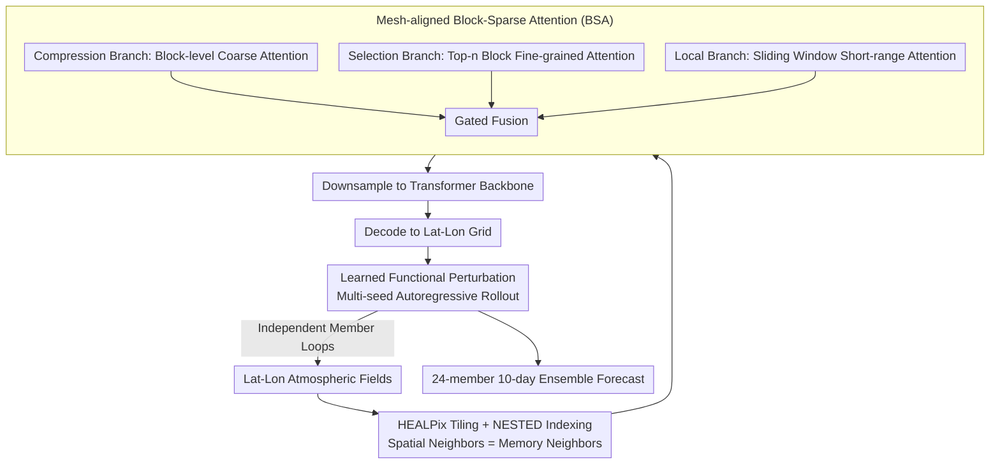

# (Sparse) Attention to the Details: Preserving Spectral Fidelity in ML-based Weather Forecasting Models

**Conference**: ICML 2026  
**arXiv**: [2604.16429](https://arxiv.org/abs/2604.16429)  
**Code**: https://github.com/maxxxzdn/mosaic (Available)  
**Area**: 3D Vision / Physical Modeling / Probabilistic Weather Forecasting / Sparse Attention  
**Keywords**: Weather forecasting, sparse attention, HEALPix mesh, spectral fidelity, probabilistic ensemble forecasting

## TL;DR
MOSAIC addresses two types of spectral degradation in ML weather forecasting models (spectral damping from deterministic averaging and high-frequency aliasing from coarsened latent spaces) using "probabilistic perturbation + mesh-aligned block-sparse attention on HEALPix spherical grids." With only 214M parameters at 1.5° resolution, it matches or exceeds models with 6× higher resolution, generating a 24-member 10-day forecast in 12 seconds on a single H100.

## Background & Motivation

**Background**: Traditional numerical weather prediction (NWP) performs 10-day forecasts by solving fluid dynamics equations, offering high accuracy but at a computational cost that grows cubically with resolution. Over the last three years, ML models (MLWP) such as GraphCast, Pangu, AIFS, GenCast, and Aurora have reduced inference time to under one minute—1000–10000× faster than NWP. However, they generally suffer from "blurriness" at fine scales, failing to faithfully reproduce fronts and tropical cyclones (50–80 km) and systematically underestimating energy at the mesoscale (10–100 km).

**Limitations of Prior Work**: The authors explicitly categorize the spectral failures of existing MLWP models into two types. The first is "spectral damping," which is statistical: deterministic models are trained to "predict conditional expectations," and expectations are inherently smoother than any single realization, causing high frequencies to be automatically erased. The second is "high-frequency aliasing," which is structural: almost all MLWP models employ "compression encoding"—projecting high-resolution atmospheric fields into a coarsened latent space where spatial reduction far exceeds channel expansion. If the Nyquist frequency of the latent grid is insufficient, nonlinear activations "fold" high-frequency content back into low wavenumbers, manifesting as an unnatural energy bulge near the Nyquist frequency during decoding (clearly visible in GenCast's spectrum).

**Key Challenge**: To eliminate spectral damping, probabilistic models must generate individual members rather than expectations. To eliminate aliasing, spatial mixing must occur at native resolution before compression. However, standard self-attention at a native 0.25° resolution is $O(N^2)$, which is computationally infeasible. Conversely, linear attention sacrifices input-dependent selectivity, failing to balance long-range dependencies with computational efficiency.

**Goal**: (i) Eliminate spectral damping at the probabilistic level; (ii) eliminate compression-induced high-frequency aliasing at the architectural level; (iii) provide global attention with $O(N)$ complexity and softmax expressivity on native grids to ensure spatial interaction occurs "before compression."

**Key Insight**: The authors observe that Tobler’s First Law of Geography—"everything is related to everything else, but near things are more related than distant things"—naturally supports two engineering designs: (1) utilizing HEALPix spherical tiling to ensure spatially adjacent pixels are contiguous in memory; (2) allowing adjacent queries to share key-value selections, replacing "per-token independent KV selection" with "per-block joint KV selection," thereby amortizing the cost of sparse attention over an entire block.

**Core Idea**: Extend Native Sparse Attention (NSA) from 1D sequences to the sphere by constructing mesh-aligned block-sparse attention (BSA). This achieves global long-range dependency modeling on the HEALPix mesh at $O(N)$ cost. Combined with learned functional perturbations for probabilistic ensemble forecasting, this approach simultaneously eliminates both modes of spectral failure.

## Method

### Overall Architecture
MOSAIC treats two types of spectral degradation (damping and aliasing) with independent sub-designs within a compact model (214M parameters, 1.5° entry resolution). Input fields are interpolated onto the HEALPix spherical tiling. Spatial interactions are performed at native resolution using mesh-aligned block-sparse attention (BSA) before downsampling into the transformer backbone and finally decoding back to the latitude-longitude grid. Learned stochastic perturbations are injected at the input to enable autoregressive rollout of ensemble members. The core mechanism involves replacing $O(N^2)$ self-attention with linear-complexity BSA to ensure spatial mixing occurs before compression, preventing aliasing, while probabilistic perturbations restore high-frequency energy lost to deterministic losses.

### Key Designs

**1. HEALPix Tiling + NESTED Indexing: Spatial Neighbors = Memory Neighbors**

For block-sparse attention to be efficient on GPUs, data for a single block must be read in a coalesced manner. Standard latitude-longitude grids oversample at the poles, and spatially adjacent points often span different rows, leading to large memory strides. HEALPix addresses this by partitioning the sphere into 12 equal-area base pixels, each recursively subdivided. At resolution $N_{side}$, there are $12 N_{side}^2$ equal-area pixels. Under the NESTED scheme (following a Z-order curve), adjacent pixels occupy contiguous indices—the four children of pixel $p$ are indexed $4p, 4p{+}1, 4p{+}2, 4p{+}3$. This unification of "spatial adjacency $\Rightarrow$ index adjacency $\Rightarrow$ memory adjacency" is the fundamental prerequisite for implementing BSA on the sphere.

Cross-attention interpolation is used to transfer lat-lon points to HEALPix: for each HEALPix target $i$, the relative position $p_{ij}$ acts as the query while adjacent source features act as keys/values: $o_i = \sum_{j\in N_i}\mathrm{softmax}_j(q_{ij}^T k_j/\sqrt d)\, v_j$. This design is critical for the feasibility of BSA.

**2. Mesh-aligned Block-Sparse Attention (BSA): Shifting Selection from Token to Block**

Standard self-attention is $O(N^2)$ and impractical at 0.25° resolution. BSA upgrades the "per-token selection" of Native Sparse Attention (NSA) to "per-block shared selection." First, $N$ tokens are partitioned into $m$ non-overlapping blocks $\{B_1, \dots, B_m\}$ following the HEALPix NESTED order. Each block uses pooling $\phi$ to obtain block-level representations $\bar q_i, \bar k_j, \bar v_j$. Three complementary branches are fused via learnable gates $g_{CG}, g_{FG}, g_L$: $o_i = g_{CG}o_i^{CG} + g_{FG}o_i^{FG} + g_L o_i^L$. The compression branch computes $\bar a_{ij} = \mathrm{softmax}(\bar q_i^T \bar k_j/\sqrt{d_k})$ for coarse block-to-block attention, broadcasting scores to all tokens within the block. The selection branch uses these scores to select the top-$n$ key blocks for each query block, performing full-resolution fine-grained attention only within those blocks to capture long-range interactions. The local branch performs standard sliding-window attention for short-range details.

This shift to block-level selection is enabled by HEALPix: on the sphere, "contiguous indexing" only equals "geographical proximity" when using such tiling. This aligns with atmospheric physics—local weather is influenced by similar distant regions—while amortizing selection costs by a factor of $B$ (block size), reducing complexity to linear.

**3. Learned Functional Perturbation: Restoring Erased High Frequencies via Probability**

Deterministic models minimize MSE against the conditional expectation, which is naturally smoother than any single realization. Consequently, high-frequency energy cannot be recovered through post-processing—this is the statistical root of spectral damping. Following Alet et al. (2025), MOSAIC adds a learnable global perturbation field at the input layer. Different seeds yield different members for independent rollout, transforming the output from a "smooth mean" to a "sample of plausible trajectories," each containing realistic high-frequency details. The resulting ensemble members' spectra almost perfectly match the ERA5 ground truth across all resolvable frequencies, whereas deterministic models consistently underestimate them.

### Mechanism
Consider a query block over a front in the North Atlantic:
1.  **Compression Branch**: Pools the entire globe into block-level tokens, calculating a coarse attention score between the front and all other global blocks. It identifies high scores for an upstream low-pressure trough and a specific tropical region.
2.  **Selection Branch**: Selects the top-$n$ (e.g., 16) key blocks based on these scores. It performs精细-resolution attention only on tokens within these select blocks, precisely capturing distant atmospheric coupling while ignoring irrelevant ocean areas.
3.  **Local Branch**: Performs standard attention within a sliding window around the block to preserve small-scale frontal structures.
The gated sum of these outputs ensures global coupling and local detail at a computational cost proportional to a few blocks rather than the whole globe.

### Loss & Training
The authors follow the training paradigm of ArchesWeather/GenCast: autoregressive training on ERA5 data (2013-2019) with 6-hour steps. Evaluation is conducted for the year 2020 following the WeatherBench2 protocol (24 members, 10-day forecast). The optimization objective follows a probabilistic framework. The model has 214M parameters and a 1.5° entry resolution, evaluated on a single H100 GPU.

## Key Experimental Results

### Main Results
MOSAIC (1.5°, 214M params) vs. various MLWP models:

| Model | Resolution | Spectral Fidelity (10m Wind 24h Ratio) | nRMSE @ 240h | Inference (per member/step) | Memory |
| :--- | :--- | :--- | :--- | :--- | :--- |
| Pangu-Weather | 0.25° | Sig. high-freq underestimation | ≈ Baseline | Fast | ≈ 10 GB |
| GraphCast (oper.) | 0.25° | High-freq underestimation | Good | Medium | ≈ 10 GB |
| GenCast (1st, oper.) | 0.25° | Near truth but aliasing bulge at Nyquist | Strong | Slow ($\approx 20\times$) | ≈ 70 GB |
| Stormer | 1.5° | High-freq underestimation | Baseline | Fast | Small |
| ArchesWeather-Gen | 1.5° | Near truth | Strong | Medium | Large |
| **MOSAIC (Ours)** | **1.5°** | **Near perfect alignment** | **Matches/Exceeds 6× res models** | **≤ 12s / 24-mem / 10-day** | **≈ 3 GB** |
| MOSAIC-C (Ablation) | 1.5° | Aliasing bulge at Nyquist | Sig. Drop | — | — |

### Ablation Study

| Configuration | Result |
| :--- | :--- |
| Full MOSAIC (BSA + Perturbation + Native) | Spectrum aligns with ERA5; optimal nRMSE. |
| MOSAIC-C (Forced latent compression) | Energy bulge at Nyquist, confirming compression $\to$ aliasing. |
| W/o functional perturbation (Det.) | Significant spectral damping; perturbation is key. |
| Dense attention instead of BSA | Runnable at 1.5° but memory/latency explode; infeasible at high res. |
| BSA w/o HEALPix (lat-lon blocks) | Tokens not geographically contiguous; "block sharing" fails, performance drops. |

### Key Findings
- The spectra of individual probabilistic members almost perfectly align with ERA5 ground truth; this is the first 1.5° model to "look like" the real atmosphere spectrally.
- Forced compression (MOSAIC-C) induces an energy bulge near the Nyquist frequency, consistent with GenCast, proving compression encoding is the cause of aliasing.
- MOSAIC at 1.5° matches or exceeds 0.25° models, challenging the assumption that higher resolution is always better: architectural correctness may be more important than data resolution.
- Efficiency: 12 seconds for 24 members over 10 days on a single H100 with only 3 GB VRAM makes it viable for consumer GPUs.

## Highlights & Insights
- "Grafting" NSA from language models to spherical physics modeling by recognizing that HEALPix satisfies NSA’s underlying assumption of "contiguous indexing = contiguous semantics."
- First clear distinction between spectral damping and aliasing as independent causes of "spectral failure," providing specific remedies for each.
- The hardware-friendly design (block-sharing selection) aligns with GPU memory access patterns, demonstrating a successful "hardware-geometric" co-design.
- Independent proposal of block-shared sparse attention (similar to concurrent work in video diffusion) suggests this is a universal principle for data with spatial/temporal continuity.

## Limitations & Future Work
- Training data (2013–2019) and compute are small compared to SOTA (e.g., GraphCast); performance on Z500 still trails ECMWF SOTA.
- The 1.5° resolution is an engineering compromise; scalability at 0.25°/0.5° needs verification as perturbation and decoder overheads may grow.
- BSA hyperparameters (block size, top-$n$) are manually tuned; adaptive versions could better handle varying physical scales (e.g., the ITCZ).
- Functional perturbation is input-level and does not explicitly model the physical structure of process noise (e.g., stochastic parameterization of convection).

## Related Work & Insights
- **vs. GenCast / GraphCast**: GenCast uses a compressed latent space leading to aliasing; GraphCast is deterministic and suffers from damping. MOSAIC solves both with much lower parameter/memory requirements.
- **vs. NSA / Video Sparse Attention**: While these work on 1D or regular grids, MOSAIC is the first to implement them on a spherical mesh using HEALPix as a geometric prerequisite.
- **vs. Subich 2025 / Bonev 2025**: Instead of using loss function penalties to recover resolution, MOSAIC solves it through architecture and probability, avoiding complex manual weighting.
- **vs. Banño-Medina 2025**: Shares the "native resolution" philosophy but uses MPNNs which lack long-range dependencies; MOSAIC gains significant expressivity by using attention.

## Rating
- Novelty: ⭐⭐⭐⭐⭐ Unifying spherical physics, BSA, HEALPix memory continuity, and functional perturbations is highly original.
- Experimental Thoroughness: ⭐⭐⭐⭐⭐ Strong evidence across spectral analysis, nRMSE, efficiency, and causality-focused ablations (MOSAIC-C).
- Writing Quality: ⭐⭐⭐⭐⭐ Clear diagnosis of the "two failure modes" with highly persuasive visualizations (Fig 2).
- Value: ⭐⭐⭐⭐⭐ High practical impact for both researchers and operational forecasting due to high fidelity and extreme efficiency.

<!-- RELATED:START -->

## Related Papers

- [\[CVPR 2026\] MeteorPred: A Meteorological Multimodal Large Model and Dataset for Severe Weather Event Prediction](../../CVPR2026/earth_science/meteorpred_a_meteorological_multimodal_large_model_and_dataset_for_severe_weathe.md)
- [\[CVPR 2026\] GeoChemAD: Benchmarking Unsupervised Geochemical Anomaly Detection for Mineral Exploration](../../CVPR2026/earth_science/geochemad_benchmarking_unsupervised_geochemical_anomaly_detection_for_mineral_ex.md)
- [\[CVPR 2026\] SIGMA: A Physics-Based Benchmark for Gas Chimney Understanding in Seismic Images](../../CVPR2026/earth_science/sigma_a_physics-based_benchmark_for_gas_chimney_understanding_in_seismic_images.md)
- [\[AAAI 2026\] MdaIF: Robust One-Stop Multi-Degradation-Aware Image Fusion with Language-Driven Semantics](../../AAAI2026/earth_science/mdaif_robust_one-stop_multi-degradation-aware_image_fusion_with_language-driven_.md)
- [\[AAAI 2026\] RENEW: Risk- and Energy-Aware Navigation in Dynamic Waterways](../../AAAI2026/earth_science/renew_risk-_and_energy-aware_navigation_in_dynamic_waterways.md)

<!-- RELATED:END -->
