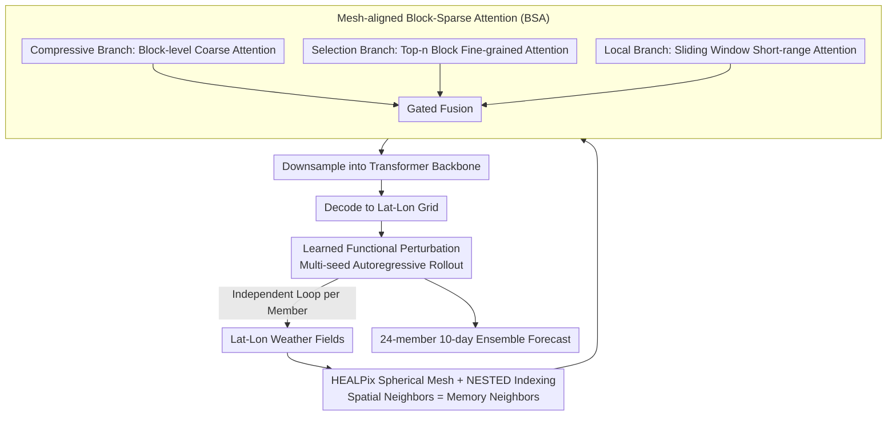

# (Sparse) Attention to the Details: Preserving Spectral Fidelity in ML-based Weather Forecasting Models

**Conference**: ICML 2026  
**arXiv**: [2604.16429](https://arxiv.org/abs/2604.16429)  
**Code**: https://github.com/maxxxzdn/mosaic (Available)  
**Area**: 3D Vision / Physics-based Modeling / Probabilistic Weather Forecasting / Sparse Attention  
**Keywords**: Weather Forecasting, Sparse Attention, HEALPix mesh, Spectral Fidelity, Probabilistic Ensemble Forecasting

## TL;DR
MOSAIC addresses two types of spectral degradation in ML weather forecasting models (spectral damping from deterministic averaging and high-frequency aliasing from coarsened latent spaces) by combining "probabilistic perturbation + mesh-aligned block-sparse attention on HEALPix spherical grids." With only 214M parameters at 1.5° resolution, it matches or exceeds models with 6× higher resolution, generating a 24-member 10-day forecast in 12 seconds on a single H100.

## Background & Motivation

**Background**: Traditional Numerical Weather Prediction (NWP) provides high-accuracy 10-day forecasts by solving fluid dynamics equations, but computational costs scale cubically with resolution. Over the past three years, ML models (MLWP) such as GraphCast, Pangu, AIFS, GenCast, and Aurora have reduced inference time to under one minute—1,000 to 10,000 times faster than NWP. However, they generally struggle at fine scales: 50–80 km fronts and tropical cyclones cannot be faithfully reproduced, and energy is systematically underestimated in the mesoscale (10–100 km).

**Limitations of Prior Work**: The authors categorize the spectral failures of existing MLWP into two types. The first is "spectral damping," which is statistical: deterministic models are trained to predict the "conditional expectation," which is inherently smoother than any single realization, thus automatically erasing high frequencies. The second is "high-frequency aliasing," which is architectural: nearly all MLWP use "encoder-compression"—mapping high-resolution fields to a coarsened latent space where spatial reduction far exceeds channel expansion. If the Nyquist frequency of the latent grid is insufficient, nonlinear activations "fold" high-frequency content back into low wavenumbers, manifesting as non-physical energy spikes near the Nyquist frequency during decoding (clearly visible in GenCast spectra).

**Key Challenge**: Eliminating spectral damping requires probabilistic models to generate single realizations rather than expectations; eliminating aliasing requires spatial mixing at the native resolution rather than after compression. However, standard self-attention at the native 0.25° resolution is $O(N^2)$, which is computationally prohibitive. Linear attention, while efficient, sacrifices input-dependent selectivity and fails to balance long-range dependencies with computational cost.

**Goal**: (i) Eliminate spectral damping at the probabilistic level; (ii) eliminate compression-induced aliasing at the architectural level; (iii) provide global attention with $O(N)$ complexity and softmax expressivity on the native grid to ensure spatial interaction occurs "before compression."

**Key Insight**: The authors observe that Tobler’s First Law of Geography—"near things are more related than distant things"—supports two engineering designs: (1) Placing data on a HEALPix spherical tessellation to ensure spatially adjacent pixels are contiguous in memory; (2) allowing adjacent queries to share key-value selections, replacing "per-token independent KV selection" with "per-block shared KV selection" to amortize the selection cost of sparse attention over an entire block.

**Core Idea**: Extend Native Sparse Attention (NSA) from 1D sequences to the sphere by constructing mesh-aligned block-sparse attention (BSA). This achieves global long-range dependency modeling on the HEALPix mesh with $O(N)$ cost. Combined with learned functional perturbation for probabilistic ensemble forecasting, it simultaneously eliminates both modes of spectral failure.

## Method

### Overall Architecture
MOSAIC targets both types of spectral degradation (damping and aliasing) in a relatively small model (214M parameters) with 1.5° input. These issues are addressed through two independent sub-designs. Input weather fields are interpolated onto a HEALPix spherical tessellation. Global spatial interactions are performed at the native resolution using mesh-aligned block-sparse attention (BSA), followed by downsampling into a transformer backbone and decoding back to a latitude-longitude grid. Learned stochastic perturbations are injected at the input to enable autoregressive rollout of an ensemble of members. The core mechanism involves replacing the $O(N^2)$ self-attention of standard transformers with BSA of linear complexity, enabling spatial mixing "before compression" to avoid aliasing, while probabilistic perturbations restore high-frequency energy lost to deterministic losses.

### Key Designs

**1. HEALPix Spherical Mesh + NESTED Indexing: Spatial Neighbors = Memory Neighbors**

For block-sparse attention to be fast on GPUs, data within a block must be read contiguously. Standard lat-lon grids oversample the poles and spatially adjacent points are often separated by rows in memory. HEALPix solves this by dividing the sphere into 12 equal-area base pixels, each recursively subdivided. At $N_{side}$ resolution, there are $12 N_{side}^2$ equal-area pixels ($N_{side} \in \{32, 64, 128, 256\}$ corresponding to 1.83°/0.92°/0.46°/0.23°). In the NESTED indexing scheme, adjacent pixels follow a Z-order curve, meaning the four sub-pixels of pixel $p$ are indexed $4p, 4p+1, 4p+2, 4p+3$. This unification of "spatial adjacency ⇒ index adjacency ⇒ memory adjacency" is the foundational condition for implementing BSA on a sphere.

Conversion between lat-lon and HEALPix uses cross-attention: for each target HEALPix point $i$, the query is the relative position $p_{ij}$ and the keys/values are features of adjacent source points, computing $o_i = \sum_{j\in N_i}\mathrm{softmax}_j(q_{ij}^T k_j/\sqrt d)\, v_j$. Decoding is the symmetric inverse. This is not just an optimization but a prerequisite for BSA.

**2. Mesh-aligned Block-Sparse Attention (BSA): Raising "Selection" from Token to Block**

Standard self-attention at 0.25° resolution is $O(N^2)$, while linear attention lacks input-dependent selectivity for long-range dependencies. BSA upgrades the "per-token selection" of NSA to "per-block shared selection." First, $N$ tokens are partitioned into $m$ non-overlapping blocks $\{B_1, \dots, B_m\}$ following the HEALPix NESTED order. Each block uses pooling $\phi$ to derive block-level representations $\bar q_i, \bar k_j, \bar v_j$. Three complementary branches are fused via learnable gates $g_{CG}, g_{FG}, g_L$: $o_i = g_{CG}o_i^{CG} + g_{FG}o_i^{FG} + g_L o_i^L$. The compressive branch computes $\bar a_{ij} = \mathrm{softmax}(\bar q_i^T \bar k_j/\sqrt{d_k})$ for coarse block-to-block attention. The selection branch uses these scores to select the top-$n$ key blocks for each query block, performing full-resolution fine-grained attention only within these blocks. The local branch performs standard sliding window attention for short-range details.

This block-level selection is enabled by HEALPix: whereas NSA works in 1D because index continuity implies semantic continuity, on a sphere, this only holds for HEALPix. Constraining selection to blocks effectively assumes that "geographically close queries attend to the same distant regions," which aligns with atmospheric physics and reduces selection overhead by approximately $B$ times (where $B$ is block size), achieving linear complexity on high-resolution grids.

**3. Learned Functional Perturbation: Recovering High Frequencies via Probabilistic Members**

Deterministic models minimize MSE against the conditional expectation, which is inherently smoother than reality. This is the statistical root of spectral damping. Following Alet et al. (2025), MOSAIC adds a learnable functional perturbation to the input layer. Different seeds yield different members for independent rollout, transforming the "single smooth mean" into a "sample of plausible trajectories." Each trajectory is a realization containing authentic high-frequency details. This ensures the ensemble members' spectra almost perfectly match the ERA5 ground truth across all resolvable frequencies, whereas deterministic models systematically underestimate them. Together with BSA, this resolves both "statistical damping" and "architectural aliasing."

### Loss & Training
The authors follow the training paradigm of GenCast: autoregressive training on ERA5 data (2013-2019) with 6-hour steps. Evaluation is conducted on the full year of 2020 following the WeatherBench2 protocol. The model uses 24 members for 10-day forecasts. The objective function follows a probabilistic framework. MOSAIC has 214M parameters and a 1.5° resolution. Inference benchmarks were performed on a single H100 GPU.

## Key Experimental Results

### Main Results
MOSAIC (1.5°, 214M parameters) vs other MLWP:

| Model | Resolution | Spectral Fidelity (10m Wind 24h) | nRMSE @ 240h | Inf. Time / Member / Step | VRAM |
| :--- | :--- | :--- | :--- | :--- | :--- |
| Pangu-Weather | 0.25° | Significant HF Underestimation | ≈ baseline | Fast | ≈ 10 GB |
| GraphCast | 0.25° | HF Underestimation | Good | Medium | ≈ 10 GB |
| GenCast | 0.25° | Near GT but Nyquist Spike (Aliasing) | Strong | Slow ($\approx 20\times$) | ≈ 70 GB |
| Stormer | 1.5° | HF Underestimation | baseline | Fast | Small |
| ArchesWeather-Gen | 1.5° | Near GT | Strong | Medium | Large |
| **MOSAIC (Ours)** | **1.5°** | **Almost perfect alignment** | **Matches/Exceeds 6×-res models** | **≤ 12s / 24 mem / 10d** | **≈ 3 GB** |

### Ablation Study

| Configuration | Result |
| :--- | :--- |
| Full MOSAIC (BSA + Perturbation + Native Grid) | Spectrum aligns with ERA5; optimal nRMSE |
| MOSAIC-C (Forced compression to coarse latent) | Energy spike at Nyquist, confirming compression $\to$ aliasing |
| No functional perturbation (Deterministic) | Obvious spectral damping; confirms perturbation is key |
| Replace BSA with dense attention | Runs at 1.5° but VRAM/latency spike; infeasible for higher res |
| BSA without HEALPix (lat-lon blocks) | Tokens in block not geographically contiguous; BSA assumption fails; performance drops |

### Key Findings
- Probabilistic members' spectra match ERA5 almost perfectly; this is the first 1.5° model that "looks like the real atmosphere" spectrally.
- MOSAIC-C (compressed) exhibits Nyquist energy spikes, confirming that encoder-compression is the direct cause of aliasing—a finding that should guide future MLWP architectures.
- MOSAIC matches or exceeds 0.25° models while running at 1.5°, challenging the assumption that higher resolution is always better; architectural correctness may be more critical than raw data resolution.
- 12s for 24 members for 10 days on a single H100 makes it one of the most efficient probabilistic models, capable of running on consumer GPUs (3 GB VRAM).

## Highlights & Insights
- "Grafting" NSA from language models to spherical physics modeling by recognizing that NSA’s assumption—"index continuity = semantic continuity"—is uniquely satisfied by HEALPix. This demonstrates the value of identifying implicit assumptions in methods across domains.
- Differentiating spectral damping and aliasing as two distinct causes of "spectral failure." MOSAIC-C provides a compelling "reverse ablation" by intentionally reintroducing the error.
- Block-shared selection is more GPU-friendly than token-level selection. This "hardware-aware geometric prior" design is a valuable approach for efficient transformer research.
- Independent yet parallel to block-shared sparse attention in video diffusion (Gu 2026); this suggests that block-shared sparsity is a universal principle for physical data with spatio-temporal continuity.

## Limitations & Future Work
- Training data (2013-2019) and compute are smaller scale compared to SOTA like GraphCast; nRMSE on Z500 still trails ECMWF SOTA.
- 1.5° resolution is an engineering compromise; scalability to 0.25° or 0.5° requires further validation (BSA is linear, but perturbation and decoder overheads need re-evaluation).
- BSA hyperparameters (block size, top-$n$) are manually tuned; adaptive versions that follow physical scales (e.g., wider ITCZ regions) could be beneficial.
- Input-level perturbations do not explicitly model the physical structure of process noise (e.g., stochastic parameterization of convection), potentially leading to under-sampling of extremes.

## Related Work & Insights
- **vs GenCast / GraphCast**: GenCast is probabilistic but uses compression (aliasing); GraphCast is deterministic (damping). MOSAIC solves both and matches them at 1.5° with far fewer resources.
- **vs NSA / Video Sparse Attention**: These apply block-level sparsity to 1D sequences or regular grids; MOSAIC is the first to implement this on spherical meshes using HEALPix as a geometric prerequisite.
- **vs Spectral Loss Constraints (Subich 2025)**: Others use loss functions to penalize spectral differences; MOSAIC uses architecture + probability to solve it fundamentally, avoiding complex loss weighting.
- **vs Native Grid Message-Passing (Bonev 2025)**: Shares the "native resolution" philosophy but uses MPNNs which lack long-range dependencies; MOSAIC gains significant expressivity by using transformers.

## Rating
- Novelty: ⭐⭐⭐⭐⭐ Integrates spherical modeling, NSA, HEALPix memory continuity, and probabilistic perturbation into a single framework.
- Experimental Thoroughness: ⭐⭐⭐⭐⭐ Comprehensive evidence across spectra, nRMSE/ACC, efficiency, and causality-focused ablations.
- Writing Quality: ⭐⭐⭐⭐⭐ Clear diagnosis of "two failure modes" and visual evidence in Fig. 2 are very persuasive.
- Value: ⭐⭐⭐⭐⭐ High-efficiency probabilistic 10-day forecasts with realistic spectra have strong implications for both research and operational forecasting.

<!-- RELATED:START -->

## Related Papers

- [\[ICML 2026\] Scaling Laws of Global Weather Models](scaling_laws_of_global_weather_models.md)
- [\[CVPR 2026\] PhyOceanCast: Global Ocean Forecasting with Physics-Informed Diffusion](../../CVPR2026/earth_science/phyoceancast_global_ocean_forecasting_with_physics-informed_diffusion.md)
- [\[CVPR 2026\] SIGMA: A Physics-Based Benchmark for Gas Chimney Understanding in Seismic Images](../../CVPR2026/earth_science/sigma_a_physics-based_benchmark_for_gas_chimney_understanding_in_seismic_images.md)
- [\[AAAI 2026\] MdaIF: Robust One-Stop Multi-Degradation-Aware Image Fusion with Language-Driven Semantics](../../AAAI2026/earth_science/mdaif_robust_one-stop_multi-degradation-aware_image_fusion_with_language-driven_.md)
- [\[AAAI 2026\] RENEW: Risk- and Energy-Aware Navigation in Dynamic Waterways](../../AAAI2026/earth_science/renew_risk-_and_energy-aware_navigation_in_dynamic_waterways.md)

<!-- RELATED:END -->
