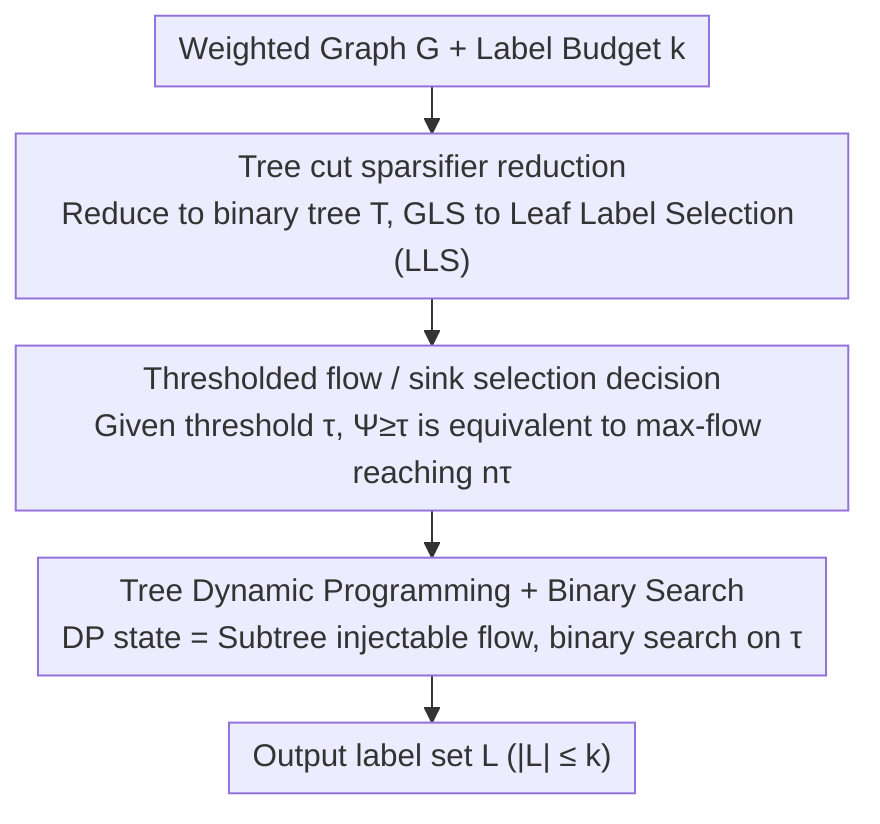

# An Approximation Algorithm for Graph Label Selection

**Conference**: ICML2026  
**arXiv**: [2605.18623](https://arxiv.org/abs/2605.18623)  
**Code**: https://github.com/josia-john/icml2026-graph-label-selection  
**Area**: Graph Learning  
**Keywords**: Graph label selection, active learning, approximation algorithm, tree cut sparsifier, dynamic programming  

## TL;DR
This paper provides the first $\tilde{O}(\log^{1.5} n)$ approximation algorithm for Graph Label Selection without label budget relaxation. By employing tree cut sparsification, flow decision-making, and dynamic programming on trees, it transforms the originally globally coupled node selection problem into a solvable combinatorial optimization pipeline.

## Background & Motivation
**Background**: Active learning on graphs often represents the similarity between samples as a weighted graph and selects a small number of vertices $k$ for labeling, aiming for these labels to represent the entire graph. Graph Label Selection (GLS) is a classic formulation of this problem: select a labeled set $L$ to maximize the worst-case cut sparseness $\Psi(L)$ of the remaining unlabeled subset. Intuitively, this prevents the existence of any large unlabeled cluster that is weakly connected to known information.

**Limitations of Prior Work**: The objective function is neither submodular nor supermodular, making it difficult for point-wise greedy methods to provide reliable guarantees. Existing theoretical methods mostly adopt resource augmentation, allowing the algorithm to select more than $k$ labels for comparison with the optimal solution for budget $k$. This is unnatural for practical active learning where the labeling budget is usually a hard constraint.

**Key Challenge**: The difficulty of GLS lies in the fact that "which point to select" is not a local problem. The value of a point depends on which sparse clusters it cuts alongside other candidate points; examples like star graphs show that local greedy selections can be significantly incorrect. To obtain approximation guarantees under a fixed budget, the algorithm must explicitly handle the global interactions between labeled points.

**Goal**: The authors aim to answer an open question posed by works such as Cohen-Addad et al.: whether there exists a polynomial-time approximation algorithm that strictly uses $k$ labeled points while competing with $\mathrm{OPT}_k$. This paper provides an affirmative answer with an approximation factor of $\tilde{O}(\log^{1.5} n)$.

**Key Insight**: Instead of following point-wise greedy approaches, the authors reduce a general graph to a binary tree via a tree cut sparsifier. They then transform the decision of "whether a label set is good enough" given a threshold $\tau$ into a max-flow determination, and finally leverage the tree structure for dynamic programming.

**Core Idea**: Utilize tree cut sparsification to preserve the sparseness of all cuts, and use dynamic programming on the tree to select a set of leaf labels at once, thereby capturing the global combinatorial effects between labeled points.

## Method

### Overall Architecture
The paper addresses graph label selection under a fixed budget $k$. The difficulty lies in the objective function being neither submodular nor supermodular, which prevents greedy methods from obtaining guarantees. The approach breaks this globally coupled selection problem by translating it layer by layer into more manageable forms: first reducing the general graph to a binary tree using a tree cut sparsifier (transforming node selection into leaf selection), then rewriting the "goodness of a label set" as a max-flow decision on the tree, and finally performing precise dynamic programming for this flow problem on the tree structure with a binary search over the threshold. The approximation factor arises solely from the distortion of the first tree cut sparsification step; the subsequent two steps are solved exactly on the tree problem.

### Key Designs

**1. Tree cut sparsifier reduction: Compressing global selection onto a tree**

The fundamental difficulty of GLS is that "which point to select" is not a local problem—a point's value depends on which sparse clusters it cuts in conjunction with other candidate labels. Star graphs are examples where greedy methods fail. The first step involves constructing a tree $T$ whose leaf set equals the vertices of the original graph, such that for any $A\subseteq V$, the original graph cut weight $w_G(A,V\setminus A)$ is bounded by the minimum cut in the tree $\lambda_T(A,\mathcal{L}_T\setminus A)$ separating $A$ and its complement, up to a factor $\alpha$. Thus, the objective value of any labeled set $L$ satisfies $\Psi_G(L)\leq\widehat{\Psi}_T(L)\leq\alpha\Psi_G(L)$, transforming GLS into Leaf Label Selection (LLS) on the tree: select $|L|\leq k$ leaves to maximize the worst tree cut sparseness $\widehat{\Psi}_T(L)$ of the unlabeled leaves. The tree structure makes subsequent DP possible, while the cut sparsifier ensures the tree solution does not deviate significantly from the original graph. An additional binarization step standardizes the DP structure without altering approximation properties.

**2. Thresholded flow / sink selection decision: Compressing "all subsets must be good" into a flow constraint**

The objective of LLS is minimum sparseness, which remains a non-linear constraint that must hold for all unlabeled subsets and is difficult to optimize directly. The authors transform it into a feasibility decision for a given threshold $\tau$: they construct a graph $T_{L,\tau}$ where each leaf receives a capacity $\tau$ from a source, selected labels are connected to a sink with infinite capacity, and tree edges retain their original capacities. The key equivalence is that $\widehat{\Psi}_T(L)\geq\tau$ if and only if the $s$-$t$ max-flow in this graph reaches $n\tau$. If there exists any unlabeled leaf set forming an overly sparse cut, the min-cut will be lower than $n\tau$; conversely, a full flow of $n\tau$ indicates that the sparseness of all unlabeled sets is no less than $\tau$. This step compresses the global constraint into max-flow/min-cut language, turning the problem into selecting minimum leaves as sinks within a budget to allow all source flow to be routed, providing a flow-conservation perspective for DP.

**3. Tree dynamic programming and binary search: Exact solving with injectable flow as state**

While sink selection on general graphs is still difficult, it can be solved exactly on binary trees via DP. The state $\mathrm{DP}[v][k]$ represents the maximum additional flow that can be injected from the subtree root $T_v$ while remaining routable, given a budget of $k$ sinks in the subtree. The leaf base case is straightforward: an unlabeled leaf contributes $-\tau$ net demand, while a labeled leaf (sink) can absorb arbitrary flow. Internal nodes enumerate budget allocations $a$ and $k-a$, using an edge capacity function $\mathrm{bound}_{(v,c)}(x)$ to truncate the flow each subtree can handle within edge limits before summing them. If $\mathrm{DP}[root][k]\geq 0$ at the root, the budget $k$ is sufficient for the threshold $\tau$ to be feasible. The final LLS solution is found by binary search on $\tau$. The total states are $O(nk)$, and each transition enumerates budget, leading to a DP time complexity of $O(nk^2)$. The value of this design lies in the tree structure allowing left and right subproblems to exchange flow only through a single edge, enabling the DP to fully capture the global interaction between labeled points.

### Loss & Training
This work presents a combinatorial optimization algorithm rather than a neural network training loss. The objective is to maximize $\Psi(L)=\min_{C\subseteq V\setminus L} w(C,V\setminus C)/|C|$, ensuring no unlabeled cluster is both large and isolated. The theoretical algorithm uses binary search for $\tau$. In the experimental implementation, due to the lack of an open-source tree cut sparsifier, the authors construct hierarchical decomposition trees using sparse cut heuristics such as Fiedler vectors and METIS.

## Key Experimental Results

### Main Results
The primary theoretical result is the fixed-budget approximation guarantee. Experiments demonstrate the speed advantages of the heuristic tree decomposition version on real SNAP graphs. The following table synthesizes theoretical and ca-GrQc runtime results.

| Dataset / Setting | Metric | Ours | Prev. SOTA / Baseline | Gain |
|---------------|------|------|-----------------|------|
| General weighted graph, budget $k$ | Approx. Guarantee | $\tilde{O}(\log^{1.5} n)$, with $|L|\leq k$ | $O(\log n)$ resource augmentation (Cohen-Addad et al.) | First poly-time approx. without budget relaxation |
| ca-GrQc, $k=10$ | Real time | 22s (Ours Fiedler) | 144s Guillory-Bilmes / 4967s Cohen-Addad | ~6.5x / 225x faster |
| ca-GrQc, $k=50$ | Real time | 21s (Ours Fiedler) | 842s Guillory-Bilmes / 15586s Cohen-Addad | ~40x / 742x faster |
| ca-GrQc, $k=100$ | Real time | 22s (Ours Fiedler) | 1835s Guillory-Bilmes / 22956s Cohen-Addad | ~83x / 1043x faster |
| com-dblp, 317,080 nodes | $\Psi$ Quality | 0.030 / 0.048 / 0.083 for $k=50/500/5000$ | Most baselines fail to scale to this size | Provides usable solutions on large graphs |

### Ablation Study
The main analysis in the experiments concerns the impact of different sparse-cut heuristics on quality and scalability. The authors do not claim these heuristics maintain worst-case theoretical guarantees, but they demonstrate practically runnable versions of the theoretical framework.

| Configuration | Key Metric | Description |
|------|---------|------|
| Fiedler sweep | Quality near existing methods on ca-GrQc, ~20s runtime | Stable spectral cut quality, but requires Fiedler vector calculation |
| FiedlerBalanced, $\beta\in\{0.01,0.1\}$ | Faster speed, lower quality | Forced balanced tree decomposition reduces recursion depth/time at the cost of cut quality |
| METIS, samples $\in\{\sqrt n,10\sqrt n,100\sqrt n\}$ | Scalable to com-dblp, $\sqrt n$ samples finishes in hours | Multiple METIS cuts with different target weights maintain utility on large graphs |
| Original tree cut sparsifier | Theoretical factor $\tilde{O}(\log^{1.5} n)$ | Lack of open-source implementation; replaced by heuristics in experiments |

### Key Findings
- The fixed-budget approximation is the most significant theoretical breakthrough: it avoids the unrealistic "labeling more points" guarantee common in active learning.
- The tree DP runtime is primarily $O(nk^2)$; thus, when $k$ is not extremely large, it has higher scaling potential than repeatedly solving complex flow/cut problems on general graphs.
- Experimental quality corresponds strongly to the sparse-cut heuristic used. Fiedler and METIS perform well overall, while the Balanced version trades quality for speed. This indicates the practical bottleneck has shifted from "how to select labels" to "how to construct good tree decompositions."

## Highlights & Insights
- The transformation of the budget-constrained selection problem into "selecting sinks for flow routability" is particularly clever. This perspective treats each labeled point as a mechanism for flow absorption rather than a local greedy score booster.
- The paper clearly distinguishes between the theoretical algorithm and the engineering implementation. Theoretically, it relies on tree cut sparsifiers for approximation factors; experimentally, it uses Fiedler/METIS for proof-of-concept, which is more rigorous than presenting heuristics as theoretical algorithms.
- The dynamic programming state design is highly reusable. Many active learning or representative selection problems under tree decomposition could utilize "injectable/absorbable flow" as a composable state.
- For graph active learning, this paper serves as a reminder: if the objective is not submodular, adding more greedy heuristics may not yield guarantees. Switching to an equivalent decision problem can open up new algorithmic spaces.

## Limitations & Future Work
- The experiments do not utilize a true worst-case tree cut sparsifier implementation, meaning the experimental version does not inherit the $\tilde{O}(\log^{1.5} n)$ theoretical guarantee. Complete results await a high-quality open-source sparsifier.
- The runtime tables are not strictly controlled benchmarks; the authors note other processes were running and the implementation was not optimized. Thus, figures should be viewed for order-of-magnitude trends rather than precise ranking.
- The objective function focuses on graph cut sparseness, suitable for label propagation settings. If real tasks have high label noise, class imbalance, or feature model errors, graph structure alone may be insufficient.
- The DP has a $k^2$ dependency on the budget. Scenarios with very large budgets or ultra-large-scale dynamic graphs still require optimization, such as approximate DP, parallel METIS sampling, or incremental updates.

## Related Work & Insights
- **vs Guillory and Bilmes**: Early work proposed the GLS objective and practical heuristics; this paper addresses the fixed-budget guarantee from an approximation algorithm perspective, offering stronger theoretical foundations.
- **vs Cesa-Bianchi et al.**: Previous work provides guarantees for specific structures like unweighted trees; this paper uses tree cut sparsifiers to reduce general graphs to trees, broadening the scope of application.
- **vs Cohen-Addad et al.**: Prior work gave resource augmentation algorithms and posed the fixed-budget problem as an open question; this paper directly addresses that question, though the approximation factor comes from flow reduction and implementation relies on heuristic decompositions.
- **Insights**: For sample selection problems on graphs, one can first find tree/hierarchical decompositions that preserve cut structures and then perform exact DP on those structures. This route may be more effective for obtaining provable results than designing greedy rules directly on original graphs.

## Rating
- Novelty: ⭐⭐⭐⭐⭐ First polynomial GLS approximation without resource augmentation.
- Experimental Thoroughness: ⭐⭐⭐⭐☆ Covers multiple SNAP graphs with various heuristics, though the gap between theoretical and experimental implementation remains.
- Writing Quality: ⭐⭐⭐⭐☆ Complete reduction chain and clear proofs; some pseudocode is dense.
- Value: ⭐⭐⭐⭐⭐ Significant reference value for graph active learning and combinatorial optimization.

<!-- RELATED:START -->

## Related Papers

- [\[AAAI 2026\] Posterior Label Smoothing for Node Classification](../../AAAI2026/graph_learning/posterior_label_smoothing_for_node_classification.md)
- [\[ICML 2026\] Identifying and Correcting Label Noise for Robust GNNs via Influence Contradiction](identifying_and_correcting_label_noise_for_robust_gnns_via_influence_contradicti.md)
- [\[AAAI 2026\] EchoLess: Label-Based Pre-Computation for Memory-Efficient Heterogeneous Graph Learning](../../AAAI2026/graph_learning/echoless_label-based_pre-computation_for_memory-efficient_heterogeneous_graph_le.md)
- [\[AAAI 2026\] RFKG-CoT: Relation-Driven Adaptive Hop-count Selection and Few-Shot Path Guidance for Knowledge-Aware QA](../../AAAI2026/graph_learning/rfkg-cot_relation-driven_adaptive_hop-count_selection_and_few-shot_path_guidance.md)
- [\[ECCV 2024\] GKGNet: Group K-Nearest Neighbor Based Graph Convolutional Network for Multi-Label Image Recognition](../../ECCV2024/graph_learning/gkgnet_group_k-nearest_neighbor_based_graph_convolutional_network_for_multi-labe.md)

<!-- RELATED:END -->
