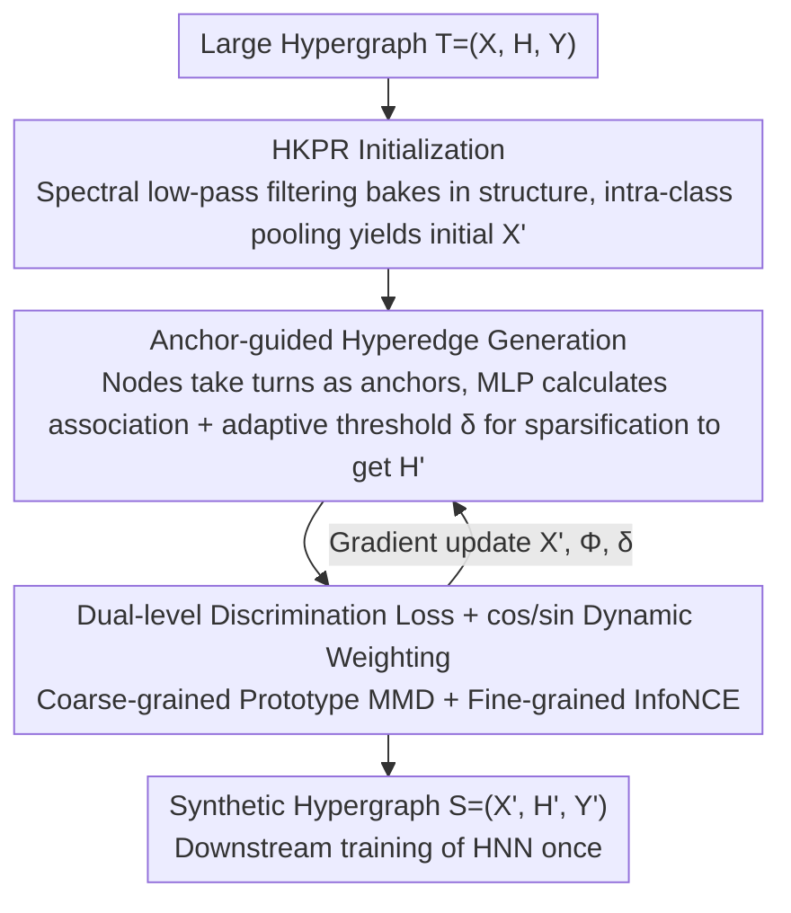

# Anchor-guided Hypergraph Condensation with Dual-level Discrimination

**Conference**: ICML 2026  
**arXiv**: [2605.10001](https://arxiv.org/abs/2605.10001)  
**Code**: Not publicly available  
**Area**: Graph Learning / Hypergraph Neural Networks / Dataset Distillation (Graph/Hypergraph Condensation)  
**Keywords**: hypergraph condensation, HKPR diffusion, anchor-guided hyperedge, dual-level discrimination, MMD

## TL;DR
AHGCDD reformulates hypergraph condensation (HGC) from a decoupled paradigm of "training a structure generator then matching trajectories" into an end-to-end framework. It embeds structural information into initial features using Heat-Kernel-PageRank, synthesizes sparse learnable hyperedges via an anchor-guided approach based on feature distances, and replaces expensive HNN retraining with a dual-level discrimination loss (prototype MMD + instance-level contrastive). It achieves ≥SOTA across 5 hypergraph benchmarks with up to a 144× speedup.

## Background & Motivation

**Background**: Hypergraph Neural Networks (HNNs) excel at modeling high-order interactions in social analysis, biochemistry, and e-commerce. However, training on large-scale hypergraphs incurs massive computational costs. Graph Condensation (GC) compresses original graphs into small synthetic ones while preserving downstream GNN performance. In 2025, HG-Cond extended this to hypergraphs by pre-training a Neural Hyperedge Linker (NHL) using variational inference to capture high-order connectivity, followed by trajectory alignment via GPSM through repeated HNN retraining.

**Limitations of Prior Work**: HG-Cond faces two fundamental issues: (1) **Decoupling of structure generation and feature optimization**: The NHL is frozen during the amelioration phase; it is only optimized to "reconstruct the original hypergraph" without joint training with synthetic features, leading to a mismatch between structure and nodes that degrades downstream accuracy. (2) **Resource-intensive trajectory matching**: Each amelioration round requires retraining an HNN, which, combined with the memory cost of variational NHL pre-training, makes the total overhead difficult to scale to large-scale hypergraphs.

**Key Challenge**: Integrating "structure, features, and training trajectories" into a bi-level optimization inevitably leads to either expensive retraining or complex alignment losses. To maintain downstream accuracy without retraining, a lightweight signal must be identified that can supervise both structure and features simultaneously.

**Goal**: (1) Incorporate the structure generator into end-to-end optimization to avoid misalignment; (2) Identify an alignment objective that does not require HNN retraining; (3) Encode high-order structural information into features during the initialization phase to provide a strong starting point for optimization.

**Key Insight**: First, apply a low-pass spectral filter on the original graph via Heat Kernel PageRank to "bake" multi-hop structural knowledge into node features. Next, let each synthetic node take turns acting as an anchor to learn pairwise association strengths via an MLP to form differentiable sparse hyperedges. Finally, use a composite loss of prototype MMD and node-level InfoNCE to preserve both the global class distribution and local decision boundaries.

**Core Idea**: Replace "structure by generator + features by matching" with "structure and features driven simultaneously by a discrimination loss," and collapse expensive "repeated propagation" into a one-time initialization filter using HKPR.

## Method

### Overall Architecture
AHGCDD addresses the problem of compressing a large hypergraph into a small synthetic hypergraph such that downstream HNNs trained on the small graph approximate full-graph accuracy, while bypassing the high costs of HG-Cond's "pre-trained generator + trajectory matching." The approach divides condensation into three complementary tasks: first, spectral filtering to bake high-order structure into synthetic node features; second, allowing these features to generate differentiable sparse hyperedges; and third, using a discrimination loss that supervises both structure and features without HNN retraining. Given a large hypergraph $\mathcal{T}=(\mathbf{X},\mathbf{H},\mathbf{Y})$, the synthetic hypergraph $\mathcal{S}=(\mathbf{X}',\mathbf{H}',\mathbf{Y}')$ satisfies $N'\ll N$ and $M'\ll M$; once optimization is complete, downstream models only need to be trained once on $\mathcal{S}$.

### Key Designs

**1. HKPR Initialization: Baking Multi-hop Structural Knowledge into Features Once**

A pain point of condensation is that if synthetic features are initialized randomly, subsequent optimization must learn structure from scratch. AHGCDD performs a Heat Kernel PageRank diffusion before condensation starts, filtering high-order structural information (K-hop neighborhood + global context) into node features to provide a strong prior. Specifically, defining the normalized hypergraph propagation operator as $\mathbf{P}=\mathbf{D}_v^{-1/2}\mathbf{H}\mathbf{D}_e^{-1}\mathbf{H}^\top\mathbf{D}_v^{-1/2}$, the HKPR diffusion is expressed as:

$$\tilde{\mathbf{X}}=\sum_{k=0}^\infty \frac{e^{-\lambda}\lambda^k}{k!}\mathbf{P}^{(k)}\mathbf{X},$$

Thm 3.1 proves this is equivalent to applying a low-pass filter $g(\mu)=e^{-\lambda\mu}$ in the hypergraph Fourier domain, naturally filtering out high-frequency noise. In the implementation, the infinite series is truncated at $K=\lceil\lambda+3\sqrt{\lambda}\rceil$, as Lemma 3.2 uses the Poisson tail probability upper bound to guarantee exponential decay of the truncation error. After diffusion, the features of each synthetic node are obtained via mean pooling of original nodes from the same class: $\mathbf{X}'_i=\frac{1}{|S_i|}\sum_{j\in S_i}\tilde{\mathbf{X}}_j$. Thus, initial features carry structural information and are aligned by class, providing topological signals for feature-driven hyperedge generation.

**2. Anchor-guided Hyperedge Generation: Differentiable Structure and Adaptive Density**

HG-Cond uses a pre-trained generator with a global threshold, resulting in decoupled structure/features and uniform hyperedge density, which limits expressiveness. AHGCDD adopts an anchor perspective—letting each synthetic node $v_i'$ take turns as an anchor, using a shared MLP to calculate pairwise associations with other synthetic nodes $j$: $\hat{h}'_{i,j}=\text{sigmoid}(\text{MLP}_\Phi([\mathbf{X}'_i;\mathbf{X}'_j]))$. this forms a complete incidence vector $\hat{\mathbf{H}}'_i$, followed by ReLU sparsification $\mathbf{H}'_i=\text{ReLU}(\hat{\mathbf{H}}'_i-\delta_i)$ using a learned adaptive threshold $\delta_i$ for each hyperedge. This design offers two advantages: first, structure $\mathbf{H}'$ and features $\mathbf{X}'$ are differentiable with respect to the same loss; second, the anchor perspective aligns with the intuition that "hypergraphs are essentially high-order motifs around nodes," while independent $\delta_i$ allows the optimizer to determine edge density as needed.

**3. Dual-level Discrimination Loss + cos/sin Dynamic Weighting: Alignment via Distribution**

To completely eliminate expensive HNN retraining, AHGCDD uses a "coarse + fine" discrimination loss to directly align synthetic and original graphs. The coarse-grained $\mathcal{L}_c$ is based on class prototypes $\mathbf{C}=\mathbf{Y}^\top\tilde{\mathbf{X}}$ and $\mathbf{C}'=\mathbf{Y}'^\top\tilde{\mathbf{X}}'$, pushing the cosine similarity of same-class prototypes toward 1 and different classes toward 0 to ensure global separability. Thm 3.3 proves this is equivalent to minimizing the MMD on the joint distribution of (normalized features, labels), and Prop 3.5 provides a class-level margin lower bound. However, coarse-grained loss cannot handle intra-class crowding. Thus, a fine-grained $\mathcal{L}_f$ uses InfoNCE-style contrastive learning, sampling same-class original nodes as positives and different-class nodes as negatives for each synthetic node to refine local decision boundaries. Prop 3.8 proves this directly upper-bounds the mis-ranking probability $\Pr(\mathcal{E}_i)\leq\mathbb{E}[e^{l_i}-1]$. Since both have weaknesses, they are fused using time-weighted scheduling:

$$\mathcal{L}_{Disc}^{(t)}=\cos\!\Big(\tfrac{\pi t}{2T}\Big)\mathcal{L}_c+\sin\!\Big(\tfrac{\pi t}{2T}\Big)\mathcal{L}_f,$$

where $T$ is the total number of epochs. This cos/sin schedule introduces no new hyperparameters and implements curriculum learning—aligning global distributions early and refining local boundaries later—theoretically optimizing both MMD and ranking margins.

### Loss & Training
The final condensation objective is $\min_{\mathbf{X}', \Phi, \delta}\mathcal{L}_{Disc}^{(t)}$, with no HNN retraining steps. Tunable hyperparameters primarily include the HKPR path intensity $\lambda$, truncation order $K$, sample size $s$, number of negative samples $N_{neg}$, and training epochs $T$. The total time complexity is $\mathcal{O}(KM\delta_e d+T(L_\Phi N'^2 d^2+N'N_{neg}d))$, where the primary terms depend on the original edge count and synthetic scale, significantly lower than the cost of repeated HNN training in trajectory matching methods.

## Key Experimental Results

### Main Results
The authors compared SOTA HGC (HG-Cond) and several GC methods across 5 hypergraph benchmarks (Cora, Pubmed, DBLP-CA, Walmart, Yelp) based on downstream HNN accuracy:

| Dataset | Nodes | Hyperedges | Classes | Description |
|--------|--------|--------|------|------|
| Cora | 2,708 | 1,579 | 7 | co-citation |
| Pubmed | 19,717 | 7,963 | 3 | co-citation |
| DBLP-CA | 41,302 | 22,363 | 6 | co-authorship |
| Walmart | 88,860 | 69,906 | 11 | co-purchase |
| Yelp | 50,758 | 679,302 | 9 | co-occurrence |

| Method Category | Accuracy Trend | Condensation Speed |
|----------|----------|----------|
| GC Methods (Jin et al. 2022; Zheng et al. 2023; ...) applied to HG | Lags on all HG data (no high-order modeling) | Medium |
| HG-Cond (Trajectory matching + NHL) | SOTA but requires multiple HNN retrains | Slow |
| **AHGCDD** | ≥ HG-Cond across 5 datasets | **Up to 144× speedup** |

### Ablation Study

| Configuration | Phenomenon | Interpretation |
|------|------|------|
| w/o HKPR (Random init of features) | Significant drop in accuracy | Structure-aware initialization is a vital prior |
| Global threshold instead of adaptive $\delta_i$ | Structural homogenization, drop in accuracy | Adaptive sparsity allows edges to fit local needs |
| Only $\mathcal{L}_c$ (Coarse-grained) | Clear classes but intra-class crowding | Missing local ranking signals |
| Only $\mathcal{L}_f$ (Fine-grained) | Prototype shift, unstable training | Missing global distribution constraints |
| Fixed 50%/50% weight | Worse than cos/sin schedule | Curriculum learning is effective |
| Using GPSM (HG-Cond style) retraining | Time cost ↑↑, no significant accuracy gain | Dual-level discrimination is sufficiently accurate |
| Swapping anchor generation for pre-trained NHL | Decrease in accuracy | End-to-end optimization is key |

### Key Findings
- HKPR initialization and anchor generation provide orthogonal gains: the former facilitates "structure → feature" knowledge transfer, while the latter enables "feature → structure" end-to-end feedback.
- $\lambda$ controls the average HKPR diffusion steps; smaller $\lambda$ (e.g., 2-3) suits graphs with small diameters, while larger $\lambda$ is better for larger graphs like Pubmed/Walmart, correlating with the hypergraph spectral radius.
- The efficiency gain of condensation scales with the original graph size: reaching 144× speedup on Yelp, mainly because HG-Cond requires massive trajectory matching and HNN retraining on large graphs.
- The coarse-to-fine curriculum order in the dual-level loss is critical for convergence stability; reversing it (fine-to-coarse) leads to local optima early in training.

## Highlights & Insights
- **Dual Proofs of Theory and Methodology**: Thm 3.3 relates $\mathcal{L}_c$ to MMD, and Prop 3.8 relates $\mathcal{L}_f$ to mis-ranking bounds. This "condensation loss = distribution alignment + ranking guarantee" dual proof is rare in GC literature and provides a template for future work.
- **HKPR Filtering Perspective**: Compressing "multi-hop propagation" into a one-time spectral filter is a transferable technique—any initialization requiring prior structural signals can substitute repeated message passing with similar low-pass filtering.
- **Differentiable Hyperedges via Anchors**: Since each node is both an anchor and a candidate member, it naturally supports high-order interactions of arbitrary arity; the threshold $\delta_i$ leaves "edge density" to the optimizer.
- **Discrimination Loss without HNN Retraining**: This is the most valuable engineering contribution—liberating GC from "proxy task matching" to "direct discriminative alignment," allowing scalability to billion-scale graphs.

## Limitations & Future Work
- The experimental data scale caps at Yelp (50K nodes / 679K edges); it remains unverified if the 144× speedup holds for true industrial-scale hypergraphs (millions of nodes).
- The Anchor MLP complexity $\mathcal{O}(L_\Phi N'^2 d^2)$ is quadratic to $N'$, which may become a bottleneck if a larger synthetic scale (e.g., 1% ratio) is required.
- The HKPR path intensity $\lambda$ requires manual tuning or grid search; no adaptive estimation is provided, and optimal $\lambda$ varies significantly across hypergraphs.
- Evaluation is limited to node classification; it is unknown if dual-level discrimination maintains SOTA for hypergraph link prediction or subgraph classification.
- The cos/sin schedule for dual-level loss depends on a fixed total number of epochs $T$; long/short training runs may deviate from the optimal schedule.

## Related Work & Insights
- **vs HG-Cond (Gong et al. 2025)**: HG-Cond achieves high-fidelity condensation through NHL pre-training and GPSM trajectory matching but at a high cost; AHGCDD end-to-ends structure generation and replaces trajectory matching with discrimination loss, speeding up significantly while maintaining or exceeding accuracy.
- **vs GCond / SFGC (Graph Condensation)**: These works handle only pairwise graphs; AHGCDD extends the concept to high-order interactions via anchors and adaptive sparsity, and is the first to propose the equivalence of "MMD ↔ prototype alignment" in hypergraph condensation.
- **vs DSL / GraphSAINT (Graph Sampling)**: Sampling preserves original sub-structures, while AHGCDD synthesizes new ones, offering more control. They serve different scenarios (training acceleration vs. inference serving).
- **vs Dataset Distillation (Wang et al.; Cazenavette et al.)**: Traditional DD uses gradient/trajectory matching; AHGCDD provides an alternative path—using "distribution alignment + ranking guarantee" to replace trajectory matching, proving that high-quality distillation is possible without proxy tasks.

## Rating
- Novelty: ⭐⭐⭐⭐ The combination of HKPR initialization, anchor hyperedges, and dual-level discrimination is a first for HGC, with theoretical support for each component.
- Experimental Thoroughness: ⭐⭐⭐⭐ 5 datasets with multiple backbone HNNs and complete ablations; however, it lacks validation on larger graphs and different downstream tasks.
- Writing Quality: ⭐⭐⭐⭐ Rigorous derivations and clear ablation mappings; Theorem 3.1/3.3 and Prop 3.5/3.8 are strategically placed within the narrative.
- Value: ⭐⭐⭐⭐ The combination of 144× speedup and ≥SOTA accuracy is highly practical, providing a viable preprocessing solution for large-scale hypergraph training.

<!-- RELATED:START -->

## Related Papers

- [\[ICML 2026\] Learnable Kernel Density Estimation for Graphs and Its Application to Graph-Level Anomaly Detection](learnable_kernel_density_estimation_for_graphs_and_its_application_to_graph-leve.md)
- [\[ICML 2026\] DTKG: Dual-Track Knowledge Graph-Verified Reasoning Framework for Multi-Hop QA](dtkg_dual-track_knowledge_graph-verified_reasoning_framework_for_multi-hop_qa.md)
- [\[ICLR 2026\] Pairwise is Not Enough: Hypergraph Neural Networks for Multi-Agent Pathfinding](../../ICLR2026/graph_learning/pairwise_is_not_enough_hypergraph_neural_networks_for_multi-agent_pathfinding.md)
- [\[AAAI 2026\] BugSweeper: Function-Level Detection of Smart Contract Vulnerabilities Using Graph Neural Networks](../../AAAI2026/graph_learning/bugsweeper_function-level_detection_of_smart_contract_vulnerabilities_using_grap.md)
- [\[ACL 2026\] TagRAG: Tag-guided Hierarchical Knowledge Graph Retrieval-Augmented Generation](../../ACL2026/graph_learning/tagrag_tag-guided_hierarchical_knowledge_graph_retrieval-augmented_generation.md)

<!-- RELATED:END -->
