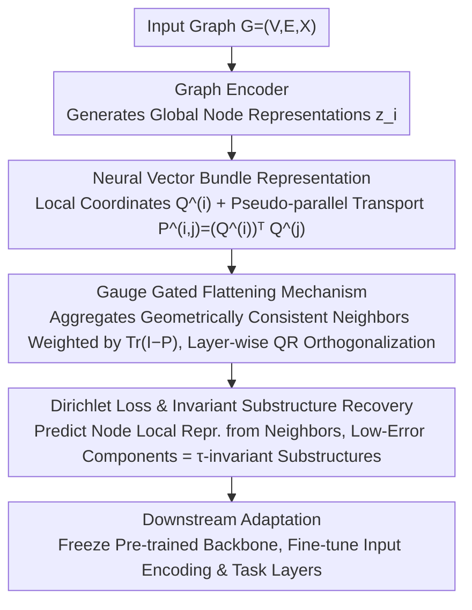

# Are Common Substructures Transferable? Riemannian Graph Foundation Model with Neural Vector Bundles

**Conference**: ICML 2026  
**arXiv**: [2606.03270](https://arxiv.org/abs/2606.03270)  
**Code**: https://github.com/RiemannGraph/GAUGE  
**Area**: Graph Learning / Graph Foundation Models  
**Keywords**: Graph Foundation Models, Riemannian Geometry, Neural Vector Bundles, Structural Transfer, Dirichlet Energy  

## TL;DR
This paper redefines "transferable common substructures" in graph pre-training as behavioral invariance within the representation space. It constructs Gauge using neural vector bundles, gated geometric flattening, and Dirichlet loss, enabling graph models to achieve stronger structural generalization in cross-domain few-shot transfer, zero-shot link prediction, and graph isomorphism tasks.

## Background & Motivation
**Background**: Similar to language and vision foundation models, graph foundation models (GFMs) aim to learn reusable structural patterns through pre-training for transfer to new graphs and tasks. Current approaches generally fall into two categories: those utilizing LLMs to process graphs with textual attributes, and those seeking discrete common substructures like motifs, trees, graphons, or structural vocabularies in pure structural graphs.

**Limitations of Prior Work**: High frequency of discrete substructures does not equate to functional transferability. The same local motif may play entirely different structural roles in different neighborhoods; simply matching shapes risks mistaking context-dependent patterns for universal knowledge. Furthermore, existing Riemannian graph learning usually assumes extrinsic geometric priors (e.g., hyperbolic, spherical, or product spaces), making it difficult to characterize the intrinsic geometry induced by the representations of general graph models.

**Key Challenge**: What graph transfer truly requires is the reuse of structural behaviors rather than isolated shapes. If the representation mechanism of a substructure requires minimal adjustment in a new graph, it should manifest as behavioral invariance. However, this invariance is hidden within the model's representation space and local neighborhood interactions, making it impossible to judge directly by discrete frequencies.

**Goal**: The authors aim to answer whether common substructures are truly transferable and provide a trainable model. This involves establishing a theoretical link between behavioral invariance and intrinsic geometric flatness, designing a graph neural architecture capable of learning such geometry during pre-training, and utilizing it to enhance cross-graph transfer and structural identification.

**Key Insight**: The paper selects vector bundles from Riemannian geometry as the representation language. Intuitively, the graph structure is placed on an abstract base manifold, with each node attached to a local fiber space. If the parallel transport between adjacent fibers is close to an identity transformation, the behavior of that local structural patch is more stable and thus more likely to transfer.

**Core Idea**: Use neural vector bundles to explicitly learn local coordinates and inter-fiber transport of graph representations, identifying geometrically flat and behaviorally invariant substructures by minimizing Dirichlet energy.

## Method
The proposed method consists of two layers: a theoretical representation framework that describes local structural behaviors as geometric objects on vector bundles, and the Gauge architecture that transforms these objects into a pre-trainable network and loss functions.

### Overall Architecture
Given a graph $\mathcal{G}=(\mathcal{V},\mathcal{E},\mathbf{X})$, Gauge first utilizes a graph encoder to generate global node representations $\mathbf{z}_i$, and then learns a set of local coordinates $\mathbf{Q}^{(i)}$ for each node. These local coordinates can be viewed as bases for the node's fiber space, describing how the structure near that node unfolds in the representation space.

In each layer, the model constructs local fiber bases from the attention residuals of nodes and their neighborhoods, then calculates the pseudo-parallel transport $\mathbf{P}^{(i,j)}=(\mathbf{Q}^{(i)})^\top\mathbf{Q}^{(j)}$ between adjacent node fibers. If $\mathbf{P}^{(i,j)}$ is close to the identity matrix, the local coordinate geometries of the two neighborhoods are compatible. Gauge aggregates the coordinates of these neighbors more strongly, thereby flattening homogeneous local geometries layer by layer.

During pre-training, Gauge does not rely on external task labels. Instead, it uses a Dirichlet loss requiring a node's local representation to be predictable from those of its neighbors. Connected regions with low loss are identified as approximately behaviorally invariant regions, which the authors define as transferable structures. For downstream adaptation, the pre-trained backbone is frozen, and only the input encoding and task adaptation layers are fine-tuned to minimize disruption to the learned structural mechanisms.

### Key Designs

**1. Neural Vector Bundle Representation: Making Node Geometry Comparable**

Traditional graph representations assign only a single vector to each node, making it difficult to distinguish between "similar representation values" and "consistent local structural behavior." To transform transferability into a computable geometric problem, Gauge expands each node from a single embedding point to a "global representation + local fiber coordinates." For node $i$, it learns a set of orthogonal bases $\mathbf{Q}^{(i)}$, whose transpose acts as a local trivialization map, projecting the global representation into the local coordinates of that node's fiber. Adjacent nodes compare their coordinate systems via pseudo-parallel transport $\mathbf{P}^{(i,j)}=(\mathbf{Q}^{(i)})^\top\mathbf{Q}^{(j)}$. Consequently, the vague judgment of "whether two neighborhoods serve the same structural role" is rewritten as a concrete metric of "whether two sets of local coordinate systems are geometrically compatible."

**2. Gauge Gated Flattening Mechanism: Aggregating Only Geometrically Consistent Neighbors**

Standard message passing does not distinguish whether neighbors share the same local geometry, often aggregating non-transferable contextual noise. Within each layer, Gauge calculates edge gating weights based on $\mathrm{Tr}(\mathbf{I}_r-\mathbf{P}^{(i,j)})$. The closer the parallel transport is to an identity transformation, the more compatible the local geometry of neighbor $j$ is with node $i$, leading $i$ to absorb more of $j$'s local coordinates. Post-update, QR decomposition is applied to maintain the orthogonality of the local bases. Restricting aggregation to geometrically consistent neighborhoods causes transferable regions to flatten layer by layer, aligning with the theoretical intuition that transferable structures should possess flat intrinsic geometry.

**3. Dirichlet Loss and Invariant Substructure Recovery: Measuring Transfer Cost via Prediction Error**

If a structural behavior remains consistent across a neighborhood, its local representation should be stably predictable by its neighbors. Conversely, a high prediction error suggests the structure is more context-dependent and requires more adjustment during transfer. Gauge reformulates the Dirichlet energy $\|\mathbf{x}_i-\mathbf{P}^{(i,j)}\mathbf{x}_j\|^2$, which measures local fiber differences, into a predictive loss: the initial local representation of a node should be predictable from the average of the neighbors' final local representations. Pre-training is entirely unsupervised, and connected components with low error are decoded as $\tau$-invariant substructures. This provides both the transferable structures learned by the model and a direct measure of the transfer cost.

### Loss & Training
The pre-training objective of Gauge is the Dirichlet loss. For each graph, the loss is approximated as $\mathcal{L}(\mathcal{G})=\sum_i\|(\mathbf{Q}^{(i)})^\top\hat{\mathbf{z}}^{(0)}_i-\frac{1}{|\mathcal{N}_i|}\sum_{j\in\mathcal{N}_i}(\mathbf{Q}^{(j)})^\top\mathbf{z}^L_j\|_2^2$, where the initial representation uses a stop-gradient to prevent the model from evading the objective through trivial scaling.

Downstream adaptation uses $\mathcal{L}_{ft}=\mathcal{L}_{task}+\lambda\mathcal{L}(\mathcal{G})$. The paper provides parameter stability results: for invariant structures identified during pre-training, the fine-tuning gradient is constrained by both the task gradient and the structural prediction error, making low-error structures more resistant to disruption during the adaptation process.

## Key Experimental Results

### Main Results
Gauge was evaluated on cross-domain few-shot node classification, zero-shot link prediction, and graph isomorphism classification. Pre-training graphs were sourced from academic, social, and e-commerce domains. Target graphs included PubMed, FacebookPagePage, Roman-empire, and Photo. Most results report the mean and standard deviation of 10 independent runs.

| Task / Dataset | Metric | Gauge | Prev. SOTA | Key Findings |
| :--- | :--- | :--- | :--- | :--- |
| PubMed 1-shot | Accuracy | 61.26±5.43 | RiemannGFM 56.82±9.00 | Gauge leads by ~4.44 points in biomedical graph transfer |
| PubMed 5-shot | Accuracy | 71.63±3.89 | GraphAny 70.19±2.20 | Maintains top performance with few labels |
| Facebook 1-shot | Accuracy | 51.61±9.53 | GRACE 49.79±7.82 | Leading performance in social graph transfer |
| Photo 5-shot | Accuracy | 81.33±2.93 | GraphAny 78.45±0.84 | Significant transfer advantage in e-commerce graphs |
| Roman 5-shot | Accuracy | 26.43±1.47 | GraphAny 26.72±1.14 | Close to best baseline on heterophilous graphs |

### Ablation Study
The paper validates whether "intrinsic geometry + Dirichlet invariance" genuinely leads to structural capability using zero-shot link prediction, graph isomorphism, and visualization.

| Analysis Item | Key Metric | Description |
| :--- | :--- | :--- |
| Zero-shot Link Prediction PubMed | AUC 64.03 / AP 61.40 | Outperforms GFMs like RAGraph, GFT, and RiemannGFM without target graph fine-tuning |
| Zero-shot Link Prediction Facebook | AUC 93.88 / AP 90.73 | Significantly exceeds most baselines on Facebook, proving structural patterns are directly transferable |
| Zero-shot Link Prediction Roman | AUC 66.22 / AP 67.21 | Achieves best zero-shot performance even on heterophilous graphs |
| Graph Isomorphism CSL | ACC 92.56±4.37 | Structrual identification significantly enhanced compared to SAMGPT (64.17±15.24) |
| Graph Isomorphism ZINC12K | MAE 0.1570±0.005 | Lower than GIN's 0.1630±0.004, indicating geometric modeling aids molecular graph regression |

### Key Findings
- Cross-domain transfer is not solely a product of pre-training scale. While several GFM baselines also follow the pre-train/fine-tune paradigm, Gauge outperforms them in most target graphs and few-shot settings, suggesting intrinsic geometry makes an independent contribution to structural transfer.
- Zero-shot link prediction serves as the most direct test: the model achieves best or near-best results on PubMed, Facebook, Roman, and Photo without any parameter updates, supporting the argument that behaviorally invariant structures can be reused.
- Graph isomorphism experiments shift the focus from attribute prediction to pure structural identification. Gauge outperforms GCN, GraphSAGE, GIN, GAT, and SAMGPT on CSL and MUTAG, demonstrating that vector bundles not only facilitate transfer but also enhance the representation of structural equivalence.
- In visualizations, Gauge recovers invariant substructures consistent with true topologies like binary trees, grids, paths, and stars, providing intuitive evidence for the abstract Dirichlet energy interpretation.

## Highlights & Insights
- The primary highlight is the reframing of "substructure transferability" from a discrete matching problem to whether functional behavior remains constant within local geometry. This perspective avoids the ambiguity of heuristic metrics like motif frequency and explains why identical shapes may not be reusable in different contexts.
- The neural vector bundle modeling is ingenious: it does not require a predefined hyperbolic or spherical space but instead learns local coordinates from the node representations of a standard graph model. This preserves the interpretability of geometric tools while reducing the issue of mismatched extrinsic geometric priors.
- The Dirichlet loss serves as both a pre-training objective and a transfer metric, resulting in a unified design. Low-loss regions not only assist in training representations but can also be decoded into specific invariant substructures to interpret which structural mechanisms the model has learned.
- These concepts are applicable to other structured data. For instance, "reusable patterns" in molecules, program graphs, or knowledge graphs often depend on contextual functionality rather than isolated shapes. Measuring transfer cost via local coordinate consistency may prove more robust than manual pattern matching.

## Limitations & Future Work
- While the theoretical framework is strong, the practical system remains dependent on hyperparameters such as local coordinate dimensions, gating temperature, and Dirichlet weights. Systematic reporting on sensitivity across different graph scales, noise levels, and heterophily is still needed.
- Although experiments cover various graph domains, target tasks are mainly concentrated on node classification, link prediction, and graph isomorphism. The computational cost and stability of neural vector bundles for dynamic graphs, heterogeneous graphs, knowledge graph reasoning, or large-scale industrial graph retrieval remain to be verified.
- The geometric interpretation of Gauge is compelling, but visualization cases remain qualitative. Future work could map identified invariant substructures to actual downstream error types, domain knowledge, or manual structural labels to enhance the testability of its interpretability.
- Gauge employs a transfer strategy of freezing the backbone and adding small adaptation layers, which is suitable for validating structural stability. However, real-world applications often require more extensive fine-tuning; how to maintain invariant structures under aggressive adaptation is an area worth exploring.

## Related Work & Insights
- **vs. Motif / Graphon / Structural Vocabulary methods**: These methods search for common patterns in discrete structural space, whereas Gauge defines commonality as behavioral invariance in the representation space. The former is more intuitive and enumerable, while the latter is better at handling context-dependent structural functions.
- **vs. RiemannGFM**: RiemannGFM also employs Riemannian geometry but relies primarily on predefined extrinsic geometric spaces. Gauge learns the intrinsic geometry induced by model representations, making it less constrained by artificial geometric priors.
- **vs. Self-supervised GNNs like GraphMAE / GRACE**: GraphMAE and GRACE obtain universal representations through reconstruction or contrastive learning. Gauge can be seen as generalizing "positive pair alignment" to Dirichlet smoothing of geometrically compatible neighborhoods, targeting structural transfer more directly.
- **vs. LLM-based graph foundation models**: LLM-based methods are powerful for graphs with textual attributes but are significantly limited for pure structural graphs. Gauge's value lies in starting entirely from graph structure and node representations, filling a theoretical and architectural gap for text-free graph foundation models.

## Rating
- Novelty: ⭐⭐⭐⭐⭐ Defining graph structural transfer through vector bundles and intrinsic geometry is highly distinctive in both problem reframing and model design.
- Experimental Thoroughness: ⭐⭐⭐⭐ Covers cross-domain few-shot, zero-shot link prediction, graph isomorphism, and visualization, though module-level ablation and large-scale cost analysis could be more detailed.
- Writing Quality: ⭐⭐⭐⭐ The theoretical narrative is complete and geometric motivations are clear; however, heavy formulas and notation require a certain background in Riemannian geometry.
- Value: ⭐⭐⭐⭐⭐ Provides a trainable, interpretable, and effective solution to a core problem in graph foundation models, particularly in inspiring further research on structural transfer.

<!-- RELATED:START -->

## Related Papers

- [\[ICML 2026\] Structure-Centric Graph Foundation Model via Geometric Bases](structure-centric_graph_foundation_model_via_geometric_bases.md)
- [\[AAAI 2026\] Adaptive Riemannian Graph Neural Networks](../../AAAI2026/graph_learning/adaptive_riemannian_graph_neural_networks.md)
- [\[ICML 2026\] GILT: An LLM-Free, Tuning-Free Graph Foundational Model for In-Context Learning](gilt_an_llm-free_tuning-free_graph_foundational_model_for_in-context_learning.md)
- [\[ICML 2026\] Beyond Model Base Retrieval: Weaving Knowledge to Master Fine-grained Neural Network Design](beyond_model_base_retrieval_weaving_knowledge_to_master_fine-grained_neural_netw.md)
- [\[ICML 2026\] When Do Graph Foundation Models Transfer? A Data-Centric Theory](when_do_graph_foundation_models_transfer_a_data-centric_theory.md)

<!-- RELATED:END -->
