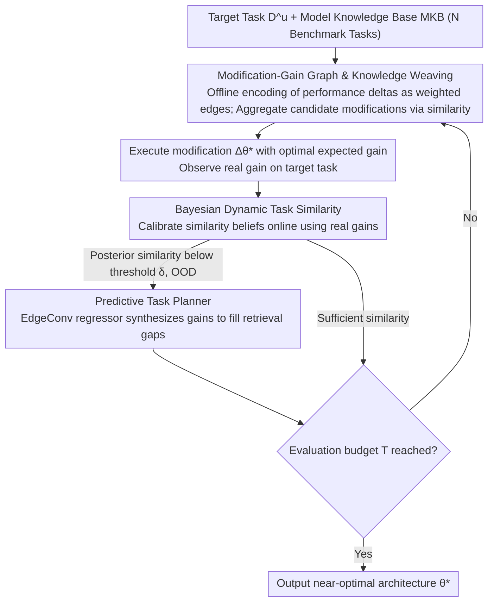

# Beyond Model Base Retrieval: Weaving Knowledge to Master Fine-grained Neural Network Design

**Conference**: ICML 2026  
**arXiv**: [2507.15336](https://arxiv.org/abs/2507.15336)  
**Code**: https://github.com/jilwang84/M-DESIGN  
**Area**: Graph Learning / Automated Machine Learning (AutoML)  
**Keywords**: Neural Architecture Search, Model Retrieval, Knowledge Graph, Graph Neural Networks, Bayesian Optimization  

## TL;DR

The M-DESIGN framework is proposed to model neural network design as a retrieval-augmented iterative modification process. By constructing a Modification-Gain Graph to encode fine-grained architectural editing effects and utilizing Bayesian dynamic task similarity to calibrate transfer signals online, it achieves design-space optimality in 26 out of 33 GNN tasks.

## Background & Motivation

**Background**: Dominant methods for designing high-performance neural networks fall into two categories: Neural Architecture Search (NAS), which finds optimal structures through exhaustive trial and error, and Model Retrieval, which selects a starting model from a pre-trained library. The former is computationally expensive, while the latter struggles to reach optimal performance.

**Limitations of Prior Work**: NAS methods search from scratch for each new task without reusing historical experience, suffering from severe cold-start issues. While retrieval methods are efficient, they focus only on selecting a reasonable initial model, leaving subsequent architectural adaptation dependent on ad-hoc trial-and-error adjustments. Crucially, both categories ignore the specific performance impact records of fine-grained architectural modifications (e.g., replacing the message-passing mechanism of a GNN).

**Key Challenge**: Existing methods face a fundamental trade-off between search efficiency and optimality. NAS can find superior architectures but at a high cost, whereas retrieval is efficient but often yields sub-optimal results. The root causes are: (1) The transfer effect of architectural modifications evolves as the modification trajectory progresses, rendering static task similarity ineffective; (2) Evidence from direct retrieval becomes unreliable when the target task distribution deviates significantly from the knowledge base.

**Goal**: Transform model design from a one-off retrieval into a knowledge-driven iterative modification process, quickly identifying near-optimal architectures within a limited evaluation budget.

**Key Insight**: The authors observe that if the performance impact of each fine-grained architectural modification (such as changing activation functions or aggregation methods) is explicitly recorded as "edit-effect evidence," these pieces of evidence can be organized into a graph structure to support relational reasoning across tasks.

**Core Idea**: Construct a Modification-Gain Graph to encode historical design experience and "weave" cross-task evidence through Bayesian online-updated dynamic task similarity, converting model design into an adaptive retrieval-augmented modification process.

## Method

### Overall Architecture

The input to M-DESIGN is a new target task $D^u$ and a Model Knowledge Base (MKB) containing historical records of $N$ benchmark tasks. The output is the optimal architecture $\theta^*$ found within a fixed evaluation budget $T$. The workflow is divided into three phases: (1) Offline construction of the Modification-Gain Graph, encoding performance differences between architectural variants on each benchmark task as directed weighted edges; (2) Online iterative modification, where candidate modifications are retrieved from the knowledge base at each step, expected gains are estimated via cross-task knowledge weaving, and the optimal modification is executed to observe actual effects; (3) Bayesian update, utilizing observed real gains to calibrate task similarity beliefs online, gradually aligning the transfer signals with the target task.

### Key Designs

**1. Modification-Gain Graph & Knowledge Weaving: Turning historical experience into a composable graph**

Traditional retrieval methods only store "how a complete model scores on a task," which allows for lookup but not reasoning. M-DESIGN instead records "relative gains": for each benchmark task $D^i$, it constructs a graph $G_\Delta^i = (V, E^i, \omega^i)$, where nodes $V$ are architectural configurations and edge weights $\omega^i(e) = \mathcal{P}(θ', D^i) - \mathcal{P}(θ, D^i)$ represent the performance delta of that modification. Relative gains are naturally reversible and chainable, allowing local cross-task editing patterns to be combined to approximate an optimal path. When selecting the next modification for the target task, evidence from benchmark tasks is aggregated via similarity-weighted sums: $\Delta\theta_t^* = \arg\max_{\Delta\theta} \sum_i \mathcal{S}_t(D^u, D^i) \cdot \widetilde{\Delta P}_t^i(\Delta\theta)$, where $\mathcal{S}_t(D^u, D^i)$ is the dynamic task similarity updated online.

**2. Bayesian Dynamic Task Similarity: Calibrating transfer signals during modification**

The problem with static similarity is that the guidance value of a specific modification can change drastically at different stages of the modification trajectory (empirical Kendall’s Tau improves from 0.08 static to 0.34 dynamic); a mismatch leads to negative transfer. M-DESIGN treats similarity $\mathcal{S}_t^{u,i}$ as a Bayesian posterior, updated after each modification and observation of real gain using Bayes' rule: $\mathcal{S}_t^{u,i} \propto \mathcal{N}(\Delta P_t^u; \gamma_{i,t} \Delta P_t^i, \sigma^2) \cdot \mathcal{S}_{t-1}^{u,i}$. The likelihood term assumes that the real gain $\Delta P_t^u$ of the target task is Gaussian-consistent with the benchmark gain $\Delta P_t^i$ under a scaling factor $\gamma_{i,t}$, with parameters estimated from a recent sliding window (size 30-40) to align similarity with target performance.

**3. Predictive Task Planner: Synthesizing gains when knowledge base evidence is insufficient**

When a target task deviates significantly from the knowledge base distribution (OOD), the correlation of direct retrieval can drop to $R^2=0.03$ (e.g., Cornell), and following misleading evidence causes error accumulation. To address this, an EdgeConv GNN-based gain regressor $f_{\psi_i}$ is trained for each benchmark task, predicting gains as $\widehat{\Delta P}_t^i(\Delta\theta) = f_{\psi_i}(\theta_t, \theta_t + \Delta\theta)$. Once the posterior similarity falls below a threshold $\delta$, the system switches to planner predictions to fill retrieval gaps, using an online replay buffer for fine-tuning to pull the synthetic evidence closer to the target distribution, increasing Cornell's correlation from $R^2=0.03$ to $R^2=0.11$.

## Key Experimental Results

### Main Results

Evaluated on 67,760 GNN models across 22 datasets and 33 task-data pairs, with a maximum budget of 100 evaluations:

| Dataset | Design Space Optimal | AutoTransfer | DesiGNN | M-DESIGN | Achieved Optimal? |
|--------|-------------|-------------|---------|----------|----------|
| Actor | 34.89 | 33.97 | 34.43 | **34.89** | ✓ |
| Computers | 89.59 | 87.72 | 88.40 | **89.22** | — |
| Photo | 94.75 | 94.62 | 94.60 | **94.75** | ✓ |
| CiteSeer | 74.59 | 73.89 | 74.54 | **74.59** | ✓ |
| CS | 95.33 | 95.16 | 95.03 | **95.33** | ✓ |
| Cora | 88.50 | 88.50 | 88.34 | **88.50** | ✓ |
| Cornell | 77.48 | 76.58 | 75.50 | **77.48** | ✓ |
| DBLP | 84.29 | 83.59 | 84.29 | **84.29** | ✓ |
| PubMed | 89.08 | 89.08 | 89.08 | **89.08** | ✓ |
| Texas | 84.68 | 78.38 | 81.80 | 83.79 | — |
| Wisconsin | 91.33 | 88.67 | 90.66 | **91.33** | ✓ |

M-DESIGN achieved the design space optimal in **26 out of 33** task-data pairs, outperforming all baselines.

### Ablation Study

| Variant | Avg. Accuracy Drop | Kendall’s Tau | Description |
|------|-------------|---------------|------|
| M-DESIGN (Full) | — | 0.34 | Dynamic similarity + sliding window + OOD adaptation |
| w/o Sliding Window | Slight drop | 0.27 | Early unreliable evidence is not downweighted |
| w/o Dynamic Update | Largest drop | 0.08 | Static similarity fails to track local consistency |
| w/o OOD Adaptation | Significant drop on OOD | 0.31 | Heavy degradation on Computers/Cornell/Texas |

Knowledge base scale ablation: Retaining only 25% of benchmark tasks resulted in an average accuracy of 81.50, compared to 82.11 with 100%, indicating graceful performance degradation.

### Search Efficiency Comparison

| Method | Evals to reach target (Cornell) | Evals to reach target (Wisconsin) |
|------|-------------------------|---------------------------|
| Random | ∞ | 79 |
| RL | 92.7 | 91.2 |
| EA | ∞ | 96.9 |
| DesiGNN | ∞ | 62.6 |
| **M-DESIGN** | **22** | **5** |

The computational overhead of M-DESIGN per MKB operation is <0.31s (<0.44s with OOD adaptation), significantly less than the ~30s required for a single model evaluation.

## Highlights & Insights

1.  **Paradigm Shift in Knowledge Representation**: Moving from storing full model performance to encoding fine-grained modification gains allows historical experience to be composable and reasoning-enabled rather than just searchable.
2.  **Dynamic Transfer Calibration**: Bayesian online updating is the primary source of performance gain (ablation shows Kendall correlation dropping from 0.34 to 0.08 without it), addressing the fundamental failure of static task similarity during iterative modification.
3.  **Empirical Support for Theoretical Assumptions**: Linear gain transfer and Gaussian distribution assumptions were validated on high-similarity task pairs (e.g., $R^2=0.87$ for Cora-DBLP), providing a reliable likelihood model for Bayesian updates.
4.  **Cross-domain Transfer Potential**: Successful performance on tabular data (4 datasets including Protein/Slice/Naval), ranking within the top 0.05%-0.47% of the design space.

## Limitations & Future Work

1.  The current instantiation only covers the GNN design space (3,080 candidate architectures); extending to larger spaces like CNNs/Transformers requires solving scalability issues in knowledge base construction.
2.  Offline MKB construction requires pre-training a large number of models (67,760), incurring a high initial cost.
3.  OOD adaptation shows limited improvement under extreme distribution shifts (Cornell's $R^2$ improved only from 0.03 to 0.11), suggesting a need for enhanced multi-hop reasoning.
4.  The Bayesian update assumes gains follow a Gaussian distribution, which may not hold in highly non-convex design spaces.

## Related Work & Insights

1.  **DesiGNN** (Wang et al., 2026): Retrieval-augmented GNN design, but utilizes static task similarity and lacks online calibration.
2.  **AutoTransfer** (Cao et al., 2023): Embedding-based model transfer, also suffering from static similarity issues.
3.  **NAS-Bench-Graph** (Qin et al., 2022): A benchmark for GNN architecture search, using rank correlation to measure task similarity.

## Rating
- Novelty: 9/10 — Reframing model design as retrieval-augmented optimization on a Modification-Gain Graph; Bayesian dynamic similarity is an original design.
- Experimental Thoroughness: 9/10 — 33 task-data pairs + 10 baselines + detailed ablation + theoretical validation + cross-domain experiments.
- Writing Quality: 8/10 — Formal definitions are clear and rigorous, though the notation density is high.
- Value: 8/10 — Provides a new paradigm for AutoML, though the feasibility of scaling to larger design spaces remains to be verified.

<!-- RELATED:START -->

## Related Papers

- [\[ICML 2026\] KBQA-R1: Reinforcing Large Language Models for Knowledge Base Question Answering](kbqa-r1_reinforcing_large_language_models_for_knowledge_base_question_answering.md)
- [\[ICML 2026\] Full-Spectrum Graph Neural Network: Expressive and Scalable](full-spectrum_graph_neural_network_expressive_and_scalable.md)
- [\[ACL 2025\] Beyond Completion: A Foundation Model for General Knowledge Graph Reasoning](../../ACL2025/graph_learning/beyond_completion_a_foundation_model_for_general_knowledge_graph_reasoning.md)
- [\[ICLR 2026\] Beyond Simple Graphs: Neural Multi-Objective Routing on Multigraphs](../../ICLR2026/graph_learning/beyond_simple_graphs_neural_multi-objective_routing_on_multigraphs.md)
- [\[ICML 2026\] Are Common Substructures Transferable? Riemannian Graph Foundation Model with Neural Vector Bundles](are_common_substructures_transferable_riemannian_graph_foundation_model_with_neu.md)

<!-- RELATED:END -->
