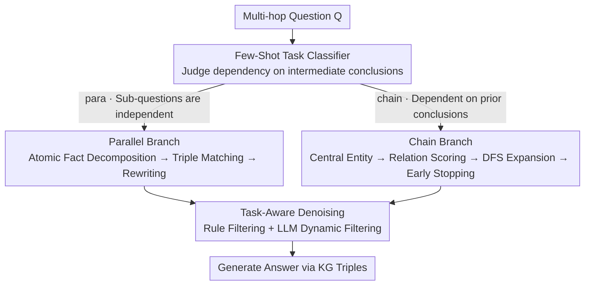

# DTKG: Dual-Track Knowledge Graph-Verified Reasoning Framework for Multi-Hop QA

**Conference**: ICML 2026  
**arXiv**: [2510.16302](https://arxiv.org/abs/2510.16302)  
**Code**: https://anonymous.4open.science/r/DTKG-621F  
**Area**: Graph Learning / Knowledge Graph / Multi-Hop QA / RAG  
**Keywords**: Knowledge Graph, Multi-Hop Reasoning, Dual-Process Theory, Fact Verification, Path Pruning

## TL;DR
DTKG bisects multi-hop QA into "parallel fact verification vs. chain reasoning." It first routes questions to the appropriate branch using a few-shot classifier. The parallel branch verifies atomic facts using KG triples, while the chain branch performs DFS path expansion with scoring-based pruning on Wikidata. Combined with "task-aware" denoising, it achieves a performance gain of 5%–29.5% over single-strategy baselines like KGR and ToG across six datasets.

## Background & Motivation
**Background**: RAG has become a mainstream solution for mitigating LLM hallucinations, with multi-hop QA being the most challenging subtask within RAG, requiring entity-relation chain reasoning across multiple knowledge units. Current mainstream approaches follow two paths: LLM-centric fact verification (e.g., KGR) or KG path-based chain construction (e.g., ToG).

**Limitations of Prior Work**: Both approaches suffer from a "one-size-fits-all" flaw. LLM fact verification excels at decomposing answers into independent atomic facts for KG comparison but loses intermediate conclusions and breaks the reasoning chain when facing sequential dependencies (e.g., "Find A, then use A's attributes to find B"). KG path methods excel at step-by-step traversal but generate massive redundant branches and waste computation on irrelevant paths when handling parallel tasks consisting of independent sub-questions.

**Key Challenge**: Multi-hop questions are inherently heterogeneous in topology—some sub-questions are independent (parallel), while others strongly depend on predecessor conclusions (chain). Existing architectures employing a single "reasoning core" inevitably perform suboptimally on one of these categories. Stanovich refers to this as the "cognitive miser" tendency, where all problems are relegated to the same set of cheap heuristics.

**Goal**: (i) Dynamically route multi-hop questions to the correct processing branch; (ii) design specialized KG reasoning operators for each branch; and (iii) differentiate denoising strategies by task type, as noise in parallel tasks (redundant triples across sub-problems) differs fundamentally from noise in chain tasks (lateral relations deviating from the backbone).

**Key Insight**: The authors adapt the dual-process theory of Tversky & Kahneman—humans utilize "unconscious rapid classification + conscious deep processing" for different tasks, which directly maps to a two-stage "classify-then-branch" pipeline.

**Core Idea**: A few-shot LLM classifier simulates the "unconscious stage" to quickly determine the question type. Two distinct KG processing pipelines (fact verification vs. path construction) then simulate the "conscious stage" to focus on specialized tasks, supported by task-specific denoising to eliminate strategy-task mismatch.

## Method

### Overall Architecture
DTKG addresses the mismatch where a single reasoning core fails against heterogeneous multi-hop questions: some sub-questions are independent (suitable for parallel verification), while others rely on intermediate results (suitable for chain reasoning). It employs a lightweight classifier to determine the question type, routes the question to one of two specialized KG processing branches, and applies task-specific denoising to clear irrelevant triples. The authors map this "rapid judgment + deep processing" to the dual-process theory and formally bisect the reasoning space as $\mathcal{Q} = \mathcal{Q}_{para} \cup \mathcal{Q}_{chain}$. They propose the Optimal Strategy Alignment theorem: the optimal core $\mathcal{K}^* = \arg\max_{\mathcal{K}} \mathbb{P}(A|Q,\mathcal{K})$ is achieved only when the reasoning core $\mathcal{K}$ aligns with the topology of question $Q$, providing a formal foundation for the "classify-then-branch" approach.

### Key Designs

**1. Few-Shot Task Classifier: Eliminating Strategy-Task Mismatch at the Forefront**

The most fatal failure in the pipeline is using the wrong reasoning strategy. Therefore, DTKG moves this judgment to the front of the pipeline, using a 6-shot prompted LLM classifier $\mathcal{C}: Q \to \{para, chain\}$ to act as the "unconscious rapid judgment" in dual-process theory. The core signal for discrimination is "whether the question depends on intermediate reasoning conclusions"—if yes, it outputs "yes" for the chain branch; otherwise, it outputs "no" for the parallel branch. The prompt consists of 5 explicit boundary rules and 6 labeled examples, relying entirely on the LLM's in-context learning without supervised training data. The importance of this step is highlighted in ablation studies: replacing it with Random Classification causes HotpotQA ACC to drop from 85.8% to 73.0%—worse than any single-branch strategy—proving that hybrid strategies backfire if not correctly selected based on question type.

**2. Dual-Track Processing Engine: Specialized Operators for Parallel and Chain Tracks**

The optimal operators for each task type differ, so DTKG employs separate branches rather than forcing a single pipeline, only sharing the underlying triple scoring module. The **Parallel Branch** follows a flat "decomposition-matching-rewriting" pipeline: an LLM decomposes the candidate answer $R$ into a set of atomic facts $F = \{f_1, \ldots, f_n\}$. For each $f_i$, subject entities are extracted and mapped to Wikidata QIDs via string similarity. Candidate triples for an entity are first recalled via cosine similarity $\text{sim}_{\cos}(f_i, t_j) = \mathbf{h}(f_i)\cdot \mathbf{h}(t_j) / (|\mathbf{h}(f_i)||\mathbf{h}(t_j)|)$ to get the top-$K$, then refined by a reranker. Scores are fused as $\text{score}_{\text{combined}} = \alpha \cdot \text{score}_{\text{rerank}} + (1-\alpha)\cdot \text{sim}_{\cos}$ ($\alpha$ is a tunable deployment parameter). If the top triple $t^*$ is inconsistent with $f_i$, rewriting is triggered as $f_i' = f_{\text{rewrite}}(f_i, t^*)$. The **Chain Branch** follows a deep "entity-relation-scoring-expansion-stopping" pipeline: it extracts the central entity $e_0$ and retrieves both head/tail relations $R(e_0) = R_{\text{head}} \cup R_{\text{tail}}$. DFS is performed along the path $P_k = [e_0 \xrightarrow{r_1} e_1 \cdots \xrightarrow{r_k} e_k]$, with the path score $\text{score}_{\text{path}}(P_k) = \prod_{i=1}^k \text{score}_{\text{combined}}(r_i)$. To prevent DFS explosion, four constraints are applied: max depth $D_{\max}=3$, beam width $W_{\max}$, a threshold $\theta$, and a limit of 3 paths selected by an LLM when candidates are excessive. At each layer, early stopping is checked: $\text{stop}(P_k) = \mathbb{I}[\text{info}(P_k) \supseteq \text{info}(Q)]$. The final answer $A = f_{\text{gen}}(Q, P^*)$ is generated strictly based on top-$k$ path triples to avoid hallucination. The ablation results show that Only-Fact achieves 86.0% < 90.0% ACC on the chain-heavy CWQ, while Only-Chain achieves 57.0% < 67.6% EM on the parallel-heavy Mintaka, demonstrating the superiority of the dual-track system.

**3. Task-Aware Denoising: Distinguishing Administrative vs. Attribute Relevance**

Universal threshold pruning often suffers from accidental deletion—a relation may be noise for question A but critical for question B. DTKG splits noise into two categories for tiered processing. The first layer is rule-based filtering for meaningless KG administrative metadata: a static keyword set $K_{\text{invalid}} = \{\text{ID, source, version, metadata}\}$ is maintained. If a relation label matches, $\text{filter}_{\text{rule}}(r) = \text{True}$ and it is discarded (e.g., wikidata:id). The second layer is dynamic filtering for "contextually related but irrelevant" attributes: an LLM scores relevance $\text{score}_n(r, Q) = \text{LLM}(\text{Prompt}_n \oplus r \oplus Q)$, and relations below threshold $\theta$ are discarded. This allows "absolute noise" to be cut cheaply and "relative noise" to be judged with high-precision context, preserving logically necessary relations that ToG's uniform pruning might miss.

### Loss & Training
DTKG is a training-free reasoning framework. All "learning" is achieved via LLM in-context prompting with no extra parameters. Key hyperparameters include: embedding top-$K$, reranker fusion weight $\alpha$, DFS max depth $D_{\max}=3$, width $W_{\max}$, relation score threshold $\theta$, and necessity score threshold. Specific values are provided in Appendix. Llama-3-8B is used as the base LLM.

## Key Experimental Results

### Main Results
Evaluation on 6 datasets comparing against COT, CRITIC, KGR, and ToG using Llama-3-8B. Metrics are EM / ACC (semantic matching accuracy based on BERTScore thresholds).

| Dataset | Metric | Ours (DTKG) | Top Baseline | Gain |
|--------|------|------|----------|------|
| HotpotQA | EM/ACC | 38.2 / 85.8 | ToG 37.1 / KGR 83.5 | +1.1 / +2.3 |
| Mintaka | EM/ACC | 67.6 / 93.9 | COT 66.6 / KGR 92.0 | +1.0 / +1.9 |
| CWQ | EM/ACC | 46.3 / 90.0 | KGR 45.0 / ToG 88.1 | +1.3 / +1.9 |
| QALD10-en | EM/ACC | 50.0 / 85.0 | COT 50.0 / KGR 83.0 / CRITIC 83.0 | tie / +2.0 |
| GraphRAG-Bench | EM/ACC | 14.5 / 87.1 | COT 14.4 / ToG 84.5 | +0.1 / +2.6 |
| MuSiQue | EM/ACC | 18.5 / 83.0 | COT 18.0 / ToG 80.5 | +0.5 / +2.5 |

The absolute ACC improvement relative to Original (without KG) reaches a maximum of +29.5% (53.5% → 83.0%) on MuSiQue, which is the source of the "5.0%-29.5%" figure in the abstract.

### Ablation Study
Classifier ablation (Llama-3-8B, EM/ACC):

| Configuration | HotpotQA | Mintaka | CWQ | QALD10-en | Description |
|------|----------|---------|-----|-----------|------|
| Only-Fact Verification | 35.6 / 83.5 | 62.3 / 91.5 | 40.5 / 86.0 | 49.5 / 83.5 | All parallel, drops on chain-heavy data |
| Only-Reasoning Chain | 36.5 / 85.5 | 57.0 / 91.5 | 40.6 / 87.1 | 50.0 / 81.0 | All chain, EM plunges on parallel task Mintaka |
| Random Classification | 30.5 / 73.0 | 56.0 / 86.0 | 41.0 / 79.0 | 47.5 / 76.0 | Mismatch is costly, -12.8% ACC on HotpotQA |
| Full DTKG | 38.2 / 85.8 | 67.6 / 93.9 | 46.3 / 90.0 | 50.0 / 85.0 | Full dual-track |

### Key Findings
- The classifier is critical, not optional: Random Classification drops HotpotQA's ACC from 85.8% to 73.0%, proving that a hybrid strategy without question-type alignment is worse than a single branch, validating the dual-process design.
- Single branches approach DTKG in their favored domains but fail elsewhere: Only-Chain is close to DTKG on chain-heavy CWQ (40.6 vs 46.3 EM) but far behind on parallel-heavy Mintaka (57.0 vs 67.6 EM), confirming the "strategy-task alignment" thesis.
- The greatest gain is in ACC rather than EM: DTKG improves MuSiQue ACC from 53.5% to 83.0%, indicating that KG grounding recovers answers that are semantically correct but phrased differently, which is particularly beneficial for natural language QA.

## Highlights & Insights
- Using psychology's dual-process theory as an architectural metaphor is more than cosmetic: "cheap rapid judgment" maps to Type 1 thinking, while "deep processing" maps to Type 2, justifying the "front-end routing + back-end specialized operators" design. This can be extended to any task with heterogeneous inputs (e.g., multimodal QA, mixed code/text reasoning).
- Dividing noise into "administrative / attribute relevance" is highly reusable: static keyword lists eliminate absolute noise, while LLM scoring handles relative noise, avoiding the "deletion on high recall / leakage on high precision" dilemma of single-threshold methods.
- The two-stage scoring (embedding top-$K$ → reranker → weight fusion) is a practical engineering design that maintains recall while boosting precision, with $\alpha$ providing a tuning knob for deployment.

## Limitations & Future Work
- The classifier relies on 6-shot prompting; robustness depends on the base LLM’s in-context ability. Cross-validation on models other than Llama-3-8B is missing, and the cost of classification mismatch is high.
- Strong dependency on Wikidata: Coverage is limited by KG completeness. In KG-sparse scenarios (e.g., specific languages or vertical domains like medicine), path recall for the chain branch might collapse.
- The hard constraint $D_{\max} = 3$ means $\geq$ 4-hop questions are truncated. While the authors claim most questions are $\leq$ 3 hops, MuSiQue contains 4-hop samples that lack specialized analysis.
- LLM call counts are not quantified in main results: The dual-track pipeline requires at least 1 classification + multiple scoring + 1 generation call per question, likely increasing latency and cost compared to single-branch baselines.

## Related Work & Insights
- **vs KGR (Guan et al., 2024)**: KGR uses KG for fact verification, equivalent to running only the parallel branch of DTKG. On chain-heavy CWQ, KGR (45.0 EM) lags behind DTKG (46.3 EM) due to the lack of a chain branch. DTKG integrates KGR as a sub-module while adding path construction.
- **vs ToG (Sun et al., 2024)**: ToG performs iterative path exploration, equivalent to running only the chain branch of DTKG. On parallel-heavy Mintaka, ToG (90.0 ACC) lags behind DTKG (93.9 ACC) as redundant paths waste computation. DTKG uses the classifier to bypass ToG-style exploration for parallel tasks.
- **vs CoT (Wei et al., 2022)**: CoT is pure in-context reasoning without KG grounding, making hallucinations inevitable. DTKG almost universally outperforms CoT in ACC (e.g., 87.1 vs 77.2 on GraphRAG-Bench), proving explicit KG verification is more robust than implicit chain-of-thought for factual tasks.

## Rating
- Novelty: ⭐⭐⭐ Single-point innovations are limited, but the "dual-process guided routing" is a novel integration.
- Experimental Thoroughness: ⭐⭐⭐⭐ 6 datasets + 3 classifier ablations, though denoising ablations and long-hop scenarios are missing.
- Writing Quality: ⭐⭐⭐⭐ Clear motivation-theory-method-experiment chain; formal theorems are well-integrated.
- Value: ⭐⭐⭐⭐ Establishes a "classify + route" architecture paradigm for KG-QA, providing a useful template for multi-strategy RAG systems.

<!-- RELATED:START -->

## Related Papers

- [\[CVPR 2026\] M3KG-RAG: Multi-hop Multimodal Knowledge Graph-enhanced Retrieval-Augmented Generation](../../CVPR2026/graph_learning/m3kg_rag_multi_hop_multimodal_knowledge_graph_enhanced_retrieval_augmented_genera.md)
- [\[AAAI 2026\] RFKG-CoT: Relation-Driven Adaptive Hop-count Selection and Few-Shot Path Guidance for Knowledge-Aware QA](../../AAAI2026/graph_learning/rfkg-cot_relation-driven_adaptive_hop-count_selection_and_few-shot_path_guidance.md)
- [\[ACL 2026\] ComplianceNLP: Knowledge-Graph-Augmented RAG for Multi-Framework Regulatory Gap Detection](../../ACL2026/graph_learning/compliancenlp_knowledge-graph-augmented_rag_for_multi-framework_regulatory_gap_d.md)
- [\[AAAI 2026\] PathMind: A Retrieve-Prioritize-Reason Framework for Knowledge Graph Reasoning with Large Language Models](../../AAAI2026/graph_learning/pathmind_a_retrieve-prioritize-reason_framework_for_knowledge_graph_reasoning_wi.md)
- [\[ICLR 2026\] Knowledge Reasoning Language Model: Unifying Knowledge and Language for Inductive Knowledge Graph Reasoning](../../ICLR2026/graph_learning/knowledge_reasoning_language_model_unifying_knowledge_and_language_for_inductive.md)

<!-- RELATED:END -->
