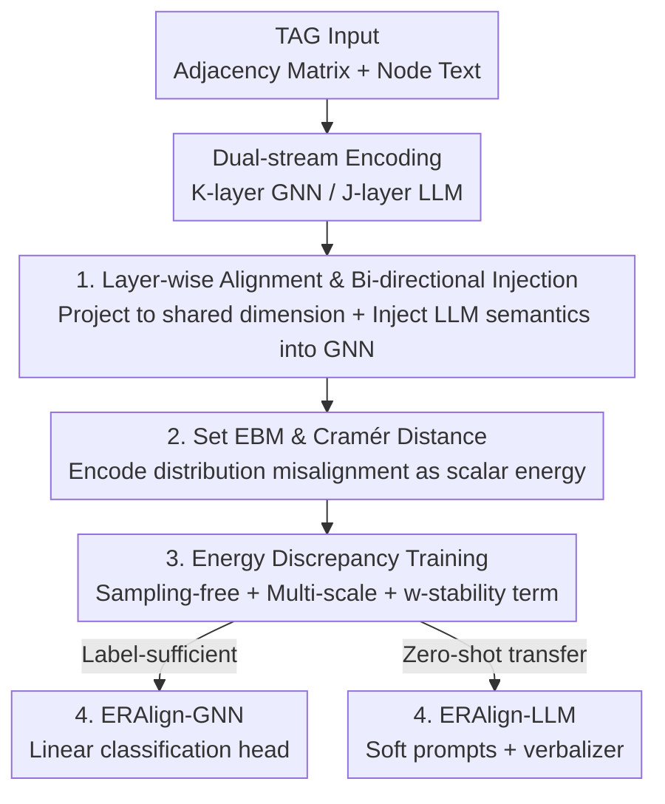

# ERAlign: Energy-based Representation Alignment of GNNs and LLMs on Text-attributed Graphs

**Conference**: ICML2026  
**arXiv**: [2606.10461](https://arxiv.org/abs/2606.10461)  
**Code**: To be confirmed  
**Area**: Graph Learning / GNN-LLM Representation Alignment  
**Keywords**: Text-attributed Graphs, GNN-LLM Alignment, Energy-based Model, Energy Discrepancy, Cramér Distance

## TL;DR
Addressing the difficulty of aligning GNN and LLM representations on Text-Attributed Graphs (TAGs), this paper proposes a **set energy-based model (set EBM)**. It projects both representations into a shared latent space, measures distribution misalignment using Cramér distance for layer-wise alignment, and employs a sampling-free **Energy Discrepancy (ED)** training objective to minimize energy. The method achieves state-of-the-art (SOTA) performance across 8 TAG datasets.

## Background & Motivation
**Background**: Text-Attributed Graphs (TAGs), where each node contains text (e.g., papers, user profiles, product descriptions), incorporate both "structural" and "semantic" information. Since GNNs excel at modeling topology via message passing and LLMs excel at text understanding, "GNN + LLM collaboration" has become the mainstream direction for TAG learning, significantly improving performance.

**Limitations of Prior Work**: The key to effective collaboration is "aligning" GNN and LLM representations into a comparable space. However, existing methods suffer from three major flaws: (i) **Weak constraints**: relying solely on autoregressive token loss or synthetic embedding-text pairs as proxy signals; (ii) **Coarse granularity**: alignment occurs only at the output (logit mixing or concatenation), leaving intermediate representations unaligned; (iii) **Distribution inconsistency**: focusing only on local similarity of individual sample pairs while ignoring global distribution consistency, leading to failure under distribution shifts in the latent space.

**Key Challenge**: GNNs and LLMs encode **heterogeneous signals** (structure vs. semantics). Simply pulling positive pairs closer (e.g., InfoNCE) can lead to failure modes where individual pairs appear aligned, but the underlying distributions remain mismatched. The fundamental requirement is to constrain **geometric consistency at the distribution level** rather than point-to-point similarity.

**Goal**: To achieve **layer-wise, distribution-level** alignment of GNN structural representations and LLM semantic representations within a shared latent space, while ensuring efficient training that avoids expensive sampling.

**Key Insight**: The authors draw inspiration from **Energy-Based Models (EBMs)**. EBMs define non-normalized densities via a learnable scalar energy function, assigning low energy to high-probability regions, which naturally encourages distribution consistency. By encoding "representation misalignment" as energy and treating "alignment" as "energy reduction," a theoretically grounded distribution-level constraint is obtained.

**Core Idea**: Replace point-wise contrastive losses with a set EBM defined over sets of latent representations. The energy function is the Cramér distance between the two representations; minimizing energy minimizes cross-modal distribution misalignment. Energy Discrepancy (ED) is then used to entirely eliminate the need for MCMC sampling, which is typically a bottleneck in EBM training.

## Method

### Overall Architecture
ERAlign is a framework characterized by **dual-stream encoders and shared latent space energy alignment**. The input is a TAG (adjacency matrix $\mathbf{A}$ + text $s_v$ for each node). A $\mathcal{K}$-layer GNN $g_\theta$ generates structural representations $\mathbf{H}^{\mathcal{G}}_k$ along the topology, while a $\mathcal{J}$-layer pre-trained LLM $f_\theta$ encodes node text into semantic representations $\mathbf{H}^{\mathcal{T}}_j$. Since GNN depth and dimensionality are much smaller than those of LLMs ($\mathcal{K}\ll\mathcal{J}$, $d_{\mathcal{G}}\ll d_{\mathcal{T}}$), direct alignment is impossible. First, projection heads map them to a unified dimension $d_{\mathcal{A}}$. Intermediate layers are paired at fixed intervals for **layer-wise alignment**, and LLM semantics are backward-injected into GNN message passing. Alignment quality is scored by a **set energy function** (Cramér distance), and energy is reduced via **ED training**. Finally, dual output heads (GNN classification head / LLM soft-prompt head) are utilized for label-sufficient and zero-shot transfer scenarios, respectively.

### Key Designs

**1. Layer-wise Alignment and Bi-directional Semantic Injection: Moving alignment from outputs to intermediate layers**

To address the issue of coarse granularity, ERAlign no longer acts only on the final layer. Instead, each GNN layer is paired with LLM layers selected at fixed intervals $(k,j)\in\mathcal{P}$ (e.g., using $\{1,4), (2,12), (3,20), (4,28)\}$ as "medium intervals"). Learnable projection heads handle dimensionality mismatches: $\pi_{\mathcal{G}}$ upscales low-dimensional GNN representations, and $\pi_{\mathcal{T}}$ downscales high-dimensional LLM representations to $d_{\mathcal{A}}$, resulting in paired representations $\mathbf{Z}^{\mathcal{G}}_k=\pi_{\mathcal{G}}(\mathbf{H}^{\mathcal{G}}_k)$ and $\mathbf{Z}^{\mathcal{T}}_j=\pi_{\mathcal{T}}(\mathbf{H}^{\mathcal{T}}_j)$. Critically, LLM semantics are injected back into the GNN before the next message-passing round:

$$\tilde{\mathbf{H}}^{\mathcal{G}}_k=(1-\alpha)\mathbf{H}^{\mathcal{G}}_k+\alpha\,\tilde{\pi}_{\mathcal{G}}(\mathbf{Z}^{\mathcal{T}}_j),$$

where $\alpha$ controls the fusion intensity. As the LLM abstracts text into high-level semantics and the GNN expands structural receptive fields layer by layer, this injection "anchors" structural aggregation at each step within the LLM's semantic space. Ablation studies (Table 4) confirm that output-only alignment (layer index $\{32\}$) yields only 87.14% on Cora, whereas medium intervals reach 90.75%.

**2. Set EBM and Cramér Distance: Encoding distribution misalignment as a reducible scalar energy**

To address weak constraints and local sample-pair alignment, the authors define a set EBM over the set of latent representations $\mathbf{Z}=\{\mathbf{z}^{\mathcal{G}}_i,\mathbf{z}^{\mathcal{T}}_i\}_{i=1}^N$: $p_\theta(\mathbf{Z})\propto\exp(-E_\theta(\mathbf{Z}))$. They choose Cramér distance over KL or Wasserstein because KL ignores geometric scales, and Wasserstein optimization via SGD is unstable due to biased sample gradients in high dimensions. The energy function is formulated as the empirical Cramér distance:

$$E_\theta(\mathbf{Z})=2\,\widehat{\mathbb{E}}_{i,j}\big[\|\mathbf{z}^{\mathcal{G}}_i-\mathbf{z}^{\mathcal{T}}_j\|_2\big]-\widehat{\mathbb{E}}_{i,j}\big[\|\mathbf{z}^{\mathcal{G}}_i-\mathbf{z}^{\mathcal{G}}_j\|_2+\|\mathbf{z}^{\mathcal{T}}_i-\mathbf{z}^{\mathcal{T}}_j\|_2\big].$$

The first term minimizes **cross-modal** distance, while the latter two maximize **intra-modal** dispersion to prevent collapse into trivial solutions. Lower energy indicates better alignment relative to dispersion. The EBM acts as a layer-wise regularizer to suppress modal drift and enhance robustness against distribution shifts—a global constraint point-wise contrastive methods cannot provide.

**3. Energy Discrepancy Minimization: Efficient MCMC-free, multi-scale training with stability terms**

Standard EBM training (Contrastive Divergence, CD) requires MCMC sampling from $p_\theta$, which is expensive and prone to instability. Score Matching is sampling-free but "near-sighted," using only local gradients. ERAlign adopts **Energy Discrepancy (ED)**. By adding isotropic Gaussian noise to $\mathbf{Z}$ to obtain perturbed samples $\tilde{\mathbf{Z}}_t$, ED is defined as the difference between the energy of real data and the contrastive potential $E_q$ of perturbed samples: $\mathrm{ED}_q=\mathbb{E}_{p_d}[E_\theta(\mathbf{Z})]-\mathbb{E}_{p_d}\mathbb{E}_q[E_q(\tilde{\mathbf{Z}}_t)]$. Theoretically (Theorem 1), the gradient field induced by ED under Gaussian perturbation reduces to score matching as $t\to0$ and approaches maximum likelihood gradients as $t$ increases. The authors integrate over $t\in(0,T]$ to obtain **multi-scale ED** (Theorem 2). To handle biased logarithmic estimates when the number of samples $M$ is small, a **$w$-stability term** $w/M$ is added:

$$\mathcal{L}_{\text{ED}}(\theta)\approx\frac{1}{S}\sum_{i=1}^{S}\log\Big(\frac{w}{M}+\frac{1}{M}\sum_{j=1}^{M}\exp\big(E_\theta(\mathbf{Z})-E_\theta(\tilde{\mathbf{Z}}_{t_i,j})\big)\Big).$$

This reduces variance and ensures stable training with fewer samples per scale.

**4. Dual Output Heads: Serving supervised classification and zero-shot transfer with one aligned representation**

Aligned latent representations are mapped to downstream tasks via two heads. **ERAlign-GNN** maps final GNN embeddings $\mathbf{H}^{\mathcal{G}}_{\mathcal{K}}$ via softmax to class probabilities for standard supervised classification. **ERAlign-LLM** maps aligned GNN embeddings back to $B$ token embeddings via $\tilde{\pi}_{\mathcal{T}}$ as **soft prompts**. For node classification, it uses conditional log-likelihood scores with verbalizers; for link prediction, it constructs binary queries for node pairs. Task-agnostic alignment allows ERAlign-LLM to perform **zero-shot transfer** from node classification to link prediction. The total objective is: $\mathcal{L}_{\text{total}}=\mathcal{L}_{\text{task}}+\lambda\sum_{(k,j)\in\mathcal{P}}\mathcal{L}^{(k,j)}_{\text{ED}}(\theta)$.

### Loss & Training
$\mathcal{L}_{\text{task}}$ varies: standard cross-entropy for ERAlign-GNN and verbalizer-based cross-entropy for ERAlign-LLM. ED loss updates the GNN, LLM backbone (via LoRA), and all projection heads. Implementation: 4-layer GraphSAGE (dim 256), 32-layer LLaMA2-7B with LoRA, 2-layer GELU MLP projection heads ($d_{\mathcal{A}}=512$), $S=4$ noise scales in $[0.01, 10.0]$, $M=4$ samples per scale, $\alpha=0.5, w=0.1, \lambda=1.0$. Training uses AdamW (lr $10^{-3}$), cosine annealing, 5-epoch warm-up, up to 200 epochs with early stopping.

## Key Experimental Results

### Main Results
Testing on 8 TAG datasets (Cora, CiteSeer, PubMed, Arxiv, Reddit, Instagram, Photo, Computer), comparing against GNN, PLM, and GNN-LLM Enhancer/Predictor baselines across 10 random seeds.

| Setting | Dataset | ERAlign-GNN | Prev. SOTA | Gain |
|------|--------|-------------|--------------|------|
| Supervised (acc%) | Cora | **90.75** | GraphAdapter 88.95 | +1.8 |
| Supervised (acc%) | PubMed | **92.17** | GraphAdapter 91.39 | +0.8 |
| Supervised (acc%) | Photo | **89.38** | LLaGA 87.62 | +1.8 |
| Supervised (acc%) | Computer | **90.07** | GAT 88.32 | +1.8 |
| Semi-supervised 20% | Cora | **52.33** | GLEM 49.01 | +3.3 |
| Semi-supervised 20% | Photo | **63.27** | TAPE 59.76 | +3.5 |

Zero-shot cross-task transfer (Classification → Link Prediction, AUC%): ERAlign-LLM achieves the highest results across all 5 datasets, outperforming the strongest baseline TEA-GLM by 1.2–3.2% (e.g., PubMed 71.17 vs 68.90).

### Ablation Study

| Dimension | Configuration | Cora | PubMed | Photo |
|------|------|------|--------|-------|
| Alignment Interval | Output only $\{32\}$ | 87.14 | 85.22 | 86.36 |
| Alignment Interval | Medium $\{4,12,20,28\}$ | **90.75** | 92.17 | **89.38** |
| Metric + Objective | Cosine + InfoNCE | 87.52 | 89.19 | 87.14 |
| Metric + Objective | Wasserstein + Sinkhorn | 88.10 | 90.45 | 88.40 |
| Metric + Objective | Cramér + EBM(ED) | **90.75** | **92.17** | **89.38** |

### Key Findings
- **Layer-wise alignment is superior to output-only alignment**: Output-only alignment on Cora drops to 87.14%, whereas medium intervals reach 90.75%, proving that intermediate drift must be explicitly corrected. However, "denser is not always better"—medium intervals offer the best trade-off between efficiency and richness.
- **Cramér + ED outperforms alternatives**: Cosine+InfoNCE (point-wise) and Euclidean metrics are significantly worse, validating that distribution statistics are superior. For Cramér metrics, ED slightly outperforms CD and SM, demonstrating its stability.
- **Maximized gains in semi-supervised settings**: ERAlign-GNN outperforms the strongest baseline by 3.3–3.5% with only 20% labels, showing that LLM semantics effectively mitigate label scarcity.

## Highlights & Insights
- **Reinterpreting "representation alignment" as "energy reduction"**: By using a set EBM + Cramér distance, the cross-modal distribution misalignment is encoded into a differentiable scalar energy. This global distribution constraint is a significant shift from point-wise contrastive methods and is applicable to any multi-modal scenario requiring heterogeneous alignment.
- **ED bypasses the EBM sampling hurdle**: Using perturbed contrasts, multi-scale integration, and a stability term instead of MCMC makes EBM training fast and stable. This provides a valuable blueprint for utilizing EBMs where sampling was previously a deterrent.
- **Unified aligned space for dual outcomes**: One aligned manifold serves both GNN (supervised) and LLM (zero-shot) heads, proving that "task-agnostic alignment" alone provides cross-task generalization benefits.

## Limitations & Future Work
- Backpropagating through GNN, LLM (via LoRA), and projection heads for layer-wise alignment involves significant memory and compute costs; scalability to larger graphs or LLMs requires further discussion.
- Hyperparameters such as alignment intervals $\mathcal{P}$, noise range $[0.01, 10.0]$, and weights ($\alpha, w, \lambda$) are numerous. Sensitivity is observed with intervals, suggesting that new datasets may require hyperparameter search.
- Evaluation is limited to node classification and (zero-shot) link prediction; effectiveness on graph-level tasks, heterophilic graphs, or dynamic graphs remains to be verified.

## Related Work & Insights
- **vs. TEA-GLM / GraphAdapter (GNN-LLM Predictor)**: These use linear projections to feed soft tokens into frozen LLMs, with alignment typically occurring only at the output via token loss. ERAlign pushes alignment into intermediate layers using distribution-level energy, yielding 1.2–3.2% higher zero-shot AUC.
- **vs. InfoNCE-based Contrastive Alignment**: InfoNCE enforces point-wise similarity, which can lead to "aligned points but mismatched distributions" for heterogeneous signals. ERAlign directly constrains distribution geometry.
- **vs. Graph EBMs (GraphEBM / DeGEM)**: Previous graph EBMs primarily focused on graph generation or structure learning. This work is the first to use EBMs as a **cross-modal alignment regularizer** for GNNs and LLMs, resolving training efficiency via ED.

## Rating
- Novelty: ⭐⭐⭐⭐⭐ Formulates cross-modal alignment via set EBM + Cramér distance with sampling-free ED training.
- Experimental Thoroughness: ⭐⭐⭐⭐ Extensive testing across 8 datasets and various settings; lacks validation on large-scale or heterophilic graphs.
- Writing Quality: ⭐⭐⭐⭐ Clear motivation, logical progression of methodology, and well-explained theoretical theorems.
- Value: ⭐⭐⭐⭐ Provides a reusable paradigm for "distribution-level alignment of heterogeneous representations."

<!-- RELATED:START -->

## Related Papers

- [\[NeurIPS 2025\] Unifying Text Semantics and Graph Structures for Temporal Text-attributed Graphs with LLMs](../../NeurIPS2025/graph_learning/unifying_text_semantics_and_graph_structures_for_temporal_text-attributed_graphs.md)
- [\[AAAI 2026\] GCL-OT: Graph Contrastive Learning with Optimal Transport for Heterophilic Text-Attributed Graphs](../../AAAI2026/graph_learning/gcl-ot_graph_contrastive_learning_with_optimal_transport_for_heterophilic_text-a.md)
- [\[NeurIPS 2025\] SSTAG: Structure-Aware Self-Supervised Learning Method for Text-Attributed Graphs](../../NeurIPS2025/graph_learning/sstag_structure-aware_self-supervised_learning_method_for_text-attributed_graphs.md)
- [\[NeurIPS 2025\] Dynamic Bundling with Large Language Models for Zero-Shot Inference on Text-Attributed Graphs](../../NeurIPS2025/graph_learning/dynamic_bundling_with_large_language_models_for_zero-shot_inference_on_text-attr.md)
- [\[ICLR 2026\] Global-Recent Semantic Reasoning on Dynamic Text-Attributed Graphs with Large Language Models](../../ICLR2026/graph_learning/global-recent_semantic_reasoning_on_dynamic_text-attributed_graphs_with_large_la.md)

<!-- RELATED:END -->
