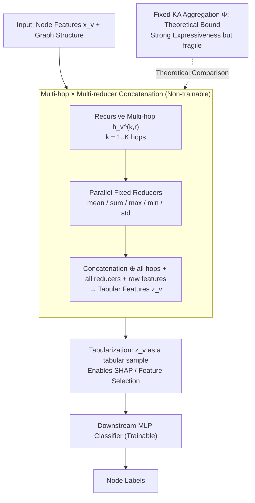

# Fixed Aggregation Features Can Rival GNNs

**Conference**: ICML2026  
**arXiv**: [2601.19449](https://arxiv.org/abs/2601.19449)  
**Code**: Not disclosed  
**Area**: Graph Learning / GNN / Tabular Learning  
**Keywords**: Fixed Aggregation, Multi-hop Feature Concatenation, Kolmogorov-Arnold, MLP baseline, Node Classification

## TL;DR
The paper proposes Fixed Aggregation Features (FAF): multi-hop neighborhoods are compressed into tabular features using **non-trainable** aggregation operators like mean/sum/max/min/std and fed into an MLP. On 12 out of 14 node classification benchmarks, it matches or outperforms fine-tuned GCN/GAT/GraphSAGE and even Graph Transformers, systematically questioning the necessity of trainable neighborhood aggregation in GNNs.

## Background & Motivation

**Background**: Node classification is dominated by message-passing GNNs. From GCN/GAT/GraphSAGE to Graph Transformers and heterophily-specific models, the mainstream narrative posits that "learning neighborhood aggregation + linear transformation at each layer" is essential, with high complexity accepted as the cost for expressiveness.

**Limitations of Prior Work**: (1) Luo et al. (2024) discovered that classical GNNs match SOTA Graph Transformers given rigorous hyperparameter tuning, suggesting the complexity of new models yields diminishing returns. (2) Attention mechanisms suffer from known learnability issues (vanishing gradients, inability to "silence" neighbors). (3) GNNs often overfit training sets quickly; validation optima frequently occur before aggregation is fully learned.

**Key Challenge**: Expressiveness and learnability have long been conflated. While GNNs can theoretically learn information-preserving aggregations, does actual optimization achieve this? Or is it that **fixed, or even non-information-preserving aggregations**, are sufficient?

**Goal**: To answer two sub-questions using a minimalist baseline: (a) How well can one perform without learning aggregation? (b) Do existing benchmarks truly "require learned aggregation" to be solved?

**Key Insight**: Drawing from the Kolmogorov-Arnold representation theorem, the authors prove the existence of a **fixed, univariate, information-lossless** neighborhood aggregation $\Phi$, such that any multiset function can be written as $f = g \circ \Phi^{-1}$. This reduces "learning aggregation + classifier" to learning only $g$. However, $\Phi$ is discontinuous and numerically fragile; thus, the authors reconsider simple reducers (mean/sum/max/min/std), which, despite being non-invertible, are empirically easier to optimize.

**Core Idea**: Replace "trainable multi-layer aggregation" in GNNs with "multi-hop fixed aggregation + concatenation + tabular MLP" in a pre-processing stage. This reduces graph learning to tabular learning, gaining benefits in interpretability, tunability, and efficiency.

## Method

### Overall Architecture

FAF addresses whether learning neighborhood aggregation at every layer is necessary by moving all aggregation to a non-trainable pre-processing stage. The process consists of two steps: first, multi-hop neighborhood features for each node are compressed into a single tabular row using fixed reducers (mean/sum/max/min/std) offline; then, this feature row is fed into a fine-tuned MLP for classification. There are no message-passing layers, no attention, and no trainable propagation matrices; all graph structure is "baked" into the feature vectors.

### Key Designs

**1. Multi-hop × Multi-reducer Concatenation: Approximating Injectivity in Tabular Space**

The core challenge for FAF is the inherent information loss in single fixed aggregators. The authors provide theoretical support (Thm 4.1): when node features are orthogonal, 1-hop sum aggregation is **injective**, perfectly representing any multiset function. However, injectivity fails for $k \geq 2$. Different reducers capture different distribution facets (sum counts, mean weights by degree, max/min focus on tails). By using multiple complementary operators, FAF "approximates injectivity" in tabular space.

For each node $v$, reducer $r \in \mathcal{R}$, and hop $k \in \{1,\ldots,K\}$, the features are computed as $h_v^{(0,r)} = x_v$, $h_v^{(k,r)} = r(\{h_u^{(k-1,r)} : u \in N(v)\})$, then concatenated:

$$z_v = x_v \oplus \bigoplus_{r \in \mathcal{R}} \bigoplus_{k=1}^{K} h_v^{(k,r)}$$

This results in a tabular vector of dimension $|x_v| \cdot (1 + |\mathcal{R}| \cdot K)$. Concatenation is critical: instead of selecting a reducer manually, the MLP acts as a "soft feature selector." Ablations (Tab 10/11) show that using only the last hop or replacing the MLP with a linear layer significantly degrades performance.

**2. Kolmogorov-Arnold Construction: Decoupling Expressiveness from Learnability**

To define the upper bound of the FAF framework, the authors introduce a theoretically **lossless** fixed aggregation $\Phi(x_1,\ldots,x_d) = 3\sum_{p=1}^{d} 3^{-p}\phi(x_p)$ (based on the ternary expansion of Cantor sets). As $\Phi$ is an injective mapping from $[0,1]^d \to \mathbb{R}$, any continuous $f$ can be represented as $g \circ \Phi^{-1}$, inheriting the approximation rates of $f$.

However, the discontinuity of $\Phi$ produces "rough" embeddings that are difficult for MLPs to learn. This confirms the authors' point: simple reducers succeed in practice due to **learnability (optimization ease)** rather than superior expressiveness. Evidence shows that on the Roman-Empire dataset, where simple reducers fail, KA aggregation achieves a high score of $80.33$, indicating the bottleneck was information loss, not the lack of trainable aggregation.

**3. Total Tabularization: Accessing the Tabular Toolbox**

By converting graph problems into tabular ones, feature/hop/reducer selection is decoupled. Standard tabular tools—SHAP, feature importance, and noise-robust methods—can be directly applied. This transparency is rarely possible in G-NNs. Using SHAP on the Minesweeper dataset, the authors found the most critical signal was "hop-1 mean of feature 1" (ratio of neighbors with zero bomb counts), perfectly matching the game mechanics.

### Loss & Training

The downstream MLP uses standard Cross-Entropy + Dropout + LayerNorm. Hyperparameters follow the grid from Luo et al. (2024) for direct comparison with Graph Transformers. FAF prefers a **higher learning rate** (faster convergence and implicit sparse regularization), while dropout gains are found to stem from dataset characteristics rather than graph convolution properties.

## Key Experimental Results

### Main Results

Comparison of FAF against classical GNNs across 14 benchmarks (Selected from Table 1):

| Dataset | GCN | GAT | SAGE | FAF$_\text{bestval}$ | Conclusion |
|--------|------|------|------|------|------|
| Amazon-Computer | 93.58 | 93.91 | 93.31 | **94.01** | FAF wins slightly |
| Amazon-Photo | 95.77 | 96.45 | 96.17 | **96.54** | FAF wins slightly |
| Amazon-Ratings | 53.86 | 55.51 | 55.26 | 55.09 | Comparable |
| Pubmed | 80.00 | 79.80 | 77.42 | **80.96** | FAF wins slightly |
| Questions | 78.44 | 77.72 | 76.75 | **78.69** | FAF wins slightly |
| WikiCS | 80.06 | 81.01 | 80.57 | 80.25 | Comparable |
| Coauthor-CS | 95.73 | 96.14 | 96.21 | 95.37 | 1% Lower |
| Cora | 84.38 | 83.02 | 83.18 | 82.84 | 1.5% Lower |
| **Minesweeper** | 97.48 | 97.00 | 97.72 | **90.00** | **Significant Gap** |
| **Roman-Empire** | 91.05 | 90.38 | 90.41 | **78.11** | **Significant Gap** |

Overall: FAF outperforms GNNs on 5 datasets, matches on 5 (gap $\leq 1\%$), and lags on 4.

### Ablation Study

| Configuration | Key Observation | Description |
|------|---------|------|
| FAF4 (mean+sum+max+min) | Best on most datasets | Default configuration |
| Single Reducer (Tab 7) | Mean usually wins | Citeseer favors sum; Amazon-Ratings favors max |
| Last-hop only (Tab 11) | Significant drop | Confirms necessity of all-hop concatenation |
| Linear Classifier (Tab 10) | Much lower than MLP | Confirms MLP non-linearity is crucial |
| KA Aggregation (Tab 12) | Hits 80.33 on Roman-Empire | Proves gap is info loss, not fixed aggregation |

### Key Findings

- **Best FAF typically uses only 2-4 hops**, whereas Minesweeper/Roman-Empire require 10-15 layers for GNNs. The gap matches the impact of residual connections reported in Luo et al. (2024).
- **Mean alone is often highly competitive**, suggesting that neighborhood distribution is the primary signal, and degree information (ratio of sum to mean) is sufficient.
- **Over-smoothing and deep degradation** also appear in the purely tabular FAF setting, indicating these issues may stem from dataset traits rather than message-passing per se.
- KA aggregation's success on Roman-Empire proves that failures of simple reducers are due to information loss, not the "fixity" of the aggregation.

## Highlights & Insights

- **Strong Counter-example**: Challenges the belief that GNNs "need" to learn aggregation using a baseline so simple it cannot be attributed to over-engineering.
- **Theory-Experiment Synergy**: The KA construction theoretically validates FAF, while the superiority of simple reducers highlights that learnability is more critical than raw expressiveness in practice.
- **Interpretability as a Free Lunch**: SHAP allows for granular attribution (e.g., identifying specific hops/features), providing a reusable tool for diagnosing whether benchmarks contain actual structural signals.
- **Critique of Benchmarking**: The authors call for FAF to be a standard baseline. If a complex graph model cannot beat FAF, it likely isn't leveraging complex graph structures effectively.

## Limitations & Future Work

- FAF fails on Minesweeper/Roman-Empire due to long-range dependencies and reducer information loss; these remain scenarios where GNNs are indispensable.
- **Dimensionality**: Concatenating many hops and reducers leads to feature explosion, increasing MLP parameter counts and training costs.
- **Scope**: Experiments are limited to node classification. Generalization to link prediction or graph classification is unverified.
- **Future Directions**: Designing "smooth" injective aggregators; hybrid FAF/learned models; and creating new benchmarks that truly require learned aggregation logic.

## Related Work & Insights

- **vs SGC (Wu et al. 2019)**: SGC removes non-linearity and uses only linear readout/diffusion. FAF uses **non-linear** reducers (max/min/std) and an MLP, providing significantly higher expressiveness.
- **vs SIGN/GAMLP**: These also pre-compute features but employ complex attention/gating. FAF learns nothing on the propagation side, serving as a diagnostic baseline.
- **vs PNA (Corso et al. 2020)**: PNA uses multiple reducers but in an end-to-end GNN. FAF takes this to the limit by freezing the aggregation entirely.

## Rating
- Novelty: ⭐⭐⭐⭐ Simple method, but the KA-based perspective and diagnostic value are high.
- Experimental Thoroughness: ⭐⭐⭐⭐⭐ Comprehensive coverage across 14 benchmarks and multiple ablations.
- Writing Quality: ⭐⭐⭐⭐⭐ Logical arguments and clear empirical-theoretical links.
- Value: ⭐⭐⭐⭐⭐ Will likely act as a standard baseline and a catalyst for better benchmark design.

<!-- RELATED:START -->

## Related Papers

- [\[AAAI 2026\] Logical Characterizations of GNNs with Mean Aggregation](../../AAAI2026/graph_learning/logical_characterizations_of_gnns_with_mean_aggregation.md)
- [\[AAAI 2026\] Enhancing Logical Expressiveness in GNNs via Path-Neighbor Aggregation](../../AAAI2026/graph_learning/enhancing_logical_expressiveness_in_graph_neural_networks_via_path-neighbor_aggr.md)
- [\[ICML 2026\] Identifying and Correcting Label Noise for Robust GNNs via Influence Contradiction](identifying_and_correcting_label_noise_for_robust_gnns_via_influence_contradicti.md)
- [\[AAAI 2026\] Beyond Fixed Depth: Adaptive Graph Neural Networks for Node Classification Under Varying Homophily](../../AAAI2026/graph_learning/beyond_fixed_depth_adaptive_graph_neural_networks_for_node_classification_under_.md)
- [\[ICLR 2026\] GRAPHITE: Graph Homophily Booster — Reimagining the Role of Discrete Features in Heterophilic Graph Learning](../../ICLR2026/graph_learning/graph_homophily_booster_reimagining_the_role_of_discrete_features_in_heterophili.md)

<!-- RELATED:END -->
