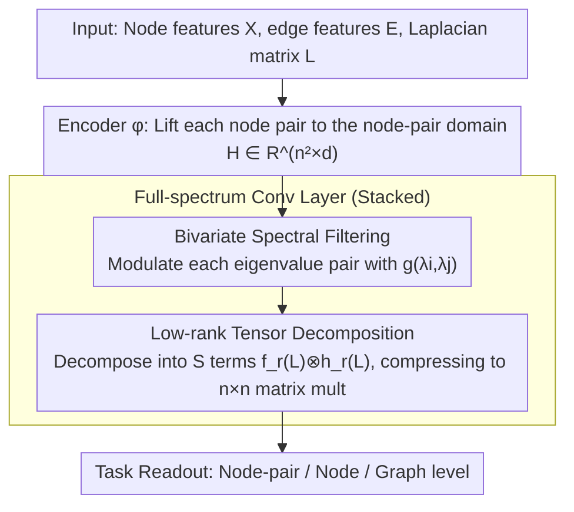

# Full-Spectrum Graph Neural Network: Expressive and Scalable

**Conference**: ICML 2026  
**arXiv**: [2605.05759](https://arxiv.org/abs/2605.05759)  
**Code**: None  
**Area**: Graph Learning / Spectral Graph Neural Networks / Expressivity Theory  
**Keywords**: Spectral GNNs, Node-pair Domain, Bivariate Filtering, Heterophilic Graphs, Local 2-GNN, Kronecker Product

## TL;DR
This paper generalizes the univariate eigenvalue filter $g(\lambda_i)$ of classical spectral GNNs to a bivariate filter $g(\lambda_i,\lambda_j)$, lifting signals from the node domain to the node-pair domain. Theoretically, this approach can approximate Local 2-GNNs (surpassing 1-WL). By utilizing low-rank tensor decomposition, it avoids explicit $n^2\times n^2$ calculations, achieving strong results in heterophilic graph node classification and substructure counting.

## Background & Motivation

**Background**: Spectral GNNs parameterize graph convolution as Laplacian filtering $U g(\Lambda) U^\top x$. While proven to be universal in node signal approximation, their ability to distinguish non-isomorphic graphs (another dimension of expressivity) is strictly bounded by the 1-WL test. To break the 1-WL limit, spatial methods lift message passing from the node domain $V$ to the node-pair domain $V\times V$ or $k$-tuples (e.g., high-order GNNs by Morris et al.), but a corresponding "lifting" in spectral methods has remained missing.

**Limitations of Prior Work**: (1) On heterophilic graphs, where adjacent nodes often carry different labels, the diagonal spectral filtering $g(L)$ of traditional spectral GNNs struggles to learn convolutional patterns that achieve "inter-class suppression and intra-class enhancement"; (2) High-order spatial GNNs, while expressive, often have $O(n^k)$ computational complexity, leading to poor scalability; (3) Spectral methods lack a theoretical explanation for the necessity of non-diagonal spectral components.

**Key Challenge**: Spectral methods are naturally compact and can universally approximate node signals, but their expressivity is bottlenecked by 1-WL. Spatial high-order methods are expressive but non-scalable. There is no bridge between these two paradigms.

**Goal**: (1) Propose a spectral GNN counterpart "lifted to the node-pair domain" and prove it reaches Local 2-GNN level discriminative power; (2) Provide a scalable implementation that avoids explicit construction of $n^2\times n^2$ matrices; (3) Prove that the failure of classical spectral GNNs on heterophilic graphs is an inevitable consequence of missing non-diagonal spectral components and demonstrate how the new method naturally fixes this.

**Key Insight**: The GFT of a node signal $x\in\mathbb{R}^V$ is $U^\top x$. Naturally, the GFT of a node-pair signal $\varepsilon\in\mathbb{R}^{V\times V}$ is $(U\otimes U)^\top \varepsilon$, corresponding to the basis $\{u_i u_j^\top\}$. The filter is upgraded from a vector $g_\lambda=(g(\lambda_i))_i$ to a matrix $G_\lambda=(g(\lambda_i,\lambda_j))_{ij}$—the most natural second-order spectral generalization.

**Core Idea**: Replace the univariate spectral filter $g(\lambda_i)$ with a bivariate filter $g(\lambda_i,\lambda_j)$ as a second-order lifting for spectral methods, and use low-rank tensor decomposition to compress calculations back to the node domain.

## Method

### Overall Architecture
The problem to solve is that the expressivity of spectral GNNs is limited by 1-WL because they only perform diagonal filtering $g(\lambda_i)$ on node signals $x\in\mathbb{R}^V$. This paper lifts signals by one dimension—from the node domain $V$ to the node-pair domain $V\times V$—so the filter naturally transitions from univariate $g(\lambda_i)$ to bivariate $g(\lambda_i,\lambda_j)$. Specifically, an encoder $\phi$ first lifts each pair of node features into $H_{uv}=\phi(X_u,X_v,E_{uv})$, reshaped as $H\in\mathbb{R}^{n^2\times d}$. Then, multiple full-spectrum convolutional layers are stacked: $H'=\sigma\big(g(L\otimes I_n,\,I_n\otimes L)\,H\,W\big)$. Finally, a node-pair / node / graph level readout is taken based on the task. The challenge lies in the bivariate function $g$: parameterizing it for second-order expressivity without explicitly calculating $n^2\times n^2$ matrices. This is addressed by "Bivariate Spectral Filtering" (expressivity) and "Low-rank Tensor Decomposition" (scalability). The third design, the "Necessity of Non-diagonal Spectral Components," provides the theoretical support from a heterophilic graph perspective.

### Key Designs

**1. Bivariate Spectral Filtering on the Node-pair Domain: Independent Modulation for Every Eigenvalue Pair**

Traditional spectral convolution is $\sum_i g(\lambda_i)\,u_iu_i^\top x$, where the filter only recognizes individual eigenvalues and cannot express "interactions between frequencies $\lambda_i$ and $\lambda_j$," which is the source of the 1-WL upper bound. This paper places node-pair signals $\varepsilon\in\mathbb{R}^{V\times V}$ into an $\mathbb{R}^{n^2}$ orthogonal space spanned by the Kronecker basis $\{u_i\otimes u_j\}$, defining a bivariate spectral filter matrix $G_\lambda=(g(\lambda_i,\lambda_j))_{ij}$. The convolution is $G_\lambda \ast_G \varepsilon = g(L\otimes I_n,\,I_n\otimes L)\,\varepsilon = \sum_{i,j} g(\lambda_i,\lambda_j)\,u_iu_i^\top\varepsilon\,u_j\mathbf{u}_j^\top$. This generalization is self-consistent: Proposition 3.3 states that when $g(s,t)$ is restricted to diagonal values $g(\lambda_i,\lambda_i)$, it reverts exactly to classical $U g(\Lambda) U^\top x$. FSpecGNN is effective because the node-pair domain is the most natural lifting for surpassing 1-WL, and non-diagonal components $g(\lambda_i,\lambda_j), i\neq j$ unlock the filtering patterns required for heterophilic graphs. Theorem 3.4 proves linear FSpecGNN can universally approximate any 1D node-pair signal, and Theorem 3.8 proves that a bivariate polynomial $q$ exists such that FSpecGNN reaches Local 2-GNN discriminative power, strictly surpassing 1-WL.

**2. Low-rank Tensor Decomposition: Compressing Second-order Convolution back to Matrix Multiplication**

Directly learning $g(\lambda_i,\lambda_j)$ requires $O(n^3)$ eigendecomposition and explicit construction of the $n^2\times n^2$ Kronecker product, which is infeasible for large graphs. The solution parameterizes $g$ with a bivariate polynomial $P(s,t)=\sum_{i+j\le K} a_{ij}\,s^i t^j$. A key observation (Proposition 3.9) is $P(L\otimes I_n,\,I_n\otimes L)=\sum_{r=1}^R f_r(L)\otimes h_r(L)$ if and only if $R\ge\mathrm{rank}(A)$, where $A=(a_{ij})$ is the coefficient matrix. By applying low-rank approximation to $A$, taking $\mathcal{T}_L^S\coloneqq \sum_{r=1}^S f_r(L)\otimes h_r(L)$ ($S\ll\mathrm{rank}(A)$, where each $f_r,h_r$ is a univariate polynomial of degree $\le K$, e.g., Bern, Cheb), the bivariate filter is decomposed into $S$ terms of first-order spectral Kronecker sums. Using the identity $(L^p\otimes L^q)\,\mathrm{vec}(\varepsilon)=\mathrm{vec}(L^q\,\varepsilon\,L^p)$, each Kronecker multiplication is replaced by two $n\times n$ matrix multiplications, reducing complexity to $O(SK\cdot n^2 d)$. This allows second-order spectral methods to achieve scalability comparable to first-order methods.

**3. Necessity of Non-diagonal Spectral Components: Characterizing Heterophily as a Second-order Phenomenon**

Whether non-diagonal components are redundant has long been unanswered. This paper provides an algebraic answer via heterophilic graphs. Under a simplified "class-conditional features + intra-class compression" model, defining the class squared error $\mathcal{L}(C)=\sum_a \frac{1}{n_a}\sum_{p\in V_a}\mathbb{E}\|Y_p-m_a\|_2^2$, Theorem 4.1 proves the optimal convolution $C^*$ asymptotically takes a "block-diagonal by class" form—intra-class weights $1/(n_a+\tau_a)$ and inter-class weights 0. More strikingly, Theorem 4.2 states that if $C=g(L)$ is any classical spectral filter and inter-class entries must be zero, then $C=\alpha I_n$. This implies classical spectral GNNs cannot approximate this optimal operator, whereas FSpecGNN can achieve it via full-spectrum convolution. This elevates "GCN failure on heterophilic graphs" from empirical observation to algebraic impossibility, clarifying that heterophily is essentially a second-order phenomenon.

### Loss & Training
Supervised training is used, with Cross-Entropy for node classification and MAE for substructure counting. There are three spectral backbones: FSpecGNN(Cheb) / (ChebII) / (Bern), using corresponding polynomials for $f_r,h_r$. Low-rank parameter $S$ and polynomial order $K$ are selected via the validation set. For small graphs, the explicit path (eigendecomposition + MLP $g_\theta$) can be used without low-rank approximation.

## Key Experimental Results

### Main Results

**Heterophilic Graph Node Classification** (higher is better):

| Model | Chameleon | Squirrel | Tolokers | Questions | Wisconsin |
|------|-----------|---------|----------|-----------|-----------|
| ChebNetII | 33.48 | 30.80 | 69.37 | 63.99 | 41.33 |
| GPRGNN | 30.44 | 24.33 | 67.05 | 53.76 | 40.79 |
| BernNet | 29.45 | 25.94 | 69.31 | 65.41 | 49.33 |
| **FSpecGNN(Cheb)** | 33.09 | **39.57** | 76.89 | 75.87 | 49.87 |
| **FSpecGNN(ChebII)** | **39.60** | 37.70 | 76.37 | **77.00** | 50.00 |
| **FSpecGNN(Bern)** | 37.91 | 37.59 | 74.50 | 77.11 | **54.58** |

Three variants of Ours pushed the SOTA on Squirrel from 30.80 to 39.57 (+8.77) and questions by +11.6, significantly outperforming first-order spectral baselines on all heterophilic datasets, validating Theorems 4.1 and 4.2.

### Ablation Study

| Configuration | Substructure MAE | Heterophily Acc | Description |
|------|----------------|-----------|------|
| FSpecGNN (full, low-rank $S$) | Lowest | Highest | Full Model |
| Diagonal degradation ($g(s,t)=h(s+t)$) | Significant rise | Near BernNet | Equivalent to first-order on Kronecker sum; validates non-diagonal necessity.|
| No low-rank approximation ($S=\mathrm{rank}(A)$) | Slightly lower than full | Same level | Full-rank performs slightly better but GPU memory increases 5-10×. |
| Replace with spatial 2-GNN | Same level | Slightly lower | Comparable expressivity, but runtime is 5× slower with high memory usage. |

### Key Findings
- On chordal cycle counting, FSpecGNN aligns with spatial Local 2-GNN expressivity but with ~5× lower runtime and the lowest peak GPU memory.
- Datasets with the largest gains (Squirrel/Questions) also have high heterophily $h(G)$, aligning with the observation that "off-diagonal energy grows with heterophily."
- Low-rank $S$ is a critical hyperparameter: $S=1$ degrades to a diagonal solution, while large $S$ loses efficiency. Empirically, $S=4\sim 8$ reaches 95%+ of full-rank performance.

## Highlights & Insights
- Found the "correct lifting" for spectral GNNs—node-pair domain + Kronecker basis—bridging the gap between spectral and spatial methods: aligns with Local 2-GNN expressivity while retaining sparse polynomial forms.
- "Heterophily as a second-order phenomenon" is a strong theoretical framing. Theorem 4.2 transforms the phenomenon (GCN failure) into an algebraic impossibility.
- The trick of low-rank tensor decomposition + $(L^p\otimes L^q)\mathrm{vec}(\varepsilon)=\mathrm{vec}(L^q \varepsilon L^p)$ is a general template for Kronecker-based graph algorithms.
- Simultaneously addresses universal approximation (Theorem 3.4) and discriminative power (Theorem 3.8) in the node-pair domain.

## Limitations & Future Work
- Theorem 3.8 guarantees "existence" not "learnability"—the polynomial $q$ exists, but optimizers might not find it.
- While the input $E\in\mathbb{R}^{n\times n\times d_2}$ can be sparsified, memory remains $O(n^2 d)$ for dense node-pair representations; scalability on million-node graphs requires more sparse implementation details.
- Only node classification and substructure counting were evaluated; link prediction and graph-level regression results are missing.
- $S$ is currently selected via validation search; future work could make $S$ data-adaptive.

## Related Work & Insights
- **vs Local 2-GNN**: Ours is the spectral version, achieving second-order discriminative power with spectral filters. Advantage: No explicit node-pair traversal, lower cost. Disadvantage: Existence $\neq$ guaranteed learnability.
- **vs BernNet / ChebNetII / GPRGNN**: These are first-order spectral filters. FSpecGNN views them as "diagonal embedding special cases."
- **vs Heterophily-specific methods (H2GCN, GBK-GNN)**: Those rely on local heuristics, whereas FSpecGNN provides a more general theoretical explanation for non-diagonal spectral components.
- **Transferable Insights**: (1) The Kronecker basis + low-rank decomposition is a template for reducing complexity in second-order models; (2) The "optimal operator-algebraic constraint-architecture choice" chain is a powerful paradigm for justifying new architectures.

## Rating
- Novelty: ⭐⭐⭐⭐⭐ Cleanly provides spectral lifting for the node-pair domain with rigorous necessity theorems.
- Experimental Thoroughness: ⭐⭐⭐⭐ Overall win in heterophily and alignment with spatial 2-GNNs; lacks link prediction and ultra-large graph experiments.
- Writing Quality: ⭐⭐⭐⭐ Rigorous derivations; some lemmas have high notation density.
- Value: ⭐⭐⭐⭐ Provides both a scalable second-order spectral baseline and a new theoretical perspective on heterophily.

<!-- RELATED:START -->

## Related Papers

- [\[AAAI 2026\] On Stealing Graph Neural Network Models](../../AAAI2026/graph_learning/on_stealing_graph_neural_network_models.md)
- [\[ICLR 2026\] Canonical Tree Cover Neural Networks for Expressive and Invariant Graph Learning](../../ICLR2026/graph_learning/canonical_tree_cover_neural_networks_for_expressive_and_invariant_graph_learning.md)
- [\[ICML 2026\] Beyond Model Base Retrieval: Weaving Knowledge to Master Fine-grained Neural Network Design](beyond_model_base_retrieval_weaving_knowledge_to_master_fine-grained_neural_netw.md)
- [\[ICLR 2026\] AdaSpec: Adaptive Spectrum for Enhanced Node Distinguishability](../../ICLR2026/graph_learning/adaspec_adaptive_spectrum_for_enhanced_node_distinguishability.md)
- [\[ICLR 2026\] AdS-GNN - a Conformally Equivariant Graph Neural Network](../../ICLR2026/graph_learning/ads-gnn_-_a_conformally_equivariant_graph_neural_network.md)

<!-- RELATED:END -->
