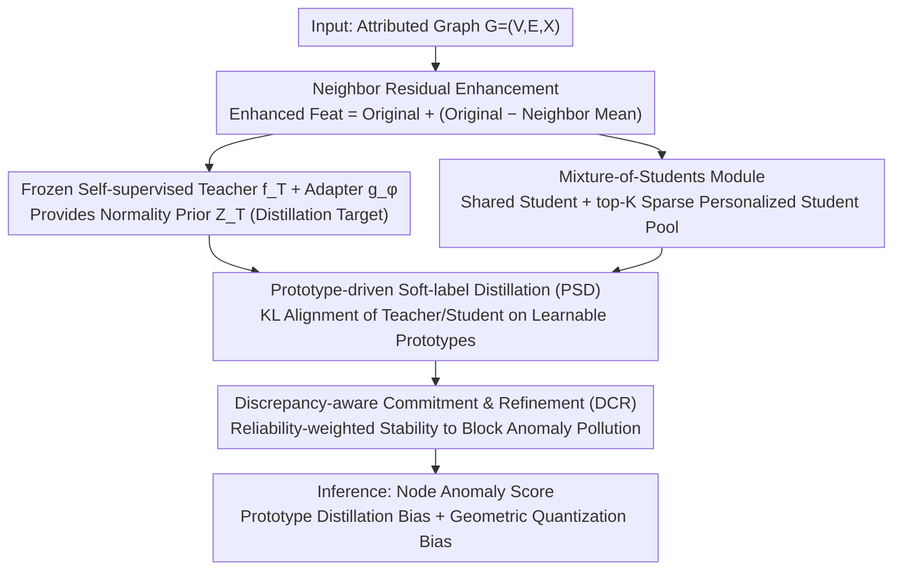

# ProMoS: Generalist Graph Anomaly Detection via Prototype-Based Distillation

**Conference**: ICML 2026  
**arXiv**: [2605.26857](https://arxiv.org/abs/2605.26857)  
**Code**: https://github.com/yimingxu24/ProMoS  
**Area**: Graph Learning / Anomaly Detection / Self-supervised Learning  
**Keywords**: Generalist Graph Anomaly Detection, Prototype Distillation, Mixture-of-Students, Zero-shot, Self-supervised GNN  

## TL;DR
ProMoS treats a frozen self-supervised GNN as a "normality prior teacher" and distills it into a suite of shared and sparsely activated lightweight student branches. By aligning teachers and students to a cross-graph shared semantic space via learnable prototypes, it achieves the first fully label-free, zero-shot, and cross-graph transferable generalist graph anomaly detector.

## Background & Motivation
**Background**: Current Graph Anomaly Detection (GAD) mainstream follows a "one model per graph" paradigm: either using scarce labels for supervised learning (DOMINANT / BWGNN / GHRN) or self-supervised proxy tasks (reconstruction, contrastive learning) to model normal structures. A few recent works (ARC, UNPrompt, AnomalyGFM) have begun exploring generalist GAD for one-time training and direct cross-graph application.

**Limitations of Prior Work**: Existing generalist methods still heavily rely on anomaly labels from the training graphs and may even require a small number of target domain support samples during inference. Annotation costs are high, open-world anomalies are constantly evolving, and "labeled sets are never enough." Furthermore, cross-graph transfer naturally faces structural and feature heterogeneity: financial graphs have numerical features and hub-centric topologies, while social graphs have text features and community structures. Instance-level alignment easily overfits to the fine-grained patterns of the training graph.

**Key Challenge**: To be "generalist," a method must move beyond labels and fine-grained alignment. However, learning normality from scratch in a purely unsupervised manner often falls into "narrow and unrepresentative normal manifolds"—an ill-designed unsupervised objective leads to biased normality descriptions, inevitably degrading downstream anomaly scoring.

**Goal**: Construct the first generalist GAD framework that is simultaneously "Unsupervised + Zero-shot + Cross-graph." This is decomposed into two sub-problems: (i) how to learn comprehensive and representative normal patterns without labels, and (ii) how to overcome the heterogeneity gap in node semantics and topology across graphs.

**Key Insight**: The authors observe that when self-supervised GNNs (e.g., GraphMAE) are pre-trained on large graphs, their representations already capture normal regularities like "neighbor matching," as normal nodes constitute the vast majority. This effectively provides a free "normality prior teacher," eliminating the need to learn normality from scratch.

**Core Idea**: Use knowledge distillation to inject the normality prior of a frozen self-supervised GNN teacher into lightweight student modules. Subsequently, use a set of learnable semantic prototypes to align teacher and student outputs at the "prototype level" rather than the "instance level," allowing normal patterns to exist as transferable abstract concepts. During inference, the discrepancy between the teacher and student in the prototype space, combined with geometric deviation, is used as the anomaly score.

## Method

### Overall Architecture
ProMoS aims to solve GAD under the triple constraints of "no labels, zero-shot, and cross-graph." Instead of learning normality from scratch, it utilizes a frozen self-supervised GNN as a "normality prior" and uses lightweight students for distillation. Teacher-student alignment is shifted to a transferable semantic prototype level to avoid overfitting to specific instances. Specifically, given an attributed graph $\mathcal{G}=(\mathcal{V},\mathcal{E},\mathbf{X})$, neighbor residual enhancement is first performed: $\tilde{\mathbf{x}}_i = \mathbf{x}_i + (\mathbf{x}_i - \frac{1}{|\mathcal{N}(v_i)|}\sum_{v_j\in\mathcal{N}(v_i)}\mathbf{x}_j)$. The frozen teacher $f_T$ provides $\mathbf{Z}_T = g_\phi(f_T(\mathbf{X},\mathbf{A}))$ via a trainable adapter $g_\phi$ as the distillation target. A suite of shared and sparsely activated student branches fits this target. Both teacher and student are projected onto learnable prototypes for alignment. These prototypes are continuously stabilized and evolved during training. During inference, node anomaly scores are calculated from prototype-space distillation bias and geometric quantization deviation.

### Key Designs

**1. Mixture-of-Students Module: Modeling Global and Local Divergent Normality with Sparse Branches**

A single student model struggles to balance capacity—small models lack expressiveness, while large models lose the efficiency advantage of distillation. ProMoS splits normality into two branches: a consistently active shared student $\mathbf{h}_i^g = f_{g}(\tilde{\mathbf{x}}_i \odot \mathbf{m}_i) + \tilde{\mathbf{x}}_i$ captures universal graph-wide patterns repeatedly confirmed by the teacher; a personalized student pool with $N$ lightweight MLPs $\{f_p\}$ captures local diverse patterns. A router $\mathbf{r}_i = \mathrm{softmax}(\mathbf{W}_r \tilde{\mathbf{x}}_i)$ sparsely activates only the top-$K$ students with weights $g_{i, p}$, yielding $\mathbf{h}_i^\ell = \sum_p g_{i, p} f_p(\tilde{\mathbf{x}}_i \odot \mathbf{m}_i) + \tilde{\mathbf{x}}_i$. Random masking $\mathbf{m}_i$ provides robustness, while identity skips encourage the student to only fit the "incremental info from teacher aggregation." This "shared global + sparse personalized" decoupling allows different types of normality to be modeled separately. The authors prove in Appendix A that the expected prediction error of MoS is no worse than any single student.

**2. Prototype-driven Soft-label Distillation (PSD): Aligning in Transferable Prototype Space**

Directly forcing teacher and student outputs to match in feature space leads to overfitting on fine-grained features. PSD maintains a prototype codebook $\mathbf{P}^b \in \mathbb{R}^{M_b \times d}$ for each branch $b \in \{g, \ell\}$. Both teacher and student calculate soft assignments relative to these prototypes. For the teacher: $\mathbf{q}_i^b[m] = \frac{\exp(\mathrm{sim}(\mathbf{z}_i^t, \mathbf{p}_m^b)/\tau)}{\sum_{m'}\exp(\mathrm{sim}(\mathbf{z}_i^t, \mathbf{p}_{m'}^b)/\tau)}$. The student $\mathbf{s}_i^b$ follows the same logic using $\mathbf{h}_i^b$, with similarity calculated as negative squared Euclidean distance. Distillation is performed via cross-branch KL divergence: $\mathcal{L}_{\text{PSD}} = \frac{1}{|\mathcal{V}|}\sum_i \sum_b \mathrm{KL}(\mathbf{q}_i^b \| \mathbf{s}_i^b)$. Prototypes represent high-level semantic roles, which are more stable across graphs than instance features.

**3. Discrepancy-aware Commitment & Refinement (DCR): Stabilizing Teacher Space and Blocking Anomaly Pollution**

DCR addresses teacher feature space drift and prevents anomaly nodes from injecting misleading gradients. It quantizes teacher representations $\mathbf{z}_i^t$ to the nearest prototype $\mathcal{Z}_b(\mathbf{z}_i^t) = \arg\min_m \|\mathbf{z}_i^t - \mathbf{p}_m^b\|^2$. Using the prototype relationship matrix $\mathbf{Q}^b = \mathrm{softmax}(\mathrm{sim}(\mathbf{P}^b, \mathbf{P}^b)/\tau)$, it computes reliability $w_i^b = \sigma(-\beta(\mathrm{KL}(\mathbf{q}_i^b \| \mathbf{Q}_{m_i^\star}^b) - \mu))$. The objective $\mathcal{L}_\mathrm{DCR} = \sum_i \sum_b w_i^b(\|\mathbf{z}_i^t - \mathrm{sg}[\mathcal{Z}_b]\|^2 + \|\mathrm{sg}[\mathbf{z}_i^t] - \mathcal{Z}_b\|^2)$ uses a weighted commitment term to pull teacher features toward prototypes and a refinement term allowing prototypes to fit the semantics of reliable nodes. This acts as a soft anomaly exclusion mechanism, keeping prototypes pure under unsupervised conditions.

### Loss & Training
The total objective is $\mathcal{L} = \mathcal{L}_\text{PSD} + \lambda \mathcal{L}_\text{DCR}$, where $\lambda$ balances distillation and prototype alignment, $\tau$ is the temperature, and $\beta, \mu$ control reliability sensitivity. No retraining is needed for inference. The node anomaly score is $s_i = \sum_b[\mathrm{KL}(\mathbf{q}_i^b \| \mathbf{s}_i^b) + \lambda(\|\Delta_h\|^2 + \|\Delta_z\|^2)]$, where $\Delta_h = \mathbf{h}_i^b - \mathcal{Z}_b(\mathbf{h}_i^b)$ and $\Delta_z = \mathbf{z}_i^t - \mathcal{Z}_b(\mathbf{z}_i^t)$. Anomalous nodes exhibit either high distillation bias or large geometric deviation from prototypes.

## Key Experimental Results

### Main Results
AUROC under zero-shot settings across 11 real-world datasets (selected):

| Dataset | ProMoS | DOMINANT (Unsupervised) | TAM | UNPrompt (Supervised Generalist) | AnomalyGFM (Supervised Generalist) |
|--------|--------|-------------------|-----|------------------------------|-------------------------------|
| Cora | **84.56** | 66.53 | 62.02 | 53.19 | 47.83 |
| CiteSeer | **90.77** | 69.47 | 72.27 | 53.70 | 49.10 |
| ACM | **89.47** | 70.08 | 74.43 | 68.74 | 53.40 |
| BlogCatalog | **76.17** | 74.25 | 49.86 | 68.87 | 49.31 |
| Reddit | **60.83** | 50.05 | 55.43 | 57.10 | 52.78 |
| Photo | **72.67** | — | 58.35 | 38.60 | 49.65 |
| T-Finance | **71.62** | OOM | 56.16 | 22.14 | 64.44 |

ProMoS ranks first in AUROC on 9/11 datasets. On Weibo (highly homophilic), it ranks second behind the reconstruction-based DOMINANT (91.74 vs 92.88). It is the only method satisfying the "Unsupervised + Zero-shot + Generalist" criteria simultaneously. ProMoS also leads in AUPRC on 7/11 datasets, with significant Gains in T-Finance, CS, and Cora.

### Ablation Study

| Configuration | Performance | Explanation |
|------|---------|------|
| Full ProMoS | Best Avg | Includes all three components. |
| w/o MoS | Significant drop | Loss of complementarity between global and local branches. |
| w/o Prototype Distillation | Significant drop | Regression to instance-level alignment; failure in cross-graph transfer. |
| w/o DCR | Prototype collapse | Teacher space unstable; prototypes polluted by anomalies. |
| w/o Reliability Weights | Drop of 3-5 pt | Loss of filtering for anomalous gradients. |

### Key Findings
- The theoretical guarantee of MoS (Expected Error $\le$ Any Single Student) holds in practice, as single-branch versions are consistently weaker.
- Prototype distillation is the cornerstone of cross-graph generalization; replacing it with instance KL causes AUROC to collapse to baseline levels.
- Reliability weighting provides the largest Gain on graphs with high anomaly rates (e.g., T-Finance).
- The framework is robust to the choice of self-supervised teacher (e.g., GraphMAE), proving the framework's effectiveness rather than reliance on a specific teacher.

## Highlights & Insights
- **"Distill a free normality prior instead of learning from scratch"**: This is the most elegant aspect. While pre-trained self-supervised GNNs exist, this work is the first to treat them as GAD teachers, bringing the "General Pre-training → Downstream Task" paradigm to GAD.
- **Prototypes as both alignment anchors and inference signals**: They act as intermediaries for teacher-student alignment during training and as a codebook for geometric deviation during inference.
- **Reliability weighting as unsupervised robust learning**: Determining node trustworthiness based on whether its distribution matches the global prototype structure effectively performs soft anomaly detection during training, creating a self-consistent loop.
- **Extensibility of MoS**: The "shared global + sparse personalized" MoE logic applied to self-supervised distillation can be extended to other transfer tasks like cross-domain segmentation or multi-lingual NLP.

## Limitations & Future Work
- **Dependence on Teacher Quality**: If the pre-trained teacher's normality prior is biased (e.g., due to small or noisy pre-training data), the performance ceiling of ProMoS is lowered.
- **Hyperparameter Sensitivity**: The number of prototypes $M_b$, experts $N$, and parameters like $\beta, \mu$ are fixed in this work; whether they require per-target tuning remains to be fully explored.
- **Node-level Focus**: Current work is node-level; expanding to graph-level GAD (using graph-level teachers/prototypes) is a valuable direction.
- **Anomaly Types**: Currently covers structural and attribute anomalies; behavior-based or temporal anomalies would require different teachers.

## Related Work & Insights
- **vs DOMINANT/CoLA/TAM**: Traditional unsupervised GAD requires retraining per graph; ProMoS realizes the "train once, use everywhere" paradigm.
- **vs ARC / UNPrompt / AnomalyGFM**: These generalist methods require labels or few-shot samples, whereas ProMoS is fully unsupervised and zero-shot while often performing better.
- **vs Self-supervised GNNs**: Previously used for classification/clustering, ProMoS "reverses" their use as anomaly detection teachers.
- **vs Image KD-AD (e.g., STFPM, MKD)**: While teacher-student distillation is mature in computer vision AD, ProMoS pioneers its adaptation to node-level graphs by using prototypes instead of feature alignment to ensure cross-graph compatibility.

<!-- RELATED:START -->

## Related Papers

- [\[ICML 2026\] Rethinking Feature Alignment in Generalist Graph Anomaly Detection: A Relational Fingerprint-based Approach](rethinking_feature_alignment_in_generalist_graph_anomaly_detection_a_relational_.md)
- [\[ICLR 2026\] DR-GGAD: Dual Residual Centering for Mitigating Anomaly Non‑Discriminativity in Generalist Graph Anomaly Detection](../../ICLR2026/graph_learning/dr-ggad_dual_residual_centering_for_mitigating_anomaly_nondiscriminativity_in_ge.md)
- [\[ICML 2026\] Learnable Kernel Density Estimation for Graphs and Its Application to Graph-Level Anomaly Detection](learnable_kernel_density_estimation_for_graphs_and_its_application_to_graph-leve.md)
- [\[ICLR 2026\] Topological Anomaly Quantification for Semi-Supervised Graph Anomaly Detection](../../ICLR2026/graph_learning/topological_anomaly_quantification_for_semi-supervised_graph_anomaly_detection.md)
- [\[ICLR 2026\] Dynamic Multi-sample Mixup with Gradient Exploration for Open-set Graph Anomaly Detection](../../ICLR2026/graph_learning/dynamic_multi-sample_mixup_with_gradient_exploration_for_open-set_graph_anomaly_.md)

<!-- RELATED:END -->
