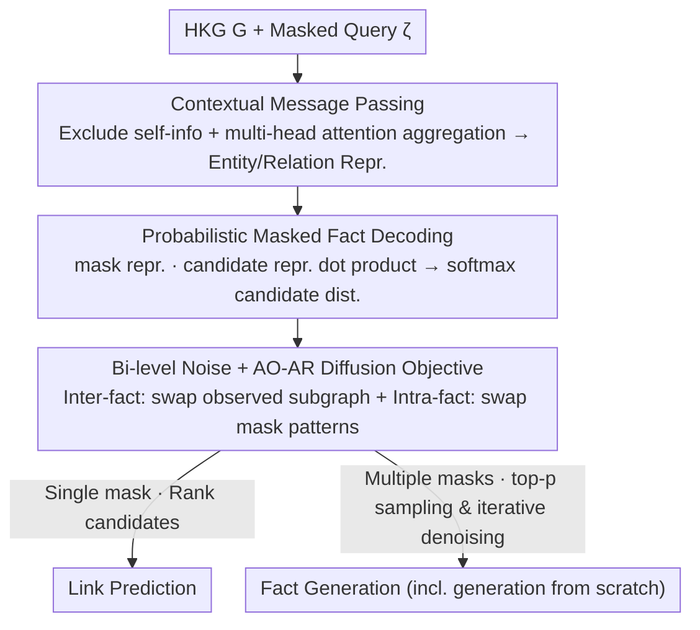

# Generative Representation Learning on Hyper-relational Knowledge Graphs via Masked Discrete Diffusion

**Conference**: ICML 2026  
**arXiv**: [2605.24064](https://arxiv.org/abs/2605.24064)  
**Code**: https://github.com/bdi-lab/KREPE (Available)  
**Area**: Graph Learning / Knowledge Graph Representation / Generative Modeling  
**Keywords**: Hyper-relational Knowledge Graphs, Fact Generation, Masked Discrete Diffusion, Contextual Message Passing, Link Prediction

## TL;DR
This paper introduces the "Fact Generation" task, extending Hyper-relational Knowledge Graph (HKG) completion from "filling a single blank" to "generating complete facts from arbitrary mask patterns or even from scratch." It proposes KREPE, the first generative HKG representation learning method: it encodes intra-fact and inter-fact dependencies via contextual message passing and models the joint conditional distribution of missing components using masked discrete diffusion. KREPE achieves SOTA on link prediction across three HKG benchmarks and significantly outperforms strong LLM baselines (e.g., GPT-5.2 / Gemini 3 Pro) in fact generation (e.g., WikiPeople- generation from scratch: 0.855 vs. LLM best 0.343).

## Background & Motivation

**Background**: HKGs extend traditional triplets $(h,r,t)$ into "main triplet + qualifier key-value pairs" $((h,r,t),\{(k_i,v_i)\})$ to express complex multi-dimensional facts (typical of Wikidata and YAGO). Mainstream HKG completion methods (StarE, HyperFormer, HAHE, MAYPL, etc.) model the task as **Link Prediction**: assuming exactly one position in a fact is `?`, the model ranks candidates based on scores.

**Limitations of Prior Work**: The single-blank assumption deviates significantly from reality. In real-world queries, the number of missing components is uncertain—subject and relation might be missing, the entire fact might be unknown, or only a qualifier might be known. Once multiple positions are missing, scoring-based methods face combinatorial explosion; even forced extensions (like HAHE's multi-position prediction) can only handle fixed predefined mask patterns.

**Key Challenge**: The intrinsic requirement of HKG completion is "generating new facts under uncertain mask patterns," whereas existing architectures are essentially "discriminative scoring + single mask template," causing a misalignment from training objectives to inference workflows. Directly applying LLMs is also problematic—LLM-based KG methods (like KICGPT) follow a "KG model proposes, LLM reranks" pipeline, but if the KG backbone cannot handle multi-blank queries, reranking is impossible.

**Goal**: (1) Formalize a new task "Fact Generation" covering any mask pattern (including full empty); (2) Design a single representation learning framework capable of **both** link prediction and fact generation.

**Key Insight**: Treat missing components as a sampling problem from the joint conditional distribution $P_\theta(x_{\text{mask}} \mid \zeta, G)$, naturally introducing **Masked Discrete Diffusion**. This mechanism inherently supports arbitrary subset masking and iterative reconstruction. Additionally, dependencies in HKGs are both "intra-fact" (mutual constraints between head/relation/tail/qualifier) and "inter-fact" (shared semantics of an entity across multiple facts), requiring modeling at both the message passing and diffusion noise levels.

**Core Idea**: Build representations using **Contextual Message Passing** (explicitly excluding a component's own information when updating it to force reliance on surrounding context) and train using a **Bi-level Noise + AO-AR Diffusion Objective** (simultaneously perturbing the observed subgraph and the query's mask pattern). Link prediction is treated as a special case of "single-mask fact generation" within a unified model.

## Method

### Overall Architecture
KREPE aims to complete or generate hyper-relational facts given an uncertain number of missing components. It takes an HKG $G=(\mathcal{V},\mathcal{R},\mathcal{H})$ and a masked query $\zeta$ as input. Contextual message passing encodes observed facts into entity/relation representations, and masked discrete diffusion converts each `?` into a probability distribution over the candidate set. During training, each epoch splits facts into an "observed set $\mathcal{H}_{\text{obs}}$" and a "target set $\mathcal{H}_{\text{tgt}}$". Representations are derived from $L$ layers of message passing on $\mathcal{H}_{\text{obs}}$. Facts in $\mathcal{H}_{\text{tgt}}$ are masked and used as queries. During inference, $\mathcal{H}_{\text{train}}$ serves as the observed set—**Link Prediction** ranks candidates for single masks, while **Fact Generation** uses top-$p$ sampling and iterative denoising for multiple masks or empty queries.

### Key Designs

**1. Contextual Message Passing: Forcing models to infer components via structure**

To make a representation both discriminative and reconstructible via diffusion, components must not "see themselves." KREPE decomposes each fact into "relation-entity pairs" $(p,e)$, projected by roles $\rho\in\{\texttt{head},\texttt{tail},\texttt{qual}\}$ as $z_{(p,e)}^{(l)} = W_\rho^{(l)}[p^{(l-1)};e^{(l-1)}]$. Fact representation $z_\xi^{(l)}$ is the sum of these pairs. When updating a component $e$, KREPE sends a "self-excluded" contextual message $m_{\xi\to(p,e)}^{(l)} = \text{MLP}^{(l)}\big((z_\xi^{(l)} - z_{(p,e)}^{(l)})/(n_\xi+1)\big)$, which is then concatenated with paired relation/entity representations to obtain $m_{\xi\to e}^{(l)}$ and $m_{\xi\to p}^{(l)}$. Multi-head attention aggregates messages from multiple facts.

This design is a core inductive bias: ablation (i) replacing contextual messages with $z_\xi$ (retaining self-info) dropped WD50K Link Prediction MRR from 0.419 to 0.408 and Fact Generation accuracy from 0.717 to 0.552. If a component sees itself, it takes shortcuts instead of learning context-based reconstruction. Entities and relations also use **shared** initial tokens $z_{\text{ENT}}, z_{\text{REL}}$ rather than unique embeddings per ID (ablation iv dropped MRR to 0.272), forcing the model to rely on structure rather than memory.

**2. Probabilistic Masked Fact Decoding: Storing confidence in dot product magnitude**

KREPE initializes masked components with learnable vectors $x_{\text{ENT}}$ or $x_{\text{REL}}$ and ensures that the query $\zeta$ only influences the masks themselves. The final layer dot product $P_\theta(x \mid \zeta, G) = \text{Softmax}_{c\in\mathcal{C}}(x_{\text{mask}}^{(L)} \cdot c^{(L)})$ fuses local query info ($x_{\text{mask}}^{(L)}$) and global HKG structure ($c^{(L)}$).

The use of dot product over cosine similarity is intentional: the **magnitude** of the representation vector carries information about "how confident the candidate is in this context"—normalization would erase this. Ablation (vi) shows a 0.6 point drop with cosine similarity.

**3. Bi-level Noise + AO-AR Diffusion Objective: Link Prediction as a special case**

**Inter-fact noise** via random structure sampling at each epoch treats the observed subgraph as a variable. **Intra-fact noise** samples the number of masks $n_{\text{mask}}\sim\mathcal{U}(\{1,\dots,2n_\xi+3\})$ for $\xi\in\mathcal{H}_{\text{tgt}}$, where $2n_\xi+3$ covers all patterns including "empty." The training objective uses Any-Order Autoregressive (AO-AR) loss:

$$\mathcal{L}_{\text{AO-AR}} = \mathbb{E}_{\xi,\mathcal{M}_\zeta}\Big[-\sum_{(x,y)\in\mathcal{M}_\zeta} \log P_\theta\big(x=y \mid \zeta,(\mathcal{V},\mathcal{R},\mathcal{H}_{\text{obs}})\big)\Big]$$

Iterative denoising during inference recomputes distributions and replaces masks via top-$p$ sampling. Ablation (ii) without structure sampling dropped MRR from 0.419 to 0.296; ablation (v) replacing AO-AR with standard link prediction cross-entropy dropped generation accuracy from 0.717 to 0.038, proving discriminative losses cannot learn joint conditional distributions.

### Loss & Training
The single AO-AR objective (Eq. 7) supports entity prediction, relation prediction, and fact generation. Discriminative ranking and generative sampling share the same representations and parameters; the only difference is whether the mask count is one or many during inference.

## Key Experimental Results

### Main Results
Evaluation metrics: MRR / Hit@10 / Hit@1 for Link Prediction, and LLM-as-a-judge (GPT-5.2) accuracy for Fact Generation.

**Link Prediction (Entity Prediction, All positions)**

| Dataset | Metric | KREPE | Prev. SOTA (MAYPL) | Gain |
|--------|------|-------|--------------------|------|
| WD50K | MRR | **0.419** | 0.411 | +0.008 |
| WD50K | Hit@10 | **0.580** | 0.572 | +0.008 |
| WikiPeople- | MRR | **0.522** | 0.521 | +0.001 |
| WikiPeople | MRR | **0.491** | 0.488 | +0.003 |
| WikiPeople | Hit@10 | **0.642** | 0.635 | +0.007 |

Relation prediction (WD50K All) MRR increased from HDiff's 0.956 to **0.968**.

**Fact Generation (Accuracy, higher is better)**

| Dataset | Setting | KREPE | Best LLM Baseline | Gain |
|--------|------|-------|----------------|------|
| WikiPeople- | Scratch | **0.855** | 0.343 (Random+Gemini 3 Pro) | +0.51 |
| WD50K | Scratch | **0.717** | 0.351 (Neighbor+Gemini 3 Pro) | +0.37 |
| WikiPeople | Scratch | **0.777** | 0.326 (Few-shot+Gemini 3 Pro) | +0.45 |
| WD50K | Arbitrary Masking | **0.604** | 0.604 (Random+Gemini 3 Pro) | Parity |
| WikiPeople- | Targeted | **0.600** | 0.394 (Neighbor+Gemini 3 Pro) | +0.21 |

On WikiPeople- Scratch, the Valid&Novel Rate is 0.351 (vs. LLM 0.242) with an expected generation count of 2.85 (vs. 4.13).

### Ablation Study
(WD50K LP MRR / Generation Accuracy from Scratch)

| Configuration | LP MRR | FG Acc | Description |
|------|--------|--------|------|
| Full KREPE | 0.419 | 0.717 | Full model |
| (i) w/o Context Msg | 0.408 | 0.552 | No self-exclusion; generation drops 16.5 |
| (ii) w/o Stochastic Sampling | 0.296 | 0.545 | No structure sampling; LP crashes |
| (iii) w/o Attention | 0.408 | 0.673 | Attention replaced by mean pooling |
| (iv) Individual Init | 0.272 | 0.466 | Unique embeddings; overall degradation |
| (v) w/ LP Loss | 0.415 | **0.038** | Standard CE; generation ability lost |
| (vi) w/ Cosine Sim | 0.419 | 0.711 | Cosine replaces dot product; generation drops |

### Key Findings
- **AO-AR diffusion is the source of generative capability**: Replacing it with standard LP loss (v) results in near-zero accuracy while preserving LP performance (0.419 vs 0.419).
- **Self-exclusion and shared initial tokens are counter-intuitive but necessary**: Ablations (i) and (iv) show that including self-info leads to shortcuts, and individual ID embeddings cause MRR to collapse to 0.272.
- **LLMs fail significantly at HKG fact generation**: Even with 1000 facts as context, Gemini 3 Pro achieves only 0.343 accuracy, far below KREPE’s 0.855.
- **Generation quality and novelty coexist**: KREPE generates complex facts like "(nominated for, Oscars Best Score), {(subject of, 68th Oscars), (nominee, R. Newman)}" for "Toy Story" across multiple domains.

## Highlights & Insights
- **Task Formalization**: Elevating HKG completion from "fill-in-the-blank" to "conditional fact generation" provides a new dimension for benchmarking.
- **Bi-level Noise**: The combination of inter-fact and intra-fact noise expands the training distribution, making link prediction a natural byproduct of the generative objective.
- **Structural Reconstruction**: The use of contextual message passing and shared tokens forces the model to rely on structural patterns, benefiting long-tail entities.
- **Magnitude Significance**: Vector magnitude contributes to performance (ablation vi), indicating that confidence information is lost during normalization in generative representation learning.

## Limitations & Future Work
- **Transductive Only**: Only handles entities/relations seen during training; does not yet support inductive scenarios.
- **Inference Complexity**: Second-order dependency on query length $|\zeta|^2 d^2(L+|\mathcal{V}|+|\mathcal{R}|)$ makes softmax a bottleneck for millions of Wikidata entities.
- **LLM-as-a-judge Bias**: Despite high correlation with humans (0.997/0.987), LLMs might favor certain structural styles.
- **Mask Bound**: The upper bound $2n_\xi+3$ is empirical and may need adjustment for facts with dozens of qualifiers.

## Related Work & Insights
- **vs. MAYPL (2025)**: KREPE builds on structure encoding but switches to AO-AR diffusion to enable generation, actually improving LP scores (MRR 0.419 vs. 0.411).
- **vs. HDiff (2025)**: HDiff uses diffusion to refine continuous embeddings for ranking; KREPE uses discrete diffusion to model distributions, highlighting that diffusion's real value in structured data is explicit probability modeling.
- **vs. LLM-based KG**: LLM-based reranking fails on multi-blank queries due to the lack of generative KG backbones. KREPE provides a native probabilistic model.
- **Transferable Insight**: The combination of AO-AR/masked discrete diffusion and role-aware message passing is applicable to any structured generation task with variable components and rich dependencies.

## Rating
- Novelty: ⭐⭐⭐⭐⭐ New task definition and the first generative HKG representation framework.
- Experimental Thoroughness: ⭐⭐⭐⭐⭐ Comprehensive evaluation across 3 datasets, 3 tasks, 15+ baselines, and 7 LLM strategies.
- Writing Quality: ⭐⭐⭐⭐ Clear definitions, though Figure 2 and bi-level noise require careful reading.
- Value: ⭐⭐⭐⭐⭐ A paradigm shift for the KG community, unifying discriminative and generative tasks.

<!-- RELATED:START -->

## Related Papers

- [\[ICML 2026\] T-GINEE: A Tensor-Based Multilayer Graph Representation Learning](t-ginee_a_tensor-based_multilayer_graph_representation_learning.md)
- [\[ICLR 2026\] Relatron: Automating Relational Machine Learning over Relational Databases](../../ICLR2026/graph_learning/relatron_automating_relational_machine_learning_over_relational_databases.md)
- [\[ICML 2026\] Unsat Core Prediction through Polarity-Aware Representation Learning over Clause-Literal Hypergraphs](unsat_core_prediction_through_polarity-aware_representation_learning_over_clause.md)
- [\[AAAI 2026\] UniHR: Hierarchical Representation Learning for Unified Knowledge Graph Link Prediction](../../AAAI2026/graph_learning/unihr_hierarchical_representation_learning_for_unified_knowledge_graph_link_pred.md)
- [\[ICML 2026\] Deep Neural Sheaf Diffusion](deep_neural_sheaf_diffusion.md)

<!-- RELATED:END -->
