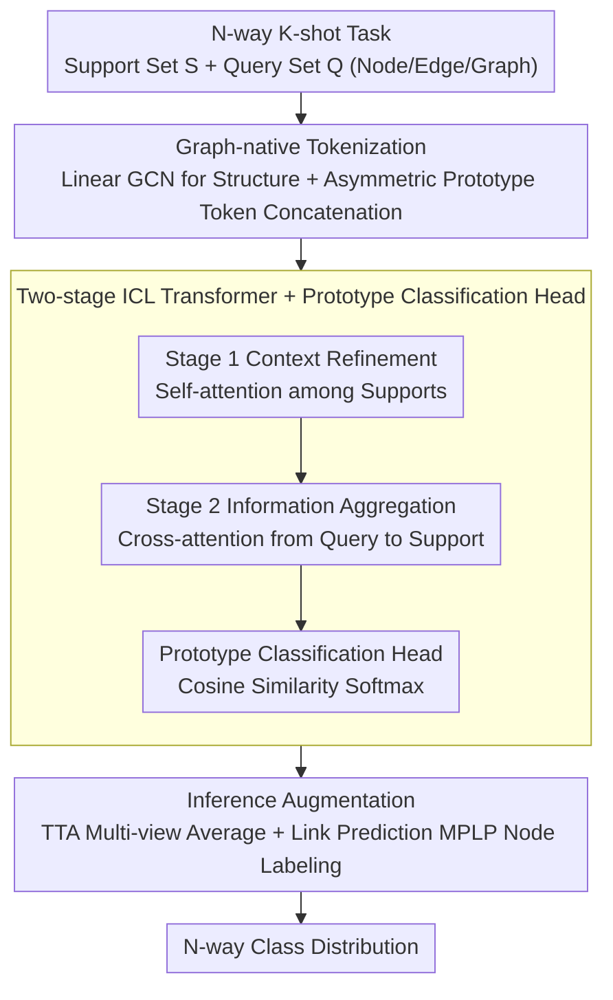

# GILT: An LLM-Free, Tuning-Free Graph Foundational Model for In-Context Learning

**Conference**: ICML 2026  
**arXiv**: [2510.04567](https://arxiv.org/abs/2510.04567)  
**Code**: https://github.com/yiming421/inductnode/ (Available)  
**Area**: Graph Learning / Graph Foundational Models / In-Context Learning  
**Keywords**: Graph Foundational Models, Graph ICL, Few-shot Graph Learning, Prototype Classification, Transformer

## TL;DR
GILT reformulates few-shot classification across node, edge, and graph tasks into a token-based in-context learning problem. Using a purely numerical architecture consisting of a "linear GCN for structural extraction + asymmetric prototype tokens + two-stage attention Transformer + prototype head," it achieves superior performance over LLM-based and tuning-based GFMs in 5-shot settings without any downstream tuning, while being 1 to 4 orders of magnitude faster.

## Background & Motivation

**Background**: General GNNs perform well on single graphs but exhibit poor cross-graph transferability, leading to the emergence of "Graph Foundational Models" (GFMs). Current GFMs follow two primary paths: first, leveraging LLMs to map node/category text attributes into a unified semantic space (e.g., ZeroG, GOFA); second, pre-training a structural encoder on large-scale graphs followed by graph prompting for parameter fine-tuning on each downstream graph (e.g., GCOPE, RiemannGFM).

**Limitations of Prior Work**: LLM-based approaches are inherently text-dependent and fail on graphs dominated by numerical, categorical, or purely structural features (e.g., molecular graphs, social networks) unless manual text descriptions are provided. Prompting-based methods, while graph-native, require gradient descent for every new graph, creating a significant efficiency bottleneck and violating the "out-of-the-box" principle of foundational models.

**Key Challenge**: The extreme heterogeneity of graph data—where feature dimensions, semantics, label sets, and topologies vary across graphs—naturally ties traditional GNN parameters to the training graphs. Breaking this bond currently requires either a "text bridge" (limited by text availability) or "tuning" (limited by efficiency).

**Goal**: Construct a unified GFM that is simultaneously LLM-free, tuning-free, multi-domain, multi-task, and few-shot capable, allowing the model to handle arbitrary N-way K-shot node/edge/graph classification tasks during inference by observing only a few support samples.

**Key Insight**: The authors draw inspiration from the success of TabPFN on tabular data, where Transformers with causal attention achieve excellent ICL on structured data. By "translating" graph tasks into a standardized set of tokens, a Transformer can perform ICL on graphs just as it does on tables, completely bypassing text and tuning requirements.

**Core Idea**: In short, "unify few-shot graph classification as token reasoning, using prototype-aware asymmetric tokens and two-stage attention to let the Transformer 'read' task semantics from the support set, followed by a cosine prototype head for on-the-fly N-way classification."

## Method

### Overall Architecture
GILT aims to handle few-shot classification on arbitrary graphs without any fine-tuning. It translates an input N-way K-shot task—comprising a labeled support set $\mathcal{S} = \{(x_i, y_i)\}_{i=1}^{N \times K}$ and a query set to be predicted $\mathcal{Q} = \{x_j\}_{j=1}^{Q}$, where $x_i$ can be a node, edge, or graph—into a unified set of fixed-dimension tokens. First, a structural encoder without learnable weights compresses heterogeneous graphs into structure-aware embeddings, which are concatenated with class prototypes to form support/query tokens. A two-stage attention ICL Transformer then "reads" task semantics from the support tokens and injects them into each query. Finally, a non-parametric prototype head calculates cosine similarity for class distributions. The model is trained on meta-tasks across 22 cross-domain graphs to learn the meta-skill of "inferring task rules from supports" rather than memorizing labels of specific graphs.

### Key Designs

**1. Graph-native Tokenization: Linear GCN + Asymmetric Prototype Tokens to address the challenge of feeding heterogeneous graphs into Transformers.**

Graphs vary in feature dimensions, label sets, and topology. To process all graphs with a single Transformer, the first step is compressing them into unified tokens. GILT’s structural encoder uses a 4–6 layer linear GCN (similar to SGC/APPNP) **stripped of learnable weights and non-linear activations**, performing only $H^{(l+1)} = \mathrm{LayerNorm}(\tilde{A} H^{(l)})$ to aggregate multi-hop neighborhood information without semantic projection. Results are then aggregated into item representations $h$ based on the task type (node embeddings for nodes, element-wise products for edges, pooling for graphs). Learnable weights are disabled because "semantic projections" during pre-training would overfit to the feature distribution of training graphs, damaging cross-graph generalization.

The second part of tokenization embeds class information into a fixed dimension. GILT calculates a prototype $p_c$ for each class via mean-pooling and L2 normalization, then **asymmetrically** constructs support tokens $t_s = [h_i \,\|\, p_{y_i}]$ and query tokens $t_q = [h_j \,\|\, \mathbf{0}]$. Support tokens include their corresponding class prototypes, while query tokens use zero vectors. This asymmetric concatenation resolves the tension between fixed token dimensions and allowing the model to see all class concepts simultaneously—outperforming one-hot encodings (which vary with class count) or decomposition into multiple binary classifications.

**2. Two-stage ICL Transformer + Prototype Classification Head to enable task semantic injection into queries for arbitrary N-way tasks without tuning.**

To achieve zero parameter updates during inference, task semantics must flow between tokens via attention. Inspired by TabPFN’s causal masking, GILT splits each layer into two steps to guarantee a unidirectional information flow from support to query. Stage 1 is Context Refinement, where multi-head self-attention $T_\mathcal{S}' = \mathrm{SelfAttention}(T_\mathcal{S})$ allows labeled support samples to interact and distill task semantics. Stage 2 is Information Aggregation, where queries use multi-head cross-attention $T_\mathcal{Q}' = \mathrm{CrossAttention}(Q{=}T_\mathcal{Q},\, K{=}T_\mathcal{S}',\, V{=}T_\mathcal{S}')$ to extract necessary context from refined supports. This design ensures queries do not influence each other or contaminate supports, which is critical for stable ICL on structured data.

Final classification is handled by a non-parametric prototype head. it extracts the "class space" segment from the token embeddings, averages samples of the same class in the support set to obtain prototypes, and computes the class distribution for queries via softmax over cosine similarity. Decoupling item space from class space allows the same pre-trained model to handle any N-way task without structural changes.

**3. Inference Augmentation: TTA + Link Prediction Node Labeling to address high prediction variance and the 1-WL expressivity bottleneck.**

Without modifying the shared backbone, GILT applies two augmentations during inference. First, **test-time augmentation (TTA)** is applied to node, edge, and graph tasks by applying random rotations to original features to generate multiple views and averaging predictions, leveraging TabPFN’s observation that ensembles enhance ICL models. Second, for link prediction, an MPLP-inspired node labeling estimation is introduced. Since standard MPNNs are limited by 1-WL and cannot distinguish different edge pairs in isomorphic subgraphs, structural cues are added to the target edge pairs. Fixing expressivity gaps during inference rather than within the backbone preserves a unified, multi-task model.

### Loss & Training
The pre-training corpus covers 22 cross-domain graphs (citation/social/molecule), totaling over 450,000 nodes and 4 million edges, ranging from small scales to 170,000 nodes and feature dimensions from single digits to over 8,000. For each step, a few-shot task is randomly sampled, and the standard cross-entropy loss is used for supervision:

$$\mathcal{L} = -\frac{1}{|\mathcal{Q}|} \sum_{x_j \in \mathcal{Q}} \log P(y = y_j \mid x_j)$$

The test set is completely disjoint from the pre-training set. The training objective is to acquire the "meta-skill" of inferring task rules from support sets rather than memorizing labels of specific graphs.

## Key Experimental Results

### Main Results

Tasks cover three major graph learning types; evaluation strictly separates train/test splits, and support samples are drawn only from the training set.

| Dataset | Task | Metric | Setting | GILT | Prev. SOTA | Gain |
|--------|------|------|------|------|----------|------|
| Cora | Node | Acc | 5-shot | 73.22 | GraphAny 72.68 | +0.54 |
| Citeseer | Node | Acc | 5-shot | 66.17 | GCOPE 63.90 | +2.27 |
| Pubmed | Node | Acc | 5-shot | 71.86 | GCN 69.88 | +1.98 |
| Node Mean (4 sets) | Node | Acc | 5-shot | **69.51** | GAT 66.21 | +3.30 |
| ogbl-collab | Link | Hits@K | 5-shot | 67.83 | MaskGAE-sup 65.84 | +1.99 |
| ogbg-molhiv | Graph | ROC-AUC | 5-shot | 65.81 | GCN 55.56 | +10.25 |

Highlights: At 5-shot, GILT not only outperforms all ICL/tuning baselines, but Link Prediction on Cora/Citeseer/ogbl-collab even exceeds supervised models like SEAL/MaskGAE using full training labels.

### Ablation Study

| Configuration | Cora 5-shot Acc | Description |
|------|-----------------|------|
| Full model | 73.22 | Complete model |
| w/o ICL Transformer | 13.00 | Performance collapses without the Transformer, proving ICL is the core |
| w/ Full Token for Prediction | 72.97 | Without item/class space separation, performance drops slightly (near 10% on WikiCS) |
| w/o Graph Encoder | 57.50 | 15+ point drop without structural encoding; structure is essential |
| w/ Non-linear GCN | 70.76 | Performance drops when replacing linear GCN with standard GCN, validating the "overfitting feature semantics" hypothesis |
| w/ 2-layer Encoder | 70.52 | Shallow encoders lack expressivity; 4–6 layers is the sweet spot |
| Base (no TTA) | 68.68 | Backbone only; removing TTA drops performance by ~4 points on average |

### Key Findings
- **ICL Transformer is the absolute core**: Removing it causes performance to collapse to near-random levels, making it more critical than the graph encoder—consistent with TabPFN's findings in tabular ICL.
- **"Linear is better than non-linear" is counter-intuitive but stable**: Simplified GCNs without learnable weights consistently outperform standard GNNs across four node datasets. This is attributed to the "fewer parameters = less overfitting to training graph semantics = better cross-graph generalization" principle.
- **Massive efficiency advantage**: On the same hardware (RTX 4090), GILT is ~20× faster than GAT, 180× faster than tuning-based GCOPE, and **14,000×** faster than LLM-based GOFA. Tuning-free and LLM-free are not just slogans; they enable sub-second responses.
- **Outperforming text-based zero-shot LLMs**: With only 5 numerical samples, GILT surpasses ZeroG/GOFA/LLaGA on Planetoid datasets, suggesting that inferring semantics from support samples is more effective for graph tasks than "querying knowledge" from text category names.

## Highlights & Insights
- **Asymmetric token + prototype concatenation** is the most clever design choice: a fixed dimension simultaneously encodes "what the item is" and "the current estimate of its class," allowing the Transformer to perform both instance reasoning and cross-class comparison—the key to N-way decoupling.
- **The "semantics to Transformer, structure to minimalist encoder" division of labor** is a noteworthy design philosophy for LLM-free GFMs: concentrating learnable parameters where "understanding" is most needed aids generalization—a concept transferable to ICL in other heterogeneous modalities like point clouds or time series.
- **Migrating TabPFN successes (causal masking + ensemble) to graphs**: This recognizes graphs as structured data, suggesting we can aggressively borrow designs from tabular ICL rather than reinventing graph-specific mechanisms from scratch.
- **Restricting MPLP node labeling to the inference stage** for link prediction maintains the simplicity of the backbone while fixing the 1-WL expressivity gap, offering a decoupled approach worth reusing.

## Limitations & Future Work
- **Tasks limited to N-way K-shot classification**: Regression, generation, and node ranking are not yet covered; the non-parametric prototype classification is not easily adaptable to regression.
- **Support set scale and Transformer complexity**: Context length grows with $N \times K$, and attention complexity is $O((NK+Q)^2)$. Scaling to large N or K remains a bottleneck; experiments primarily focus on 1-shot and 5-shot settings.
- **1-shot performance on WikiCS is lower than GraphAny**: The lack of a detailed explanation suggests ICL might be less stable than simple non-parametric methods on highly noisy or heterophilic graphs.
- **Linear GCN width assumption**: The assumption that SGC/APPNP provides "sufficient structural expression" might fail on heterophilic graphs, requiring more complex graph priors.
- **Future Directions**: Replacing the prototype head with differentiable retrieval/memory modules or using Set-Transformers to reduce attention complexity; expanding to more task types; dynamically deciding the number of TTA views based on query difficulty.

## Related Work & Insights
- **vs OFA**: OFA also uses ICL but constructs a prompt graph to connect supports as virtual nodes for GNN inference. GILT applies attention directly to token sets, providing more flexible cross-task unification (Cora 1-shot: 30.52 vs 56.36).
- **vs GraphAny**: GraphAny uses an analytical solver + attention fusion to achieve tuning-free node classification. GILT generalizes ICL to node/link/graph tasks with an end-to-end trainable deep network.
- **vs GCOPE/RiemannGFM**: These prompting methods rely on downstream tuning. GILT removes tuning and outperforms them on many node datasets while being 100+ times faster during inference.
- **vs ZeroG/GOFA**: These methods rely on LLMs for zero-shot graph classification via text. GILT outperforms them with just 5 numerical samples, indicating LLMs may be a burden for text-poor graphs (e.g., molecules).
- **Insight**: The next step for GFMs may not be "how to better textialize graphs," but rather "how to better represent graph tasks in Transformer-friendly set/token formats." GILT's migration of the TabPFN approach opens a new path for the community.

## Rating
- Novelty: ⭐⭐⭐⭐ First GFM to achieve LLM-free + tuning-free status across node/link/graph tasks; the asymmetric token + two-stage attention combo is memorable.
- Experimental Thoroughness: ⭐⭐⭐⭐ Covers three task types + multiple baselines + full ablation + efficiency analysis, though lacks stress tests for extreme cases (large N/K, heterophily).
- Writing Quality: ⭐⭐⭐⭐ Clear motivation; every design choice is justified; strong alignment between method and experiments.
- Value: ⭐⭐⭐⭐ Directly benefits latency-sensitive industrial graph tasks and provides a reusable design template for graph ICL.

<!-- RELATED:START -->

## Related Papers

- [\[ICML 2026\] Quantile-Free Uncertainty Quantification in Graph Neural Networks](quantile-free_uncertainty_quantification_in_graph_neural_networks.md)
- [\[ICML 2026\] Message Tuning Outshines Graph Prompt Tuning: A Prismatic Space Perspective](message_tuning_outshines_graph_prompt_tuning_a_prismatic_space_perspective.md)
- [\[ICML 2026\] Are Common Substructures Transferable? Riemannian Graph Foundation Model with Neural Vector Bundles](are_common_substructures_transferable_riemannian_graph_foundation_model_with_neu.md)
- [\[CVPR 2025\] Knowledge Bridger: Towards Training-Free Missing Modality Completion](../../CVPR2025/graph_learning/knowledge_bridger_towards_training-free_missing_modality_completion.md)
- [\[CVPR 2026\] Graph-to-Frame RAG: Visual-Space Knowledge Fusion for Training-Free and Auditable Video Reasoning](../../CVPR2026/graph_learning/graph-to-frame_rag_visual-space_knowledge_fusion_for_training-free_and_auditable.md)

<!-- RELATED:END -->
