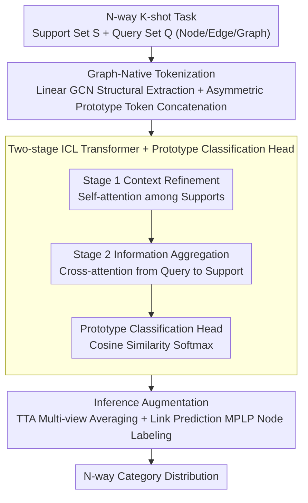

# GILT: An LLM-Free, Tuning-Free Graph Foundational Model for In-Context Learning

**Conference**: ICML 2026  
**arXiv**: [2510.04567](https://arxiv.org/abs/2510.04567)  
**Code**: https://github.com/yiming421/inductnode/ (Available)  
**Area**: Graph Learning / Graph Foundation Models / In-Context Learning  
**Keywords**: Graph Foundation Models, Graph ICL, Few-shot Graph Learning, Prototype Classification, Transformer

## TL;DR
GILT reformulates node, edge, and graph few-shot classification into a unified token-based in-context learning problem. By utilizing a pure numerical architecture consisting of "linear GCN for structural extraction + asymmetric prototype tokens + two-stage attention Transformer + prototype head," it achieves graph-native ICL without relying on LLMs or requiring any downstream tuning. In 5-shot settings, it outperforms both LLM-based and tuning-based GFMs while being 1 to 4 orders of magnitude faster.

## Background & Motivation

**Background**: While general GNNs perform strongly on single graphs, their cross-graph transfer capability is limited, leading to the emergence of "Graph Foundation Models" (GFMs). Current GFMs follow two main paths: 1) leveraging LLMs to map text attributes to a unified semantic space (e.g., ZeroG, GOFA), or 2) pre-training a structural encoder on large-scale graphs and using graph prompting for parameter fine-tuning on downstream graphs (e.g., GCOPE, RiemannGFM).

**Limitations of Prior Work**: The LLM-based route is inherently text-dependent and fails on graphs dominated by numerical, categorical, or pure structural features (e.g., molecular graphs, social networks) unless manual text descriptions are provided. The prompting route, although graph-native, requires a round of gradient descent for every new graph, creating a significant efficiency bottleneck and violating the "out-of-the-box" principle of foundation models.

**Key Challenge**: The extreme heterogeneity of graph data—where feature dimensions, semantics, label sets, and topologies vary across graphs—naturally ties traditional GNN parameters to specific training graphs. Breaking this tie typically requires either text bridges (limited by availability) or tuning (limited by efficiency).

**Goal**: To construct a unified GFM that is simultaneously LLM-free, tuning-free, multi-domain, multi-task, and few-shot capable, allowing the model to handle arbitrary N-way K-shot node/edge/graph classification tasks at inference time by merely observing a few support samples.

**Key Insight**: The authors draw inspiration from the success of TabPFN on tabular data, where Transformers equipped with causal attention demonstrate excellent ICL on structured data. By "translating" graph tasks into a unified set of tokens, a Transformer can perform ICL much like it does on tables, completely bypassing the need for text and tuning.

**Core Idea**: The core strategy is to unify few-shot graph classification as token reasoning, using prototype-aware asymmetric tokens and two-stage attention to allow the Transformer to "read" task semantics from the support set, followed by a cosine prototype head for on-the-fly N-way classification.

## Method

### Overall Architecture
GILT aims to enable a single model to process few-shot classification on any graph without fine-tuning. It translates the input N-way K-shot task—comprising a labeled support set $\mathcal{S} = \{(x_i, y_i)\}_{i=1}^{N \times K}$ and a query set to be predicted $\mathcal{Q} = \{x_j\}_{j=1}^{Q}$, where $x_i$ can be a node, edge, or graph—into a set of fixed-dimension tokens. First, a structural encoder without learnable weights compresses heterogeneous graphs into structure-aware embeddings, which are concatenated with class prototypes to form support and query tokens. Then, a two-stage attention ICL Transformer extracts task semantics from support tokens and injects them into each query. Finally, a non-parametric prototype head calculates cosine similarity to output category distributions. Trained on meta-tasks across 22 domains, the model learns the ability to "infer task rules from supports" rather than memorizing labels.

### Key Designs

**1. Graph-Native Tokenization: Linear GCN + Asymmetric Prototype Tokens to solve the bottleneck of feeding heterogeneous graphs into Transformers**

Since graph feature dimensions, label sets, and topologies vary, GILT first compresses them into tokens of a uniform dimension. The structural encoder uses a 4–6 layer linear GCN **stripped of learnable weights and non-linear activations** (similar to SGC/APPNP). Each layer performs $H^{(l+1)} = \mathrm{LayerNorm}(\tilde{A} H^{(l)})$ to aggregate multi-hop neighborhood information without semantic projection. Results are pooled based on the task type (node embedding for node tasks, element-wise product for edge tasks, pooling for graph tasks). Weights are disabled because "semantic projection" during pre-training tends to overfit to the training graphs' feature distributions, hindering cross-graph generalization.

For tokenization, GILT uses mean-pooling and L2 normalization to calculate a prototype $p_c$ for each class, then **asymmetrically** constructs support tokens $t_s = [h_i \,\|\, p_{y_i}]$ and query tokens $t_q = [h_j \,\|\, \mathbf{0}]$. Support tokens are appended with their corresponding label prototype, while query tokens are appended with a zero vector to be filled. This asymmetric concatenation allows the model to see all category concepts simultaneously while maintaining a fixed token dimension.

**2. Two-Stage ICL Transformer + Prototype Classification Head to enable tuning-free task semantic injection for arbitrary N-way tasks**

To achieve zero-parameter updates during inference, task semantics must flow between tokens via attention. Inspired by TabPFN, each GILT layer involves two steps to ensure a unidirectional flow from support to query. Stage 1 (Context Refinement) performs multi-head self-attention among support tokens $T_\mathcal{S}' = \mathrm{SelfAttention}(T_\mathcal{S})$, allowing labeled samples to interact and condense task semantics. Stage 2 (Information Aggregation) uses multi-head cross-attention $T_\mathcal{Q}' = \mathrm{CrossAttention}(Q{=}T_\mathcal{Q},\, K{=}T_\mathcal{S}',\, V{=}T_\mathcal{S}')$ for queries to extract context from refined supports. This design ensures queries do not influence each other or pollute the support set. Removing the Transformer causes performance to collapse to ~13%.

Final classification is handled by a non-parametric prototype head. It extracts the "class space" segment of the token embedding, averages samples of the same class in the support set to obtain prototypes, and calculates the query distribution via softmax over cosine similarity. Decoupling the item space and class space allows the same pre-trained model to handle any N-way task.

**3. Inference-time Augmentation: TTA + Link Prediction Node Labeling to resolve prediction variance and 1-WL expressive bottlenecks**

GILT uses two inference-stage enhancements without modifying the shared backbone. First, **Test-Time Augmentation (TTA)** is applied to node, edge, and graph tasks by generating multiple views via random feature rotation and averaging predictions. Second, for link prediction, it introduces **MPLP-inspired node labeling**. Standard MPNNs, limited by 1-WL, cannot distinguish between different edge pairs in isomorphic subgraphs; thus, structural cues are added to target edge pairs. Moving these expressive fixes to the inference stage maintains the simplicity of the "one model for all tasks" paradigm.

### Loss & Training
The pre-training corpus covers 22 cross-domain graphs (citation, social, molecule) with over 450,000 nodes and 4 million edges. Each step randomly samples a few-shot task, generates predictions through the GILT architecture, and uses standard cross-entropy supervision:

$$\mathcal{L} = -\frac{1}{|\mathcal{Q}|} \sum_{x_j \in \mathcal{Q}} \log P(y = y_j \mid x_j)$$

The test sets are completely disjoint from the pre-training sets, encouraging the model to acquire the meta-skill of "inferring task rules from supports."

## Key Experimental Results

### Main Results

The tasks cover three main graph learning categories, with a strict split between training and testing.

| Dataset | Task | Metric | Setting | GILT | Prev. SOTA | Gain |
| :--- | :--- | :--- | :--- | :--- | :--- | :--- |
| Cora | Node Class. | Acc | 5-shot | 73.22 | GraphAny 72.68 | +0.54 |
| Citeseer | Node Class. | Acc | 5-shot | 66.17 | GCOPE 63.90 | +2.27 |
| Pubmed | Node Class. | Acc | 5-shot | 71.86 | GCN 69.88 | +1.98 |
| Node Mean (4 datasets) | Node Class. | Acc | 5-shot | **69.51** | GAT 66.21 | +3.30 |
| ogbl-collab | Link Pred. | Hits@K | 5-shot | 67.83 | MaskGAE-sup 65.84 | +1.99 |
| ogbg-molhiv | Graph Class. | ROC-AUC | 5-shot | 65.81 | GCN 55.56 | +10.25 |

Highlights: In 5-shot settings, GILT outperforms all ICL/tuning baselines and even surpasses supervised models (SEAL/MaskGAE) using full training labels on link prediction tasks like Cora and Citeseer.

### Ablation Study

| Configuration | Cora 5-shot Acc | Description |
| :--- | :--- | :--- |
| Full model | 73.22 | Complete model |
| w/o ICL Transformer | 13.00 | Complete collapse, proving ICL module is core |
| w/ Full Token for Prediction | 72.97 | No item/class space separation (WikiCS drops 10 pts) |
| w/o Graph Encoder | 57.50 | 15+ pt drop without structural information |
| w/ Non-linear GCN | 70.76 | Switching to standard GCN with non-linearity causes a drop |
| w/ 2-layer Encoder | 70.52 | Shallow encoder lacks expressiveness |
| base (No TTA) | 68.68 | Backbone only, ~4 pt drop on average |

### Key Findings
- **ICL Transformer is the absolute core**: Performance collapses to near-random without it, echoing findings from TabPFN.
- **"Linear is better than Non-linear"**: Simplified GCNs without learnable weights outperformed standard GCNs across 4 node datasets, likely because fewer parameters prevent overfitting to pre-training semantics.
- **Massive Efficiency Gap**: On an RTX 4090, GILT is ~20× faster than GAT, 180× faster than GCOPE, and **14,000×** faster than the LLM-based GOFA.
- **Outperforming Zero-shot LLMs**: GILT with 5 numerical samples beats ZeroG/GOFA/LLaGA, suggesting that inferring semantics from supports is more effective for graph tasks than "querying knowledge" from textual category names.

## Highlights & Insights
- **Asymmetric token + prototype concatenation** is the most ingenious design: it encodes both item identity and category estimation in a fixed dimension, enabling the Transformer to perform both instance reasoning and cross-category comparison.
- **The division of labor (semantics to Transformer, structure to a "dumb" encoder)** is a valuable design philosophy for LLM-free GFMs: concentrating learnable parameters where reasoning occurs aids generalization.
- **Migrating TabPFN's success to graphs**: This recognizes graphs as structured data and suggests borrowing from tabular ICL rather than reinventing graph-specific mechanisms every time.
- **Inference-only MPLP node labeling**: Fixing the 1-WL expressive gap only during inference maintains the simplicity of the backbone, a useful decoupling strategy.

## Limitations & Future Work
- **Task Scope**: Currently limited to N-way K-shot classification; regression, generation, and node ranking are not yet covered.
- **Context Complexity**: Attention complexity is $O((NK+Q)^2)$, becoming a bottleneck in large N or K scenarios.
- **Performance on WikiCS**: GILT's 1-shot performance is lower than GraphAny's, potentially indicating ICL struggles on highly noisy or heterophilic graphs.
- **Linear GCN Assumption**: Might not hold for extremely heterophilic graphs that require more complex inductive biases.

## Related Work & Insights
- **vs OFA**: OFA uses prompts as graphs and GNNs for single-forward inference; GILT uses Transformers on token sets, providing more flexibility and better 1-shot performance on Cora (56.36 vs 30.52).
- **vs GraphAny**: GraphAny is tuning-free but limited to node classification; GILT generalizes to node/link/graph tasks with an end-to-end trainable deep architecture.
- **vs GCOPE/RiemannGFM**: These require downstream tuning; GILT achieves higher accuracy on several datasets without any tuning, while being 100+ times faster.

## Rating
- Novelty: ⭐⭐⭐⭐ First GFM to achieve LLM-free + tuning-free performance across node/link/graph tasks.
- Experimental Thoroughness: ⭐⭐⭐⭐ Broad task coverage and ablation, though lacks stress tests for massive N/K.
- Writing Quality: ⭐⭐⭐⭐ Clear motivation and logical progression of design choices.
- Value: ⭐⭐⭐⭐ Significant benefits for latency-sensitive industrial graph tasks; provides a reproducible template for graph ICL.

<!-- RELATED:START -->

## Related Papers

- [\[ICML 2026\] Quantile-Free Uncertainty Quantification in Graph Neural Networks](quantile-free_uncertainty_quantification_in_graph_neural_networks.md)
- [\[ICLR 2026\] Training-Free Counterfactual Explanation for Temporal Graph Model Inference](../../ICLR2026/graph_learning/training-free_counterfactual_explanation_for_temporal_graph_model_inference.md)
- [\[ICML 2026\] Message Tuning Outshines Graph Prompt Tuning: A Prismatic Space Perspective](message_tuning_outshines_graph_prompt_tuning_a_prismatic_space_perspective.md)
- [\[ICML 2026\] Are Common Substructures Transferable? Riemannian Graph Foundation Model with Neural Vector Bundles](are_common_substructures_transferable_riemannian_graph_foundation_model_with_neu.md)
- [\[ICLR 2026\] Glance for Context: Learning When to Leverage LLMs for Node-Aware GNN-LLM Fusion](../../ICLR2026/graph_learning/glance_for_context_learning_when_to_leverage_llms_for_node-aware_gnn-llm_fusion.md)

<!-- RELATED:END -->
## Related Papers

- [\[ICML 2026\] Quantile-Free Uncertainty Quantification in Graph Neural Networks](quantile-free_uncertainty_quantification_in_graph_neural_networks.md)
- [\[ICML 2026\] Message Tuning Outshines Graph Prompt Tuning: A Prismatic Space Perspective](message_tuning_outshines_graph_prompt_tuning_a_prismatic_space_perspective.md)
- [\[CVPR 2025\] Knowledge Bridger: Towards Training-Free Missing Modality Completion](../../CVPR2025/graph_learning/knowledge_bridger_towards_training-free_missing_modality_completion.md)
- [\[ICML 2026\] Are Common Substructures Transferable? Riemannian Graph Foundation Model with Neural Vector Bundles](are_common_substructures_transferable_riemannian_graph_foundation_model_with_neu.md)
- [\[ICML 2026\] Structure-Centric Graph Foundation Model via Geometric Bases](structure-centric_graph_foundation_model_via_geometric_bases.md)

<!-- RELATED:END -->
