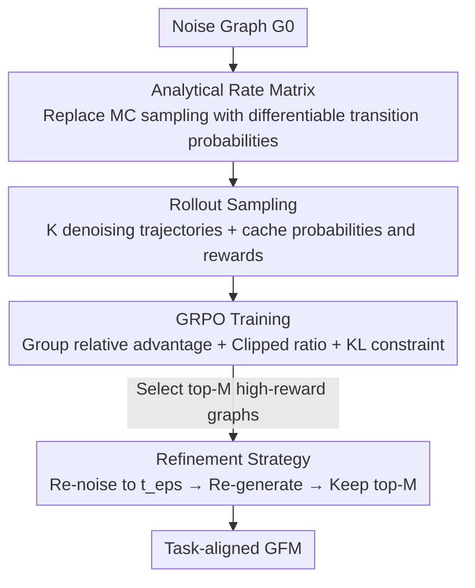

# Graph-GRPO: Training Graph Flow Models with Reinforcement Learning

**Conference**: ICML 2026  
**arXiv**: [2603.10395](https://arxiv.org/abs/2603.10395)  
**Code**: https://github.com/Zhubaoheng/Graph-GRPO  
**Area**: Graph Learning / Graph Generation / Reinforcement Learning  
**Keywords**: Graph Flow Models, Discrete Flow Matching, GRPO, Molecular Optimization, Differentiable Sampling  

## TL;DR
To address the challenge that "Graph Flow Models (GFMs) are difficult to align with complex objectives using reinforcement learning," this paper proposes Graph-GRPO. First, it derives the non-differentiable Monte Carlo rate matrix in GFM sampling into an **analytical expression**, making the entire denoising trajectory differentiable and trainable via GRPO. Second, it introduces a **refinement strategy** that performs "local noise injection and re-generation" on high-scoring graphs. With only 50 denoising steps, it achieves 95.0%/97.5% V.U.N. on Planar/Tree datasets and outperforms previous graph RL and genetic algorithm methods in molecular optimization (protein docking, PMO).

## Background & Motivation

**Background**: Graph generation is shifting from discrete diffusion to the **discrete flow matching** paradigm, represented by Graph Flow Models (GFM, e.g., DeFoG). GFMs decouple training objectives from the sampling process, using a denoiser $f_\theta$ to predict clean graphs and then sampling from a noisy graph step-by-step through the rate matrix $R_t$ of a Continuous-Time Markov Chain (CTMC), combining high quality with flexible inference.

**Limitations of Prior Work**: GFMs typically only perform "unconditional" de novo generation, making it difficult to align with complex human preferences or task objectives—such as drug discovery, which requires generating small molecules with high binding affinity and low toxicity. These objectives correspond to only a small region in the generation space. Sampling directly from a pre-trained GFM results in mostly invalid or low-quality graphs.

**Key Challenge**: Applying RL to GFMs faces two major hurdles. First, modern policy gradients require calculating the probability ratio $r=\pi_\theta(G_{t+\mathrm{d}t}\mid G_t)/\pi_{\text{old}}(G_{t+\mathrm{d}t}\mid G_t)$ between new and old policies, which requires the transition probability of each action to be **differentiable**. However, the GFM rate matrix is estimated by **sampling a pseudo-graph** $\hat z_1$ via Monte Carlo, which truncates the gradient flow. Even using Gumbel-Softmax results in training-inference inconsistency due to "different pseudo-graphs sampled by new and old models." Second, de novo generation provides very sparse reward signals (most graphs are invalid), making it hard for RL exploration to locate task-relevant regions.

**Goal**: To enable end-to-end RL training for GFMs and achieve efficient exploration of high-potential regions under sparse rewards.

**Key Insight**: The authors found that the Monte Carlo estimation of the rate matrix is essentially taking the "expectation over the real data $z_1$." Since the categories are finite, this **expectation can be expanded analytically**, bypassing the sampling step.

**Core Idea**: Replace Monte Carlo sampling with a pre-computable **analytical rate matrix**, making the GFM rollout fully differentiable and compatible with GRPO. Then, use a **refinement strategy** to repeatedly perform local perturbations and re-generation on high-reward samples to concentrate exploration in high-potential regions.

## Method

### Overall Architecture

Graph-GRPO is built upon a pre-trained GFM (DeFoG, with a graph Transformer denoiser using RRWP), treated as the policy model $\pi_\theta$. The state is the current graph, and the actions are the nodes and edges for the next sampling step. The pipeline is: starting from the same noise graph $G_0$, use the **analytical rate matrix** to calculate differentiable transition probabilities and sample a group of $K$ denoising trajectories (rollouts), caching the transition probabilities and rewards of the final graphs. Rewards are normalized within the group to compute advantages, and the policy is updated using the GRPO clipped objective with a KL constraint. Finally, a **refinement strategy** selects top-$M$ high-scoring graphs for repeated "re-noising and re-generation" to further push generation quality toward task objectives.

### Key Designs

**1. Analytical Rate Matrix: Replacing non-differentiable Monte Carlo sampling with differentiable closed-form transition probabilities**

This is the foundation for connecting RL to GFMs. The original DeFoG predicts the distribution $p_\theta(\cdot\mid z_t)$ at each step, **samples a pseudo-graph** $\hat z_1\sim p_\theta(\cdot\mid z_t)$, and uses it to calculate the conditional rate matrix $R_t(z_t,z_{t+\mathrm{d}t}\mid \hat z_1)$, with transition probability $p(z_{t+\Delta t}\mid z_t)=\delta(z_t,z_{t+\Delta t})+R_t\,\Delta t$. This sampling makes the transition probability non-differentiable w.r.t. $\theta$. The authors noted that the unconditional rate matrix is the expectation over pseudo-graphs $R_t(z_t,z_{t+\mathrm{d}t})=\mathbb{E}_{\hat z_1\sim p_\theta(\cdot\mid z_t)}[R_t(z_t,z_{t+\mathrm{d}t}\mid \hat z_1)]$, and expanded it analytically:

$$R_t^{\theta}(z_t,z_{t+\mathrm{d}t})=p_\theta(z_{t+\mathrm{d}t})\,V_1+\big(1-p_\theta(z_t)-p_\theta(z_{t+\mathrm{d}t})\big)\,V_2,$$

where $V_1=\frac{1+p_0(z_t)-p_0(z_{t+\mathrm{d}t})}{Z_t^{>0}(1-t)p_0(z_t)}$ and $V_2=\frac{\mathrm{ReLU}(p_0(z_t)-p_0(z_{t+\mathrm{d}t}))}{Z_t^{>0}(1-t)p_0(z_t)}$ depend only on the prior distribution $p_0$ and time $t$, and **can be pre-computed**. The transition probability thus becomes a differentiable function of the denoiser's prediction $p_\theta$, eliminating pseudo-graph sampling, restoring gradient flow, and removing training-inference inconsistency.

**2. GRPO Rollout and Training: Intra-group comparison under sparse rewards**

With differentiable transition probabilities, the authors applied the GRPO framework. During rollout: starting from the same $G_0$, the GFM generates a group of $K$ trajectories $\{\tau^{(k)}\}_{k=1}^K$ in parallel, recording transition probabilities $p(G_{t+\Delta t}^{(k)}\mid G_t^{(k)})$ and endpoint rewards $R^{(k)}=\mathcal{R}(G_1^{(k)})$. During training, **group relative advantages** are used to normalize rewards $A^{(k)}=\frac{R^{(k)}-\operatorname{mean}(\{R^{(i)}\})}{\operatorname{std}(\{R^{(i)}\})}$. The objective $\mathcal{L}_t^{(k)}=\min\big(r_{t,\theta}^{(k)}A^{(k)},\,\operatorname{clip}(r_{t,\theta}^{(k)},1\pm\epsilon)A^{(k)}\big)$ is maximized using clipped importance ratios $r_{t,\theta}^{(k)}$, with a $-\beta D_{\text{KL}}(\pi_\theta\Vert\pi_{\text{ref}})$ term to keep the policy close to the pre-trained DeFoG. This eliminates the need for a separate value network and mitigates high variance from sparse rewards while preventing reward hacking.

**3. Refinement Strategy: Targeted exploration via "local re-noising and re-generation"**

De novo sampling rarely hits narrow task objectives. The authors maintain a priority pool $\mathcal{B}$ of top-$M$ reward graphs. In each round, graphs from the pool undergo "re-noising + re-generation": $G_1$ is reverted to an intermediate noise state $t_\epsilon\in(0,1)$ following $p_{t_\epsilon\mid 1}(z_{t_\epsilon}\mid z_1)=t_\epsilon\cdot\delta(z_{t_\epsilon},z_1)+(1-t_\epsilon)\cdot p_0(z_{t_\epsilon})$. A larger $t_\epsilon$ implies smaller perturbations (local node/edge changes). The GFM then re-denoises these to produce multiple candidates. This is equivalent to performing a local search around good samples and is much more effective than de novo generation for highly selective rewards (e.g., Valsartan SMARTS).

### Loss & Training

The overall objective follows standard GRPO: $\mathcal{J}(\theta)=\frac{1}{KT}\sum_{k=1}^K\sum_{t=1}^T\big(\mathcal{L}_t^{(k)}(\theta)-\beta D_{\text{KL}}(\pi_\theta\Vert\pi_{\text{ref}})\big)$. For synthetic graph tasks, the reward is a combination of "hard validity constraints + soft distribution matching": $R(G)=\mathbb{I}(G)\cdot\big(\alpha+\frac{1-\alpha}{|\mathcal{K}|}\sum_{k\in\mathcal{K}}S_k\big)$, where $\mathcal{K}=\{\text{deg},\text{clus},\text{orb}\}$ denotes structural similarity metrics and $\alpha=0.65$ prioritizes validity. Molecular tasks use metrics like docking score (DS).

## Key Experimental Results

### Main Results

Synthetic graph generation (Planar/Tree, 64 nodes, V.U.N. higher is better, Ratio lower is better). Graph-GRPO outperforms diffusion and policy optimization methods that use 1000 steps, using only **50 steps**:

| Model | Steps | Planar V.U.N.↑ | Planar Ratio↓ | Tree V.U.N.↑ | Tree Ratio↓ |
|------|------|------|------|------|------|
| DiGress | 1,000 | 77.5 | 5.1 | 90.0 | 1.6 |
| DisCo | 1,000 | 83.6 | - | - | - |
| GDPO | 1,000 | 73.8 | - | - | - |
| DeFoG (Base) | 50 | 95.0 | 3.2 | 73.5 | 2.5 |
| **Graph-GRPO** | 50 | **95.0** | **1.5** | **97.5** | **2.2** |

Protein docking (ZINC250k, DS top 5% lower is better, Hit Ratio higher is better). Graph-GRPO significantly leads RL-based and generative methods across targets:

| Target | Metric | Graph-GRPO | GDPO | MOOD | DiGress |
|------|------|------|------|------|------|
| parp1 | DS top 5%↓ | **-12.515** | -10.938 | -10.865 | -9.219 |
| parp1 | Hit Ratio↑ | **60.763** | 9.814 | 7.017 | 0.366 |
| jak2 | DS top 5%↓ | **-11.123** | -10.183 | -10.147 | -8.706 |
| jak2 | Hit Ratio↑ | **52.897** | 13.405 | 9.200 | 0.861 |
| 5ht1b | Hit Ratio↑ | **46.634** | 34.359 | 18.673 | 4.236 |

### Ablation Study

The refinement strategy's effect varies by task difficulty. On simple Scaffold Hopping, de novo generation and refinement perform similarly. On highly selective tasks like Valsartan SMARTS, a significant gap emerges, proving refinement's importance for narrow target regions. On the PMO benchmark (AUC-top10), Graph-GRPO in a cold-start setting outperforms methods like InVirtuoGen and Gen.GFN:

| Config / Oracle | Metric | Description |
|------|---------|------|
| de novo (Base task) | ≈ Comparable | Gains from refinement are minor on Scaffold Hopping |
| + Refinement (Hard task) | Significant Lead | Clear gap on Valsartan SMARTS |
| Celecoxib Rediscovery | 0.890 vs 0.802 (Gen.GFN) | Leads on most PMO oracles |
| Fexofenadine MPO | 0.984 vs 0.856 | Consistent advantage |

### Key Findings

- **Analytical rate matrix is the "on-off switch" for training**: Without it, GFM transition probabilities are non-differentiable, and GRPO ratios cannot be computed.
- **Refinement gains scale with task difficulty**: The more selective the reward, the harder it is for de novo generation to succeed, and the higher the value of repeated local search.
- **Low steps, high quality**: Achieving superior results in 50 steps compared to 1000-step diffusion baselines shows that RL alignment shifts the distribution toward target regions rather than just increasing sampling computation.

## Highlights & Insights
- Expanding the Monte Carlo rate matrix into a closed-form analytical expression $V_1, V_2$ solves both "non-differentiability" and "training-inference inconsistency." This "analytical expectation" approach is transferable to other discrete diffusion/flow RL fine-tuning scenarios.
- The refinement strategy essentially performs a local search around good samples during sampling, unifying RL exploration with inference-time scaling (equivalent to more denoising steps), similar to SDEdit in image diffusion.
- Using GRPO instead of PPO removes the need for a value network and relies on intra-group relative advantages, which naturally fits graph generation where multiple trajectories are sampled from the same noise graph.

## Limitations & Future Work
- The derivation of the analytical rate matrix depends on the specific form of discrete flow matching (linear interpolation, co-design rate matrix) and may require re-derivation for other noise schedules.
- Refinement introduces hyperparameters (pool size $M$, $t_\epsilon$, candidates per round). Sensitivity analysis is not fully explored, potentially increasing tuning costs for new tasks.
- Rewards still rely on verifiable oracles; aligning with "soft preferences" without clear scoring functions remains unexplored.

## Related Work & Insights
- **vs GDPO (Graph Diffusion Policy Optimization)**: GDPO uses 1000 steps and does not solve the transition probability differentiability issue. Graph-GRPO uses analytical rates for differentiable rollouts, outperforming GDPO significantly in 50 steps (e.g., parp1 Hit Ratio 60.8 vs 9.8).
- **vs DeFoG (Base GFM)**: DeFoG is limited to unconditional generation and uses MC estimation. This work adds RL alignment and refinement, improving Tree V.U.N. from 73.5% to 97.5%.
- **vs Genetic Algorithms / Fragment-based RL (Mol GA, f-RAG)**: These perform discrete search. Graph-GRPO's differentiable flow policy + local refinement is superior for most PMO oracles in cold-start settings.

<!-- RELATED:START -->

## Related Papers

- [\[ACL 2026\] AgentGL: Towards Agentic Graph Learning with LLMs via Reinforcement Learning](../../ACL2026/graph_learning/agentgl_towards_agentic_graph_learning_with_llms_via_reinforcement_learning.md)
- [\[ICLR 2026\] Bures-Wasserstein Flow Matching for Graph Generation](../../ICLR2026/graph_learning/bures-wasserstein_flow_matching_for_graph_generation.md)
- [\[ICLR 2026\] Learning Concept Bottleneck Models from Mechanistic Explanations](../../ICLR2026/graph_learning/learning_concept_bottleneck_models_from_mechanistic_explanations.md)
- [\[ICML 2026\] Aitchison Embeddings for Learning Compositional Graph Representations](aitchison_embeddings_for_learning_compositional_graph_representations.md)
- [\[ICML 2026\] T-GINEE: A Tensor-Based Multilayer Graph Representation Learning](t-ginee_a_tensor-based_multilayer_graph_representation_learning.md)

<!-- RELATED:END -->
