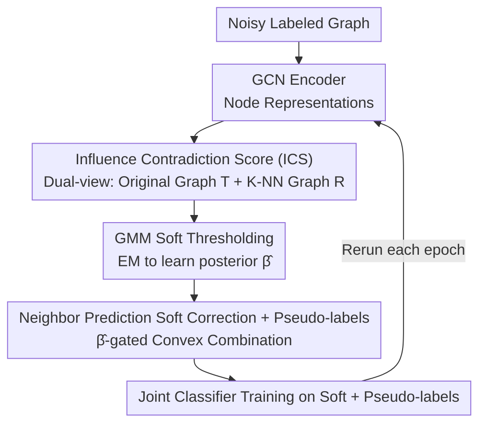

# Identifying and Correcting Label Noise for Robust GNNs via Influence Contradiction

**Conference**: ICML 2026  
**arXiv**: [2601.17469](https://arxiv.org/abs/2601.17469)  
**Code**: https://github.com/wayc04/ICGNN  
**Area**: Graph Learning / GNN Robustness / Noisy Labels  
**Keywords**: Graph Neural Networks, Noisy Labels, Influence Contradiction, Graph Diffusion, GMM

## TL;DR
ICGNN defines the "Influence Contradiction Score" (ICS) on graph diffusion matrices to measure the suspicion of node labels from both structural and attribute perspectives. It utilizes a Gaussian Mixture Model (GMM) soft thresholding to identify dirty labels and performs convex combination soft correction based on neighbor predictions, outperforming specialized methods such as NRGNN, RTGNN, CGNN, and ProCon across six graph benchmarks.

## Background & Motivation

**Background**: The effectiveness of Graph Neural Networks (GNNs) in node classification heavily relies on clean training labels. However, manual annotations in real-world graph data (social networks, recommendation systems, molecules) are often fraught with noise. While the Computer Vision (CV) domain has developed noise reduction methods categorized into sample selection, loss correction, and label correction, most ignore topological structures when transferred to graphs.

**Limitations of Prior Work**: Existing graph-specific works (NRGNN, RTGNN, CGNN, ProCon, etc.) remain unsatisfactory in two aspects: (i) Detection: NRGNN bypasses detection by simply connecting unlabeled nodes to similar labeled ones; RTGNN/CGNN rely on small-loss or simple prediction consistency, failing to fully exploit topological information. (ii) Correction: RTGNN/ProCon only downweight suspected noisy samples without actual correction; CGNN uses neighbor majority voting, which is prone to confirmation bias in class-imbalanced scenarios.

**Key Challenge**: Identifying noisy labels on graphs requires simultaneously characterizing two opposing forces: "support from surrounding similar nodes" and "interference from heterogeneous nodes." Previous methods typically focus on only one aspect (loss, neighbor prediction, or feature similarity), leading to significant overlap in the discriminant distributions of clean and noisy samples.

**Goal**: (1) Design a noise metric sensitive to total graph propagation paths utilizing both structure and attributes; (2) Softly separate noisy samples from clean samples using a statistical model; (3) Correct labels in a more robust manner than hard voting; (4) Leverage large volumes of unlabeled nodes to alleviate label scarcity.

**Key Insight**: Treat the columns $\mathbf{T}_{\cdot i}$ of the graph diffusion matrix $\mathbf{T}=\epsilon(\mathbf{I}-(1-\epsilon)\hat{\mathbf{A}})^{-1}$ as the "global influence distribution of all other nodes on node $i$," then aggregate the influence from "classes other than the node's own." Under the homophily assumption, if a node receives substantial "heterogeneous influence," its current label is likely incorrect.

**Core Idea**: **Replace local small-loss or neighbor voting with "heterogeneous influence accumulation" under global graph diffusion as a metric for label credibility. Use a GMM to learn a soft threshold for separating noisy samples and apply soft correction based on neighbor predictions.**

## Method

### Overall Architecture
ICGNN addresses how to train robust GNNs when training labels are noisy. It decomposes the problem into two steps: "quantifying the suspicion of each labeled node" and "soft correction based on suspicion," integrated into an inner loop that reruns every epoch. Specifically, it uses a GCN encoder to generate node representations and calculates graph diffusion matrices from both the original adjacency graph and the representation-space K-NN graph to compute the Influence Contradiction Score (ICS). These scores are fed into a two-component GMM to obtain the posterior probability $\hat{\beta}_i$ of a "clean label." Using $\hat{\beta}_i$ as a gating weight, it creates soft labels via a convex combination of the original label and neighbor predictions. Simultaneously, pseudo-labels are assigned to unlabeled nodes for joint training.

### Key Designs

**1. Influence Contradiction Score (ICS): Replacing "Small-loss" with Global Propagation Influence**

Traditional noise detection on graphs either follows the "small-loss" criterion from CV (a topology-independent 1D statistic) or relies on local first-order neighbor voting. ICGNN utilizes a global influence matrix $\mathbf{T}=\epsilon(\mathbf{I}-(1-\epsilon)\hat{\mathbf{A}})^{-1}$ (derived via personalized PageRank) to explicitly aggregate influence from all nodes. Structural ICS is defined as $\text{ICS}_i(\mathbf{T})=\sum_{j\neq y_i}\frac{1}{|\mathcal{C}_j|}\sum_{k\in\mathcal{C}_j}\mathbf{T}_{ki}$, representing the "normalized influence of all nodes from non-self classes on node $i$." Based on homophily, a clean node should be supported by its own class with minimal heterogeneous influence. To compensate for structural sparsity, an attribute-level $\text{ICS}_i(\mathbf{R})$ is calculated via a K-NN graph in the representation space. The final score $\text{ICS}_i=(1-\alpha)\text{ICS}_i(\mathbf{T})+\alpha\text{ICS}_i(\mathbf{R})$ (default $\alpha=0.5$) leverages both views. Theorem 3.1 provides theoretical backing: if a homophily bound $\delta\in(0,1]$ exists, clean nodes satisfy $\text{ICS}_i\le 1-\delta$ while noisy nodes satisfy $\text{ICS}_i\ge\delta$, enabling strict separation when $\delta>1/2$.

**2. GMM Soft Thresholding: Automated Threshold Selection via EM**

The separation threshold $\delta$ is unobservable in practice, and manual hard thresholds are difficult to tune. ICGNN fits a two-component Gaussian Mixture Model $\sum_q\pi_q\mathcal{N}(\cdot|\mu_q,\sigma_q)$ to the set $\{\text{ICS}_i\}_{i=1}^L$. The EM algorithm iteratively calculates the posterior $\beta(a_{iq})$. After convergence, the component with the smaller mean ($\hat{q}=\arg\min_q\hat{\mu}_q$) is treated as the "clean cluster," and $\hat{\beta}_i=\hat{\beta}(a_{i\hat{q}})$ represents the confidence that node $i$ is clean. This transforms the threshold into a learned soft boundary in $[0,1]$, which serves directly as a weight for downstream correction without extra calibration. The complexity is $O(LT)$, where $T\le 10$, imposing negligible overhead.

**3. Neighbor Prediction Soft Correction + Pseudo-labels: Convex Combination by Confidence**

Hard neighbor voting (as in CGNN) can cause confirmation bias by incorrectly forcing nodes into majority classes. ICGNN employs "soft correction": in epoch $t$, the soft label for node $i$ is $\mathbf{l}_i^{(t)}=\hat{\beta}_i^{(t)}\mathbf{y}_i+(1-\hat{\beta}_i^{(t)})h^{(t)}(\mathbf{z}_i)$, where $h^{(t)}(\mathbf{z}_i)=\operatorname{softmax}(\sum_{k\in I(i)}\mathbf{T}_{ki}\mathbf{p}_k^{(t)})$ aggregates global neighbor predictions weighted by diffusion. $\hat{\beta}_i$ acts as a trust knob: higher confidence in the original label retains more of $\mathbf{y}_i$, while suspicion shifts reliance to neighbors. Using PageRank weights $\mathbf{T}_{ki}$ instead of first-order $\mathbf{A}_{ki}$ provides more robust evidence from higher-order structures. Unlabeled nodes are assigned pseudo-labels using the same $h^{(t)}(\mathbf{z}_i)$. The final loss $\mathcal{L}=\sum_{i=1}^L \mathbf{l}_i^{(t)}\log\mathbf{p}_i^{(t)}+\sum_{i=L+1}^N h^{(t)}(\mathbf{z}_i)\log\mathbf{p}_i^{(t)}$ includes an auxiliary negative sampling reconstruction term from NRGNN.

## Key Experimental Results

### Main Results (Node Classification Accuracy %, 20% Noise Rate)

| Dataset | Noise Type | GCN | RTGNN | CGNN | DND-NET | ProCon | **ICGNN** |
|--------|------|------|-------|------|---------|--------|-----------|
| Coauthor CS | Uniform | 80.3 | 86.7 | 84.1 | 86.2 | 85.4 | **87.4** |
| Amazon Photo | Uniform | 82.2 | 84.8 | 85.3 | 82.3 | 83.5 | **87.3** |
| Cora | Uniform | 70.3 | 79.1 | 76.8 | 76.5 | 78.6 | **80.9** |
| DBLP | Uniform | 71.0 | 79.0 | 78.9 | 77.0 | 77.2 | **80.1** |
| Citeseer | Uniform | 64.9 | 68.2 | 69.7 | 70.4 | 68.4 | **71.5** |
| Amazon Photo | Pair | 80.9 | 84.2 | 85.1 | 80.1 | 81.4 | **86.3** |
| Coauthor CS | Pair | 79.5 | 83.8 | 81.0 | 84.0 | 82.6 | **85.9** |

ICGNN achieves state-of-the-art results in all 12 settings (6 datasets × 2 noise types). On OGBN-Arxiv (where NRGNN/RTGNN suffer from OOM), it scores 28.3 vs DND-NET's 25.9. On the heterophilous Cornell dataset, it achieves 44.7 vs RTGNN's 42.3, demonstrating robust performance across scales and graph types.

### Ablation Study (Cora / DBLP, 20% Noise)

| Configuration | Cora-Uni | Cora-Pair | DBLP-Uni | Description |
|------|----------|-----------|----------|------|
| Full ICGNN | **80.9** | **79.4** | **80.1** | Full model |
| w/o s-ICS | 79.4 | 78.1 | 78.1 | Remove structural view; -1.5 to 2.0 |
| w/o a-ICS | 79.2 | 77.9 | 78.3 | Remove attribute view; -1.5 to 1.8 |
| w/o NC | 78.7 | 76.9 | 77.4 | Remove soft correction; -2.7 (largest drop) |
| w/o PL | 79.5 | 77.2 | 77.5 | Remove pseudo-labels; -1.4 to 2.6 |
| w $\mathbf{A}$ for $\mathbf{T}$ | 79.6 | 78.2 | 78.2 | 1st-order adj vs global diffusion; -1.3 to 1.9 |

### Key Findings
- **Soft Correction (NC)** is the most critical module; its removal results in a 2-3% drop, proving that convex combinations are superior to simple re-weighting or hard voting.
- **Global Diffusion $\mathbf{T}$** is essential; replacing it with first-order adjacency $\mathbf{A}$ leads to a drop of >1%, as PageRank paths provide critical information for detection and aggregation.
- **ICS vs Loss Distribution**: At 40% noise on Amazon Photo, loss histograms overlap significantly (especially under pair noise), while ICS clearly separates clean and noisy samples, qualitatively validating that small-loss criteria fail on graphs.
- **Robustness and Sparsity**: ICGNN shows the slowest decay as noise increases (10%→40%). At a low label rate of 0.5%, where RTGNN fails due to insufficient samples for small-loss, ICGNN remains stable.
- **Hyperparameter $\alpha$**: Dense graphs (Coauthor CS, Amazon Photo, DBLP) benefit more from the structural view, while sparse graphs (Pubmed) rely more on attributes. A fixed $\alpha=0.5$ is surprisingly robust compared to learned weights.

## Highlights & Insights
- **Reframing Noise Detection as "Global Influence Contradiction"**: Unlike previous works using topology-independent loss or local voting, this work aggregates "heterogeneous vs. self" influence via PageRank. It replaces the CV-centric "small-loss" with a statistic that truly leverages global graph topology.
- **Two-stage GMM Soft Thresholding + Convex Correction**: The model outputs confidence $\hat{\beta}_i$ rather than a hard binary classification. This "soft detection + soft correction" paradigm allows the model to handle uncertainty gracefully, avoiding the irreversible errors of hard thresholding.
- **Dual-view Diffusion**: Constructing a K-NN graph in the representation space treats "feature similarity" as a graph itself. Averaging these two diffusions is a simple yet effective way to combine structural and attribute information.
- **Scalability**: Unlike NRGNN/RTGNN, ICGNN does not explicitly expand edges or store dense similarity graphs. Combined with the $O(LT)$ complexity of GMM, it is highly efficient on large graphs like OGBN-Arxiv.

## Limitations & Future Work
- **Homophily Dependence**: ICS relies on the assumption that connected nodes tend to share labels (Theorem 3.1). While it leads on Cornell, the relative advantage is smaller on heterophilous graphs, and large-scale heterophilous datasets (Squirrel, Chameleon) were not tested.
- **Bootstrapping Issue**: Both detection and correction depend on an initially noise-trained GCN. Under extreme noise (>40%), the initial representations may be too distorted to provide a reliable attribute-view ICS.
- **Class Priors**: Normalization uses $|\mathcal{C}_j|$, which is calculated from noisy labels. In highly imbalanced datasets, this might amplify the ICS of minority classes, introducing new biases.
- **Operational Overhead**: Recalculating PageRank, GMM, and aggregation every epoch is manageable but not trivial for massive graphs. For dynamic graphs, diffusion matrices would need frequent updates.

## Related Work & Insights
- **vs NRGNN (KDD'21)**: NRGNN bypasses noise by adding edges for unlabeled nodes but lacks active detection. ICGNN introduces explicit noise metrics + GMM and uses unlabeled nodes for pseudo-labeling, leading by 1–3% on standard benchmarks.
- **vs RTGNN (WSDM'23) / ProCon (IJCAI'25)**: These use small-loss or consistency for detection and downweight noisy samples. ICGNN replaces local consistency with global diffusion influence and upgrades "downweighting" to "convex combination correction."
- **vs CGNN (ICASSP'23)**: CGNN uses hard neighbor voting. ICGNN uses a soft convex combination of diffusion-weighted softmax predictions to avoid confirmation bias. Visualization shows ICGNN's confidence distribution is much more distinct (bimodal) than CGNN's loss-based distribution.
- **vs DND-NET (KDD'24)**: DND-NET focuses on preventing noise propagation but lacks a unified noise metric. ICGNN integrates detection, correction, and pseudo-labeling into an inner loop, outperforming DND-NET by 1–4%.

## Rating
- **Novelty**: ⭐⭐⭐⭐ Reinterpreting graph diffusion as a global influence matrix for noise detection is a sound, theoretically-backed alternative to small-loss on graphs.
- **Experimental Thoroughness**: ⭐⭐⭐⭐⭐ Comprehensive evaluation across 6 datasets + OGBN-Arxiv + Cornell, covering multiple noise types, rates, label densities, and ablation studies.
- **Writing Quality**: ⭐⭐⭐⭐ Clear overall structure with well-defined theorems; minor formatting issues in some formulas do not significantly impede readabilty.
- **Value**: ⭐⭐⭐⭐ Provides a robust, interpretable, and scalable baseline for noisy labels on graphs; the soft thresholding and correction paradigm is highly transferable.

<!-- RELATED:START -->

## Related Papers

- [\[ICML 2026\] An Approximation Algorithm for Graph Label Selection](an_approximation_algorithm_for_graph_label_selection.md)
- [\[AAAI 2026\] Posterior Label Smoothing for Node Classification](../../AAAI2026/graph_learning/posterior_label_smoothing_for_node_classification.md)
- [\[AAAI 2026\] Logical Characterizations of GNNs with Mean Aggregation](../../AAAI2026/graph_learning/logical_characterizations_of_gnns_with_mean_aggregation.md)
- [\[ICML 2026\] Fixed Aggregation Features Can Rival GNNs](fixed_aggregation_features_can_rival_gnns.md)
- [\[ACL 2026\] Collaboration of Fusion and Independence: Hypercomplex-driven Robust Multi-Modal Knowledge Graph Completion](../../ACL2026/graph_learning/collaboration_of_fusion_and_independence_hypercomplex-driven_robust_multi-modal_.md)

<!-- RELATED:END -->
