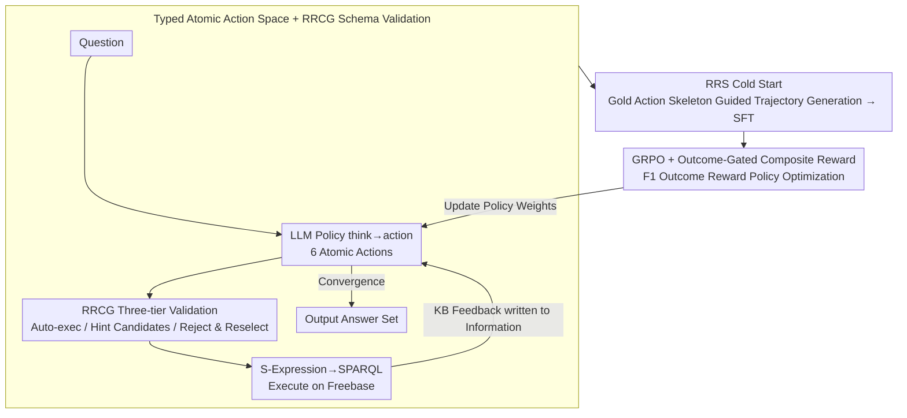

# KBQA-R1: Reinforcing Large Language Models for Knowledge Base Question Answering

**Conference**: ICML 2026  
**arXiv**: [2512.10999](https://arxiv.org/abs/2512.10999)  
**Code**: https://github.com/sunxin000/KBQA-R1 (Existing)  
**Area**: LLM Reasoning / Reinforcement Learning / Knowledge Base Question Answering  
**Keywords**: KBQA, Multi-turn RL, GRPO, Referenced Rejection Sampling, Action Space

## TL;DR
Redefines KBQA from a "one-shot logical expression generation" task to a "multi-turn decision process." It utilizes Referenced Rejection Sampling guided by gold-standard action sequences to generate executable reasoning trajectories for SFT cold start, followed by GRPO optimization based on F1 outcome rewards. This allows an 8B Llama to outperform both GPT-4 prompting methods and graph retrieval SOTA across three benchmarks: WebQSP, GrailQA, and GraphQ.

## Background & Motivation

**Background**: Knowledge Base Question Answering (KBQA) requires models to translate natural language questions into executable logical forms (SPARQL / S-Expression) against large-scale graphs like Freebase or Wikidata to return answer sets. Current LLM-based KBQA follows three main paths: (i) End-to-end one-shot generation of full logical forms (KB-BINDER / KB-Coder / ChatKBQA); (ii) Prompt-driven step-by-step graph exploration (ToG / RoG, relying on commercial APIs like GPT-4); (iii) Supervised or search-augmented agent approaches (KBQA-o1 using MCTS + synthetic trajectories).

**Limitations of Prior Work**: The authors summarize current failures as "dichotomous failure." One category (end-to-end, prompting) suffers from **schema hallucinations**—generating queries that "look executable" but cite non-existent or irrelevant relations. The other category (supervised agents) exhibits **templated repetition**—models mechanically mimic actions in synthetic trajectories without truly understanding KB feedback, while search augmentation introduces massive inference overhead.

**Key Challenge**: This is essentially a mismatch between "static supervision" and a "dynamic environment." Gold-standard values (gold S-Expressions) only tell the model "what the final result should look like," but fail to teach "how to decide when seeing a specific set of neighbors returned by the KB at each step." LLMs lack grounded experience with KB executors, leading them to "guess" what to write through text imitation, inevitably resulting in hallucinations or mechanization.

**Goal**: To enable an 8B-scale open-source LLM to learn "autonomous exploration on KB" without relying on external commercial APIs or large-scale retrieval pipelines, outperforming both LLM prompting methods and graph retrieval SOTA in zero-shot and compositional generalization scenarios.

**Key Insight**: Reformulate KBQA as a **multi-turn sequential decision problem**. The LLM acts as a policy $\pi_\theta$ operating within a compact, verified discrete action space, making decisions at each step based on real KB feedback. Consequently, the ground truth is no longer the "final query" but the "F1 of the final answer." The model can then infer "which action to select under each context" via reinforcement learning from outcome feedback.

**Core Idea**: Replace **imitation of static logical forms** with **RL on a typed KB action space**, and address the cold-start challenge before RL training using Referenced Rejection Sampling.

## Method

### Overall Architecture
KBQA-R1 replaces "one-shot legal form generation" with "step-by-step decision making on the KB." During inference, it acts as a ReAct-style multi-turn agent: the LLM first reasons within `<think>`, then issues an atomic action (`Find_relation`, `Merge`, `Order`, `Compare`, `Time_constraint`, `Count`) within `<action>`. The system translates these actions into S-Expression fragments, converts them to SPARQL for execution on Freebase, and writes retrieved entities or diagnostic info back into `<information>` for the next turn. This loop continues until the model provides an `<answer>`. Crucially, every `Find_relation` passes through schema validation to ensure proposed relations actually exist. Training comprises two steps: cold-starting with SFT using trajectories synthesized via Referenced Rejection Sampling, and policy optimization via GRPO based on F1 outcome rewards. The pipeline is implemented on Llama-3.1-8B-Instruct.

### Key Designs

**1. Typed Atomic Action Space + RRCG Schema Validation: Decomposing "Get Query Right at Once" into "Verifiable Decisions"**

A major weakness of end-to-end methods is that a single misspelled token makes the entire S-Expression unexecutable, and LLMs often hallucinate non-existent relations. KBQA-R1 decomposes complex queries into 6 atomic actions, each strictly defined by a `(arguments, target functional update, S-Expression template)` triplet (e.g., `Find_relation(entity, relation)` maps to `JOIN(relation, START(entity))`). Thus, the model only decides the next atomic operation rather than writing the whole query. Crucially, Relation Retrieval and Confidence Gating (RRCG) is inserted before each `Find_relation`: a dense retriever $Sim(\cdot,\cdot)$ scores the agent's proposed $r_{\text{agent}}$ against all neighbor relations $R(e_c)$ of the current entity $e_c$. Based on double thresholds $\tau_{\text{high}}, \tau_{\text{low}}$, results are categorized into three tiers: if $s_{\max} \geq \tau_{\text{high}}$, it auto-executes with the nearest neighbor $r_s^*$; if $\tau_{\text{low}} \leq s_{\max} < \tau_{\text{high}}$, it executes but provides top-k candidates in the observation noting uncertainty; if $s_{\max} < \tau_{\text{low}}$, it rejects the action and returns the neighbor relation list for reselection. This converts hallucination risk from "unstoppable during generation" to "recoverable feedback during execution," providing a stable environment for RL. Ablations show removing RRCG drops F1 by 18%, and removing multi-turn drops it by 25% (36.3% on GrailQA), proving these are foundational.

**2. Referenced Rejection Sampling (RRS) Cold Start: Aligning Reasoning with Executable Steps using Gold Skeletons**

Standard rejection sampling has an acceptance rate of only ~40% on KBQA, and passed trajectories are often "syntactically correct but semantically weak," failing to provide a good starting point for RL. RRS extends training samples to $(q, \mathcal{A}, S^*)$. It parses the gold S-Expression $S^*$ into an atomic action sequence $\mathbf{a}^* = (a_1^*, \ldots, a_k^*)$. During rollout, $a_t^*$ is explicitly injected into the prompt as a "reference action" at step $t$, forcing the model to generate a `<think>` explanation of why this step leads to the answer while observing real KB feedback. A trajectory is accepted only if $\text{F1}(\hat{\mathcal{A}}, \mathcal{A}) \geq \tau$ (correct result) and tag structures are compliant. Reference action hints are stripped before SFT to ensure the model does not rely on hidden signals during inference. By constraining generation to gold skeletons, the model cannot fabricate post-hoc explanations and must align reasoning with real steps. Table 7 shows RRS increases acceptance rates from ~40% to 67% on GrailQA/GraphQ, with SFT initialization F1 significantly higher than standard RS (e.g., 80.2 vs 73.8 on GrailQA), serving as a prerequisite for stable GRPO training.

**3. GRPO + Outcome-Gated Composite Reward: Pushing Policy from "Imitation" to "Exploration" via F1 Signals**

KBQA ground truths are inherently "whether the answer set is correct"—sparse but reliable, making them ideal for RL rewards. The composite reward is defined as $R = \lambda_{\text{outcome}} \cdot r_{\text{outcome}} + \lambda_{\text{format}} \cdot \mathbb{I}[r_{\text{outcome}} > 0] \cdot r_{\text{format}}$, where $r_{\text{outcome}}$ is the F1 between predicted $\hat{\mathcal{A}}$ and gold variants $\mathcal{A}$, and $r_{\text{format}}$ rewards tag integrity. A key design is that format rewards are only granted if the outcome is non-zero ($\mathbb{I}[r_{\text{outcome}} > 0]$), preventing the agent from learning "perfect format but wrong answer." Optimization uses GRPO: $n$ rollouts are sampled per prompt, using the group mean as a baseline for advantage calculation $\hat{A}_i = r_i - \frac{1}{n}\sum_{j=1}^n r_j$, eliminating the need for a separate value function. The objective is a clipped PPO form with KL regularization: $\max_\theta \mathbb{E}[\min(r_t \hat{A}_t, \text{clip}(r_t, 1-\epsilon, 1+\epsilon)\hat{A}_t)] - \beta D_{\text{KL}}[\pi_\theta \| \pi_{\text{ref}}]$. Outcome F1 as the primary reward plus KL anchoring allows freedom to explore action combinations while preventing the policy from drifting into unexecutable zones. Ablations show SFT alone (w/o GRPO) loses ~5-10% F1, while direct RL (w/o SFT warm-start) loses 8.6%, indicating SFT and GRPO are complementary.

### Loss & Training
Two-stage training. **Stage 1 (SFT)**: RRS-accepted trajectories are sliced into independent training samples by turn; context serves as input and model response as target, with loss calculated only on response tokens. **Stage 2 (GRPO)**: Conducts RL based on the SFT checkpoint. The backbone is Llama-3.1-8B-Instruct. During the RRS rollout phase, a stronger Qwen-2.5-72B-Instruct generates trajectories which are then distilled into the 8B model. Specific hyperparameters for reward weights, $\beta$, and $\epsilon$ are provided in Appendix B.3.

## Key Experimental Results

### Main Results

| Dataset | Metric | KBQA-R1 (Llama-3.1-8B) | Prev. SOTA | Gain |
|--------|------|------|----------|------|
| GrailQA Overall | F1 | **86.1** | 78.5 (KBQA-o1, Llama-3.1-8B) / 81.9 (TIARA, T5-large) | +7.6 |
| GrailQA Zero-shot | EM / F1 | **83.6 / 85.2** | 68.1 / 76.1 (KBQA-o1) | +15.5 / +9.1 |
| WebQSP | F1 | **83.4** | 78.2 (SubgraphRAG + GPT-4o) / 76.0 (MCTS-KBQA) | +5.2 / +7.4 |
| GraphQ | F1 | **53.8** | 48.7 (KBQA-o1) / 47.5 (CoTKR) | +5.1 |

Of particular note is the zero-shot dimension—where relations and compositions were unseen during training, EM increased by 15.5%, suggesting that RL learned strategic generalization rather than just distribution fitting.

### Ablation Study

| Configuration | WebQSP F1 | GraphQ F1 | GrailQA F1 | Description |
|------|-----------|-----------|------------|------|
| Full KBQA-R1 | 83.4 | 53.8 | 86.1 | Full Model |
| w/o RRCG | 64.1 | 37.7 | 67.1 | No schema validation, avg. −18% |
| w/o Multi-turn | 63.2 | 34.1 | 49.8 | One-shot generation, avg. −25% (GrailQA −36) |
| w/o RRS (Standard RS) | 78.9 | 49.2 | 78.3 | Lower cold-start data quality, avg. −5.6% |
| w/o SFT warm-start | 75.2 | 47.3 | 75.1 | Direct RL, avg. −8.6% |
| w/o GRPO (SFT only) | 72.1 | 47.8 | 80.2 | No RL optimization stage |
| w/o Format Reward | 81.1 | 51.6 | 84.2 | Format reward as stabilizer; minor impact |

### Key Findings
- **Multi-turn and RRCG are foundations**: Removing either results in a 18-25% F1 drop, indicating that the "executable environment" provided by structured action spaces and schema validation is the prerequisite for RL to learn, not just an engineering optimization.
- **RRS vs. Standard RS Data Efficiency**: On GrailQA, the acceptance rate improved from 39.3% to 67.0%, pre-SFT F1 rose from 54.2 to 70.2, and SFT initialization F1 rose from 73.8 to 80.2—showing that trajectory quality before RL training dictates the final ceiling.
- **Efficiency Gains**: Compared to GPT-4 prompting methods (ToG / PoG), KBQA-R1 using Llama-3.1-8B achieves higher accuracy with over 70% fewer LLM calls, verifying that internalizing reasoning into policy is more efficient than exhaustive search at test-time.
- **Frontier Agent Comparison**: Even with the same KBQA-R1 harness (action space + feedback format), frontier models like GLM-5 or Kimi-K2.5 achieve lower accuracy and consume more turns/tokens than the trained 8B policy—suggesting RL captures strategic knowledge that prompt engineering cannot replace.

## Highlights & Insights
- The **RRS paradigm of "Reference gold skeletons, strip, then train"** is clever: it converts the sparse success rate problem in KBQA into a dense supervision problem of "can the model reasonably explain a given skeleton," and stripping references prevents leakage during inference. This could generalize to any task where final answers are verifiable but intermediate reasoning is hard to supervise (e.g., code generation, formal proofs).
- The **outcome-gated design of format rewards** ($\mathbb{I}[r_{\text{outcome}} > 0]$) is a valuable detail: it prevents the model from regressing to "pretty but wrong" results, a common oversight when training LLM agents with RL.
- **Schema validation as a "soft-hard" layered system** (auto-validate / tentative / reject) is an elegant solution to the tension between LLM hallucinations and KG ground truths—rather than simple rejection, it feeds uncertainty back to the model for self-correction.
- The **"Aha!" moment** of the paper: In a task like KBQA, where RAG and LLM prompting were thought to have closed the gap, the authors prove an 8B model can outperform GPT-4o + retrieval when the correct training paradigm is used.

## Limitations & Future Work
- **Dependency on linked topic entities**: Like ToG/RoG, it assumes entities in questions are pre-linked to the KB, excluding entity linking errors from evaluation; this is a bottleneck in real deployment.
- **Validation only on Freebase**: All benchmarks use Freebase. Whether the action space and RRCG are scalable to KBs with more complex schemas and larger relation counts like Wikidata remains unproven.
- **Freebase-specific action space design**: The 6 actions follow KBQA-o1, targeting S-Expression operations (JOIN / AND / etc.). Migrating to Cypher, SQL, or higher-order reasoning requires redesign.
- **RRS still requires gold S-Expressions**: Cold-start data synthesis depends heavily on gold logical forms in the training set; for weak supervision datasets (answers only), additional steps are needed.
- **Future Directions**: Modularize the action space and RRCG into KB-agnostic interfaces; extend to scenarios without gold queries using self-play or outcome-only weak supervision; explore RRS applications in training process rewards/verifiers.

## Related Work & Insights
- **vs KBQA-o1 (Luo et al., 2025c)**: Also uses Llama-3.1-8B and atomic actions, but KBQA-o1 uses MCTS + incremental finetuning. Ours uses GRPO to internalize search into policy weights, achieving higher accuracy without test-time search (WebQSP F1 83.4 vs 57.8, +25.6 absolute).
- **vs ToG / RoG / PoG**: These rely on GPT-4 for multi-turn prompt-driven graph exploration. Ours uses RL to teach an 8B model the same capability with 70%+ fewer LLM calls.
- **vs SubgraphRAG / GNN-RAG**: GraphRAG routes rely on offline subgraph construction or retrieval pipelines to reduce hallucinations, but the retrieval strategy itself is not end-to-end optimized. Ours learns "how to explore the KB" as part of the policy.
- **vs Standard Rejection Sampling**: Changing "accepting high-score trajectories" to "reasoning based on gold skeletons" is a fundamental improvement for structured tasks, proving more effective than adjusting temperature or sampling budgets.

## Rating
- Novelty: ⭐⭐⭐⭐ — RRS's "Reference action skeleton + strip and retrain" is a genuinely new contribution. RL on action space has predecessors like KBQA-o1, but this is the first to achieve pure RL rather than SFT+search.
- Experimental Thoroughness: ⭐⭐⭐⭐⭐ — Three benchmarks, seven baselines, seven groups of ablations, frontier agent comparisons, and efficiency analysis; every ablation confirms the necessity of specific designs.
- Writing Quality: ⭐⭐⭐⭐ — Uses "dichotomous failure" as a compelling narrative line. Methods are cross-described with Algorithms, tables, and formulas, though some details (thresholds, weights) are delegated to the appendix.
- Value: ⭐⭐⭐⭐⭐ — Provides hard evidence that "Small model + RL internalized reasoning > Large model + test-time search," and contributes the transferable RRS technique to the community.

<!-- RELATED:START -->

## Related Papers

- [\[ACL 2025\] Ontology-Guided Reverse Thinking Makes Large Language Models Stronger on Knowledge Graph Question Answering](../../ACL2025/graph_learning/ontology-guided_reverse_thinking_makes_large_language_models_stronger_on_knowled.md)
- [\[ACL 2025\] FiDeLiS: Faithful Reasoning in Large Language Model for Knowledge Graph Question Answering](../../ACL2025/graph_learning/fidelis_faithful_reasoning_in_large_language_model_for_knowledge_graph_question_.md)
- [\[ACL 2025\] The Role of Exploration Modules in Small Language Models for Knowledge Graph Question Answering](../../ACL2025/graph_learning/the_role_of_exploration_modules_in_small_language_models_for_knowledge_graph_que.md)
- [\[ACL 2025\] Can Knowledge Graphs Make Large Language Models More Trustworthy? An Empirical Study Over Open-ended Question Answering](../../ACL2025/graph_learning/kg_llm_trustworthy_qa.md)
- [\[ICML 2026\] Beyond Model Base Retrieval: Weaving Knowledge to Master Fine-grained Neural Network Design](beyond_model_base_retrieval_weaving_knowledge_to_master_fine-grained_neural_netw.md)

<!-- RELATED:END -->
