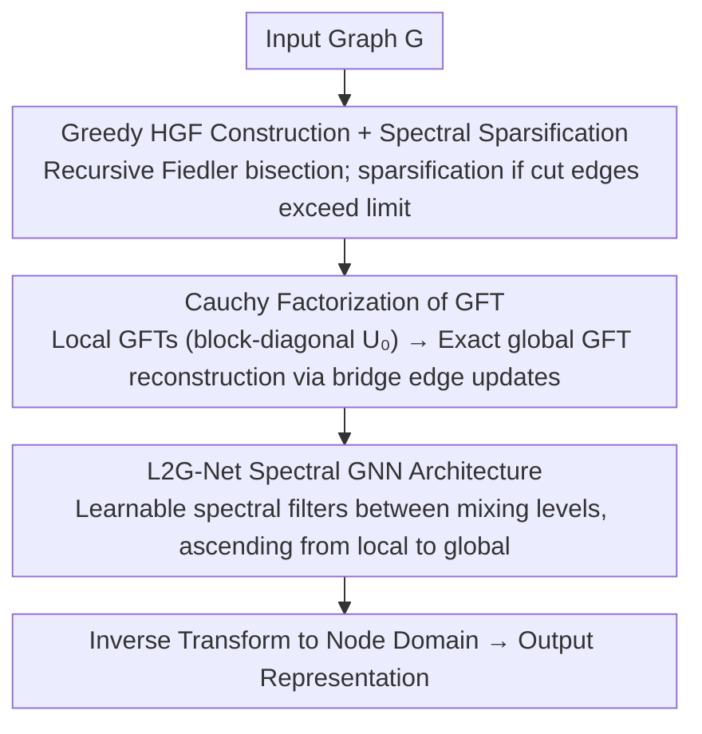

# L2G-Net: Local to Global Spectral Graph Neural Networks via Cauchy Factorizations

**Conference**: ICML 2026  
**arXiv**: [2602.18837](https://arxiv.org/abs/2602.18837)  
**Code**: To be confirmed  
**Area**: Graph Learning / Spectral Graph Neural Networks  
**Keywords**: Spectral GNNs, Graph Fourier Transform, Cauchy Factorization, Hierarchical Partitioning, Long-range Dependencies

## TL;DR
The authors **precisely decompose** the basis of the Graph Fourier Transform (GFT) into "local GFTs for each subgraph $\times$ a sequence of Cauchy matrices," reducing the $O(n^3)$ eigendecomposition complexity to $O(kn^2)$ (where $k$ is the number of cut edges between subgraphs). By interleaving learnable spectral filters within this factorization, they develop a family of local-to-global spectral GNNs capable of running on large graphs with 569k nodes, achieving performance comparable to Transformers with several orders of magnitude fewer parameters.

## Background & Motivation

**Background**: Spectral GNNs process graphs by projecting signals onto the Laplacian eigenbasis (i.e., GFT), which theoretically captures global frequency structures precisely. However, true GFT-based GNNs are rarely used in practice. The mainstream approaches are polynomial Laplacian filters like ChebNet and Message Passing Neural Networks (MPNNs), which replace eigendecomposition with sparse Laplacian multiplications.

**Limitations of Prior Work**: Pure GFT methods face two critical issues: eigendecomposition requires $O(n^3)$ complexity, making it infeasible for tens of thousands of nodes; and operations in the GFT domain are **global**, meaning changing a single spectral coefficient affects all nodes, thus lacking local inductive bias in the vertex domain. While polynomial/MPNN routes are computationally cheap and possess $k$-hop locality, they can only approximate long-range dependencies through multiple steps, leading to oversquashing and optimization instability. Graph Transformers use attention for global aggregation but suffer from massive parameter counts and lose graph-structural interpretability.

**Key Challenge**: There is an "either-or" trade-off between **global spectral expressivity** and **local computation/inductive bias** in existing architectures—achieving global expressivity requires $O(n^3)$ and loses locality, while local computation necessitates sacrificing the precision of the spectral representation.

**Goal**: To discover a spectral processing framework that **maintains precise GFT, enables local computation, and naturally incorporates local bias**, while being stackable as GNN layers.

**Key Insight**: The authors start from a mathematical observation: adding an edge to a graph is equivalent to a rank-one update of the Laplacian. An **exact closed-form relationship in the form of Cauchy matrices** exists between the eigenbases before and after a rank-one update (Fasino 2023). By hierarchically partitioning a graph into subgraphs and "adding back" the bridge edges one by one, the global GFT can be expressed as an exact product of "local subgraph GFTs $\times$ a sequence of Cauchy factors."

**Core Idea**: Use **Cauchy factorization** to rewrite the GFT as a chain structure of "partitioned GFT + local mixing," interleaving learnable spectral filters between each level of mixing to form a local-to-global spectral GNN.

## Method

### Overall Architecture
L2G-Net aims for a spectral processing framework that performs precise GFT without the $O(n^3)$ cost, while possessing inherent local inductive bias. It hierarchically partitions the graph into subgraphs, computes inexpensive local GFTs for each, and then "adds back" cross-subgraph bridge edges—each edge addition corresponds to one Cauchy factor multiplication. This chain exactly reconstructs the global GFT. Learnable spectral filters are inserted between mixing stages, making the chain both a computational shortcut and a family of stackable spectral GNN layers. The entire process never explicitly constructs the full GFT matrix $U$.

### Key Designs

**1. Cauchy Factorization of GFT: Rewriting $O(n^3)$ Global Transform as a Local Update Chain**

Pure GFT is unusable because obtaining the eigenbasis $U$ requires $O(n^3)$ decomposition. The breakthrough comes from a numerical linear algebra fact (Proposition 2.1): adding an edge $(i,j)$ is a rank-one update $\tilde L = L + w_{ij}(e_i-e_j)(e_i-e_j)^\top$. The bases satisfy $\tilde U^\top = D(\tilde\lambda, \lambda) U^\top$, where the Cauchy factor $D$ is constructed from new eigenvalues $\tilde\lambda$ obtained by solving the secular equation (i.e., Orthogonal Cauchy-like Matrices, OCLM). Theorem 3.1 extends this to hierarchical partitioning: the GFT basis of any graph $G \in \mathcal{F}(L, \{G_i\}, k)$ can be written exactly as:

$$U^\top = D(\lambda, \tilde\lambda_{K-1}) \cdots D(\tilde\lambda_1, \tilde\lambda_0) U_0^\top,$$

where $U_0$ is a block-diagonal matrix of local GFTs, and $K = k(2L-1)$ bridge edges are added back. Crucially, these Cauchy factors are themselves block-diagonal—each edge addition only affects spectral components of the two subgraphs it connects. Thus, the chain is computed in $O(kn^2)$ (Theorem 3.2) instead of $O(n^3)$. The authors generalize prior results to handle multiple eigenvalues and degenerate updates using deflation (Definition 3.1).

**2. Greedy HGF Construction + Spectral Sparsification: Shortening the Chain for Arbitrary Graphs**

The complexity in Theorem 3.2 is dominated by the number of cut edges $k$. To maximize efficiency, the authors use Fiedler-vector-based spectral bisection but only accept a partition if $n^2 k + \max_i f(G_i) < f(G)$, where $f$ is the theoretical cost of decomposition. For graphs where small cuts are impossible, they provide a worst-case fallback: applying Spielman-Srivastava spectral sparsification (Theorem 4.1) to the bridge subgraphs. This reduces the number of cut edges to $O(\varepsilon^{-2})$ while maintaining $(1-\varepsilon) x^\top L x \le x^\top L' x \le (1+\varepsilon) x^\top L x$. Since spectral filters are Lipschitz, the output bias is only $O(\varepsilon)$, making the Cauchy framework applicable to any graph with controllable error.

**3. L2G-Net Spectral GNN Architecture: Interleaving Learnable Filters for Local-Global Interpolation**

With the precise decomposition, learnable spectral filters are embedded into each mixing stage. For channel $c$, the $m$-th layer of a standard spectral GNN performs $X_{m+1,c} = U g_{\theta,c}(\lambda) U^\top Z_{m,c}$. L2G-Net replaces the forward transform $U^\top$ with the recursion:

$$H_p^{(r)} = g_{r,p}(\lambda_{r,p})\, D_{r,p}\, [H_{p_l}^{(r-1)}; H_{p_r}^{(r-1)}]^\top,$$

meaning each level first mixes current spectral representations via $D_{r,p}$, then applies a filter $g_{r,p}$ specialized to that subgraph's eigenvalues, ascending until the root level where a global filter $g_\theta(\lambda)$ is applied. The structure is fixed by the graph $G$, while parameters reside in the filters $g_{r,p}$. This is strictly more expressive than standard $g(L)$ filters (Theorem 5.1) because it allows different responses in different subgraphs. This "local-to-global interpolation" encodes structural inductive bias directly into the computation graph, eliminating the need for position encodings and significantly reducing parameters compared to Graph Transformers.

### Loss & Training
Standard losses are used (cross-entropy/AUC for classification, MAE for regression). Filters are parameterized using splines; in heterophilic graph experiments, filters are shared across channels and layers to maximize efficiency. Preprocessing (HGF partitioning and Cauchy factor calculation) is performed once and cached.

## Key Experimental Results

### Main Results

**Node Classification on Heterophilic Graphs** (Platonov 2023 benchmark):

| Dataset | Metric | Ours (L2G-Net) | Polynormer (Prev. SOTA, attention) | St-ChebNet (Prev. SOTA, Spectral) | Global GFT |
|--------|------|---------|---------|---------|---------|
| Roman-empire | Acc | 92.12 (1.1) | **92.55** (0.3) | 92.03 (0.9) | — |
| Amazon-ratings | Acc | 53.39 (0.6) | **54.81** (0.5) | 53.15 (0.2) | — |
| Minesweeper | AUC | **97.50** (0.3) | 97.46 (0.4) | 95.71 (2.3) | — |
| Tolokers | AUC | 85.57 (0.6) | **85.91** (0.7) | 85.55 (3.4) | — |

**Long-range Large-scale Graphs** (Liang 2025 City-Networks, $>10^5$ nodes, time in minutes):

| Dataset | ED (Measured) | ED Extrapolated (cubic) | CF (Ours) | Speedup |
|--------|----------|----------|-----------|--------|
| Paris | OOM | 50,412 min | **17.91 min** | ~3000× |
| Shanghai | OOM | 121,932 min | **45.61 min** | ~2700× |
| LA | OOM | 131,544 min | **61.53 min** | ~2100× |
| London (569k) | OOM | 1,632,123 min | **144.22 min** | ~11000× |

### Ablation Study

**VRAM Consumption (GB, 64-bit)**:

| Config | Mines. | Tolok. | Am.Rat. | R.Emp. | Paris | London |
|------|--------|--------|---------|--------|-------|--------|
| Full GFT | 0.80 | 1.11 | 4.80 | 4.11 | 103.97 | **2588.22** |
| CF (Ours) | 0.20 | 0.28 | 1.21 | 1.03 | 12.21 | **40.96** |
| Reduction | 4× | 4× | 4× | 4× | 8.5× | **63×** |

**Factorization vs. Eigendecomposition** (Platonov 2023, seconds): CF takes 232 s vs. ED 731 s on R.Emp. Even on Tolokers (dense graph with many cut edges after sparsification), CF maintains an edge (91 s vs. 118 s).

**LRGB Long-range Benchmark** (peptides-func AP↑ / peptides-struct MAE↓): L2G-Net achieves 72.14 / 0.2479, comparable to or exceeding GRIT (69.88 / 0.2460) and MP-SSM (69.93 / 0.2458).

### Key Findings
- **Theoretical complexity is empirically validated**: On synthetic BA graphs with fixed $k=5$, CF follows $O(n^2)$ strictly. On fixed $n=8000$, CF grows linearly with $k$. Preprocessing is nearly independent of $k$, confirming the efficiency of the "sparsify then decompose" strategy.
- **Parameter efficiency is the killer feature**: L2G-Net matches the accuracy of Polynormer with orders of magnitude fewer parameters and consistently outperforms Global GFT, proving that local bias is a valuable inductive bias rather than a precision compromise.
- **Interpretability via Grad-CAM**: Node attribution shows L2G-Net concentrates predictive importance on fewer nodes, whereas Global GFT disperses it globally, and Polynormer is the most diffuse. This aligns with L2G-Net's encoded geometric structure.
- **Boundary Scenarios**: For extremely dense graphs like Tolokers, the CF advantage is minimal, suggesting the method thrives on graphs with hierarchical modularity.

## Highlights & Insights
- **Applying numerical linear algebra to GNNs**: Extending the mathematical fact "adding an edge = rank-one update = Cauchy rotation" to hierarchical partitions and learnable layers is a novel and elegant architectural approach.
- **Graph-determined architecture**: That the architecture adapts to the graph structure while parameters remain minimal and shared is ideal for multi-graph settings.
- **Redefining spectral sparsification**: Sparsification here serves as a bounded-error tool for truncating the Cauchy update chain, a perspective transferable to any rank-one based operator approximation.
- **Enabling large-scale spectral methods**: Successfully bringing precise spectral processing to 569k nodes makes spectral GNNs competitive with Transformers in large-graph regimes.

## Limitations & Future Work
- The performance gain is **strongly dependent on hierarchical/modular structures** with small cuts; dense or random graphs rely on sparsification-induced $O(\varepsilon)$ errors.
- A small performance gap remains compared to attention-based Polynormer on certain heterophilic tasks, suggesting pure spectral bias may be less flexible than learned attention; future work could integrate attention as an auxiliary channel.
- GPU kernels for Cauchy factors and parallel scheduling (Theorem 3.2 provides parallel complexity bounds $T_m = O(kn^2 + \max_i f_i(n))$) are not yet fully optimized, leaving room for further engineering acceleration.
- The architecture is static relative to the graph structure; incremental updates for dynamic graphs by adding Cauchy factors for new edges are a natural extension.

## Related Work & Insights
- **vs. ChebNet/Polynomial Filters**: ChebNet provides a $k$-hop hard truncation; L2G-Net restores global GFT precisely above the local level, avoiding oversquashing without needing excessive depth.
- **vs. Global GFT**: Global GFT is a special case ($L=0$). L2G-Net is strictly more expressive and performs better, validating that locality is a feature, not a bug.
- **vs. Graph Transformers**: L2G-Net encodes inductive bias into the computation graph directly, requiring fewer parameters and providing better interpretability via structure.
- **vs. Fernández-Menduiña 2025a**: While the prior work derived Cauchy identities for **path graphs**, this work generalizes it to **any symmetric matrix and hierarchical partition** for GNNs.
- **vs. MP-SSM**: While both address long-range issues, MP-SSM is an implicit continuous-time system, whereas L2G-Net provides an **explicit, precise decomposition**.

## Rating
- Novelty: ⭐⭐⭐⭐⭐ Adapting rank-one updates and Cauchy matrices into stackable GNN layers is highly original for spectral GNNs.
- Experimental Thoroughness: ⭐⭐⭐⭐ Broad coverage of synthetic, heterophilic, large-scale, and long-range tasks, though GPU-specific scaling analyses could be deeper.
- Writing Quality: ⭐⭐⭐⭐ Clear mathematical exposition and structured theorems, though Definition 3.1 requires referring to the appendix for deflation details.
- Value: ⭐⭐⭐⭐⭐ Decouples spectral GNNs from $O(n^3)$ complexity, providing a definitive positive answer to whether precise spectral methods remain relevant.

<!-- RELATED:START -->

## Related Papers

- [\[AAAI 2026\] Sheaf Graph Neural Networks via PAC-Bayes Spectral Optimization](../../AAAI2026/graph_learning/sheaf_graph_neural_networks_via_pac-bayes_spectral_optimization.md)
- [\[ICLR 2026\] Global and Local Topology-Aware Graph Generation via Dual Conditioning Diffusion](../../ICLR2026/graph_learning/global_and_local_topology-aware_graph_generation_via_dual_conditioning_diffusion.md)
- [\[ICML 2026\] Polynomial Neural Sheaf Diffusion: A Spectral Filtering Approach on Cellular Sheaves](polynomial_neural_sheaf_diffusion_a_spectral_filtering_approach_on_cellular_shea.md)
- [\[ICML 2026\] Quantile-Free Uncertainty Quantification in Graph Neural Networks](quantile-free_uncertainty_quantification_in_graph_neural_networks.md)
- [\[ICML 2026\] Understanding Truncated Positional Encodings for Graph Neural Networks](understanding_truncated_positional_encodings_for_graph_neural_networks.md)

<!-- RELATED:END -->
