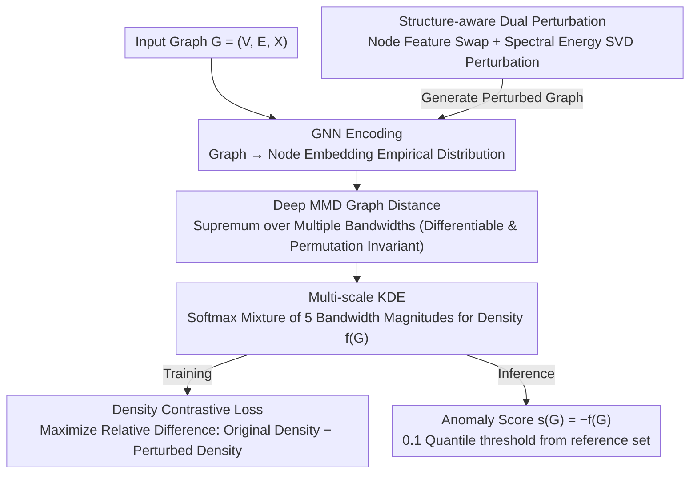

# Learnable Kernel Density Estimation for Graphs and Its Application to Graph-Level Anomaly Detection

**Conference**: ICML 2026  
**arXiv**: [2505.21285](https://arxiv.org/abs/2505.21285)  
**Code**: To be confirmed  
**Area**: Graph Learning / Graph Anomaly Detection  
**Keywords**: Graph Density Estimation, Kernel Density Estimation, Deep MMD, Spectral Perturbation, Graph-Level Anomaly Detection  

## TL;DR
LGKDE embeds each graph as a "node distribution" using a learnable deep MMD metric, overlays a multi-scale kernel density estimation (KDE) on this metric space, and trains end-to-end via a self-supervised contrastive signal where "normal graph density is higher than its structure-aware perturbed version." This provides the first unified framework for graph-level density estimation with theoretical guarantees—including consistency, convergence rates, robustness, and generalization bounds—while consistently outperforming strong GNN, contrastive, and one-class baselines across over ten graph anomaly detection benchmarks.

## Background & Motivation

**Background**: Mainstream graph-level anomaly detection follows two primary paths. The first is "Graph Kernel + KDE," which maps graphs into similarity matrices using WL subtree, shortest path, or propagation kernels, followed by classic KDE. The second is "Deep Representation + Distance/One-class Boundary," which learns embeddings via Graph Neural Networks (GNNs) and applies proxy targets like SVDD (OCGIN), contrastive learning (CVTGAD), information bottleneck (SIGNET), or reconstruction (VAE) for anomaly scoring.

**Limitations of Prior Work**: The first path relies on handcrafted features and fixed bandwidths, making it difficult to capture both local substructures and global topology simultaneously. The second path replaces "density modeling" with "shape priors"—either assuming normal regions are hyperspheres or skipping explicit density entirely. This leads to a lack of theoretical guarantees, sensitivity to graph size heterogeneity, and misclassification of semantically different but geometrically similar graphs as normal.

**Key Challenge**: Graphs are non-Euclidean, discrete, and permutation-invariant structured data. "Density" must be sensitive to both structure and semantics while maintaining isomorphism invariance, differentiability, and the ability to be trained end-to-end. Classical kernel methods are provable but inflexible, while deep methods are flexible but lose provability; these two paths have remained largely disconnected.

**Goal**: Construct an end-to-end trainable graph density estimator $\hat f(G)$ that: (i) encodes both structure and node features under permutation invariance; (ii) supports multi-scale adaptive bandwidths; (iii) possesses consistency, convergence rates, robustness, and generalization bounds; (iv) naturally adapts to graph-level anomaly detection where the anomaly score is $s(G)=-\hat f(G)$.

**Key Insight**: The authors observe that directly maximizing the density of all training graphs leads to model collapse into a single embedding. However, by constructing a "structure-aware perturbed version" for each normal graph and using the relative difference ("original density > perturbed density") as the optimization target, one can avoid collapse while explicitly injecting geometric information about what constitutes a "deviation from normal" into the KDE bandwidth and MMD metric.

**Core Idea**: Use deep MMD to represent graphs as points in a metric space, learn a multi-scale KDE mixture density over this space, and perform joint end-to-end optimization of embeddings, bandwidths, and mixture weights via a "density contrastive loss + spectral-feature dual perturbation." This represents the first systematic attempt to integrate provable KDE directly into GNNs.

## Method

### Overall Architecture
LGKDE addresses the problem of "how to calculate a density value for a graph with theoretical guarantees." The challenge lies in the non-Euclidean and permutation-invariant nature of graphs. The approach first encodes each graph $G_i=(V_i,E_i,\mathbf{X}_i)$ into a set of node embeddings $\mathbf{Z}_i\in\mathbb{R}^{n_i\times d_{out}}$ via a GNN, treating the graph as an empirical distribution of $n_i$ points. It then uses deep MMD to measure distances between graphs and stacks a multi-scale Gaussian KDE on these distances to obtain the density $\hat f(G)$. The model optimizes GNN parameters $\bm\theta$ and mixture weights $\bm\alpha$ based on the relative difference in density. During inference, the anomaly score is $s(G)=-\hat f(G)$, using the 0.1 quantile of the reference set density as the threshold.

### Key Designs

**1. Deep MMD Graph Distance: A Differentiable, Permutation-Invariant Metric**

KDE requires a distance between graphs as input. Traditional graph kernels are either fixed or computationally expensive and cannot backpropagate. LGKDE represents graph $G_i$ as an empirical distribution of node embeddings $\{\mathbf{z}_p^{(i)}\}_{p=1}^{n_i}$ and defines distance as the Maximum Mean Discrepancy (MMD) over a Gaussian kernel family $\Gamma_{emb}=\{\gamma_1,\dots,\gamma_S\}$:

$$d_{MMD}(G_i,G_j)=\sup_{\gamma}\left(\frac{1}{n_i^2}\sum k_\gamma(\mathbf{z}_p^{(i)},\mathbf{z}_q^{(i)})+\frac{1}{n_j^2}\sum k_\gamma(\mathbf{z}_p^{(j)},\mathbf{z}_q^{(j)})-\frac{2}{n_i n_j}\sum k_\gamma(\mathbf{z}_p^{(i)},\mathbf{z}_q^{(j)})\right)^{1/2}$$

where $k_\gamma(\mathbf{u},\mathbf{v})=\exp(-\gamma\|\mathbf{u}-\mathbf{v}\|^2)$. This form naturally averages over node counts $n_i, n_j$, is invariant to node permutations, and is differentiable. Taking the $\sup$ over multiple bandwidths allows the distance to automatically capture multi-scale structural differences for the downstream KDE.

**2. Multi-scale KDE: Data-Driven Bandwidth Selection**

Graph collections (e.g., molecules vs. social networks) vary greatly in scale. Single-bandwidth KDE is often over-smoothed or over-fitted. LGKDE stacks a set of bandwidths $\{h_k\}_{k=1}^{M}=\{10^{-2},10^{-1},1,10,10^{2}\}$ across five orders of magnitude, fused via softmax weights:

$$\hat f(G)=\sum_{k=1}^{M}\pi_k(\bm\alpha)\,\phi_k(G),\quad \pi_k(\bm\alpha)=\mathrm{softmax}(\alpha_k),\quad \phi_k(G)=\frac{1}{N}\sum_i K_{KDE}(d_{MMD}(G,G_i),h_k)$$

where the kernel is $K_{KDE}(d,h)=\frac{1}{C_{d_{int}}h^{d_{int}}}\exp(-\tfrac{d^2}{2h^2})$. A key observation is that MMD projects the graph into a 1D distance, making the intrinsic dimension $d_{int}=1$ (constant $C_{d_{int}}=\sqrt{2\pi}$). Thus, the KDE convergence rate is not hindered by the "curse of dimensionality" of graph embeddings—establishing the foundation for the $O(N^{-0.8})$ MISE bound. Softmax mixing allows the data to determine the dominant bandwidth and avoids discrete bandwidth selection.

**3. Structure-aware Dual Perturbation: Consistent Negative Sampling**

Maximizing density for all training graphs causes collapse. Whereas standard contrastive augmentations (random edge addition/deletion) might destroy core topology, LGKDE creates perturbed versions $\tilde G^{(j)}$ by deviating from both nodes and structure. For nodes: randomly swap $r_{swap}|V|$ features. For structure: perform SVD on the adjacency matrix $\mathbf{A}=\mathbf{U}\bm\Sigma\mathbf{V}^\top$, categorize singular values into high $\mathcal{S}_h$, medium $\mathcal{S}_m$, and low $\mathcal{S}_l$ based on energy thresholds, and scale them to simulate removing backbone edges or adding noise. Theorem 4.4 provides a closed-form upper bound for $\|\Delta_{\mathbf{A}}\|_2$, ensuring $\tilde G$ is "slightly" lower in density rather than "completely different," which, combined with the Lipschitz property in Theorem 4.3, bounds the false alarm rate.

### Loss & Training
The final objective is $\min_{\bm\theta,\bm\alpha}\mathcal{L}=-\sum_{i=1}^{N}\sum_{j=1}^{N_{pert}}\frac{\hat f(G_i)-\hat f(\tilde G_i^{(j)})}{\hat f(G_i)}$. Normalization by the denominator balances contributions across different density scales. Theoretically: Theorem 4.1 establishes consistency $\hat f\xrightarrow{p}f^\ast$ in $L_1$ norm; Theorem 4.2 shows that with optimal bandwidth $h^\ast\sim N^{-1/(4+d_{int})}$, MISE reaches $O(N^{-4/(4+d_{int})})=O(N^{-0.8})$, matching the non-parametric minimax optimal rate. Complexity is $O(L(md+nd^2)+NSn^2 d)$, which can be reduced to $O(L(md+nd^2)+QSn^2 d)$ using the neighbor trick from Appendix E.4.3, where $Q\ll N$.

## Key Experimental Results

### Main Results
Performance was evaluated on 12 public graph anomaly detection benchmarks (MUTAG, PROTEINS, DD, ENZYMES, etc.) against graph kernels, one-class GNNs, contrastive/reconstruction methods, and information bottleneck models (PK-SVM, WL-SVM, OCGIN, OCGTL, GLocalKD, CVTGAD, SIGNET).

| Dataset / Metric | Ours (LGKDE) | Prev. SOTA Representative | Remarks |
|--------|------|----------|------|
| Average AUROC (12 datasets) | Significantly highest | OCGIN / GLocalKD etc. | LGKDE ranks 1st on average, Top-3 on most. |
| MUTAG AUROC | Major lead | WL-iF 65.71 | PK-SVM at 46.06 indicates manual kernel failure. |
| DD AUROC | Surpasses SOTA | OCGIN 79.08 | Validates multi-scale KDE on large graphs. |
| Synthetic ER Density | Recovered peak | Traditional kernels fail | Directly verifies density estimation accuracy. |

### Ablation Study

| Configuration | Key Metric Change | Explanation |
|------|---------|------|
| Full LGKDE | Baseline AUROC | MMD + Multi-scale KDE + Dual Perturbation. |
| w/o Spectral Perturbation | Significant Drop | Structural perturbation is necessary for boundary definition. |
| w/o Node Feature Perturbation | Moderate Drop | Node semantic deviation is also critical. |
| Single Bandwidth KDE (M=1) | Drop (esp. on large graphs) | Multi-scale adaptation is key. |
| Replacing MMD with WL/PK | Large Drop | Deep MMD is the source of expressive power. |

### Key Findings
- Dual perturbation is indispensable: swapping node features alone ignores topology, while spectral perturbation alone may ignore semantics. They complement each other to cover both types of anomalies.
- Bandwidth weights $\bm{\alpha}$ vary significantly across datasets—molecular data favors small bandwidths (structure-sensitive), while social networks favor larger bandwidths (coarse patterns).
- Spectral perturbation provides higher quality contrastive samples than random edge deletion (Appendix B.5), aligning with the analytically controlled $\|\Delta_{\mathbf{A}}\|_2$ in Theorem 4.4.

## Highlights & Insights
- The "original density > perturbed density" self-supervised target simultaneously avoids representation collapse, avoids hard negative sampling assumptions, and injects provability into training. It treats Out-of-Distribution (OOD) detection as density estimation rather than binary classification.
- Spectral perturbation is a rare design that bridges "graph operation controllability" with "theoretical Lipschitz bounds." Using SVD energy ratios as knobs for perturbation magnitude maps directly to the inequalities in the proofs.
- The observation that MMD reduces the problem to $d_{int}=1$ is crucial—it allows the KDE convergence rate to escape the curse of dimensionality, a technique transferable to other non-Euclidean density estimation problems.
- Multi-scale softmax mixture is more elegant than manual bandwidth selection and provides an interpretable tool for analyzing the "structural scale" of a dataset.

## Limitations & Future Work
- Calculating the MMD matrix for every batch is computationally heavy for extremely large graph sets (millions of graphs); online or bucketed anchor selection could be explored.
- The model currently considers undirected graphs with continuous node features; extensions to heterogeneous, dynamic, or hypergraphs would require redefining spectral perturbation semantics.
- Perturbation parameters ($r_{max}$, $\tau_1, \tau_2$) require manual tuning, though sensitivity analysis is provided; an adaptive version (e.g., based on spectral entropy) is worth investigating.

## Related Work & Insights
- **vs OCGIN / OCGTL (One-class GNN)**: They assume normal regions are hyperspheres; LGKDE characterizes arbitrary density contours, providing weaker geometric priors and stronger expressiveness.
- **vs GLocalKD / CVTGAD (Distillation/Contrastive)**: They use global-local distillation or cross-view contrast as proxy tasks; LGKDE explicitly estimates density, offering more direct interpretability and provability.
- **vs Classical Graph Kernels + KDE**: By replacing "fixed kernels + fixed bandwidth" with "learned MMD + learned multi-scale mixture," LGKDE retains the statistical framework while removing the bottleneck of handcrafted features.

## Rating
- Novelty: ⭐⭐⭐⭐⭐ First end-to-end framework to embed provable KDE into GNNs; unique spectral perturbation + density contrastive combo.
- Experimental Thoroughness: ⭐⭐⭐⭐ 12 real-world datasets + synthetic graphs + 6 theorems; lacks experiments on ultra-large-scale graph sets.
- Writing Quality: ⭐⭐⭐⭐ Clear loop from motivation to theory and experiment; high density of information in the main text.
- Value: ⭐⭐⭐⭐⭐ Provides a new provable + trainable baseline for graph anomaly/OOD detection; components are independently transferable.

<!-- RELATED:START -->

## Related Papers

- [\[ICML 2026\] ProMoS: Generalist Graph Anomaly Detection via Prototype-Based Distillation](generalist_graph_anomaly_detection_via_prototype-based_distillation.md)
- [\[ICML 2026\] Rethinking Feature Alignment in Generalist Graph Anomaly Detection: A Relational Fingerprint-based Approach](rethinking_feature_alignment_in_generalist_graph_anomaly_detection_a_relational_.md)
- [\[ICLR 2026\] Topological Anomaly Quantification for Semi-Supervised Graph Anomaly Detection](../../ICLR2026/graph_learning/topological_anomaly_quantification_for_semi-supervised_graph_anomaly_detection.md)
- [\[ICLR 2026\] DR-GGAD: Dual Residual Centering for Mitigating Anomaly Non‑Discriminativity in Generalist Graph Anomaly Detection](../../ICLR2026/graph_learning/dr-ggad_dual_residual_centering_for_mitigating_anomaly_nondiscriminativity_in_ge.md)
- [\[ICML 2026\] MedCoG: Maximizing LLM Inference Density in Medical Reasoning via Meta-Cognitive Regulation](medcog_maximizing_llm_inference_density_in_medical_reasoning_via_meta-cognitive_.md)

<!-- RELATED:END -->
