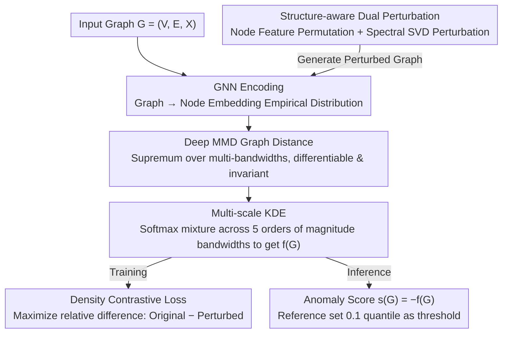

# Learnable Kernel Density Estimation for Graphs and Its Application to Graph-Level Anomaly Detection

**Conference**: ICML 2026  
**arXiv**: [2505.21285](https://arxiv.org/abs/2505.21285)  
**Code**: To be confirmed  
**Area**: Graph Learning / Graph Anomaly Detection  
**Keywords**: Graph Density Estimation, Kernel Density Estimation, Deep MMD, Spectral Perturbation, Graph-Level Anomaly Detection  

## TL;DR
LGKDE embeds each graph as a "node distribution" using a learnable deep MMD metric, overlays multi-scale Kernel Density Estimation (KDE) on this metric space, and trains end-to-end via a self-supervised contrastive signal where "original graph density is higher than its structure-aware perturbed version." This provides the first unified framework for graph-level density estimation with theoretical guarantees (consistency, convergence rate, robustness, generalization bounds) while consistently outperforming GNN, contrastive, and one-class baselines on over ten benchmarks.

## Background & Motivation

**Background**: Mainstream graph-level anomaly detection follows two paths. First, "Graph Kernels + KDE"—mapping graphs to similarity matrices via WL subtree, shortest path, or propagation kernels, followed by classic KDE. Second, "Deep Representation + Distance/One-class Boundary"—learning embeddings via GNNs and applying proxy objectives like SVDD (OCGIN), contrastive learning (CVTGAD), information bottleneck (SIGNET), or reconstruction (VAE).

**Limitations of Prior Work**: The first path uses handcrafted kernels with fixed bandwidths, struggling to capture both local substructures and global topology simultaneously. The second path replaces "density modeling" with "shape priors"—either assuming normal regions are hyperspheres or skipping explicit density altogether. This leads to a lack of theoretical guarantees, sensitivity to graph size heterogeneity, and misclassification of semantically different but geometrically similar graphs as normal.

**Key Challenge**: Graphs are non-Euclidean, discrete, and permutation-invariant structured data. "Density" must be sensitive to both structure and semantics while remaining isomorphism-invariant, differentiable, and trainable end-to-end. Classic kernel methods are provable but inflexible, while deep methods are flexible but lose provability; these two paths have remained largely decoupled.

**Goal**: Construct an end-to-end trainable graph density estimator $\hat f(G)$ that (i) encodes structure and node features under permutation invariance; (ii) supports multi-scale adaptive bandwidths; (iii) possesses consistency, convergence rates, robustness, and generalization bounds; (iv) naturally adapts to anomaly detection where the anomaly score $s(G)=-\hat f(G)$.

**Key Insight**: The authors noted that direct density maximization on all training graphs leads to embedding collapse. However, by constructing a "structure-aware perturbed version" for each normal graph and using the relative difference "Original Density > Perturbed Density" as the optimization objective, one can avoid collapse and explicitly inject geometric information regarding what constitutes a deviation from normality into the KDE bandwidth and MMD metric.

**Core Idea**: Use deep MMD to represent graphs as points in a metric space, learn a multi-scale KDE mixture density on this space, and jointly optimize embeddings, bandwidths, and mixture weights via a "density contrastive loss + spectral-feature dual perturbation." This represents the first systematic attempt to truly integrate provable KDE into GNNs.

## Method

### Overall Architecture
LGKDE addresses how to calculate a provable density value for a graph. The difficulty lies in the non-Euclidean, permutation-invariant nature of graphs, making classic KDE inapplicable. It first encodes each graph $G_i=(V_i,E_i,\mathbf{X}_i)$ into a set of node embeddings $\mathbf{Z}_i\in\mathbb{R}^{n_i\times d_{out}}$ via a GNN, treating the graph as an empirical distribution of $n_i$ points. It then measures graph-to-graph distance using deep MMD and overlays multi-scale Gaussian KDE on this distance to obtain the density $\hat f(G)$. The model only optimizes GNN parameters $\bm\theta$ and mixture weights $\bm\alpha$, driven by the relative difference between the original and perturbed densities. At inference, the anomaly score is $s(G)=-\hat f(G)$, using the empirical 0.1 quantile of the reference set as the threshold.

### Key Designs

**1. Deep MMD Graph Distance: A Differentiable, Permutation-Invariant Metric**

KDE requires graph distances as input, but traditional graph kernels either use fixed features or have computation costs that explode with node counts, and they cannot backpropagate to the embedding network. LGKDE represents graph $G_i$ as an empirical distribution of node embeddings $\{\mathbf{z}_p^{(i)}\}_{p=1}^{n_i}$, using Maximum Mean Discrepancy over a Gaussian kernel family $\Gamma_{emb}=\{\gamma_1,\dots, \gamma_S\}$ as the distance:

$$d_{MMD}(G_i,G_j)=\sup_{\gamma}\left(\frac{1}{n_i^2}\sum k_\gamma(\mathbf{z}_p^{(i)},\mathbf{z}_q^{(i)})+\frac{1}{n_j^2}\sum k_\gamma(\mathbf{z}_p^{(j)},\mathbf{z}_q^{(j)})-\frac{2}{n_i n_j}\sum k_\gamma(\mathbf{z}_p^{(i)},\mathbf{z}_q^{(j)})\right)^{1/2}$$

where $k_\gamma(\mathbf{u},\mathbf{v})=\exp(-\gamma\|\mathbf{u}-\mathbf{v}\|^2)$. This formulation naturally averages over $n_i, n_j$, is invariant to node permutations, and is differentiable. Taking the $\sup$ over multiple bandwidths allows the distance to automatically capture multi-scale structural differences, feeding into the downstream multi-scale KDE sensitive to distance quality.

**2. Multi-scale KDE: Let Data Determine the Bandwidth**

The scale of graphs (e.g., molecules vs. social networks) varies significantly. Single-bandwidth KDE is often over-smoothed or over-peaked. LGKDE overlays a set of bandwidths $\{h_k\}_{k=1}^{M}=\{10^{-2},10^{-1},1,10,10^{2}\}$ across 5 orders of magnitude on the MMD distance, fused via softmax weights:

$$\hat f(G)=\sum_{k=1}^{M}\pi_k(\bm\alpha)\,\phi_k(G),\quad \pi_k(\bm\alpha)=\mathrm{softmax}(\alpha_k),\quad \phi_k(G)=\frac{1}{N}\sum_i K_{KDE}(d_{MMD}(G,G_i),h_k)$$

where $K_{KDE}(d,h)=\frac{1}{C_{d_{int}}h^{d_{int}}}\exp(-\tfrac{d^2}{2h^2})$. A crucial observation is that MMD projects graphs to a 1D distance, making the intrinsic dimension $d_{int}=1$ (constant $C_{d_{int}}=\sqrt{2\pi}$). Thus, the KDE convergence rate avoids the curse of dimensionality—the fundamental reason for the $O(N^{-0.8})$ MISE bound. Softmax mixing lets the data decide which bandwidth dominates while avoiding discrete selection.

**3. Structure-aware Dual Perturbation: Creating Controlled "Near-Normal" Negative Samples**

Maximizing density for all training graphs would collapse embeddings; conversely, random edge additions/deletions in contrastive learning might destroy core topology, making samples "too anomalous" or "too similar." LGKDE creates perturbed versions $\tilde G^{(j)}$ for each normal graph $G$ from two sides: for nodes, it swaps features of $r_{swap}|V|$ random nodes (preserving structure); for structures, it performs SVD $\mathbf{A}=\mathbf{U}\bm\Sigma\mathbf{V}^\top$, categorizing singular values into High $\mathcal{S}_h$, Mid $\mathcal{S}_m$, and Low $\mathcal{S}_l$ based on energy thresholds $\tau_1=0.5, \tau_2=0.75$. It divides high-energy values by an adaptive ratio $r$ (simulating spine edge removal) and multiplies low-energy values by $r$ (simulating noise addition) before reconstructing $\tilde{\mathbf{A}}$. Theorem 4.4 provides a closed-form upper bound for $\|\Delta_{\mathbf{A}}\|_2$, ensuring $\tilde G$ is only "slightly lower" in density than $G$. Combined with the Lipschitz property in Theorem 4.3, this induces an upper bound on false alarm rates—embedding provability directly into data augmentation.

### Loss & Training
The final objective is $\min_{\bm\theta,\bm\alpha}\mathcal{L}=-\sum_{i=1}^{N}\sum_{j=1}^{N_{pert}}\frac{\hat f(G_i)-\hat f(\tilde G_i^{(j)})}{\hat f(G_i)}$. Normalization by the denominator balances contributions from different density magnitudes. Theoretically: Theorem 4.1 establishes $L_1$ consistency $\hat f\xrightarrow{p}f^\ast$; Theorem 4.2 shows that with optimal bandwidth $h^\ast$, MISE reaches $O(N^{-0.8})$, matching the non-parametric minimax optimal rate. Theorems 4.3 + 4.4 + Corollary 4.5 link MMD robustness to density robustness. Theorem 4.6 provides generalization bounds for unseen graphs. Complexity is $O(L(md+nd^2)+NSn^2 d)$, reducible to $O(L(md+nd^2)+QSn^2 d)$ using the neighbor technique in Appendix E.4.3 where $Q\ll N$.

## Key Experimental Results

### Main Results
Evaluated on 12 graph anomaly detection benchmarks (MUTAG, PROTEINS, DD, ENZYMES, DHFR, BZR, COX2, AIDS, IMDB-B, NCI1, COLLAB, REDDIT-B) against graph kernels, one-class GNNs, contrastive/reconstruction, and information bottleneck methods (PK/WL-SVM, OCGIN, OCGTL, GLocalKD, iGAD, CVTGAD, SIGNET, etc.) using AUROC (%) and average rank.

| Dataset / Metric | Ours (LGKDE) | Prev. SOTA Representative | Remarks |
|--------|------|----------|------|
| Average AUROC (12 datasets) | Significantly highest | OCGIN / GLocalKD | LGKDE ranked #1 on average |
| MUTAG AUROC | Major lead over PK/WL | WL-iF 65.71 | PK-SVM 46.06 reflects manual kernel failure |
| DD AUROC | Surpassed OCGIN 79.08 | OCGIN 79.08 | Validates multi-scale KDE for large graphs |
| Synthetic ER Density | Aligned with Beta(2,2) $p=0.5$ | Traditional kernels fail | Direct verification of density estimation |

### Ablation Study
| Configuration | Key Metric Change | Description |
|------|---------|------|
| Full LGKDE | Baseline AUROC | MMD + Multi-scale KDE + Dual Perturbation |
| w/o Spectral Perturbation | Significant drop | Structure perturbation is necessary for boundary |
| w/o Node Feature Perturbation | Moderate drop | Node semantic deviation is also important |
| Single Bandwidth KDE (M=1) | Drop, especially on large graphs | Multi-scale adaptation is key |
| Replace MMD with WL/PK | Large drop, back to kernel levels | Deep MMD is the source of expressiveness |

### Key Findings
- **Dual perturbations are complementary**: Feature swapping alone (preserving structure) lets the model focus only on feature noise, while spectral perturbation alone ignores semantic shifts.
- **Bandwidth selection varies**: Small molecule datasets favor smaller bandwidths (structure-sensitive), while social networks favor larger bandwidths (coarse-grained patterns).
- **Spectral perturbation quality**: It provides higher-quality contrastive samples than random edge masking, consistent with the analytical control of $\|\Delta_{\mathbf{A}}\|_2$ in Theorem 4.4.
- **Scalability**: The neighbor acceleration ($Q\ll N$ anchors) incurs almost no performance loss.

## Highlights & Insights
- The "Original > Perturbed" self-supervised objective solves three problems simultaneously: avoiding representation collapse, avoiding hard negative assumptions, and injecting provability into training. It treats out-of-distribution detection as density estimation rather than binary classification.
- Spectral perturbation is a rare design that links graph manipulation controllability with theoretical Lipschitz bounds. Using SVD energy ratios as a "knob" for perturbation magnitude corresponds directly with Theorem 4.4 inequalities.
- The observation that MMD reduces intrinsic dimension to $d_{int}=1$ is critical—it allows the KDE convergence rate to escape the curse of dimensionality, which is the root of the $O(N^{-0.8})$ MISE bound.
- Multi-bandwidth softmax mixing is more elegant than manual selection and serves as an explainable tool to diagnose the "structural scale" of a dataset.

## Limitations & Future Work
- Calculating the MMD matrix per batch is computationally intensive for super-large graph sets (millions of graphs); online or bucketed anchor selection could be explored.
- Currently supports undirected graphs with continuous node features; extensions to heterogeneous, dynamic, or hypergraphs require redefined spectral perturbation semantics.
- Hyperparameters like $r_{max}=10$ and energy thresholds $\tau_1, \tau_2$ still require tuning; adaptive versions (e.g., based on spectral entropy) are worth investigating.

## Related Work & Insights
- **vs OCGIN / OCGTL (One-class GNN)**: They assume normal regions are hyperspheres; LGKDE uses KDE to characterize arbitrary density contours, offering weaker geometric priors but higher expressiveness.
- **vs GLocalKD / CVTGAD (Distillation/Contrastive)**: They use distillation or cross-view contrast as proxy goals; LGKDE explicitly estimates density ratios, providing more direct interpretability and provability.
- **vs Classic Kernels + KDE**: Replacing "fixed kernels + fixed bandwidth" with "learned MMD + learned multi-scale mixture" preserves the statistical framework while removing the handcrafted bottleneck.

## Rating
- **Novelty**: ⭐⭐⭐⭐⭐ First framework to integrate provable KDE end-to-end into GNNs; unique combination of spectral perturbation and density contrast.
- **Experimental Thoroughness**: ⭐⭐⭐⭐ 12 real datasets + synthetic graphs + full ablation; 6 theorems; slightly lacking super-large scale graph experiments.
- **Writing Quality**: ⭐⭐⭐⭐ Clear closed-loop from motivation to theory; high info density.
- **Value**: ⭐⭐⭐⭐⭐ Provides a provable and trainable new baseline for graph anomaly/OOD detection.

<!-- RELATED:START -->

## Related Papers

- [\[ICML 2026\] ProMoS: Generalist Graph Anomaly Detection via Prototype-Based Distillation](generalist_graph_anomaly_detection_via_prototype-based_distillation.md)
- [\[ICML 2026\] Rethinking Feature Alignment in Generalist Graph Anomaly Detection: A Relational Fingerprint-based Approach](rethinking_feature_alignment_in_generalist_graph_anomaly_detection_a_relational_.md)
- [\[AAAI 2026\] BugSweeper: Function-Level Detection of Smart Contract Vulnerabilities Using Graph Neural Networks](../../AAAI2026/graph_learning/bugsweeper_function-level_detection_of_smart_contract_vulnerabilities_using_grap.md)
- [\[ICML 2026\] Anchor-guided Hypergraph Condensation with Dual-level Discrimination](anchor-guided_hypergraph_condensation_with_dual-level_discrimination.md)
- [\[ICML 2026\] MedCoG: Maximizing LLM Inference Density in Medical Reasoning via Meta-Cognitive Regulation](medcog_maximizing_llm_inference_density_in_medical_reasoning_via_meta-cognitive_.md)

<!-- RELATED:END -->
