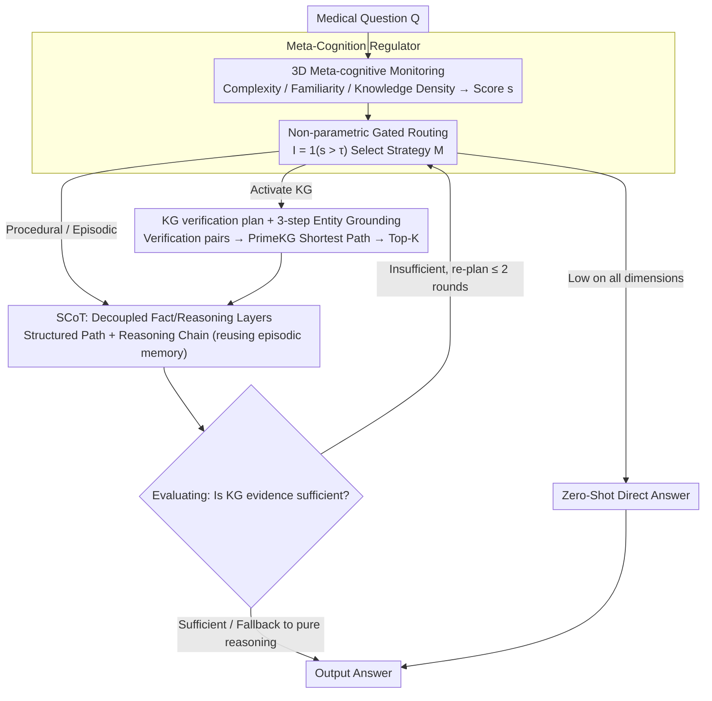

# MedCoG: Maximizing LLM Inference Density in Medical Reasoning via Meta-Cognitive Regulation

**Conference**: ICML 2026  
**arXiv**: [2602.07905](https://arxiv.org/abs/2602.07905)  
**Code**: Not disclosed  
**Area**: Medical Reasoning / LLM Agent / Meta-cognition  
**Keywords**: Meta-cognitive Regulation, Medical Reasoning, Knowledge Graph, Inference Density, On-demand Reasoning

## TL;DR
MedCoG enables LLMs to perform a three-dimensional self-assessment of "complexity, familiarity, and knowledge density" for medical queries, followed by the on-demand invocation of three categories of knowledge: SCoT, episodic memory, and knowledge graphs (KG). This approach increases inference density (the ratio of theoretical cost to actual cost required for equivalent accuracy) by 6.2× while improving average accuracy from 34.5% (AFlow) to 37.5% across five MedQA-series hard sets.

## Background & Motivation

**Background**: Medical reasoning is one of the most challenging domains for LLMs. Mainstream approaches wrap LLMs in agent frameworks—such as multi-role playing (MedAgents, MDAgents), KG retrieval (MedReason), historical memory, and iterative self-correction (Self-Refine, AFlow)—relying on test-time scaling to maximize performance.

**Limitations of Prior Work**: By plotting the cost-accuracy Pareto frontier, the authors found that these methods generally follow a logarithmic scaling law ($Acc = \alpha \ln(C) + \beta$, $R^2=0.996$), where doubling compute power yields diminishing accuracy gains. More critically, on MedQA-H, SCoT+KG performed 4 points worse than pure SCoT (41→37), suggesting that blindly adding KG/Memory can interfere with the LLM's internal knowledge.

**Key Challenge**: Oracle experiments across five strategy pools {Zero-Shot, SCoT, SCoT+Mem, SCoT+KG, SCoT+KG+Mem} revealed that per-sample selection of the optimal strategy can reach 98.98% on MedQA-Full (surpassing o1's 96.52%) and 67.0% on MedQA-H, while the best non-Oracle single strategy peaks at 50%. This indicates that the bottleneck is not knowledge coverage, but the lack of a mechanism for "per-sample selection of the correct strategy."

**Goal**: Enable the LLM to determine "which type of knowledge is needed and how much" for a specific question, rather than indiscriminately applying KG+Memory+CoT.

**Key Insight**: Drawing from cognitive science (Schraw 1998), meta-cognition allows an agent to assess its cognitive state before selecting a strategy. Tulving's three types of knowledge (Procedural, Episodic, and Factual) are mapped to SCoT, Memory, and KG, respectively.

**Core Idea**: A Meta-Cognition Regulator performs "on-demand routing" between SCoT, Memory, and KG, shifting from blind expansion to LLM-centric on-demand reasoning. This reduces costs by avoiding redundant knowledge and improves accuracy by filtering out noise.

## Method

### Overall Architecture

MedCoG replaces fixed agent pipelines with a two-stage system: a Meta-Cognition Regulator followed by a Knowledge Executor. For a medical question $\mathcal{Q}$, the Regulator quantifies its cognitive state across three dimensions (complexity, familiarity, knowledge density) to decide whether to invoke memory or KG. The Executor then performs structured reasoning, retrieves historical cases, or identifies evidence in the KG. If the KG is utilized, an Evaluating module performs a final consistency check; if evidence is insufficient, the plan is refined (up to 2 rounds) or falls back to pure reasoning.

### Key Designs

**1. 3D Meta-cognitive Monitoring + Non-parametric Gating: Transforming Knowledge Activation into Gated Thresholds**

The "interference" caused by adding KG/Memory occurs because systems fail to identify what a specific question lacks. The Regulator quantifies the LLM's self-assessment into three scalars $\mathbf{s}=[s_c, s_f, s_k]$: *Complexity* (need for multi-hop reasoning), *Familiarity* (similarity to textbook cases), and *Knowledge Density* (reliance on specific medical facts). During Planning, a non-parametric gate $I_j=\mathbb{1}(s_j>\tau_j)$ applies thresholds to each dimension. The final strategy is defined as $\mathcal{M}=\pi(\mathbf{s};\tau)=\text{SCoT}\oplus\sum_{j\in\{f,k\}}I_j\cdot\mathcal{M}_j$. If all scores are below the thresholds, the system defaults to Zero-Shot.

Threshold gating is used instead of a learned policy network because meta-cognitive characteristics vary drastically across LLMs—e.g., o3-mini tends toward overconfidence, underestimating KG needs, while Qwen3-8B fails on Knowledge Density (F1=0.33). Per-backbone calibration of $\tau=[\tau_c,\tau_f,\tau_k]$ using 50 held-out samples proves more robust and efficient.

**2. KG Verification Plan + Three-step Entity Grounding: Planning Before Retrieval**

Clinical questions often rely on a narrow set of indicators. Dense retrieval on the entire question introduces irrelevant noise (family history, demographics), leading to performance degradation. MedCoG instead decomposes the question into "verification pairs" $\mathcal{V}(\mathcal{Q})=\{(v_i,h_i)\}$ (atomic queries and hypotheses) before searching the KG.

Each entity undergoes three-step grounding: 1) Extracting candidate phrases $\mathcal{E}_v,\mathcal{E}_h$ via a KG-LLM; 2) Finding the most similar graph entity in PrimeKG using bge-base-en-v1.5: $\hat{e}=\arg\max_{e^g\in\mathcal{E}}\text{sim}(\text{enc}_\theta(e),\text{enc}_\theta(e^g))$; 3) Refinement by the KG-LLM for contextual relevance. Post-grounding, the system finds the shortest paths $\mathcal{P}^g=\bigcup\{\text{SP}(e_v,e_h)\}$ and ranks them to select Top-K=5. This hard-codes the "hypothesis-driven" cognitive path into the retrieval pipeline.

**3. SCoT: A Decoupled Procedural Knowledge Foundation**

Standard CoT mixes "what is known" with "how to reason," often leading the LLM to hallucinate based on erroneous KG paths. SCoT (Structured CoT) explicitly decouples these: it first outputs a structured entity-relation path $\mathcal{P}^e$, then uses these as anchors to generate reasoning chains $\mathcal{C}$, represented as $\text{SCoT}=(\mathcal{P}^e,\mathcal{C})$. If any $I_j$ is activated, the sample uses SCoT as the base. This allows fact and reasoning layers to be evaluated or replaced independently.

Episodic Memory utilizes the same SCoT format: the Case Bank $\mathcal{B}=(q_i,(\mathcal{P}^e_i,\mathcal{C}_i),r_i)$ stores historical questions, trajectories, and rewards. By retrieving Top-K=5 similar cases, historical SCoT acts as a procedural template for "how to decompose" the current problem.

### Loss & Training

The system is training-free. GPT-4o (2024-08-06) serves as the Regulator and SCoT backbone, while GPT-4o-mini handles KG grounding (temperature=0). Learnable components are limited to $\tau$ (calibrated via 50 samples) and the off-the-shelf bge-base-en-v1.5 ranker. The Case Bank is filtered from MedReason, retaining only samples with structured paths.

## Key Experimental Results

### Main Results (5 MedAgentsBench Hard Sets, GPT-4o backbone, IIE* = Marginal Efficiency per 1k samples)

| Method | MedQA | MedMCQA | MMLU | MMLU-Pro | PubMedQA | Avg | IIE* |
|------|-------|---------|------|----------|----------|-----|------|
| CoT (baseline) | 39.0 | 30.0 | 26.0 | 35.0 | 10.0 | 28.0 | Ref |
| Self-Refine | 41.0 | 34.0 | 34.2 | 34.0 | 13.0 | 31.2 | 0.345 |
| MultiPersona | 45.0 | 25.0 | 37.0 | 42.0 | 15.0 | 32.8 | 0.162 |
| AFlow | 48.0 | 31.0 | 38.4 | 37.0 | 18.0 | 34.5 | 0.141 |
| MedAgents | 43.0 | 30.0 | 28.8 | 8.0 | 15.0 | 25.0 | −0.035 |
| MDAgents | 36.0 | 22.0 | 24.7 | 8.0 | 11.0 | 20.3 | −0.165 |
| **MedCoG-Meta** | **52.0** | **36.0** | 35.6 | **44.0** | **20.0** | **37.5** | **0.438** |
| MedCoG-All (Fixed Full) | 50.0 | 32.0 | 28.8 | 36.0 | 19.0 | 33.2 | 0.181 |

MedCoG-Meta outperforms AFlow by 8.7% and achieves an IIE 3.1x higher. Notably, multi-agent frameworks performed worse than simple CoT (negative IIE), confirming that blind agent scaling can damage performance.

### Oracle Upper Bound and Inference Density

| Strategy (GPT-4o) | MedQA-Full | MedQA-H |
|-------------------|------------|---------|
| Zero-Shot | 87.80 | 32.0 |
| SCoT | 89.55 | 41.0 |
| SCoT+Mem | 89.08 | 42.0 |
| SCoT+KG | 87.43 | 37.0 |
| SCoT+KG+Mem | 88.85 | 50.0 |
| **MedCoG-Oracle** | **98.98** | **67.0** |
| Prev. SOTA (o1/o3-mini) | 96.52 | 53.0 |

MedCoG-Oracle reaches a ceiling above o1. MedCoG-Meta achieves an Inference Density $\rho = f^{-1}(Acc_\mathcal{M}) / C_\mathcal{M}$ of 6.2x, meaning to achieve equivalent accuracy on the reference curve would require 6.2x the cost.

### Key Findings

- **Meta-cognitive Reliability Scales with Model Size**: Qwen3-8B failed on Knowledge Density (F1=0.33), but performance normalized at 32B/Max (F1=0.80), indicating meta-cognition requires a minimum model capacity.
- **Synergy Between KG and Memory**: While adding KG alone dropped performance (41→37) on MedQA-H, the SCoT+KG+Mem combination jumped to 50. Memory helps the LLM interpret abstract KG paths.
- **Error Analysis**: Total errors in the strategy pool were reduced from 156 to 70 by MedCoG-Meta, with significant drops in Synergy Missed (29→4) and Memory Noise (20→3).
- **Domain Adaptation**: The system biases toward Memory for MMLU/MMLU-Pro (pattern generalization) and toward KG for MedQA/PubMedQA (clinical facts).

## Highlights & Insights

- **Efficiency-Centric Metrics**: By introducing Inference Density $\rho$ and IIE, the study penalizes methods that blindly consume tokens, providing a standardized scale for comparing agentic frameworks.
- **Bottleneck Diagnosis via Oracle**: Proving an Oracle upper bound of 98.98% clarifies that the priority should be "better routing" rather than "larger KGs."
- **Transferable Meta-cognitive Profiles**: The P/R/F1 analysis of backbone self-evaluation provides a baseline for evaluating the meta-cognitive capabilities of future LLMs in RAG and Agent contexts.
- **Pragmatic Engineering**: The 3-threshold calibration is more cost-effective and robust than training an end-to-end policy network.

## Limitations & Future Work

- **Sample Size**: Evaluations on hard subsets (100 samples) are somewhat small, making IIE sensitive to individual errors.
- **Regulator Cost**: Per-sample overhead includes at least two LLM calls for monitoring and planning. Performance degrades significantly if a smaller open-source model is used as the Regulator.
- **KG Brittleness**: "KG noise" remains a factor. Potential solutions include path verbalization or chain-of-verification modules on the KG paths.
- **Calibrated Thresholds**: Single thresholds may be brittle to distribution shifts; a lightweight calibration network might improve stability.

## Related Work & Insights

- **Comparison to AFlow/MedAgents**: These use fixed workflow pipelines. MedCoG provides dynamic, sample-level strategy selection, saving tokens and improving accuracy.
- **Comparison to MedReason**: MedReason provides the SCoT data but lacks dynamic routing. MedCoG treats it as a Case Bank within a higher-level cognitive scheduler.
- **RAG Insights**: The "verification plan" approach (atomizing questions before retrieval) significantly reduces noise compared to dense retrieval on full prompts—a logic applicable to Legal or Financial RAG.

## Rating
- **Novelty**: ⭐⭐⭐⭐ First systematic exploration of mapping cognitive categories (Procedural/Episodic/Factual) to SCoT/Memory/KG via non-parametric routing.
- **Experimental Thoroughness**: ⭐⭐⭐ Covers 5 backbones and 5 datasets, though the hard subset sample sizes are small.
- **Writing Quality**: ⭐⭐⭐⭐ Logical progression from Pilot to Oracle to Method, with compelling introductory evidence.
- **Value**: ⭐⭐⭐⭐ Provides a concrete framework for "on-demand" agent calls; IIE is likely to be adopted as a standard agent metric.

<!-- RELATED:START -->

<!-- Related papers would go here -->

<!-- RELATED:END -->

## Related Papers

- [\[ICML 2026\] Learnable Kernel Density Estimation for Graphs and Its Application to Graph-Level Anomaly Detection](learnable_kernel_density_estimation_for_graphs_and_its_application_to_graph-leve.md)
- [\[ICML 2026\] DTKG: Dual-Track Knowledge Graph-Verified Reasoning Framework for Multi-Hop QA](dtkg_dual-track_knowledge_graph-verified_reasoning_framework_for_multi-hop_qa.md)
- [\[ICML 2026\] Whom to Query for What: Adaptive Group Elicitation via Multi-Turn LLM Interactions](whom_to_query_for_what_adaptive_group_elicitation_via_multi-turn_llm_interaction.md)
- [\[ICML 2026\] GILT: An LLM-Free, Tuning-Free Graph Foundational Model for In-Context Learning](gilt_an_llm-free_tuning-free_graph_foundational_model_for_in-context_learning.md)
- [\[NeurIPS 2025\] MoEMeta: Mixture-of-Experts Meta Learning for Few-Shot Relational Learning](../../NeurIPS2025/graph_learning/moemeta_mixture-of-experts_meta_learning_for_few-shot_relational_learning.md)

<!-- RELATED:END -->
