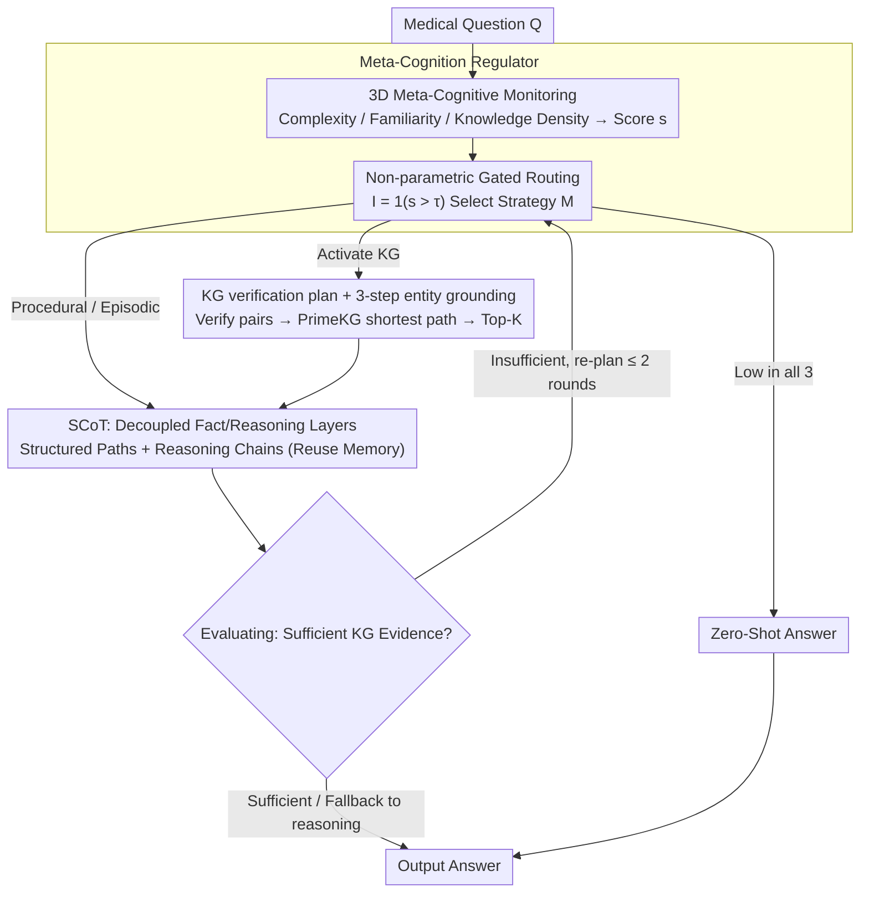

# MedCoG: Maximizing LLM Inference Density in Medical Reasoning via Meta-Cognitive Regulation

**Conference**: ICML 2026  
**arXiv**: [2602.07905](https://arxiv.org/abs/2602.07905)  
**Code**: Not disclosed  
**Area**: Medical Reasoning / LLM Agent / Meta-Cognition  
**Keywords**: Meta-cognitive regulation, Medical reasoning, Knowledge graph, Inference density, On-demand reasoning

## TL;DR
MedCoG enables LLMs to perform a three-dimensional self-assessment of "complexity / familiarity / knowledge density" for medical questions before invoking SCoT, memory, and knowledge graphs (KG) on demand. This approach increases inference density (theoretical cost/actual cost required to achieve equivalent accuracy) to 6.2×, while improving average accuracy from 34.5% (AFlow) to 37.5% across five MedQA hard sets.

## Background & Motivation

**Background**: Medical reasoning is one of the most challenging domains for LLMs. Prevailing approaches involve wrapping LLMs in agent frameworks—multi-role playing (MedAgents, MDAgents), KG retrieval (MedReason), episodic memory, and iterative self-correction (Self-Refine, AFlow)—relying on test-time scaling to boost performance.

**Limitations of Prior Work**: By plotting the cost-accuracy Pareto frontier, the authors found that these methods generally follow a logarithmic scaling law $Acc = \alpha \ln(C) + \beta$ ($R^2=0.996$), where doubling compute power yields diminishing accuracy gains. Worse, on MedQA-H, SCoT+KG performed 4 points lower than pure SCoT (41→37), suggesting that blind addition of KG/Memory can interfere with the LLM's internal knowledge.

**Key Challenge**: Oracle experiments using a strategy pool {Zero-Shot, SCoT, SCoT+Mem, SCoT+KG, SCoT+KG+Mem} revealed that selecting the optimal strategy per-sample can reach 98.98% on MedQA-Full (surpassing o1's 96.52%) and 67.0% on MedQA-H. In contrast, no single non-oracle strategy exceeds 50%. This identifies the bottleneck not as knowledge coverage, but as the lack of a "per-sample strategy selection" mechanism.

**Goal**: To enable LLMs to judge "what type and how much knowledge is needed" for a specific question, rather than indiscriminately applying KG+Memory+CoT.

**Key Insight**: Drawing from meta-cognition in cognitive science (Schraw 1998), agents should evaluate their own cognitive state before selecting a strategy. Tulving's three types of knowledge (Procedural / Episodic / Factual) are mapped to SCoT / Memory / KG respectively.

**Core Idea**: A Meta-Cognition Regulator performs "on-demand routing" between SCoT, Memory, and KG, shifting scaling from blind expansion to LLM-centric on-demand reasoning, simultaneously reducing costs (avoiding useless knowledge) and improving accuracy (avoiding noise).

## Method

### Overall Architecture

MedCoG replaces fixed agent pipelines with a two-stage system: Meta-Cognition Regulator and Knowledge Executor. For a medical query $\mathcal{Q}$, the Regulator assesses its cognitive state across three dimensions (complexity, familiarity, knowledge density) to decide whether to invoke memory or KG. The Executor then performs structured reasoning, retrieves historical cases, or identifies evidence in a KG. If a KG is used, an Evaluating module checks evidence sufficiency; if insufficient, the plan is refined (≤2 rounds) or falls back to pure reasoning.

### Key Designs

**1. 3D Meta-Cognitive Monitoring + Non-parametric Gating: Transforming Knowledge Activation into Threshold Judgment**

Blindly stacking KG+Memory+CoT hurts performance because the system does not judge what is missing. MedCoG quantifies the LLM's self-judgment into three scalars $\mathbf{s}=[s_c, s_f, s_k]$: Complexity (need for multi-hop reasoning), Familiarity (similarity to textbook cases for memory reuse), and Knowledge Density (dependence on specific medical facts). A non-parametric gate $I_j=\mathbb{1}(s_j>\tau_j)$ triggers dimensions reaching a threshold. The final strategy is $\mathcal{M}=\pi(\mathbf{s};\tau)=\text{SCoT}\oplus\sum_{j\in\{f,k\}}I_j\cdot\mathcal{M}_j$. If all scores are low, Zero-Shot is used.

Threshold gating is utilized instead of a policy network because meta-cognitive characteristics vary significantly across LLMs (e.g., o3-mini being overconfident and underestimating KG needs). A per-backbone calibration of $\tau=[\tau_c,\tau_f,\tau_k]$ using 50 held-out samples is more robust and efficient than training a unified scheduler.

**2. KG Verification Plan + 3-step Entity Grounding: Planning before Retrieval**

Clinical questions often hinge on a few key indicators. Dense retrieval on the entire question introduces irrelevant noise (family history, etc.) and hub entity explosion. MedCoG decomposes the question into "verification pairs" $\mathcal{V}(\mathcal{Q})=\{(v_i,h_i)\}$ (atomic query $v_i$ + LLM-generated hypothesis $h_i$) before searching the KG.

Grounding follows three steps: candidate phrase extraction ($\mathcal{E}_v,\mathcal{E}_h$), similarity matching in PrimeKG using bge-base-en-v1.5 to find $\hat{e}=\arg\max_{e^g\in\mathcal{E}}\text{sim}(\text{enc}_\theta(e),\text{enc}_\theta(e^g))$, and LLM-based context refinement. Shortest paths $\mathcal{P}^g=\bigcup\{\text{SP}(e_v,e_h)\}$ are then calculated and ranked to retrieve Top-K=5.

**3. SCoT: Decoupling Factual and Reasoning Layers**

Standard CoT mixes "what is known" with "how to reason," often leading LLMs to hallucinate based on incorrect KG paths. SCoT explicitly separates these: it first outputs structured entity-relation paths $\mathcal{P}^e$, then generates reasoning chains $\mathcal{C}$ anchored to these paths: $\text{SCoT}=(\mathcal{P}^e,\mathcal{C})$. When KG is active, $\mathcal{P}^e$ is filled by retrieval; otherwise, it is elicited from the LLM.

Episodic Memory reuses the SCoT format: a Case Bank $\mathcal{B}=(q_i,(\mathcal{P}^e_i,\mathcal{C}_i),r_i)$ stores historical questions, trajectories, and rewards. Retrieval uses question similarity (Top-K=5). Structured trajectories provide procedural templates for the LLM.

### Loss & Training

The system is training-free. GPT-4o (2024-08-06) serves as the Regulator and SCoT backbone; GPT-4o-mini handles KG grounding (temperature=0). Learnable parameters are limited to $\tau$ (calibrated on 50 samples) and the off-the-shelf bge-base-en-v1.5 ranker. PrimeKG is used for knowledge, and the Case Bank is filtered from MedReason.

## Key Experimental Results

### Main Results (5 MedAgentsBench Hard Sets, GPT-4o backbone, IIE* = Marginal Efficiency per 1k samples)

| Method | MedQA | MedMCQA | MMLU | MMLU-Pro | PubMedQA | Avg | IIE* |
|------|-------|---------|------|----------|----------|-----|------|
| CoT (baseline) | 39.0 | 30.0 | 26.0 | 35.0 | 10.0 | 28.0 | Ref |
| Self-Refine | 41.0 | 34.0 | 34.2 | 34.0 | 13.0 | 31.2 | 0.345 |
| MultiPersona | 45.0 | 25.0 | 37.0 | 42.0 | 15.0 | 32.8 | 0.162 |
| AFlow | 48.0 | 31.0 | 38.4 | 37.0 | 18.0 | 34.5 | 0.141 |
| MedAgents | 43.0 | 30.0 | 28.8 | 8.0 | 15.0 | 25.0 | −0.035 |
| MDAgents | 36.0 | 22.0 | 24.7 | 8.0 | 11.0 | 20.3 | −0.165 |
| **MedCoG-Meta** | **52.0** | **36.0** | 35.6 | **44.0** | **20.0** | **37.5** | **0.438** |
| MedCoG-All (All On) | 50.0 | 32.0 | 28.8 | 36.0 | 19.0 | 33.2 | 0.181 |

MedCoG-Meta outperforms AFlow by 8.7% on average, with an IIE 3.1× higher. Several medical agents performed worse than CoT (negative IIE), validating that blind agent stacking can impair LLM performance.

### Oracle Upper Bound and Inference Density

| Strategy (GPT-4o) | MedQA-Full | MedQA-H |
|-------------------|------------|---------|
| Zero-Shot | 87.80 | 32.0 |
| SCoT | 89.55 | 41.0 |
| SCoT+Mem | 89.08 | 42.0 |
| SCoT+KG | 87.43 | 37.0 |
| SCoT+KG+Mem | 88.85 | 50.0 |
| **MedCoG-Oracle** | **98.98** | **67.0** |
| Current SOTA (o1/o3-mini) | 96.52 | 53.0 |

Oracle results indicate the strategy pool ceiling exceeds o1. MedCoG-Meta achieves an Inference Density $\rho = f^{-1}(Acc_\mathcal{M}) / C_\mathcal{M}$ of 6.2× on the fitted curve ($R^2=0.996$).

### Key Findings

- **Meta-cognitive reliability correlates with model scale**: Qwen3-8B failed on Knowledge Density (F1=0.33), but recovered to 0.79~0.80 at larger scales (32B/Max). o3-mini showed overconfidence in Familiarity (Recall 1.0, Precision 0.65).
- **Synergy between KG and Memory**: KG alone dropped performance on MedQA-H (41→37), but SCoT+KG+Mem reached 50. Episodic memory helps LLMs interpret abstract KG paths.
- **Error Structure Comparison**: MedCoG-Meta reduced total strategy pool errors from 156 to 70. Significant reductions occurred in Synergy Missed (29→4), Memory Noise (20→3), and Over Reasoning (33→14).
- **Domain Adaptation**: MMLU favors Memory (pattern generalization), while clinical datasets (MedQA/PubMedQA) favor KG (clinical fact density).

## Highlights & Insights

- **Incentivizing Efficiency**: Metrics like Inference Density $\rho$ and IIE $(Acc_\mathcal{M} - Acc_{CoT}) / (C_\mathcal{M} - C_{CoT})$ penalize excessive token usage, providing a unified scale for agent comparisons.
- **Root Cause Analysis via Oracle**: Proving an ideal router can reach 98.98% clarifies that the bottleneck is scheduling rather than the knowledge source itself.
- **Per-backbone Meta-Cognitive Profiling**: Table 3 provides benchmark data for LLM self-assessment capability, which is highly transferable to RAG and agent research.
- **Pragmatic Implementation**: The training-free, threshold-based calibration is cost-effective and robust for different backbones.

## Limitations & Future Work

- Sample sizes for the hard subset were relatively small (n=73~100), making metrics sensitive to individual errors.
- The Regulator relies on closed-source LLMs; 8B models currently struggle with Knowledge Density dimensions.
- Single-threshold gating may be brittle under distribution shifts; a lightweight calibration network could be more stable.
- KG remains a bottleneck for structured reasoning; future work should focus on path verbalization or chain-level verifiers.

## Related Work & Insights

- **Comparison with AFlow/MedAgents**: Unlike fixed multi-agent pipelines, MedCoG operates at the sample level. Tokens are saved by bypassing KG/Memory when unnecessary, leading to a 3× higher IIE.
- **Comparison with MedReason/MedPrompt**: MedCoG builds upon MedReason's data by adding a meta-cognitive scheduling layer, demonstrating a hierarchical approach to knowledge engineering.
- **Inspiration for RAG**: Decomposing questions into verification plans before retrieval significantly reduces noise compared to direct dense retrieval, a strategy applicable to other high-density knowledge domains like law or finance.

## Rating
- Novelty: ⭐⭐⭐⭐ Mapping meta-cognition categories to SCoT/Memory/KG with non-parametric routing is a systematic exploration.
- Experimental Thoroughness: ⭐⭐⭐ Comprehensive across backbones/datasets, but hard subset sample sizes are small.
- Writing Quality: ⭐⭐⭐⭐ Strong logical flow from Oracle to Method to Metric.
- Value: ⭐⭐⭐⭐ Provides a clear mechanism to prevent token bloat in agents; the IIE metric is likely to be adopted by future work.

<!-- RELATED:START -->

## Related Papers

- [\[ICML 2026\] Learnable Kernel Density Estimation for Graphs and Its Application to Graph-Level Anomaly Detection](learnable_kernel_density_estimation_for_graphs_and_its_application_to_graph-leve.md)
- [\[ICML 2026\] DTKG: Dual-Track Knowledge Graph-Verified Reasoning Framework for Multi-Hop QA](dtkg_dual-track_knowledge_graph-verified_reasoning_framework_for_multi-hop_qa.md)
- [\[ICML 2026\] Whom to Query for What: Adaptive Group Elicitation via Multi-Turn LLM Interactions](whom_to_query_for_what_adaptive_group_elicitation_via_multi-turn_llm_interaction.md)
- [\[ICML 2026\] GILT: An LLM-Free, Tuning-Free Graph Foundational Model for In-Context Learning](gilt_an_llm-free_tuning-free_graph_foundational_model_for_in-context_learning.md)
- [\[NeurIPS 2025\] MedMKG: Benchmarking Medical Knowledge Exploitation with Multimodal Knowledge Graph](../../NeurIPS2025/graph_learning/medmkg_benchmarking_medical_knowledge_exploitation_with_multimodal_knowledge_gra.md)

<!-- RELATED:END -->
