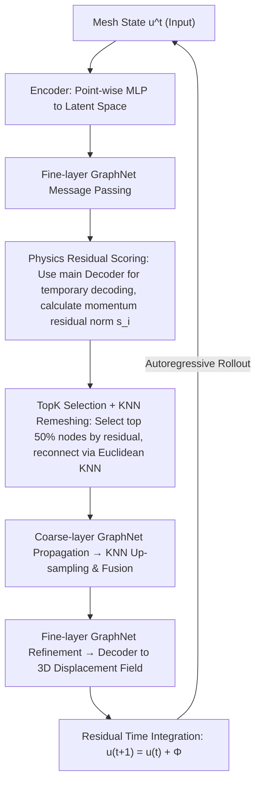

# Physics-Informed Coarsening for Multigrid Graph Neural Surrogates

**Conference**: ICML 2026  
**arXiv**: [2605.31013](https://arxiv.org/abs/2605.31013)  
**Code**: [Project Page](https://sites.google.com/view/physics-informed-coarsening)  
**Area**: Scientific Computing / Graph Neural PDE Surrogates / Solid Mechanics  
**Keywords**: Multigrid GNN, Physics Residual, Solid Mechanics Surrogate, Mesh Coarsening, Long-term Rollout

## TL;DR
This paper trains an Encoder-Processor-Decoder multigrid GNN surrogate for finite element simulation in solid mechanics. The core innovation is replacing geometric heuristics (FPS) or learned attention in "coarsening (downsampling) node selection" with "TopK scoring based on the discrete residual of momentum conservation equations." This concentrates coarse-layer computational resources on dynamically critical regions like stress concentrations, contact interfaces, and large deformations, reducing rollout RMSE from the Prev. SOTA $11.46\times 10^{-3}$ to $6.5\times 10^{-3}$ (approx. 43% improvement) on the DeformingPlate dataset.

## Background & Motivation

**Background**: Replacing FEM with neural networks for PDE simulation has achieved orders-of-magnitude acceleration in fluid dynamics (Navier-Stokes, turbulence, airfoils). Current mainstream architectures utilize MeshGraphNet-style Encode-Process-Decode GNNs combined with multigrid/U-Net style hierarchical message passing (e.g., MultiScale MeshGraphNets, BSMS-GNN, Multi-Scale GNN, HCMT, UNISOMA) to mitigate over-smoothing in deep GNNs and improve long-range information propagation.

**Limitations of Prior Work**: (i) Solid mechanics is significantly underestimated—unlike fluids, it involves strong nonlinear localized phenomena such as large deformations, plasticity, contact, and stress concentrations, which mainstream fluid-centric benchmarks fail to capture; (ii) The core design of "which nodes to retain during coarsening" in multigrid architectures generally relies on purely geometric heuristics like farthest point sampling (FPS) or learned attention scores. The former ignores physics and distributes nodes uniformly, wasting computation on quiet zones; the latter is prone to instability during training.

**Key Challenge**: The number of coarse-layer nodes is limited (fixed at 50% in this paper). If nodes are geometrically uniform, dynamically critical but spatially localized regions (stress concentrations, contact interfaces) receive insufficient coarse-layer computation. Consequently, errors in these regions diverge first during long-term rollout, contaminating the entire solution.

**Goal**: (i) Design a coarsening criterion that prioritizes "physically important" regions for coarse-layer nodes; (ii) Ensure the criterion is applicable across quasi-static hyperelasticity, transient nonlinear elasticity, and elastoplasticity with contact; (iii) Release a solid mechanics benchmark to fill the existing gap.

**Key Insight**: The authors borrow the intuition of "residual-based adaptive mesh refinement" from classical FEM, where meshes are refined where PDE residuals are high. Transferring this to GNN multigrid: score nodes during coarsening based on the discrete residual of the momentum conservation equation.

**Core Idea**: Use the "norm of the discrete residual of the momentum conservation equation" as the node importance score. Select the TopK nodes with the highest residuals to construct the coarse graph, allowing the multigrid hierarchy to naturally tilt towards stress concentrations, contact interfaces, and large deformation zones.

## Method

### Overall Architecture

To address the challenge where stress concentrations and contact interfaces diverge first due to insufficient coarse-layer resolution, this paper replaces geometric coarsening with physical criteria. The discrete residual norm of the momentum conservation equation serves as an importance score to select nodes for the coarse graph. The backbone remains an Encoder–Processor–Decoder system: the Encoder lifts features to a latent dimension $h$, and the Processor alternates between fine-grid message passing, physics-informed downsampling, and KNN upsampling fusion to form a U-Net style hierarchy.

### Key Designs

**1. Node Physical Scoring based on Momentum Residual: Replacing Geometric Criteria with Physical Criteria**

Current geometric heuristics (like FPS) ignore physics and waste resources on quiet regions. Borrowing from residual-based adaptive mesh refinement in classical FEM, nodes with high residuals represent areas where the physics is "inaccurate" or "highly dynamic." This paper calculates a scalar score $s_i^t$ for each node, characterizing the violation of the momentum conservation equation. Specifically, the downsampling block temporarily decodes the latent graph into physical space using the main Decoder $\hat{\bm{u}}^t = \phi_{\mathrm{dec}}(\tilde{\mathcal{G}})$ to calculate predicted stress $\hat{\bm{\sigma}}^t$. For transient cases, the residual is $\bm{r}_i^t = \rho_i\ddot{\hat{\bm{u}}}_i^t - (\nabla_h \cdot \hat{\bm{\sigma}}^t)_i - \rho_i\mathbf{b}_i^t$; for quasi-static cases, the inertial term is dropped to form the equilibrium residual $\bm{r}_i^t = -(\nabla_h \cdot \hat{\bm{\sigma}}^t)_i - \rho_i\mathbf{b}_i^t$. The divergence $\nabla_h \cdot$ is reconstructed using fixed mesh-based operators. The score is $s_i^t = \|\bm{r}_i^t\|_2$, recalculated at each autoregressive step.

**2. TopK Physics-Informed Selection + KNN Remeshing: From Scores to Coarse Graphs**

A key issue is that nodes with high residuals might be disconnected in the original mesh, leading to topological fragmentation. For node selection, the paper compares deterministic $\mathcal{I} = \mathrm{TopK}(\bm{s}^t, n_s)$ with probabilistic categorical sampling. For edge construction, it compares induced subgraphs with Euclidean KNN remeshing on selected nodes. The optimal combination is **TopK + remeshing**: TopK reduces rollout RMSE from $13.1\times 10^{-3}$ to $6.5\times 10^{-3}$, as the variance from sampling at high coarsening rates outweighs the exploration benefit.

**3. Encoder-Processor-Decoder Backbone + KNN Up-sampling: Fusing Global Info without Losing Local Precision**

Single-scale GNNs are limited by $k$-hop radii and fail to capture global coupling. After coarse-layer propagation yields $\tilde{\mathcal{G}}_c^{n_s \times h}$, features are interpolated back to the fine grid via $k$-NN weighted sums and fused with original fine features, followed by local refinement. Time integration uses the residual form $\bm{u}^{t+1} = \bm{u}^t + \Phi_\theta(\bm{u}^t, \mathcal{G})$, which is critical for long-term stability.

### Loss & Training

Supervision is performed directly on the next-state prediction using point-wise MSE loss. The AdamW optimizer is used for 30 epochs (approx. $10^6$ steps). All multigrid models maintain a 50% coarsening ratio (coarse nodes = half of fine nodes). Experiments utilized NVIDIA A100 GPUs.

## Key Experimental Results

### Main Results: Comparison on DeformingPlate

| Method | Rollout RMSE ($\times 10^{-3}$) ↓ | 1-step RMSE ($\times 10^{-3}$) ↓ | #Params ↓ |
| :--- | :--- | :--- | :--- |
| MeshGraphNets | 12.75 | 0.10 | 2.8M |
| BSMS-GNN | 16.60 | 0.15 | 2.1M |
| Transolver++ | 29.80 | 1.00 | 722K |
| Transformer GNN | 24.97 | 1.20 | 3.5M |
| Multi-Scale GNN | 15.7 | 0.10 | 3.1M |
| HCMT | 12.97 | 0.14 | 2.53M |
| UNISOMA | 11.46 | 0.16 | 2.85M |
| **Ours (Physics-informed Multigrid)** | **6.50** | **0.095** | 2.9M |

Rollout error is nearly halved compared to UNISOMA (11.46 → 6.50), with the lowest 1-step error among all models at comparable parameter counts.

### Ablation Study: Sampling Strategies in Multigrid Architecture

| Sampling Strategy | Rollout RMSE ($\times 10^{-3}$) ↓ | 1-step RMSE ($\times 10^{-5}$) ↓ |
| :--- | :--- | :--- |
| BSMS (Topological bi-stride) | 16.60 | 15 |
| FPS (No remeshing) | 15.0 | 10.31 |
| Attention-based | 8.1 | 17.10 |
| FPS (With remeshing) | 8.0 | 9.74 |
| Physics-informed + Stochastic Sampling | 13.1 | 11.32 |
| **Physics-informed + TopK (Ours)** | **6.5** | **9.57** |

### Key Findings
- **Coarsening Strategy > Architectural Capacity**: Swapping FPS for physics-informed TopK reduces rollout error from 8.0 to 6.5 in the same backbone.
- **TopK significantly outperforms Stochastic Sampling** ($13.1 \rightarrow 6.5$): At 50% coarsening, variance introduced by randomness outweighs exploration gains.
- **Decoder Reuse is Crucual**: Using an independent decoder for physical scoring degrades performance. Sharing the decoder forces the representation to support both "prediction" and "residual calculation," promoting physical consistency.
- **Connectivity vs. Semantic Relevance**: Remeshing via KNN on physically selected nodes outperforms maintaining original topological connectivity, suggesting semantic relevance is more important in multigrid GNNs.

## Highlights & Insights
- **Bridging Classical FEM and Deep Learning**: Transferring residual-based adaptive refinement to GNN coarsening provides interpretability and leverages decades of numerical analysis intuition.
- **Zero Extra Parameters**: The physics score is computed using the existing Decoder and fixed operators, providing a strong inductive bias without increasing model complexity.
- **Shared Decoder Trick**: Assigning the decoder dual tasks ("final output" and "intermediate scoring") naturally injects physical consistency as a regularizer.

## Limitations & Future Work
- **Complexity in Hard Cases**: Residual scoring for complex materials or distorted meshes is non-trivial and requires access to physical fields, moving away from pure black-box ML.
- **Error Propagation**: If the primary prediction is poor, the calculated residual will be inaccurate, potentially creating a feedback loop during rollout.
- **Future Directions**: Combining residual scoring with gradient vector fields, adaptive coarsening rates, or integrating as a PINN loss for joint regularization.

## Related Work & Insights
- **vs. MeshGraphNets**: Inherits the E-P-D backbone and residual stepping but adds multigrid levels and physics coarsening, improving rollout from 12.75 to 6.50.
- **vs. BSMS-GNN**: BSMS uses topological bi-stride pooling; Ours uses physics TopK + KNN remeshing. The performance jump (16.60 → 6.50) proves that physical "focus" matters more than preserving original topology.
- **vs. UNISOMA**: UNISOMA uses fixed slice tokens; Ours explicitly selects nodes by residual, better capturing local details in stress concentrations.

[1] MeshGraphNets: Learning Mesh-based Simulation with Graph Networks (ICML 2021)  
[2] BSMS-GNN: Bi-stride Multi-scale Graph Neural Network for PDE Simulation (ICLR 2023)  
[3] UNISOMA: Unified Soft-masked Attention for Multi-scale MeshGraphNets (NeurIPS 2024)

## Related Papers

- [\[ICML 2026\] Full-Spectrum Graph Neural Network: Expressive and Scalable](full-spectrum_graph_neural_network_expressive_and_scalable.md)
- [\[ICML 2026\] Quantile-Free Uncertainty Quantification in Graph Neural Networks](quantile-free_uncertainty_quantification_in_graph_neural_networks.md)
- [\[ICML 2026\] L2G-Net: Local to Global Spectral Graph Neural Networks via Cauchy Factorizations](l2g-net_local_to_global_spectral_graph_neural_networks_via_cauchy_factorizations.md)
- [\[AAAI 2026\] On Stealing Graph Neural Network Models](../../AAAI2026/graph_learning/on_stealing_graph_neural_network_models.md)
- [\[ICML 2026\] Deep Neural Sheaf Diffusion](deep_neural_sheaf_diffusion.md)

<!-- RELATED:END -->

<!-- RELATED:START -->

## Related Papers

- [\[ICML 2026\] Deep Neural Sheaf Diffusion](deep_neural_sheaf_diffusion.md)
- [\[ICML 2026\] Are Common Substructures Transferable? Riemannian Graph Foundation Model with Neural Vector Bundles](are_common_substructures_transferable_riemannian_graph_foundation_model_with_neu.md)
- [\[ICML 2026\] L2G-Net: Local to Global Spectral Graph Neural Networks via Cauchy Factorizations](l2g-net_local_to_global_spectral_graph_neural_networks_via_cauchy_factorizations.md)
- [\[ICML 2026\] Polynomial Neural Sheaf Diffusion: A Spectral Filtering Approach on Cellular Sheaves](polynomial_neural_sheaf_diffusion_a_spectral_filtering_approach_on_cellular_shea.md)
- [\[ICML 2026\] Beyond Model Base Retrieval: Weaving Knowledge to Master Fine-grained Neural Network Design](beyond_model_base_retrieval_weaving_knowledge_to_master_fine-grained_neural_netw.md)

<!-- RELATED:END -->
