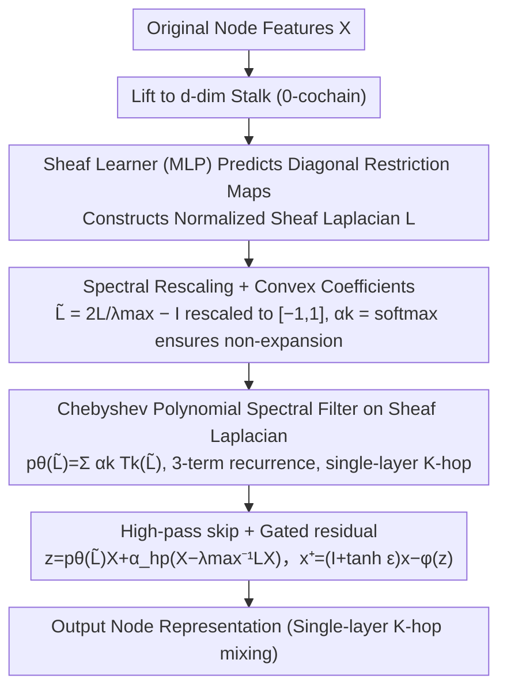

# Polynomial Neural Sheaf Diffusion: A Spectral Filtering Approach on Cellular Sheaves

**Conference**: ICML 2026  
**arXiv**: [2512.00242](https://arxiv.org/abs/2512.00242)  
**Code**: None  
**Area**: Graph Neural Networks / Sheaf Neural Networks / Spectral Graph Filtering / Heterophilic Graphs  
**Keywords**: Neural Sheaf Diffusion, Chebyshev Polynomial Filtering, Heterophilic Graphs, Oversmoothing, Diagonal Restriction Maps

## TL;DR
PolyNSD replaces the "single-step spatial diffusion" of Sheaf Neural Networks with a learnable $K$-th order polynomial spectral filter applied to the normalized sheaf Laplacian. Using Chebyshev three-term recurrence for stable computation, a single layer achieves a $K$-hop receptive field and controllable low/band/high-pass responses. A surprising finding is that using only diagonal restriction maps outperforms existing NSD models that require dense, high-dimensional stalks, significantly reducing parameters, memory, and runtime.

## Background & Motivation
**Background**: GNNs are successful on homophilic graphs but struggle with heterophilic graphs (where adjacent nodes belong to different categories) and deep stacking (oversmoothing). One solution is cellular sheaf theory: assigning a local feature space (stalk) to each node and a linear restriction map to each edge. The resulting sheaf Laplacian enables "transport-aware" diffusion, which is more suitable for heterophily than isotropic message passing. Bodnar et al. (2022) achieved SOTA with Neural Sheaf Diffusion (NSD) by learning the sheaf Laplacian.

**Limitations of Prior Work**: NSD is essentially a single-step spatial propagation $X^{(t+1)}=X^{(t)}-\sigma(\Delta_{\mathcal{F}(t)}(I_{nd}\otimes W_1^{(t)})X^{(t)}W_2^{(t)})$, which faces four structural issues: (i) each layer only propagates one step, requiring deep stacking for long-range dependencies, which exacerbates oversmoothing; (ii) it relies on dense per-edge restriction maps (diagonal/bundle/general), where parameters and memory are bottlenecked by the stalk dimension $d$; (iii) it requires normalization or decompositions like SVD during training, leading to numerical instability; (iv) performance is highly dependent on large stalk dimensions, failing to decouple "accuracy" from "computational cost."

**Key Challenge**: The advantage of the sheaf Laplacian's "transport-awareness + partial order" is spatially local, but utilizing it for multi-hop interactions requires repeated layer stacking; stacking, in turn, triggers oversmoothing and expensive re-learning of the sheaf. In other words, **long-range propagation is tied to layer depth**.

**Goal**: (1) Enable single-layer $K$-hop mixing while preserving the expressivity of sheaf transport; (2) change the frequency response of diffusion from "implicitly low-pass" to learnable; (3) decouple performance from stalk dimension so that diagonal restrictions suffice; (4) provide a stable polynomial implementation of the same order as standard GNNs.

**Key Insight**: The authors draw inspiration from classic spectral polynomial filters like ChebNet/GPRGNN—since Chebyshev recurrence has been verified as stable and efficient for the graph Laplacian, and the sheaf Laplacian is a symmetric positive semi-definite matrix, the same spectral functional analysis ($p(L)=Up(\Lambda)U^\top$) is theoretically applicable.

**Core Idea**: Replace single-step $(aI+bL)$ diffusion with $p(L)=\sum_{k=0}^K c_k L^k$. Use spectral rescaling $\widetilde{L}=2L/\lambda_\text{max}-I$ to keep the Chebyshev basis stable and bounded, effectively upgrading sheaf diffusion to a controllable spectral filtering layer.

## Method

### Overall Architecture
PolyNSD addresses the contradiction where the "long-range capability of sheaf neural networks is tied to layer depth." While sheaf Laplacian diffusion is ideal for heterophilic graphs, multi-hop coverage requires stacking, which causes oversmoothing. PolyNSD lifts each node to a $d$-dimensional stalk, uses a sheaf learner (an MLP) to learn edge-wise restriction maps and construct the sheaf Laplacian $L\in\mathbb{R}^{Nd\times Nd}$. Instead of single-step diffusion, it learns a $K$-th order polynomial spectral filter on $L$, giving a single layer a $K$-hop receptive field and controllable frequency response. The operator is compatible with existing SheafNNs and serves as a plug-and-play propagation layer replacement.

### Key Designs

**1. Chebyshev Polynomial Spectral Filtering on Sheaf Laplacian: Single-layer $K$-hop Filter**

The original NSD is essentially $X^{(t+1)}=X^{(t)}-\sigma(\Delta_{\mathcal{F}}(\dots))$, which performs a first-order $aI+bL$ transformation. PolyNSD utilizes the fact that $L$ is a symmetric PSD matrix, $L=U\Lambda U^\top$, so $p(L)=\sum_{k=0}^K c_k L^k$ equals $Up(\Lambda)U^\top$ via spectral functional calculus—the multiplier on the $i$-th sheaf Fourier mode is exactly $p(\lambda_i)$. By making the shape of $p$ learnable, a single layer can implement low-pass (smoothing), band-pass (middle-frequency extraction), or high-pass (preserving disagreement) filters. **Proposition 1** guarantees spatial locality: $(p(L))_{vu}=0$ if $\text{dist}_G(v,u)>K$, meaning a $K$-th order polynomial corresponds strictly to $K$-hop mixing without needing $K$ layers or repeated sheaf learning. Numerical stability is achieved using Chebyshev polynomials of the first kind $T_k(\xi)=\cos(k\arccos\xi)$ as a basis: $p_\theta(\widetilde{L})=\sum_{k=0}^K \alpha_k T_k(\widetilde{L})$.

**2. Spectral Rescaling + Convex Coefficients: Stability for Large $K$**

Chebyshev bases are only bounded on $[-1,1]$. To avoid exponential growth, the spectrum is rescaled via $\widetilde{L}=2L/\lambda_\text{max}-I$. For normalized $\Delta_\mathcal{F}$, setting $\lambda_\text{max}=2$ is safe; for unnormalized $L_\mathcal{F}$, a few power iterations estimate $\lambda_\text{max}$. Applying convex coefficients $\alpha=\text{softmax}(\eta)$ ensures $\|p_\theta(\widetilde{L})\|_2\le 1$, resulting in a non-expansive operator. **Proposition 2** proves that if $0\le p(\lambda)\le 1$, the Dirichlet energy $\langle p(L)x,Lp(L)x\rangle \le \langle x,Lx\rangle$, meaning the filter only damps node disagreement and never amplifies it, ensuring training stability even for large $K$.

**3. High-pass Skip + Gated Residual + Diagonal Restriction: Shifting Expressivity to Frequency Response**

Pure diffusion has a low-pass bias. PolyNSD adds a high-pass component $h_\text{hp}=x-\lambda_\text{max}^{-1}Lx$, combined as $z=p_\theta(\widetilde{L})x+\alpha_\text{hp}h_\text{hp}$. The entire linear mapping remains diagonal on the eigenbasis, and the scalar $\alpha_\text{hp}$ can analytically shift the response toward high-pass. A gated residual $x^+=(I+\tanh\varepsilon)x-\phi(z)$ is used, where $\phi$ is 1-Lipschitz, ensuring an explicit upper bound on the layer's Lipschitz constant. This allows the restriction map to be simplified to a "diagonal" form. While traditional NSD relies on large stalks and complex restrictions for expressivity, PolyNSD achieves parity using diagonal restrictions by making frequency response learnable.

### Loss & Training
The task is standard supervised node classification (cross-entropy). Key implementation points include: using power iteration to estimate $\lambda_\text{max}$ to avoid full eigendecomposition; parameterizing $\alpha=\text{softmax}(\eta)$ to enforce $\|p\|_\infty\le 1$; and utilizing diagonal restrictions as the default to minimize overhead.

## Key Experimental Results

### Main Results
On 9 node classification datasets (homophilic Cora/Citeseer/Pubmed, heterophilic Texas/Wisconsin/Film/Squirrel/Chameleon/Cornell). Comparison of Texas (homophily 0.11) and Cora (0.81):

| Model | Texas (Het. 0.11) | Wisconsin | Squirrel | Chameleon | Cora (Hom. 0.81) | Citeseer | Pubmed |
|------|------------------|-----------|----------|-----------|------------------|----------|--------|
| **DiagPolySD (Ours)** | **90.00±4.68** | 88.63±3.59 | **56.61±2.06** | **71.45±2.03** | 88.79±1.13 | 77.74±1.26 | 89.70±0.32 |
| BundlePolySD | 89.74±5.32 | 89.41±4.04 | 55.76±2.02 | 71.18±1.46 | 88.33±1.34 | 77.57±1.55 | **89.75±0.34** |
| Diag-NSD (Bodnar) | 85.67±6.95 | 88.63±2.75 | 54.78±1.81 | 68.68±1.73 | 87.14±1.06 | 77.14±1.85 | 89.42±0.43 |
| Gen-NSD (Bodnar) | 82.97±5.13 | 89.21±3.84 | 53.17±1.31 | 67.93±1.58 | 87.30±1.15 | 76.32±1.65 | 89.33±0.35 |
| GGCN | 84.86±4.55 | 86.86±3.29 | 55.17±1.58 | 71.14±1.84 | 87.95±1.05 | 77.14±1.45 | 89.15±0.37 |
| H2GCN | 84.86±7.23 | 87.65±4.98 | 36.48±1.86 | 60.11±2.15 | 87.87±1.20 | 77.11±1.57 | 89.49±0.38 |
| GPRGNN | 78.38±4.36 | 82.94±4.21 | 31.61±1.24 | 46.58±1.71 | 87.95±1.18 | 77.13±1.67 | 87.54±0.38 |
| GCN | 55.14±5.16 | 51.76±3.06 | 53.43±2.01 | 64.82±2.24 | 86.98±1.27 | 76.50±1.36 | 88.42±0.50 |

DiagPolySD improves over Diag-NSD by 4.3 points on Texas and outperforms GCN by 35 points; it sets new SOTA on Squirrel and Chameleon.

### Ablation Study

| Configuration | Key Change | Observation |
|------|---------|------|
| Full DiagPolySD ($K>1$) | Complete model | Top-3 on all 9 datasets |
| $K=1$ (degrades to NSD) | Polynomial order 1 | Equivalent to $aI+bL$, reverts to Bodnar's diffusion |
| No spectral rescaling | Learn $\{c_k\}$ monomials | Vandermonde ill-conditioning, training diverges |
| No high-pass skip | Only polynomial response | Stronger low-pass bias; performance drops on heterophilic data |
| No gated residual | Standard residual | Unstable gradients in deep layers |
| PolySpectralGNN | Stalk=1, identity transport | Heavy drop on heterophilic data (Texas 64.6 vs 90.0), proving sheaf transport is essential |
| Bundle/General restriction | Dense restriction | Performance similar to diagonal; proves large stalk is unnecessary |

### Key Findings
- **Diagonal restriction is sufficient**: Traditional NSD requires bundle/general maps for performance; PolyNSD shifts expressivity to frequency response, allowing diagonal maps to achieve SOTA—a paradigm-shifting decoupling.
- **$K>1$ consistently adds value**: Increasing polynomial order beyond 1 improves results across all datasets, confirming "single-layer $K$-hop" is better than "stacking $K$ layers."
- **Sheaf is indispensable for heterophily**: PolySpectralGNN (no sheaf, only Chebyshev) fails on highly heterophilic data, indicating that transport-aware operators are key.
- **Spectral rescaling is a necessity**: Removing $\widetilde{L}=2L/\lambda_\text{max}-I$ causes divergence.

## Highlights & Insights
- **Transferring ChebNet to the Sheaf Laplacian**: While seemingly obvious, the execution (handling $Nd\times Nd$ matrices and stability) is non-trivial.
- **Paradigm Overturn: Performance $\neq$ Large Stalk**: PolyNSD breaks the consensus that NSD requires complex restrictions, democratizing sheaf methods by making them computationally efficient.
- **Spectral Interpretability**: The learned $p_\theta(\lambda)$ can be visualized, showing high-pass/band-pass responses on heterophilic data and low-pass on homophilic data.

## Limitations & Future Work
- **Dependency on $\lambda_\text{max}$ estimation**: While power iteration works, it may be sensitive to extreme graph spectra.
- **Basis Selection**: Only Chebyshev was systematically verified; other bases (Jacobi, Bernstein) remain unexplored.
- **Hyperparameter $K$**: Currently manually tuned; an adaptive mechanism for $K$ would be ideal.
- **Scalability**: $Nd\times Nd$ matrices remain a challenge for extremely large-scale graphs (e.g., OGB).

## Related Work & Insights
- **vs Bodnar et al. (NSD 2022)**: NSD is a special case where $K=1$. PolyNSD generalizes this to arbitrary orders with stability proofs.
- **vs ChebNet (2016)**: Similar polynomial filtering but applied to the sheaf Laplacian, gaining "transport-awareness" along with frequency control.
- **vs GPRGNN/H2GCN**: These are SOTA heterophily baselines using the graph Laplacian; PolyNSD exceeds them by 20+ points on Texas/Wisconsin, quantifying the gain of sheaf transport.

## Rating
- Novelty: ⭐⭐⭐⭐ 
- Experimental Thoroughness: ⭐⭐⭐⭐⭐ 
- Writing Quality: ⭐⭐⭐⭐ 
- Value: ⭐⭐⭐⭐ 

<!-- RELATED:START -->

## Related Papers

- [\[ICML 2026\] Deep Neural Sheaf Diffusion](deep_neural_sheaf_diffusion.md)
- [\[AAAI 2026\] Sheaf Graph Neural Networks via PAC-Bayes Spectral Optimization](../../AAAI2026/graph_learning/sheaf_graph_neural_networks_via_pac-bayes_spectral_optimization.md)
- [\[ICLR 2026\] Cooperative Sheaf Neural Networks](../../ICLR2026/graph_learning/cooperative_sheaf_neural_networks.md)
- [\[ICLR 2026\] CheckMate! Watermarking Graph Diffusion Models in Polynomial Time](../../ICLR2026/graph_learning/checkmate_watermarking_graph_diffusion_models_in_polynomial_time.md)
- [\[ICML 2026\] L2G-Net: Local to Global Spectral Graph Neural Networks via Cauchy Factorizations](l2g-net_local_to_global_spectral_graph_neural_networks_via_cauchy_factorizations.md)

<!-- RELATED:END -->
