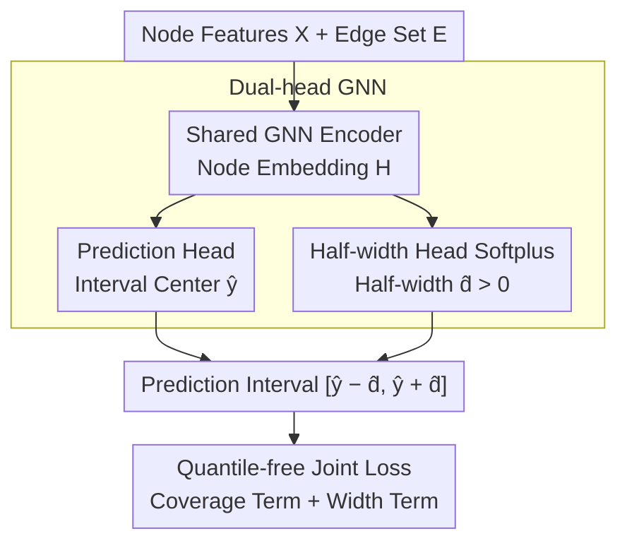

# Quantile-Free Uncertainty Quantification in Graph Neural Networks

**Conference**: ICML 2026  
**arXiv**: [2605.04847](https://arxiv.org/abs/2605.04847)  
**Code**: Available (Paper labeled anonymous.4open.science/r/QpiGNN-30808)  
**Area**: Graph Neural Networks / Uncertainty Quantification / Node Regression  
**Keywords**: GNN, Prediction Interval, Quantile Regression, Dual-head Architecture, Label-only Loss

## TL;DR
QpiGNN proposes a "quantile-input-free, post-processing-free" GNN node-level prediction interval framework. By utilizing a dual-head GNN (one head for mean prediction, one for half-width) combined with a label-level joint loss that directly optimizes "coverage + interval width," it achieves a 22% increase in average coverage and a 50% reduction in interval width across 19 synthetic/real datasets.

## Background & Motivation

**Background**: Node regression GNNs are widely used in high-risk areas such as healthcare and criminal justice. However, most GNNs only output point estimates without quantifying uncertainty. Available Uncertainty Quantification (UQ) methods are primarily categorized into two types: Bayesian (VI, posterior approximation; poor scalability and sensitive to priors) and Frequentist (resampling like ensembles, or post-hoc calibration like Conformal Prediction). Frequentist methods are computationally expensive and often rely on the **exchangeability** assumption, which is almost inherently violated in graph data due to structural dependencies.

**Limitations of Prior Work**: Quantile Regression (QR) appears to be a good choice to bypass distributional assumptions, but standard QR requires the quantile level $\tau$ as an input or trains independent models for each $\tau$, leading to issues like "quantile crossing" (lower quantile predictions exceeding higher ones). SQR learns multiple quantiles in one model, and RQR uses a width-regularized loss for MLPs to estimate center + spread. However, **direct transfers to GNNs often fail**: message passing causes node representations to be oversmoothed; SQR becomes unstable on graphs, leading to calibration failure; and the single-head design of RQR causes gradient interference between center and spread representations.

**Key Challenge**: The bottleneck of the QR series lies in the "quantile input + single-head representation," which is structurally incompatible with the "neighborhood aggregation producing globally smooth representations" in GNNs. To leverage GNN relational modeling while obtaining node-level adaptive tight intervals, "prediction" and "uncertainty" must be decoupled at both the architectural and supervisory levels.

**Goal**: (i) Design a GNN UQ framework that does not rely on quantile inputs or post-hoc calibration; (ii) provide theoretical guarantees for coverage and width under graph dependency; (iii) balance calibration and compactness.

**Key Insight**: The authors found that RQR on MLPs can learn input-dependent upper and lower bounds using a "label-only" loss, suggesting that the "quantile input" of QR can be bypassed. Since the root cause of oversmoothing in GNNs is single-head sharing, these constraints can be resolved using **dual-head decoupling + direct label supervision**.

**Core Idea**: Utilize a **dual-head GNN (one for predicting $\hat y$, one for predicting half-width $\hat d$)** + a **quantile-free joint loss** (directly penalizing "$\hat c$ deviation from $1-\alpha$" and "average interval width"). This requires neither quantile inputs nor post-processing.

## Method

### Overall Architecture
QpiGNN solves the problem of providing both a point estimate and a compact, calibrated prediction interval for GNN node regression without relying on quantile inputs or post-hoc conformal calibration. The approach decouples "prediction" and "uncertainty" in both architecture and supervision: a shared GNN encoder first computes node embeddings $\mathbf H=\text{GNN}(\mathbf X,\mathcal E)$, followed by two linear heads—a prediction head for the interval center $\hat y$, and a half-width head for the half-width $\hat d$. The interval is defined as $[\hat y_v-\hat d_v,\ \hat y_v+\hat d_v]$. During training, a joint loss is optimized using labels to pull "coverage close to the target" while keeping the "interval as narrow as possible." Inference requires a single forward pass to obtain calibrated intervals without a calibration set or post-processing.

> The coverage guarantee under graph dependency (Design 3) serves as theoretical support for the joint loss rather than a data processing stage, hence it is not listed as a separate node in the flowchart.

### Key Designs

**1. Dual-head GNN: Decoupling Prediction and Uncertainty at the Representation Layer**

The root cause of QR methods failing on GNNs is the shared single-head representation—message passing repeatedly averages neighborhoods, and a single-head model pushes both the interval center and half-width toward local means, smoothing out node-level adaptivity. QpiGNN branches into two independent linear heads above the shared encoding $\mathbf H$: a prediction head $\hat{\mathbf y}=\mathbf W_{\text{pred}}\mathbf H+\mathbf b_{\text{pred}}$ focusing on accuracy, and a half-width head $\hat{\mathbf d}=\text{Softplus}(\mathbf W_{\text{diff}}\mathbf H+\mathbf b_{\text{diff}})$ focusing on coverage. The Softplus activation ensures $\hat d>0$, making the interval naturally well-ordered and preventing quantile crossing. This structural decoupling allows the half-width head to learn a function class entirely different from the center—for instance, providing wider intervals for hub nodes without being influenced by the smoothing trend of the center head. This echoes the heteroscedastic/Bayesian regression empirical findings of Kendall & Gal and Lakshminarayanan regarding "learning different signals via separate heads," but here the purpose is specifically to block the contamination of the half-width head by oversmoothing.

**2. Quantile-free Joint Loss: Simultaneous Coverage Calibration and Interval Compression via Labels**

Standard QR requires quantile levels $\tau$ as input, while RQR-W mixes coverage and width into a single conditional loss, which is pushed toward globally wide intervals by GNN oversmoothing. QpiGNN removes the quantile input and supervises via a three-term label-level additive loss:

$$\mathcal L_{\text{total}}=\underbrace{(\hat c-(1-\alpha))^2 + \hat\ell_{\text{viol}}}_{\mathcal L_{\text{coverage}}} + \underbrace{\lambda_{\text{width}}\cdot\mathbb E_v[\hat y_v^{\text{up}}-\hat y_v^{\text{low}}]}_{\mathcal L_{\text{width}}}$$

Where $\hat c=\mathbb P(\hat y_v^{\text{low}}\le y_v\le \hat y_v^{\text{up}})$ is the empirical coverage; the squared term pulls it toward the target $1-\alpha$. The violation penalty $\hat\ell_{\text{viol}}=\mathbb E[|y_v-\hat y_v^{\text{low}}|\cdot\mathds 1[y_v<\hat y_v^{\text{low}}]+|y_v-\hat y_v^{\text{up}}|\cdot\mathds 1[y_v>\hat y_v^{\text{up}}]]$ provides fine-grained gradients based on the distance for nodes outside the interval. The width penalty uses $L_1$ instead of $L_2$ to prevent outliers from inflating the width term. Decoupling coverage and width into additive terms allows for a clear training sequence—attaining the target $\hat c$ first, then compressing width while maintaining coverage. This corresponds to the Lagrangian relaxation of a constrained optimization where the hyperparameter $\lambda_{\text{width}}\in[0.2,0.5]$ (selected via Bayesian Optimization) acts as the multiplier.

**3. Coverage Guarantee under Graph Dependency: Bypassing Exchangeability**

The coverage guarantees of CP rely on exchangeability, which graph data naturally violates. QpiGNN reconstructs guarantees based on "approximate bounded-difference under neighborhood smoothing." Proposition 4.1 uses the Weak Law of Large Numbers to show asymptotic convergence $\hat c\xrightarrow{P}1-\alpha$ under assumptions of bounded weakly correlated noise $\varepsilon_v$, convergence of $\hat y_v$ and $\hat d_v$ to the target, and sufficient diversity of node embeddings. For finite samples, McDiarmid/Hoeffding inequalities are used: the impact of single-node perturbations on coverage estimation is bounded by $1/N+\delta_G$, leading to $|\hat c-(1-\alpha)|=\mathcal O(1/\sqrt N)$, providing a practical Frequentist bound. Furthermore, under the assumption that $P(y\mid x_v)$ is symmetric, the minimum width satisfies $d_v^*=F_v^{-1}(1-\alpha/2)$, proving the joint loss is a Lagrangian relaxation of the constrained optimization.

### Loss & Training
End-to-end SGD training is applied to the weighted sum of the three terms, with a diminishing learning rate to ensure convergence to a stationary point under non-convexity. $\alpha$ is typically set to $0.1$ (target 90% coverage), and $\lambda_{\text{width}}\in[0.2,0.5]$ is selected via BO. For comparison, the authors also implemented a GNN variant of RQR, adding an ordering penalty $\gamma_{\text{order}}\cdot\text{ReLU}(\hat y^{\text{low}}-\hat y^{\text{up}})$ to mitigate its quantile crossing.

## Key Experimental Results

### Main Results
Evaluated on 19 datasets (9 synthetic structures like BA/ER/Grid/Tree + real-world datasets) using PICP (empirical coverage) and MPIW (mean prediction interval width) as metrics, with a 90% target coverage.

| Dataset (Synthetic) | Model | PICP | MPIW |
|---|---|---|---|
| Basic | SQR-GNN | 0.85 | 0.33 |
| Basic | RQR^adj-GNN | 0.90 | 0.82 |
| Basic | CF-GNN | 0.92 | 1.90 |
| Basic | BayesianNN | 1.00 | 3.01 |
| Basic | **Ours** | **≥0.90** | **Smallest valid** |
| Gaussian | RQR^adj-GNN | 0.88 | 0.53 |
| Gaussian | CF-GNN | 0.91 | 2.90 |
| Gaussian | **Ours** | **≥0.90** | Significantly smallest |
| Grid | RQR^adj-GNN | 0.72 | 0.48 |
| Grid | **Ours** | **≥0.90** | Smallest valid |

On average, Ours achieves 22% higher coverage and 50% narrower width than all baselines. SQR-GNN often under-covers (0.75–0.85), BayesianNN reaches full coverage but with a fixed width ≈3, which is impractical; CF-GNN (conformal) meets coverage targets but width is inflated by structural heterogeneity (MPIW 6.89 on BA, 11.92 on Grid).

### Ablation Study

| Configuration | Explanation | Effect |
|---|---|---|
| Full QpiGNN | dual-head + joint loss | Optimal |
| Single-head + joint loss | Shared representation for center+spread | Valid coverage but increased width |
| Dual-head + fixed-margin | Half-width set to constant | No node-level adaptivity |
| Dual-head + RQR-W loss | Using entangled loss | Oversmoothing recurs |
| $\mathcal L_{\text{coverage}}$ only | No width compression | Valid coverage but extremely wide |
| $\mathcal L_{\text{width}}$ only | No coverage constraint | Intervals collapse to 0 |

### Key Findings
- **Dual-head + joint loss are both essential**: Removing either leads to collapsed coverage or exploded width.
- **CP is ill-suited for graphs**: CF-GNN suffers from explosive MPIW on structurally heterogeneous (hub/heterophily) graphs, validating the failure of the exchangeability assumption.
- **Training trajectory aligns with Lagrangian intuition**: The loss quickly reduces coverage violation, followed by continuous compression of the interval width.

## Highlights & Insights
- **Removing the "Quantile Input" from QR**: Previously, it was assumed QR must be conditioned on $\tau$. This paper proves that with the "dual-head + label-only loss" combination, the quantile input is redundant if the architecture and supervision form are correct—a paradigm shift for the field of quantile regression.
- **Clever use of the Dual-head concept**: While dual-heads (Kendall & Gal) for learning prediction and variance are not new, the purpose here is distinct—to **block GNN message passing from oversmoothing the spread head**. This perspective of "repurposing old architectures for new problems" is insightful.
- **Graph-dependent finite sample coverage bounds**: By not relying on exchangeability and using McDiarmid's bounded-difference for graph data, the paper provides a practical $\mathcal O(1/\sqrt N)$ bound, offering a feasible path to migrate CP-style Frequentist guarantees to graph-dependent data.

## Limitations & Future Work
- The theoretical symmetry assumption ($P(y\mid x_v)$ is symmetric) does not strictly hold for skewed distributions; the authors acknowledge this as a sketch.
- $\lambda_{\text{width}}$ still requires BO; an adaptive weight annealing strategy could further reduce tuning costs.
- Experiments focus on node regression; extension to node classification (discrete output), link prediction, and graph regression remains to be verified.
- Comparisons could be broader against modern conformal variants (local CP, weighted CP), as the current focus is mainly on CF-GNN.

## Related Work & Insights
- **vs SQR-GNN**: Uses a single model + continuous quantile sampling, but calibration is unstable under GNN smoothing; QpiGNN removes quantile input.
- **vs RQR-GNN**: Width-regularized losses effective on MLPs fail with single-head GNNs; QpiGNN succeeds via dual-head + decoupled loss.
- **vs CF-GNN (Conformal)**: CP's MPIW explodes on heterogeneous graphs; QpiGNN is stable as it does not rely on exchangeability.
- **vs Bayesian/MC-Dropout/Ensembles**: Bayesian methods lack scalability or have inflated widths; ensembles are expensive. QpiGNN provides node-level intervals with a single model and forward pass.

## Rating
- Novelty: ⭐⭐⭐⭐ High originality in simultaneously removing "quantile input" and "post-hoc calibration."
- Experimental Thoroughness: ⭐⭐⭐⭐⭐ Comparison on 19 datasets against 7+ baselines using PICP/MPIW, covering synthetic, real, and structurally heterogeneous scenarios.
- Writing Quality: ⭐⭐⭐⭐ Motivated step-by-step with theoretical and experimental cross-validation; however, theorem statements are somewhat sketchy.
- Value: ⭐⭐⭐⭐ Provides a practical post-processing-free route for GNN node-level UQ, directly beneficial for medical/financial graph regression applications.

<!-- RELATED:START -->

## Related Papers

- [\[ICML 2026\] GILT: An LLM-Free, Tuning-Free Graph Foundational Model for In-Context Learning](gilt_an_llm-free_tuning-free_graph_foundational_model_for_in-context_learning.md)
- [\[ICML 2026\] L2G-Net: Local to Global Spectral Graph Neural Networks via Cauchy Factorizations](l2g-net_local_to_global_spectral_graph_neural_networks_via_cauchy_factorizations.md)
- [\[ICLR 2026\] Are We Measuring Oversmoothing in Graph Neural Networks Correctly?](../../ICLR2026/graph_learning/are_we_measuring_oversmoothing_in_graph_neural_networks_correctly.md)
- [\[CVPR 2026\] Adaptive Learned Image Compression with Graph Neural Networks](../../CVPR2026/graph_learning/adaptive_learned_image_compression_with_graph_neural_networks.md)
- [\[ACL 2026\] From Nodes to Narratives: Explaining Graph Neural Networks with LLMs and Graph Context](../../ACL2026/graph_learning/from_nodes_to_narratives_explaining_graph_neural_networks_with_llms_and_graph_co.md)

<!-- RELATED:END -->
