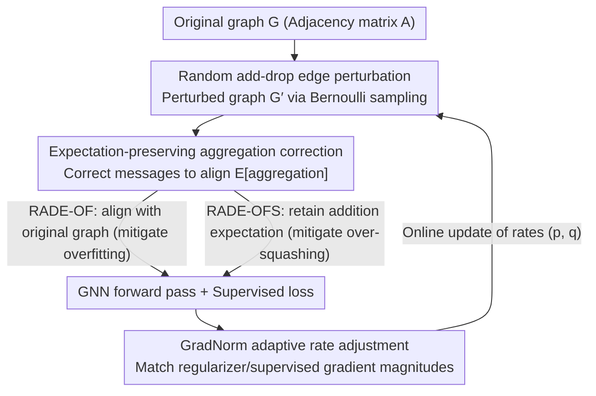

# RADE: Random Add-Drop Edge as a Regularizer

**Conference**: ICML 2026  
**arXiv**: [2606.00757](https://arxiv.org/abs/2606.00757)  
**Code**: https://github.com/Danial-sb/RADE  
**Area**: Graph Learning / GNN Regularization  
**Keywords**: GNN Regularization, Overfitting, Over-squashing, Random Graph Augmentation, Training-Inference Alignment

## TL;DR
RADE simultaneously performs random edge deletion and addition during GNN training, aligns training and inference through "expectation-preserving" aggregation correction, and adaptively tunes add/drop rates using GradNorm, allowing a single augmentation to mitigate both overfitting and over-squashing.

## Background & Motivation

**Background**: The message-passing mechanism of GNNs (MPNNs) inherently faces two major pain points: first, **overfitting**, which is shared with all deep models; and second, **over-squashing**, which is unique to MPNNs—where receptive fields expand exponentially while representation dimensions remain finite, causing long-range information to collapse. Mature solutions exist for each: random graph augmentations (e.g., DropEdge) use perturbations as implicit regularization for overfitting, while rewiring, virtual nodes, or Graph Transformers mitigate over-squashing by adding edges.

**Limitations of Prior Work**: These two approaches are used in isolation. DropEdge-style deletion augmentations are irrelevant to over-squashing (deleting edges exacerbates bottlenecks) and suffer from **training-inference mismatch**—train time uses perturbed sparse graphs while inference uses the original graph, leading to inconsistent aggregation expectations. Rewiring methods construct a single deterministic dense graph, lacking randomness and thus providing no regularization effect. Both paths also suffer from the engineering burden of manually tuning the perturbation rate $p$ per dataset.

**Key Challenge**: Randomness and connectivity enhancement are viewed as separate goals, but "adding edges" can both inject randomness (→ regularization) and create shortcuts (→ mitigating over-squashing). The problem is that constantly switching perturbed graphs during training while using a fixed graph during inference leads to mismatched aggregation expectations. This distribution shift harms generalization.

**Goal**: (1) Design a unified graph augmentation that incorporates both "deletion for regularization" and "addition for connectivity enhancement"; (2) Derive explicit aggregation correction rules so that perturbed aggregation during training equals a target aggregation in expectation; (3) Eliminate manual tuning of perturbation rates $p$ and $q$.

**Key Insight**: The authors characterize graph augmentation as a conditional distribution $\mathcal{Q}(\cdot \mid \mathcal{G})$ and propose "Expectation-Preserving Aggregation" as an alignment criterion: requiring $\mathbb{E}_{\mathcal{G}'}[\widetilde{\mathbf{a}}_i^{(\mathcal{G}',\ell)}] = \mathbf{a}_i^{(\mathcal{G},\ell)}$. Once this holds, random perturbations contribute only zero-mean aggregation noise, falling into the "variance-based implicit regularization" framework of Fang et al.: $\mathbb{E}[\tilde{L}_{\mathrm{BCE}}] \approx L_{\mathrm{BCE}} + \tfrac{1}{2}\sum_i z_i(1-z_i)\mathrm{Var}(\delta_i)$.

**Core Idea**: Randomly add edges while deleting them, and apply explicit corrections to messages for each edge/non-edge. The correction target can be the original graph aggregation (mitigating only overfitting) or a modified aggregation including "addition expectations" (mitigating both), unifying both types of augmentation in a view-sampling framework.

## Method

### Overall Architecture
RADE addresses the dilemma where DropEdge's training-inference mismatch harms generalization and rewiring lacks regularization. RADE integrates both into one sampling framework: in each epoch, a perturbed adjacency matrix $\mathbf{A}'$ is obtained via Bernoulli sampling (existing edges kept with $1-p$, non-edges added with $q$). Weighted sum aggregation $\widetilde{\mathbf{a}}_i^{(\mathcal{G}',\ell)} = \sum_{j\neq i} \alpha_{ij}^{\mathcal{G}'} \widetilde{\mathbf{m}}_{ij}^{(\ell-1)}$ is performed on the perturbed graph $\mathcal{G}'$, but messages $\widetilde{\mathbf{m}}_{ij}$ undergo "expectation-preserving" correction so that training aggregation matches target aggregation in expectation. Rates $(p, q)$ are updated online using a GradNorm rule.

### Key Designs

**1. Random Add-Drop Perturbation: Unified regularization and connectivity**

DropEdge only deletes edges, which can worsen bottlenecks and does not address long-range collapse. RADE's starting point is that adding edges injects randomness (→ regularization) and creates shortcuts (→ mitigating over-squashing). Both are done in a single perturbation. Each element of the adjacency matrix is sampled independently: for existing edges $A_{ij}=1$, $A_{ij}' \sim \mathrm{Bernoulli}(1-p)$; for non-edges $A_{ij}=0$, $A_{ij}' \sim \mathrm{Bernoulli}(q)$. The matrix is then symmetrized and self-loops are handled. This framework subsumes prior methods: $q=0$ recovers DropEdge, while $p=0$ recovers pure random edge addition. To avoid enumerating all $|\overline{E}|$ non-edges, $K = q|\overline{E}|$ edges are added via hypergeometric sampling. Proposition 4.4 proves that Drop-only and Add-only are generally not interchangeable, justifying the need for both to achieve diverse variance spectra and open long-range communication.

**2. Expectation-Preserving Aggregation Correction: Derivable alignment**

The failure of random augmentation often stems from the training aggregation expectation not matching inference. RADE formalizes the alignment criterion: $\mathbb{E}_{\mathcal{G}'}[\widetilde{\mathbf{a}}_i^{(\mathcal{G}',\ell)}] = \mathbf{a}_i^{(\mathcal{G},\ell)}$. When this holds, perturbations act as zero-mean noise. Two sets of rules are provided based on the target graph. **RADE-OF** (overfitting only) aligns training with the original graph: existing edges are rescaled by $\widetilde{\mathbf{m}}_{ij} = \frac{\alpha_{ij}^{\mathcal{G}}}{\mathbb{E}[\alpha_{ij}^{\mathcal{G}'}]} \mathbf{m}_{ij}$, while non-edges subtract the weighted mean of non-neighbors $\widetilde{\mathbf{m}}_{ij} = \mathbf{m}_{ij} - \boldsymbol{\mu}_i$ (where $\boldsymbol{\mu}_i = \tfrac{1}{Z_i}\sum_{j:A_{ij}=0}\mathbb{E}[\alpha_{ij}^{\mathcal{G}'}]\mathbf{m}_{ij}$), making the expected contribution of added edges zero. **RADE-OFS** (over-squashing too) corrects only deletion expectations, intentionally retaining addition expectations in inference:

$$\widehat{\mathbf{a}}_i^{(\mathcal{G},\ell)} = \mathbf{a}_i^{(\mathcal{G},\ell)} + \sum_{j:A_{ij}=0}\mathbb{E}[\alpha_{ij}^{\mathcal{G}'}]\mathbf{m}_{ij}$$

Inference effectively sees a "soft-densified" graph with explicit long-range shortcuts. Proposition 4.1/4.2 prove both are expectation-preserving. Calculating $\mathbb{E}[\alpha_{ij}^{\mathcal{G}'}]$ depends on the aggregator: GIN (sum) is analytically $1-p$ or $q$, but GCN/GAT involve perturbed degrees $d_i'$ in denominators, requiring delta-method approximations or empirical estimation. This explains why DropEdge only succeeds with sum aggregation and fails with weighted types; explicit correction provides a general rule.

**3. GradNorm Adaptive Rate Adjustment: Realizing "no-hyperparameter" tuning**

Traditional augmentations are sensitive to $p$. RADE replaces manual tuning by treating the variance-based regularizer $R(B, p, q) = \tfrac{1}{2}\sum_{i\in B} z_i(1-z_i)\mathrm{Var}(\delta_i)$ as an implicit loss. It requires the gradient magnitude $G_{\mathrm{reg}}^B = \|\nabla_{\boldsymbol{\theta}} R\|_2$ to match the supervised loss gradient $G_{\mathrm{data}}^B$. After each mini-batch, it optimizes:

$$\mathcal{J}(p, q) = \left[\log\frac{G_{\mathrm{reg}}^B + \epsilon}{G_{\mathrm{data}}^B + \epsilon}\right]^2 + \lambda \left(\frac{q}{D(\mathcal{G})}\right)^2$$

The first term uses log-ratio matching; the second term punishes excessive addition normalized by graph density $D(\mathcal{G})$. By optimizing a reparameterized $\rho = q/D(\mathcal{G})$, regularization strength is principledly tied to supervised gradient scales rather than being an empirical guess. $\lambda$ is fixed at the task level, eliminating dataset-specific tuning.

### Loss & Training
Supervised loss uses standard BCE/Cross-Entropy. Augmentations contribute implicit variance-based regularization (Eq. 5) via sampled perturbed graphs and corrected messages. Optimization uses Adam with a learning rate of 0.001. RADE initializes $p=0.5$ and $q = D(\mathcal{G})$, adaptively updated via GradNorm thereafter.

## Key Experimental Results

### Main Results

Node Classification (GCN backbone, 8 datasets, 5-run average, Micro-F1 for Flickr, Accuracy % for others):

| Method | Cora | CiteSeer | Computer | Physics | Flickr | ogbn-arxiv |
|------|------|----------|----------|---------|--------|------------|
| GCN | 80.10 | 69.12 | 89.63 | 96.52 | 51.89 | 70.51 |
| Dropout | 80.76 | 70.04 | 89.71 | 96.54 | 52.02 | 70.77 |
| DropEdge | 80.28 | 69.42 | 89.79 | 96.48 | 52.08 | 70.38 |
| DropMessage | 80.65 | 67.94 | 89.06 | 96.50 | 52.23 | 70.45 |
| **RADE-OF** | **81.08** | **70.20** | **90.22** | **96.58** | **52.25** | **71.09** |
| **RADE-OFS** | 80.82 | 70.12 | 89.94 | 96.53 | 51.92 | 70.95 |

Graph Classification (GCN backbone, Accuracy % for TU, ROC-AUC % for ogbg-molhiv, AP % for peptides-func):

| Method | MUTAG | PROTEINS | IMDB-B | ogbg-molhiv | peptides-func |
|------|-------|----------|--------|-------------|---------------|
| GCN | 84.00 | 75.37 | 75.70 | 75.21 | 55.14 |
| DropEdge | 84.50 | 75.29 | 75.70 | 76.01 | 55.29 |
| DropMessage | 86.08 | 75.45 | 75.40 | 74.21 | 54.98 |
| RADE-OF | 86.16 | 75.62 | 76.20 | 76.09 | 56.12 |
| **RADE-OFS** | **86.24** | **75.84** | **76.60** | **76.28** | **56.97** |

### Ablation Study (Node classification, RADE-OF / GCN backbone)

| Configuration | Cora | Flickr | ogbn-arxiv | Description |
|------|------|--------|------------|------|
| RADE-OF | **81.08** | **52.25** | **71.09** | Full model |
| w/o GN | 80.90 | 51.42 | 70.52 | Removing GradNorm → Flickr drops 0.83 |
| w/o GN & EPC | 78.94 | 49.35 | 70.33 | Removing EPC → Cora drops 2.14, Flickr drops 2.90 |
| RADE-OF-Lin | 80.42 | 50.65 | 69.92 | Linearized backbone |
| RADE-OF-Lin w/o GN & EPC | 77.80 | 50.09 | 68.72 | Full removal → Significant degradation |
| GCN-Lin (SGC) | 79.60 | 50.12 | 68.67 | Baseline reference |

### Key Findings
- **EPC is the primary contributor**: Removing EPC drops performance significantly (~2 pts on Cora, ~3 pts on Flickr), proving training-inference alignment is the actual lever of RADE.
- **GradNorm outperforms manual tuning**: On large graphs like Flickr, the w/o GN configuration drops 0.5–0.8 pts, while GN saves the cost of grid-searching $p$.
- **RADE-OFS excels in long-range tasks**: On peptides-func (LRGB long-range benchmark), RADE-OFS improves AP by 1.83 over GCN and 0.85 over RADE-OF, validating the efficacy of retaining addition expectations for over-squashing.
- **Add + Drop are complementary**: Proposition 4.4 confirms they aren't interchangeable as they scale different node-level statistics; add-only/drop-only are both weaker than joint perturbation.

## Highlights & Insights
- **"Expectation-Preserving Aggregation" as a Principle**: It serves as both an alignment criterion and a constructive principle for deriving correction rules for any weighted-sum aggregator, generalizing beyond DropEdge's sum-only scaling.
- **Dual Nature of Edge Addition**: The authors rediscover that random addition is both a noise source (regularization) and a shortcut (connectivity). Controlling which face is shown to inference via OF/OFS is a portable design pattern for GNN operators.
- **GradNorm for Implicit-Explicit Gradient Matching**: Adapting GradNorm from multi-task balancing to "Supervised vs. Variance-Regularizer" matching provides a clean, automatic tuning paradigm for any stochastic regularization like DropMessage or Mixup.

## Limitations & Future Work
- Expectations $\mathbb{E}[\alpha_{ij}^{\mathcal{G}'}]$ for GCN/GAT lack closed-form solutions, requiring delta-method approximations or sampling, which may introduce errors on small graphs or high-variance nodes.
- Theoretical derivations for non-linear GNNs rely on linear approximations (ignoring non-linear bias), lacking rigorous bounds for deep stacks.
- The proof of non-interchangeability is limited to sum aggregation, leaving guidance for other aggregators incomplete.
- Computational overhead of GradNorm, resampling, and EPC calculation per mini-batch may be a factor on giant graphs (>10M nodes).

## Related Work & Insights
- **vs. DropEdge (Rong et al., 2020)**: DropEdge only deletes edges, lacks explicit alignment (only coincidentally works for sum aggregation), and ignores over-squashing. RADE-OF subsumes it as a $q=0$ case and generalizes corrections.
- **vs. DropMessage (Fang et al., 2023)**: Both share the variance regularization perspective, but DropMessage cannot mitigate over-squashing or carry addition expectations into inference.
- **vs. Rewiring (Alon & Yahav, 2021)**: Rewiring is deterministic with no regularization; RADE-OFS achieves "soft rewiring" in expectation through a random process, gaining regularization.
- **vs. GradNorm (Chen et al., 2018)**: Porting gradient matching to the "loss vs. implicit regularizer" scale is the key to RADE's hyperparameter-free nature.

## Rating
- Novelty: ⭐⭐⭐⭐ Unifies add/drop, expectation alignment, and adaptive tuning into a clean framework.
- Experimental Thoroughness: ⭐⭐⭐⭐ Covers 14 datasets across node/graph tasks; though comparisons with Graph Transformers on LRGB are limited.
- Writing Quality: ⭐⭐⭐⭐ Well-organized propositions, proofs, and clear comparative tables.
- Value: ⭐⭐⭐⭐ Provides a principled solution to the training-inference mismatch in stochastic augmentations and is engineering-friendly.

<!-- RELATED:START -->

## Related Papers

- [\[ICLR 2026\] Neural Graduated Assignment for Maximum Common Edge Subgraphs](../../ICLR2026/graph_learning/neural_graduated_assignment_for_maximum_common_edge_subgraphs.md)
- [\[ICLR 2026\] Graph Random Features for Scalable Gaussian Processes](../../ICLR2026/graph_learning/graph_random_features_for_scalable_gaussian_processes.md)
- [\[ICLR 2026\] FLOCK: A Knowledge Graph Foundation Model via Learning on Random Walks](../../ICLR2026/graph_learning/flock_a_knowledge_graph_foundation_model_via_learning_on_random_walks.md)
- [\[ACL 2026\] Evaluating LLMs on Large-Scale Graph Property Estimation via Random Walks](../../ACL2026/graph_learning/evaluating_llms_on_large-scale_graph_property_estimation_via_random_walks.md)
- [\[AAAI 2026\] Kernelized Edge Attention: Addressing Semantic Attention Blurring in Temporal Graph Neural Networks](../../AAAI2026/graph_learning/kernelized_edge_attention_addressing_semantic_attention_blurring_in_temporal_gra.md)

<!-- RELATED:END -->
