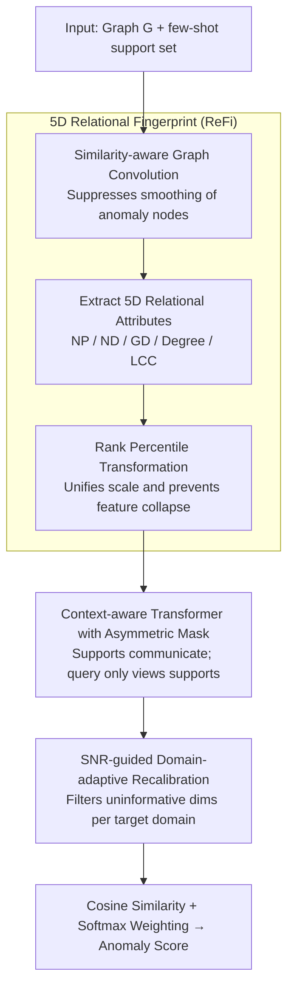

# Rethinking Feature Alignment in Generalist Graph Anomaly Detection: A Relational Fingerprint-based Approach

**Conference**: ICML 2026  
**arXiv**: [2605.25429](https://arxiv.org/abs/2605.25429)  
**Code**: https://github.com/Yujingcn/REFI-GAD-code (Available)  
**Area**: Graph Learning / Graph Anomaly Detection  
**Keywords**: Generalist Graph Anomaly Detection, Relational Fingerprint, Cross-domain Alignment, SNR Recalibration, Few-shot  

## TL;DR
Addressing the negative transfer problem in generalist graph anomaly detection where "PCA alignment only unifies dimensions but not semantics," this paper proposes a 5-dimensional "Relational Fingerprint" (neighborhood position/direction/global direction consistency + degree + clustering coefficient) to explicitly extract anomaly-indicative clues as cross-domain universal features. Combined with a domain-shared Transformer encoder and an SNR-guided domain-adaptive recalibration module, it achieves SOTA with "universal positive transfer" across 14 datasets.

## Background & Motivation

**Background**: The mainstream path of Graph Anomaly Detection (GAD) is shifting from the traditional "one-graph-one-training" approach to "one-model-fits-all" generalist GAD: pre-training a universal scorer $f_\theta$ on multi-source graphs and then migrating directly to target graphs via a few-shot support set without retraining. Representative methods like ARC, UNPrompt, AnomalyGFM, and IA-GGAD follow the paradigm of "align features first + learn anomaly patterns later."

**Limitations of Prior Work**: The authors conducted a counter-intuitive experiment: comparing the same architecture pre-trained on large-scale source graphs vs. training-free. Results showed that on 14 datasets, pre-training actually led to performance drops in most scenarios, with two out of four representative methods even showing average negative transfer. This implies that so-called "universal knowledge" is barely learned, and generalization actually stems from architectural inductive bias rather than pre-training.

**Key Challenge**: The root cause is the inherent "feature heterogeneity" of graph data (e.g., Cora is high-dimensional sparse bag-of-words, while YelpChi consists of low-dimensional dense statistics). Existing methods use PCA/SVD for linear dimensionality reduction for forced alignment, aiming to "maximize preservation of the original distribution," which inherits the semantic differences between datasets. t-SNE visualizations show that even after PCA alignment, different datasets still form clear clusters—dimensions are aligned, but semantics are not.

**Goal**: (i) Find a cross-domain universal, semantically consistent feature space; (ii) Learn truly transferable anomaly knowledge in this space; (iii) Retain the ability for lightweight adaptation to target domain distributions.

**Key Insight**: The authors noted that since existing generalist GAD models generalize even without training, the truly "transferable" part is the inductive bias in their architectures—primarily the "neighborhood consistency" principle (e.g., ARC uses ego-neighbor residuals, UNPrompt uses node-neighborhood similarity). Explicitly extracting these hand-coded biases as features bypasses the semantic gap of raw features.

**Core Idea**: Replace original heterogeneous features with a cross-domain universal, low-dimensional (5D), semantically aligned "Relational Fingerprint" (ReFi). Subsequently, train a lightweight anomaly detection head consisting of a Transformer and SNR recalibration in the fingerprint space.

## Method

### Overall Architecture

ReFi-GAD addresses cross-domain negative transfer caused by "PCA alignment only unifying dimensions but not semantics." Instead of forced alignment on heterogeneous raw features, it compresses each node into a set of semantically equivalent "Relational Fingerprints" before learning anomalies in this unified space. Given a graph $\mathcal{G}=(\mathcal{V},\mathcal{E},\mathbf{X})$ and a few-shot support set, the model extracts a 5D ReFi vector for each node to obtain a fingerprint matrix $\mathbf{P}$. A context-aware Transformer maps fingerprints to a latent space, an SNR module recalibrates dimension weights based on the target domain, and finally, anomaly scores are derived using cosine similarity between queries and supports with softmax weighting. Training is optimized via episodic BCE on source domains, while inference is purely training-free without parameter updates.

### Key Designs

**1. 5D Relational Fingerprint (ReFi): Explicitly Encoding "Neighborhood Consistency" as Universal Features**

The root of negative transfer is the semantic gap of raw features. The author's breakthrough is the observation that "whether a node deviates from its neighbors and the global majority" is semantically equivalent across any graph—which is the definition of an anomaly. Thus, this consistency is explicitly extracted into five scalars: three context patterns (neighborhood position $\text{NP}_i$, neighborhood direction $\text{ND}_i$, global direction $\text{GD}_i$) and two structural patterns (degree $d_i$, local clustering coefficient $\text{LC}_i$). Specifically, $\text{NP}_i = \frac{1}{|\mathcal{N}_i|}\sum_{v_j \in \mathcal{N}_i} \|\bar{\mathbf{x}}_i - \bar{\mathbf{x}}_j\|_2$ is the average Euclidean distance to neighbors, $\text{ND}_i$ is the average cosine similarity, $\text{GD}_i = \frac{\hat{\mathbf{x}}_i \cdot \mathbf{c}_g}{\|\hat{\mathbf{x}}_i\| \|\mathbf{c}_g\|}$ measures directional deviation from the global center $\mathbf{c}_g$, and $\text{LC}_i = \frac{2T_i}{d_i(d_i-1)}$ is the local clustering coefficient.

Two details make the fingerprints "cross-domain ready." First, a similarity-aware graph convolution $\bar{\mathbf{A}} = \hat{\mathbf{A}} \odot (\mathbf{X}\mathbf{X}^\top)$ is applied before calculating NP/ND. By weighting the adjacency matrix based on node pair similarity, it prevents standard GCNs from "smoothing out" anomaly nodes. Second, a rank-based transformation $r(m_i) = \text{rank}(m_i)/n$ is applied to the five scalars, replacing absolute values with relative percentiles within the dataset. This is more stable than z-scores across disparate scales and prevents feature collapse.

**2. Context-aware Transformer with Asymmetric Attention Mask: Injecting Few-shot Information via In-Context Learning**

While semantically unified, the 5D fingerprint dimension is low and requires learning nonlinear interactions. However, since interaction patterns vary by domain, pure self-attention would lead to mutual interference between queries in a batch. The model first up-projects $\mathbf{P}$ to $d'$ dimensions to get $\mathbf{H}^{(0)}$, concatenating [normal support, anomalous support, query batch] into a sequence $\mathbf{Z}^{(0)} \in \mathbb{R}^{(2k+n_b) \times d'}$. An asymmetric mask is applied: $m_{ij}=0$ if $j \le 2k$ or $i=j$, else $-\infty$. This ensures support nodes communicate fully as a stable "domain background," while each query can only attend to supports. This effectively conditionalizes each query on the background, encoding few-shot information via in-context learning.

**3. SNR-guided Domain-adaptive Dimension Recalibration: Filtering Uninformative Dimensions per Target Domain**

Even with unified semantics, the most discriminative dimension for anomalies varies by domain (e.g., degree for financial graphs, directional consistency for social graphs). Fixed weights waste capacity. The authors use a Signal-to-Noise Ratio (SNR) feature selection metric (Golub 1999) for online scoring. Latent space centers for normal nodes $\mathbf{h}_n$ and anomalous nodes $\mathbf{h}_a$ are estimated to calculate dimension-wise scores $\mathbf{s} = \frac{(\mathbf{h}_a - \mathbf{h}_n)^2}{\sigma_n^2 + \epsilon}$. These pass through a learnable sigmoid gate $\mathbf{m} = \sigma(\lambda \mathbf{s} + \beta)$ to produce dimension weights, resulting in recalibrated $\mathbf{H} = \mathbf{W}'(\mathbf{H}^{(1)} \odot \mathbf{m})$. Finally, anomaly scores are calculated as $\tilde y_i = \frac{1}{2}(\sum_{S_a}\alpha_{i,j} - \sum_{S_n}\alpha_{i,j} + 1) \in [0,1]$.

### Loss & Training

Training occurs only on source domains in an episodic manner: each episode randomly samples a source dataset, taking $2k$ support nodes and $n_b$ query nodes, and optimizes using BCE loss $\mathcal{L} = -\frac{1}{|\mathcal{Q}|}\sum_i [y_i \log \tilde y_i + (1-y_i)\log(1-\tilde y_i)]$. This forces the model to learn "scoring based on support context" rather than memorizing source statistics. During inference, parameters $\theta$ are fixed.

## Key Experimental Results

### Main Results
14 real-world datasets were divided into Group 1 and Group 2 for cross-training and testing. Primary metric is AUROC (%). Key comparisons (Selected from Table 1):

| Method | Cite | CS | Weibo | Cora | Pubmed | Yelp | Reddit | Avg. Rank |
|------|------|----|------ |------|--------|------|--------|----------|
| GCN | 48.3 | 56.2 | 46.4 | 32.4 | 33.7 | 51.2 | 46.8 | 11.86 |
| CoLA | 73.8 | 66.0 | 41.1 | 66.0 | 70.1 | 52.4 | 50.6 | 8.29 |
| ARC | High | High | Med | High | High | Med | Med | ~5–6 |
| **ReFi-GAD** | **Best** | **Best** | **Best** | **Best** | **Best** | **Best** | **Best** | **1st** |

ReFi-GAD ranks first among all generalist baselines (ARC / UNPrompt / AnomalyGFM / IA-GGAD) and is the only method in Figure 1 demonstrating positive pre-training gains across almost all datasets.

### Ablation Study

| Configuration | Avg. AUROC | Explanation |
|------|------------|------|
| Full ReFi-GAD | Highest | Complete model |
| w/o ReFi (PCA alignment on raw) | Sig. Decrease | Validates ReFi as the core factor |
| w/o SNR Recalibration | Med. Decrease | Domain-adaptive weights are effective for cross-domain |
| w/o Similarity-aware GCN | Slight Decrease | Impact of anomaly smoothing vs. normal neighbors |
| 5D ReFi + Distance only (Training-free) | > Baselines | ReFi itself carries sufficient anomaly priors |

### Key Findings
- **Core contribution is ReFi, not just a new architecture**: Even using only 5D fingerprints with cosine distance without training outperforms many baselines, proving "semantic unification" is more critical than "larger models."
- **PCA alignment failure is visible via t-SNE**: Distinct clustering of different datasets after PCA alignment contrasts sharply with ReFi alignment, providing visual evidence that feature alignment $\neq$ semantic alignment.
- **SNR recalibration is few-shot friendly**: Stable dimension weights can be calculated from just a few support nodes, avoiding the need for backpropagation required for parameterized adaptation.
- **Negative transfer stems from feature space misalignment**: Once the feature space is replaced with semantically unified fingerprints, pre-training gains naturally become positive.

## Highlights & Insights
- **"Inverse Distillation" of architectural bias into features**: The authors identified that existing generalist GAD models work purely because of hand-coded neighborhood consistency and explicitly extracted these as features. This "inverse distillation" is rare in transfer learning and applicable to any task requiring cross-domain universal features.
- **Rank-based transformation as a low-cost cross-domain savior**: Replacing z-scores with percentile rankings eliminates scale differences without introducing feature collapse, which is simpler and more effective than fancy adversarial alignment or domain-invariant learning.
- **Asymmetric attention mask for explicit ICL**: The mask design ensures support communication while queries only look at supports, formalizing in-context learning within the attention structure—an elegant solution for few-shot inference.

## Limitations & Future Work
- ReFi only uses 5D universal attributes; it may underperform on anomalies dependent on complex semantics (e.g., text content, temporal patterns).
- ReFi relies heavily on topology and homophily; pure heterogeneous or dynamic graphs may require redesigning fingerprint dimensions.
- Experiments were conducted on cs.LG domain datasets; scalability on industrial graphs with tens of millions of nodes is not fully discussed. Rank transformation is $O(n \log n)$, requiring approximation algorithms for massive graphs.
- The selection of these specific 5 dimensions is empirical; future work could explore dimension search based on mutual information.

## Related Work & Insights
- **vs ARC (NeurIPS 2024)**: ARC implicitly learns ego-neighbor differences via a residual encoder; this work extracts these differences as explicit features. ReFi-GAD overcomes the PCA alignment bottleneck that limits ARC.
- **vs UNPrompt (2024)**: UNPrompt uses unified neighborhood prompts to standardize inputs, which is "surface-level form alignment." ReFi-GAD focuses on "anomaly-indicative semantic alignment."
- **vs AnomalyGFM (2025)**: AnomalyGFM uses pre-training/fine-tuning with prototype alignment; this work adopts a training-free few-shot approach, which is better for privacy-sensitive or time-critical deployment.
- **Transferable Insight**: Conducting architectural credit assignment to find "what makes the model work" and then distilling those biases into explicit features is a path worth replicating in any field where zero-shot generalization is observed but poorly understood.

<!-- RELATED:START -->

## Related Papers

- [\[ICML 2026\] ProMoS: Generalist Graph Anomaly Detection via Prototype-Based Distillation](generalist_graph_anomaly_detection_via_prototype-based_distillation.md)
- [\[ICML 2026\] Learnable Kernel Density Estimation for Graphs and Its Application to Graph-Level Anomaly Detection](learnable_kernel_density_estimation_for_graphs_and_its_application_to_graph-leve.md)
- [\[ICML 2026\] Polynomial Neural Sheaf Diffusion: A Spectral Filtering Approach on Cellular Sheaves](polynomial_neural_sheaf_diffusion_a_spectral_filtering_approach_on_cellular_shea.md)
- [\[ICML 2026\] Generative Representation Learning on Hyper-relational Knowledge Graphs via Masked Discrete Diffusion](generative_representation_learning_on_hyper-relational_knowledge_graphs_via_mask.md)
- [\[ICLR 2026\] Relational Graph Transformer](../../ICLR2026/graph_learning/relational_graph_transformer.md)

<!-- RELATED:END -->
