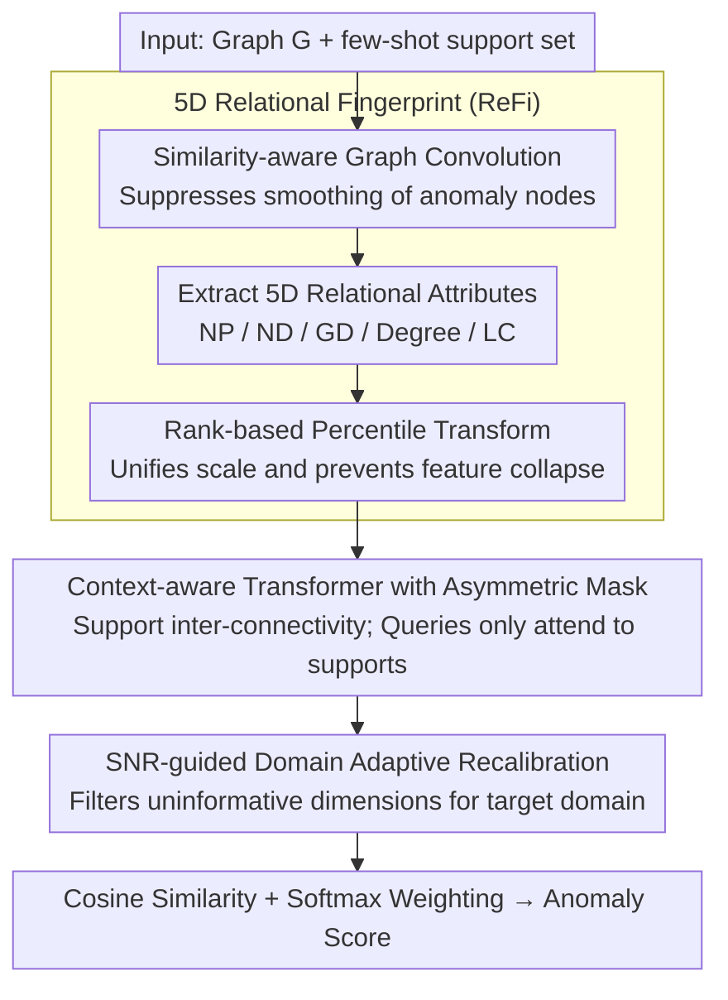

# Rethinking Feature Alignment in Generalist Graph Anomaly Detection: A Relational Fingerprint-based Approach

**Conference**: ICML 2026  
**arXiv**: [2605.25429](https://arxiv.org/abs/2605.25429)  
**Code**: https://github.com/Yujingcn/REFI-GAD-code (Available)  
**Area**: Graph Learning / Graph Anomaly Detection  
**Keywords**: Generalist Graph Anomaly Detection, Relational Fingerprint, Cross-domain Alignment, SNR Recalibration, Few-shot  

## TL;DR
Addressing the issue of "negative transfer" in generalist graph anomaly detection (GAD) where PCA alignment only unifies dimensions but fails to unify semantics, this paper explicitly extracts anomaly-indicative cues as cross-domain universal features using a 5-dimensional "Relational Fingerprint" (neighborhood position/direction/global alignment + degree + clustering coefficient). Combined with a shared Transformer encoder and an SNR-guided domain-adaptive recalibration module, the approach achieves "universal positive transfer" SOTA results across 14 datasets.

## Background & Motivation

**Background**: The mainstream paradigm of GAD is shifting from traditional "one-graph-one-training" methods to "one-model-fits-all" generalist GAD: pre-training a universal scorer $f_\theta$ on multi-source graphs and transferring it directly to target graphs via few-shot support sets without retraining. Representative methods like ARC, UNPrompt, AnomalyGFM, and IA-GGAD follow the "align features first + learn anomaly patterns second" paradigm.

**Limitations of Prior Work**: The authors present a counter-intuitive experiment demonstrating that pre-training existing generalist GAD models on large-scale source graphs often leads to performance degradation across 14 datasets compared to training-free counterparts. Among four representative methods, two even exhibit average negative transfer. This suggests that "universal knowledge" is rarely learned; generalization stems from architectural inductive bias rather than pre-training.

**Key Challenge**: The root cause is the inherent "feature heterogeneity" of graph data (e.g., Cora uses high-dimensional sparse bag-of-words, while YelpChi uses low-dimensional dense statistics). Current methods use PCA/SVD for linear reduction to force alignment, aiming to "maximize preservation of the original distribution." However, this inherits semantic differences between datasets. t-SNE visualizations show that even after PCA alignment, datasets remain in distinct clusters—dimensions are aligned, but semantics are not.

**Goal**: (i) Identify a cross-domain universal and semantically consistent feature space; (ii) Learn truly transferable anomaly knowledge within this space; (iii) Maintain lightweight adaptive capabilities for target domain distributions.

**Key Insight**: The authors observe that existing generalist GAD models generalize even without training because their inductive biases—specifically "neighborhood consistency"—are transferable (e.g., ARC uses ego-neighbor residuals, UNPrompt uses node-neighborhood similarity). Explicitly extracting these hand-coded biases as features bypasses the semantic gap of raw features.

**Core Idea**: Replace heterogeneous raw features with a cross-domain universal, low-dimensional (5D), and semantically aligned "Relational Fingerprint" (ReFi). A lightweight anomaly detection head comprising a Transformer and SNR recalibration is then trained in this fingerprint space.

## Method

### Overall Architecture

ReFi-GAD addresses negative transfer caused by PCA's failure to unify semantics. Instead of forcing alignment on heterogeneous raw features, it compresses each node into semantically equivalent "relational fingerprints." Given a graph $\mathcal{G}=(\mathcal{V},\mathcal{E},\mathbf{X})$ and a few-shot support set, the model extracts a 5D ReFi vector for each node to form a fingerprint matrix $\mathbf{P}$. A context-aware Transformer maps fingerprints to a latent space, an SNR module recalibrates dimension weights based on the target domain, and anomaly scores are computed via softmax-weighted cosine similarity between queries and supports. Training uses BCE optimization on source domains exclusively; inference is completely training-free for the support set.

### Key Designs

**1. 5D Relational Fingerprint (ReFi): Explicitly Encoding "Neighborhood Consistency"**

The source of negative transfer is the semantic gap in raw features. The breaking point identified by the authors is that the definition of an anomaly—"whether a node deviates from its neighbors and the global majority"—is semantically constant across domains. Thus, consistency is explicitly extracted into five scalars: three contextual modes (Neighborhood Position $\text{NP}_i$, Neighborhood Direction $\text{ND}_i$, Global Direction $\text{GD}_i$) and two structural modes (Degree $d_i$, Local Clustering Coefficient $\text{LC}_i$). Specifically, $\text{NP}_i = \frac{1}{|\mathcal{N}_i|}\sum_{v_j \in \mathcal{N}_i} \|\bar{\mathbf{x}}_i - \bar{\mathbf{x}}_j\|_2$, $\text{ND}_i$ is the average cosine similarity with neighbors, $\text{GD}_i = \frac{\hat{\mathbf{x}}_i \cdot \mathbf{c}_g}{\|\hat{\mathbf{x}}_i\| \|\mathbf{c}_g\|}$ measures directional deviation from the global center $\mathbf{c}_g$, and $\text{LC}_i = \frac{2T_i}{d_i(d_i-1)}$.

Two details ensure cross-domain utility. First, similarity-aware graph convolution $\bar{\mathbf{A}} = \hat{\mathbf{A}} \odot (\mathbf{X}\mathbf{X}^\top)$ is applied before computing NP/ND, weighting the adjacency matrix to prevent standard GCNs from smoothing out anomalies. Second, a rank-based transform $r(m_i) = \text{rank}(m_i)/n$ replaces absolute values with relative percentiles, which is more stable than z-score across varying dataset scales and prevents feature collapse.

**2. Context-aware Transformer with Asymmetric Mask: In-context Learning for Few-shot Injection**

To model non-linear interactions between the 5D fingerprints, an MLP projects $\mathbf{P}$ to $d'$ dimensions as $\mathbf{H}^{(0)}$. Sequences of length $2k+n_b$ are formed as [normal support, anomalous support, query batch]. An asymmetric mask is applied: $m_{ij}=0$ if $j \le 2k$ or $i=j$, else $-\infty$. This allows support nodes to communicate as a stable "domain background" while queries attend only to supports. This encodes few-shot information via in-context learning rather than gradient updates.

**3. SNR-guided Domain Adaptive Recalibration: Filtering Uninformative Dimensions**

Since the discriminative power of each fingerprint dimension varies by domain (e.g., degree is crucial in financial graphs, direction in social graphs), the model uses Signal-to-Noise Ratio (SNR) for online feature selection. It estimates normal centers $\mathbf{h}_n$ and anomalous centers $\mathbf{h}_a$ in the latent space and computes $\mathbf{s} = \frac{(\mathbf{h}_a - \mathbf{h}_n)^2}{\sigma_n^2 + \epsilon}$. Dimension weights $\mathbf{m} = \sigma(\lambda \mathbf{s} + \beta)$ are applied to recalibrate $\mathbf{H}$. Anomaly scores $\tilde y_i = \frac{1}{2}(\sum_{S_a}\alpha_{i,j} - \sum_{S_n}\alpha_{i,j} + 1) \in [0,1]$ are derived from temperature-scaled cosine similarities.

### Loss & Training

The model is trained only on source domains using an episodic strategy. For each episode, a source dataset is sampled along with $2k$ supports and $n_b$ queries. The BCE loss $\mathcal{L} = -\frac{1}{|\mathcal{Q}|}\sum_i [y_i \log \tilde y_i + (1-y_i)\log(1-\tilde y_i)]$ optimizes the ability to score based on support context. Inference is training-free with fixed parameters $\theta$.

## Key Experimental Results

### Main Results
Evaluation on 14 real-world datasets divided into Group 1 and Group 2 for cross-training/testing. AUROC (%) is reported. Selected results (from Table 1):

| Method | Cite | CS | Weibo | Cora | Pubmed | Yelp | Reddit | Avg Rank |
|------|------|----|------ |------|--------|------|--------|----------|
| GCN | 48.3 | 56.2 | 46.4 | 32.4 | 33.7 | 51.2 | 46.8 | 11.86 |
| CoLA | 73.8 | 66.0 | 41.1 | 66.0 | 70.1 | 52.4 | 50.6 | 8.29 |
| ARC | High | High | Med | High | High | Med | Med | ~5–6 |
| **ReFi-GAD** | **Best** | **Best** | **Best** | **Best** | **Best** | **Best** | **Best** | **1st** |

ReFi-GAD ranks first among all generalist baselines and is the only method showing consistent positive pre-training gains across nearly all datasets.

### Ablation Study
| Configuration | Avg AUROC | Description |
|------|------------|------|
| Full ReFi-GAD | Highest | Complete model |
| w/o ReFi (PCA on raw features) | Substantial Drop | Validates ReFi as the core architectural component |
| w/o SNR Recalibration | Moderate Drop | Domain-adaptive weighting is effective across domains |
| w/o Similarity-aware GCN | Slight Drop | Impact of smoothing anomaly nodes |
| 5D ReFi + Distance only | Strong | ReFi alone carries significant anomaly priors |

### Key Findings
- **Core contribution is ReFi, not the architecture**: Even a training-free version using 5D fingerprints and cosine distance outperforms many baselines, proving "unifying semantics" is superior to "scaling models."
- **Failure of PCA is visible via t-SNE**: Distinct clustering of datasets after PCA alignment contrasts with the unified ReFi distribution, providing visual evidence that feature alignment $\neq$ semantic alignment.
- **SNR is few-shot friendly**: Stable dimension weights are calculated from just a few support nodes, avoiding the need for backpropagation.
- **Negative transfer stems from feature space misalignment**: Recovering pre-training gains is natural once the feature space is replaced with semantically unified fingerprints.

## Highlights & Insights
- **"Reverse distilling architectural inductive bias into features"**: The authors identified that existing generalist GADs work zero-shot due to hand-coded neighborhood consistency, then explicitly extracted these as 5D features. This "reverse distillation" is a rare and valuable strategy in transfer learning.
- **Rank-based transform is a low-cost cross-domain savior**: Percentile ranking eliminates scale differences without feature collapse, proving simpler and more effective than complex adversarial alignment or domain-invariant learning.
- **Asymmetric attention mask encodes ICL**: The design ensures support inter-connectivity while queries only attend to supports, formally integrating in-context learning into the attention structure and preventing query-to-query contamination.

## Limitations & Future Work
- ReFi uses only 5 universal attributes, which may struggle with anomalies depending on complex semantics (e.g., text content or temporal patterns).
- ReFi relies heavily on topology and neighborhood homophily; purely heterogeneous or dynamic graphs may require redesigned dimensions.
- Scalability on industrial-scale graphs (millions of nodes) is not fully discussed; rank transforms are $O(n \log n)$, requiring approximation algorithms for massive data.
- The selection of the 5 dimensions is empirical; future work could pursue information-theoretic optimality for dimension search.

## Related Work & Insights
- **vs ARC (NeurIPS 2024)**: ARC implicitly learns ego-neighbor differences; ReFi-GAD explicitly extracts them. ARC is limited by PCA, whereas ReFi-GAD achieves stable positive transfer via semantically unified fingerprints.
- **vs UNPrompt (2024)**: UNPrompt aligns surface forms via prompts; ReFi-GAD aligns the underlying indicative semantics of anomalies.
- **vs AnomalyGFM (2025)**: AnomalyGFM uses pre-training/fine-tuning; ReFi-GAD uses a training-free few-shot approach, which is better for privacy-sensitive or time-critical deployment.
- **General Insight**: Conducting architectural attribution to see "why a model works" followed by reverse distilling those biases into explicit features is a promising path for any domain where zero-shot generalization mechanisms are opaque.

<!-- RELATED:START -->

## Related Papers

- [\[ICML 2026\] ProMoS: Generalist Graph Anomaly Detection via Prototype-Based Distillation](generalist_graph_anomaly_detection_via_prototype-based_distillation.md)
- [\[ICML 2026\] Learnable Kernel Density Estimation for Graphs and Its Application to Graph-Level Anomaly Detection](learnable_kernel_density_estimation_for_graphs_and_its_application_to_graph-leve.md)
- [\[ICML 2026\] Polynomial Neural Sheaf Diffusion: A Spectral Filtering Approach on Cellular Sheaves](polynomial_neural_sheaf_diffusion_a_spectral_filtering_approach_on_cellular_shea.md)
- [\[ICML 2026\] Generative Representation Learning on Hyper-relational Knowledge Graphs via Masked Discrete Diffusion](generative_representation_learning_on_hyper-relational_knowledge_graphs_via_mask.md)
- [\[ICLR 2026\] Relational Graph Transformer](../../ICLR2026/graph_learning/relational_graph_transformer.md)

<!-- RELATED:END -->
