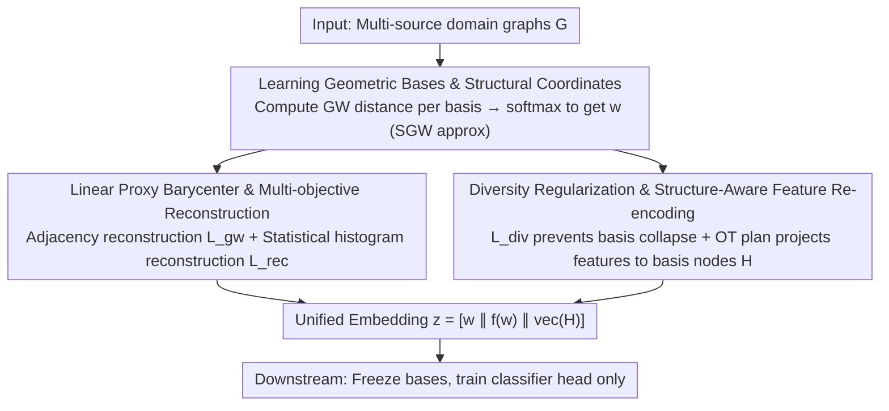

# Structure-Centric Graph Foundation Model via Geometric Bases

**Conference**: ICML 2026  
**arXiv**: [2605.08689](https://arxiv.org/abs/2605.08689)  
**Code**: https://github.com/Xd-He/SCGFM  
**Area**: Graph Foundation Models / Cross-domain Transfer / Gromov–Wasserstein / Metric Geometry  
**Keywords**: Structure-Centric GFM, Geometric Bases, Sliced GW, Structural Coordinates, Feature Re-encoding

## TL;DR
SCGFM reformulates cross-domain graph foundation models as a "triangulation" problem in metric-measure spaces: it learns a set of $K$ trainable geometric bases $\{B_k\}$, where each graph is mapped to a set of structural coordinates $\mathbf{w}$ via a softmax of its Gromov–Wasserstein distances $\delta_k$ to each basis. Node features are then aggregated into a uniform dimension using OT plans on the bases. This approach moves beyond the limitations of traditional GFMs that require aligned node feature spaces, outperforming baselines in both in-domain and OOD few-shot graph/node classification.

## Background & Motivation

**Background**: The two mainstream paths for GFMs are (a) injecting language priors using LLM/prompting, and (b) pre-training GNNs on large-scale graph corpora with contrastive or generative objectives. Both assume that node feature spaces can be aligned across datasets—typically achieved via padding, dimensionality reduction, or dataset-specific adapters. This "feature alignment" works when source and target distributions are similar but often fails during cross-domain transfer.

**Limitations of Prior Work**: (i) Existing GFMs force fixed node feature dimensions (e.g., OFA, BRIDGE), projecting features from different datasets into the same space and losing intrinsic structural differences; (ii) Graph tokenization schemes (treating graphs as sequences of tokens) violate graph permutation invariance and impose artificial node ordering; (iii) Lack of a "shared geometric reference frame"—graphs are non-Euclidean, permutation-invariant relational objects that cannot be aligned pixel-by-pixel like images.

**Key Challenge**: Transferable knowledge in graphs lies in **structure (topology)** rather than **features**, yet existing GFMs place alignment weight on features, causing structural information to be compressed or distorted across domains. Furthermore, explicit GW barycenter computation requires nested OT optimization, which is theoretically elegant but practically infeasible.

**Goal**: Establish a **structure-centric** unified representation space that (1) encodes arbitrary graphs without relying on fixed feature dimensions; (2) maps graphs with heterogeneous topologies to a shared continuous coordinate system; (3) enables strong transfer in both few-shot in-domain and OOD cross-domain settings.

**Key Insight**: View graphs through the lens of metric-measure (mm-) spaces—each graph is represented as $(\mathcal{V},d_G,\mu_G)$, independent of node identities. Leveraging the Gromov Compactness Theorem, it is assumed that real-world graphs lie within a bounded subset $\mathcal{K}\subset\mathcal{X}$ of the mm-space, implying the existence of a finite $\epsilon$-cover. By learning this cover, a "dictionary of geometric bases" is obtained.

**Core Idea**: Rewrite graph representation learning as "triangulation using $K$ trainable prototypes under the GW distance." Each graph is represented by structural coordinates $\mathbf{w}$ derived from its GW distances to all bases, combined with node features re-projected via OT plans, forming a unified embedding.

## Method

### Overall Architecture
SCGFM addresses how to align cross-domain graphs into a single representation space by providing a shared structural reference frame for all graphs instead of aligning features. This involves two stages: during pre-training, $K$ trainable geometric bases $B_k=([M],d_k,\mu_k)$ are jointly learned across multi-source domain graphs. Each graph obtains structural coordinates $\mathbf{w}$ through its Gromov–Wasserstein distance to these bases. In the downstream stage, these bases are frozen; $\mathbf{w}$ is calculated for the target graph, and node features are re-projected onto the basis nodes via OT plans to form a unified embedding for the classifier.

### Key Designs

**1. Learned Geometric Bases & Structural Coordinates: Replacing Explicit Barycenters with "Distance to Prototypes"**

The real obstacle to cross-domain transfer is the lack of a shared coordinate system between graphs. Directly learning a GW barycenter in the mm-space involves nested OT optimization, which is computationally prohibitive. SCGFM replaces the barycenter with a set of discrete prototypes: each geometric basis $B_k$ is parameterized by a symmetric, zero-diagonal matrix $\mathbf{B}_k \in [0,1]^{M\times M}$ (serving as a GW distance kernel without needing to satisfy the triangle inequality; a pseudo-metric suffices), with the measure $\mu_k$ fixed as a uniform distribution to reduce degrees of freedom. For an input graph $G_i$, GW distances $\delta_k=d_{GW}(\mathbf{A}_i,\mathbf{B}_k)$ are computed for each basis and converted into structural coordinates $w_k=\exp(-\delta_k/\tau)/\sum_j\exp(-\delta_j/\tau)$. Thus, any graph is expressed as a "triangulation" vector relative to these prototypes. This design is scalable due to two factors: Theorem 3.2 proves $\|\mathbf{w}-\mathbf{w}'\|_2\le L_w\eta$, showing that coordinates are Lipschitz continuous with respect to GW distance, ensuring structurally similar graphs map to similar coordinates. Additionally, while GW is $\mathcal{O}(N^3)$, Sliced GW (SGW) one-dimensional projections are used to reduce complexity to $\mathcal{O}(N\log N)$, making it feasible for graphs with millions of nodes.

**2. Linear Proxy Barycenter & Multi-objective Reconstruction: Ensuring Coordinates Capture Original Information**

Coordinates alone are insufficient; it must be guaranteed that $\mathbf{w}$ does not lose graph information. Instead of seeking a strict mm-space barycenter, SCGFM uses a linear combination of bases $\widetilde{\mathbf{B}}(G)=\sum_k w_k \mathbf{B}_k$ as a proxy finite-basis expansion. It then requires this reconstructed graph to be structurally close to the original via a structural reconstruction loss $\mathcal{L}_{gw}=\mathbb{E}_G[d_{GW}(\mathbf{A},\widetilde{\mathbf{B}}(G))]$. Since adjacency reconstruction is insensitive to permutations and OT non-uniqueness, a statistical supervision path is added: an MLP decoder $f(\mathbf{w})$ predicts the original graph's degree histogram, clustering coefficient histogram, and log-scaled motif counts (triangles, short cycles) via an MSE constraint $\mathcal{L}_{rec}=\mathrm{MSE}(\mathrm{FE}(G),f(\mathbf{w}))$. Although the linear proxy is not a true barycenter, it allows gradient flow and is naturally compatible with softmax coordinates. The dual "adjacency + coarse statistics" objective forces coordinates to recover both connectivity and global structural fingerprints, mitigating OT non-uniqueness. Corollary 3.3 ensures $\|f(\mathbf{w})-f(\mathbf{w}')\|_2\le L_f L_w \eta$, making statistical reconstruction Lipschitz with respect to GW distance.

**3. Diversity Regularization & Structure-Aware Feature Re-encoding: Preventing Collapse and Mapping Heterogeneous Features**

Prototype/dictionary models often suffer from basis collapse, where $K$ bases converge to the same prototype. SCGFM uses a hinge-style diversity loss $\mathcal{L}_{div}=\frac{1}{|\mathcal{P}|}\sum_{(i,j)}\max(0,m-\|\mathbf{B}_i-\mathbf{B}_j\|_F)$ to push the Frobenius distance between any two bases to at least $m$. To handle heterogeneous feature dimensions $\mathbf{X}_i\in\mathbb{R}^{N\times F}$, SCGFM utilizes the OT plan $\mathbf{T}_{ik}\in\mathbb{R}^{N\times M}$ obtained during GW computation. Node features are summed and projected onto $M$ basis nodes as $\mathbf{H}_k=N\cdot\mathbf{T}_{ik}^\top\mathbf{X}_i$, where the factor $N$ counteracts the averaging effect of the normalized measure $\mathbf{T}$ to preserve multiset injectivity. These are weighted by structural coordinates: $\mathbf{H}(G_i)=\sum_k w_k \mathbf{H}_k$. This ensures that "structurally similar nodes aggregate features along the same structural neighborhoods," maintaining feature flexibility while preserving semantic correspondence. The total objective is $\mathcal{L}_{total}=\mathcal{L}_{gw}+\alpha\mathcal{L}_{rec}+\beta\mathcal{L}_{div}$. The final embedding is $\mathbf{z}(G_i)=[\mathbf{w}\,\|\,f(\mathbf{w})\,\|\,\mathrm{vec}(\mathbf{H}(G_i))]\in\mathbb{R}^{K+r+MF}$.

### Loss & Training
Pre-training is performed only on source domain graphs using $\mathcal{L}_{total}=\mathcal{L}_{gw}+\alpha\mathcal{L}_{rec}+\beta\mathcal{L}_{div}$, with all GW terms calculated via SGW approximation. During downstream tasks, bases and $f(\cdot)$ are frozen, and only the classification head is trained. Few-shot (5-shot) evaluation is averaged over 50 runs.

## Key Experimental Results

### Main Results
5-shot graph classification (Selected from Table 1, showing in-domain and OOD typical values):

| Training | Testing | GCN | GIN | GraphCL | SCGFM (Best) |
|---|---|---|---|---|---|
| in-domain | COX2 | 49.84 | 54.31 | 54.68 | **Best** |
| in-domain | NCI1 | 51.85 | 52.95 | 57.22 | **Best** |
| in-domain | BZR | 54.41 | 51.29 | 60.28 | **Best** |
| S1→COL-3 (OOD) | COL-3 | 9.53 | 9.25 | — | **Significant Gain** |
| S2→COX2 (OOD) | COX2 | 50.33 | 55.16 | — | **Higher or Comparable** |
| Average (Avg.) | — | 43.23 | 44.85 | — | **Highest** |

(Note: For complete values, refer to Table 1 in the original paper; this slice demonstrates the dual advantage in in-domain and OOD scenarios.)

### Ablation Study

| Configuration | Key Change | Conclusion |
|---|---|---|
| Full SCGFM | Highest Mean | Complete model is optimal |
| w/o Geometric Bases | Significant OOD drop | Structural coordinates are key to transfer |
| w/o $\mathcal{L}_{rec}$ | In-domain stable, OOD drop | Statistics provide inductive bias for OOD stability |
| w/o $\mathcal{L}_{div}$ | Basis collapse | Diversity regularization is essential |
| Exact GW instead of SGW | Equal accuracy, high memory | Validates SGW scalability benefits |
| Varying Basis Count $K$ | Medium $K$ is best | Too few lacks expressivity; too many causes redundancy |

### Key Findings
- Learned geometric bases exhibit interpretable topological patterns (chains, stars, dense clusters), confirming the "approximate $\epsilon$-cover" theoretical hypothesis.
- During cross-domain transfer, feature distributions shift significantly, but structural coordinates $\mathbf{w}$ remain stable and transferable; OT plans adapt features to new dimensions naturally.
- SGW reduces training time and memory to quasi-linear complexity, enabling scalability to million-node graphs.

## Highlights & Insights
- **Unified Graph Representation via mm-space**: Reinterprets the long-standing problem of GFM alignment as $\epsilon$-covering in metric geometry, a framework applicable to other non-Euclidean objects like point clouds or 3D shapes.
- **Structural Coordinates + Lipschitz Stability**: Provides a rare "geometric consistency" guarantee—structurally similar graphs must have similar coordinates—making it more reliable than contrastive GFMs.
- **OT-based Feature Re-encoding**: Transforms "feature alignment" from rigid padding into "transmission along structural neighborhoods," preserving multiset injectivity as an elegant template for heterogeneous feature spaces.
- **Scalability via SGW**: Cutting $\mathcal{O}(N^3)$ GW to $\mathcal{O}(N\log N)$ is critical for scaling, proving that sliced OT is a highly practical and undervalued tool in the graph domain.

## Limitations & Future Work
- The linear proxy barycenter is an engineering compromise and may not be optimal for graph families with highly non-Gaussian distributions; future work could explore "Non-linear GW barycenter approximations."
- The number of bases $K$ and nodes $M$ are fixed hyperparameters; data-driven selection based on covering-number upper bounds could be explored.
- Evaluation is currently focused on few-shot classification, with narrower coverage of node-level and link-level tasks.
- Real-world graphs often have edge features/timestamps; the current mm-space only considers node measures and adjacency, requiring redesign for richer structures.

## Related Work & Insights
- **vs OFA / BRIDGE / SAMGPT**: These force fixed feature dimensions and are limited by feature alignment during transfer; this work uses structural coordinates for alignment with flexible feature dimensions.
- **vs Graph Tokenization (e.g., GIT)**: These break permutation invariance, while this work is naturally permutation-invariant through mm-spaces.
- **vs FGW / GW-coarsening (Vayer 2019, Chen 2023)**: These use GW for pairwise comparison or coarsening; this work uses learned bases to create a unified coordinate system.
- **vs Prototype/Dictionary Learning**: Unlike methods choosing prototypes in feature space, SCGFM selects structural prototypes in the mm-space, aligning better with the essence of graphs.

## Rating
- Novelty: ⭐⭐⭐⭐⭐ Reformulating GFM using mm-space + learned bases is original and theoretically supported.
- Experimental Thoroughness: ⭐⭐⭐⭐ Strong in-domain and OOD evaluations + ablations; needs larger-scale node-level transfer tests.
- Writing Quality: ⭐⭐⭐⭐ Clear geometric motivation; theorems and steps are highly readable.
- Value: ⭐⭐⭐⭐ Provides a "structure-centric, feature-flexible" paradigm for cross-domain GFM transfer.

<!-- RELATED:START -->

## Related Papers

- [\[ICML 2026\] Are Common Substructures Transferable? Riemannian Graph Foundation Model with Neural Vector Bundles](are_common_substructures_transferable_riemannian_graph_foundation_model_with_neu.md)
- [\[ICML 2026\] When Do Graph Foundation Models Transfer? A Data-Centric Theory](when_do_graph_foundation_models_transfer_a_data-centric_theory.md)
- [\[ACL 2025\] Beyond Completion: A Foundation Model for General Knowledge Graph Reasoning](../../ACL2025/graph_learning/beyond_completion_a_foundation_model_for_general_knowledge_graph_reasoning.md)
- [\[NeurIPS 2025\] GFM-RAG: Graph Foundation Model for Retrieval Augmented Generation](../../NeurIPS2025/graph_learning/gfm-rag_graph_foundation_model_for_retrieval_augmented_generation.md)
- [\[ICML 2026\] GILT: An LLM-Free, Tuning-Free Graph Foundational Model for In-Context Learning](gilt_an_llm-free_tuning-free_graph_foundational_model_for_in-context_learning.md)

<!-- RELATED:END -->
