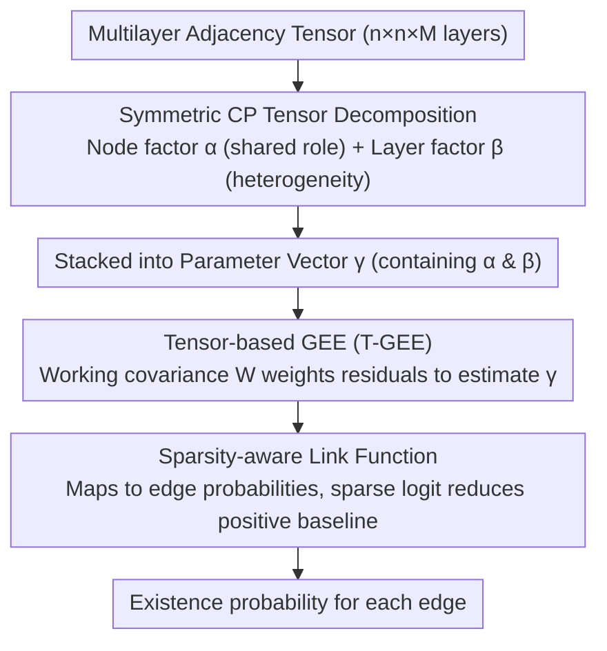

# T-GINEE: A Tensor-Based Multilayer Graph Representation Learning

**Conference**: ICML 2026  
**arXiv**: [2605.28300](https://arxiv.org/abs/2605.28300)  
**Code**: To be confirmed  
**Area**: Graph Learning / Representation Learning  
**Keywords**: Multilayer graphs, Tensor decomposition, Generalized estimating equations, Cross-layer dependencies

## TL;DR
T-GINEE combines **CP tensor decomposition** with **Generalized Estimating Equations (GEE)** to explicitly model **cross-layer dependencies** in multilayer networks—offering theoretical guarantees and superior scalability, overcoming OOM limitations of other tensor methods on million-node graphs (DBLP, Stack Overflow).

## Background & Motivation

**Background**: Multilayer networks are ubiquitous in the real world (e.g., friend/colleague/family relations in social networks; protein co-expression/physical interactions in biological networks). These systems require learning low-dimensional vector representations to capture complex cross-layer relationships.

**Limitations of Prior Work**: Traditional graph embedding methods (GNNs, Matrix Factorization) mostly **process each layer independently** in multilayer settings (ignoring cross-layer associations) or use **simple aggregation strategies** (information loss)—lacking a rigorous theoretical foundation to characterize how embeddings should encode subtle inter-layer influences.

**Key Challenge**: Current multilayer graph learning lacks a systematic theoretical framework to **explicitly model cross-layer residual dependencies**.

**Goal**: To design a statistical framework for multilayer graph learning that is both theoretically grounded and computationally efficient.

**Key Insight**: The **GEE framework** from biostatistics can model correlated data in a principled manner; **CP tensor decomposition** can elegantly represent multilayer graph structures—combining the two allows for explicit capture of inter-layer covariance.

**Core Idea**: Use **CP tensor decomposition to parameterize the multilayer graph parameter tensor**, and jointly model intra-layer and cross-layer dependencies through a **tensor-based GEE framework**.

## Method

### Overall Architecture
T-GINEE addresses the modeling challenge in multilayer networks where "each layer has its own characteristics but is also interconnected." It decomposes the parameter tensor of the entire multilayer graph into a low-rank "node embedding + layer embedding" form using symmetric CP decomposition. It then leverages GEE to transform parameter estimation into a fitting problem weighted by a working covariance matrix, allowing related layers to reinforce each other. Finally, a link function maps the parameter tensor to the existence probability of each edge.

### Key Designs

**1. Symmetric CP Tensor Decomposition: Characterizing "Common Roles" and "Layer Heterogeneity" using Low-Rank Factors**

If the parameter tensor $\Theta$ ($n \times n \times M$, where $M$ is the number of layers) were estimated element-wise, the parameter count would be $O(n^2 M)$, which is unsustainable for million-node graphs. This paper formulates it in a symmetric CP form: $\Theta = \sum_{r=1}^R \alpha^{(r)} \circ \alpha^{(r)} \circ \beta^{(r)}$. The two node modes share the same set of node factors $\alpha$, naturally satisfying the symmetry of undirected graphs, and this shared set of $\alpha$ encodes the **common roles** of nodes across different relationship types. The layer-specific factor $\beta$ absorbs the heterogeneity of each layer. This reduces the total parameters from $O(n^2 M)$ to $O((n+M)R)$. This decomposition is valid because entities in reality often interact across multiple relationships based on a few latent features; the low-rank structure of CP captures this sparsity while maintaining interpretable factors.

**2. Tensor-based GEE (T-GEE): Incorporating Cross-layer Correlations into Estimation via Working Covariance**

Fitting edges in each layer using unweighted least squares assumes independence, ignoring inter-layer correlations and leading to inefficient parameter estimation. T-GINEE adopts the GEE paradigm: it does not assume the full distribution of the response but only specifies the **first two moments (mean and covariance)**. It then uses a **working covariance matrix** $\Sigma^w_{i,j} = \Gamma^{1/2}_{i,j}\, W\, \Gamma^{1/2}_{i,j}$ to weight residuals, explicitly incorporating cross-layer correlation into the objective function. The parameter vector $\gamma$ is solved via the estimating equation $s(\gamma)=\mathbf{0}$ (equivalent to minimizing the weighted sum of squared residuals). The shared correlation matrix $W$ is not pre-determined but estimated from the **residual pool** of all edges—this "working" covariance setting allows the correlation structure to be partially mis-specified without being fatal. It allows correlated layers to support each other during estimation, utilizing co-variation information more efficiently while ensuring robustness in practice.

**3. Sparsity-aware Link Function: Accommodating Extreme Sparsity in Real-world Networks**

After estimating the parameters, the link function $g^{-1}$ maps the parameter tensor to the marginal probability $\mathcal{P}$ of each edge. It can flexibly take forms like logit, probit, or a sparsity-aware logit: $g^{-1}(x) = \frac{s}{1 + e^{-x}}$. The latter introduces a coefficient $s \in (0,1)$ to suppress the positive baseline probability. Real-world networks are typically extremely sparse; standard logits tend to have gradient explosions in sparse regions, whereas the sparsity-aware design naturally fits the observed distribution where "most edges do not exist," making the framework stable and accurate on sparse graphs.

## Key Experimental Results

### Main Results

| Method | CP | Tucker | NMF | SVD | LSE | MASE | NNTUCK | SPECK | HOSVD | **T-GINEE** |
|------|-----|--------|-----|-----|-----|------|--------|-------|--------|----------|
| Synthetic AUC | 0.449 | 0.529 | 0.722 | 0.813 | 0.223 | 0.382 | 0.611 | 0.760 | 0.850 | **0.940** |

T-GINEE significantly outperforms the second-best HOSVD (0.8503); the massive gap between basic CP decomposition and T-GINEE (0.4488 → 0.9395) quantifies the benefit of the statistical regularization framework.

### Real-world Data Comparison

| Method | AUCS | Krackhardt | WAT | Yeast | DBLP (Million nodes) | Stack Overflow (Million nodes) |
|------|--------|----------|-----|-------|--------|-------------|
| HOSVD | 0.897 | 0.783 | 0.820 | 0.902 | OOM | OOM |
| SVD | 0.877 | 0.932 | 0.719 | 0.879 | 0.6093 | 0.9682 |
| **T-GINEE** | **0.920** | **0.948** | **0.838** | **0.921** | **0.6478** | **0.9831** |

CP, Tucker, and HOSVD all failed due to Out-of-Memory (OOM) errors on DBLP and Stack Overflow, whereas T-GINEE successfully handled million-node graphs.

### Ablation Study & Generalization
- **Heterogeneous Synthesis Experiment**: The covariance matrix $W$ learned under low over-determination ratios correctly recovers the similarity order between layers.
- **New Layer Generalization**: Zero-shot transfer on DBLP-5K—training on the first four layers and predicting the fifth layer's edges without training data. T-GINEE achieved an AUC of 0.7733, surpassing MGCN and MR-GCN even when those models were retrained on the fifth layer.

## Highlights & Insights
- **Principled Cross-layer Modeling**: First to seamlessly combine the GEE framework (a standard tool in biostatistics) with tensor decomposition, providing a rigorous statistical foundation for multilayer graph learning.
- **Dual Theoretical Guarantees**: Theorem 3.1 proves $\sqrt{N}$ consistent convergence; Theorem 3.2 establishes asymptotic normality.
- **Breakthrough Scalability**: Implementation with sparse tensors + mini-batch sampling reduces complexity from $O(n^2 M)$ to $O(R |E|)$, remaining competitive on million-node graphs.
- **Inter-layer Knowledge Transfer**: The learned $\alpha$ and $\beta$ decomposition naturally supports **zero-shot cross-layer generalization**.

## Limitations & Future Work
- Theoretical analysis (Theorem 3.2) requires an over-determination condition, limiting the applicability of asymptotic normality in extremely sparse scenarios.
- Lack of data-driven methods for optimal selection of rank $R$ and sparsity coefficient $s$.
- Layer Heterogeneity: The assumption of a shared node embedding $\alpha$ across layers may be too strong for completely heterogeneous relationship types.
- Improvements: Introduce hierarchical or soft-sharing mechanisms; develop provable mini-batch theory; design adaptive rank and sparsity coefficient selection.

## Related Work & Insights
- **vs. Traditional Tensor Decomposition (CP/Tucker)**: Traditional methods lack covariance modeling and assume edges are independent; T-GINEE explicitly learns the working covariance.
- **vs. Multilayer GNNs (MGCN/MR-GCN)**: GNNs rely on local neighborhood aggregation via graph convolutions; T-GINEE adopts a global tensor perspective and statistical inference.
- **Insight**: The combination of the GEE paradigm and tensor decomposition can be extended to other multivariate data scenarios.

## Rating
- Novelty: ⭐⭐⭐⭐⭐  The first combination of GEE and tensor decomposition introduces a new theoretical paradigm for multilayer graphs.
- Experimental Thoroughness: ⭐⭐⭐⭐⭐  Synthetic + Real-world data + Small scale benchmarks + Million-node graphs + Comprehensive GNN baselines.
- Writing Quality: ⭐⭐⭐⭐⭐  Clear motivation, rigorous methodological description, and explicit experimental conclusions.
- Value: ⭐⭐⭐⭐⭐  Fills the theoretical gap in multilayer graph learning while advancing statistical frameworks and scalable design.

<!-- RELATED:START -->

## Related Papers

- [\[ICML 2026\] Generative Representation Learning on Hyper-relational Knowledge Graphs via Masked Discrete Diffusion](generative_representation_learning_on_hyper-relational_knowledge_graphs_via_mask.md)
- [\[ICML 2026\] Unsat Core Prediction through Polarity-Aware Representation Learning over Clause-Literal Hypergraphs](unsat_core_prediction_through_polarity-aware_representation_learning_over_clause.md)
- [\[AAAI 2026\] UniHR: Hierarchical Representation Learning for Unified Knowledge Graph Link Prediction](../../AAAI2026/graph_learning/unihr_hierarchical_representation_learning_for_unified_knowledge_graph_link_pred.md)
- [\[ICML 2025\] Banyan: Improved Representation Learning with Explicit Structure](../../ICML2025/graph_learning/banyan_improved_representation_learning_with_explicit_structure.md)
- [\[AAAI 2026\] Feature-Centric Unsupervised Node Representation Learning Without Homophily Assumption](../../AAAI2026/graph_learning/feature-centric_unsupervised_node_representation_learning_without_homophily_assu.md)

<!-- RELATED:END -->
