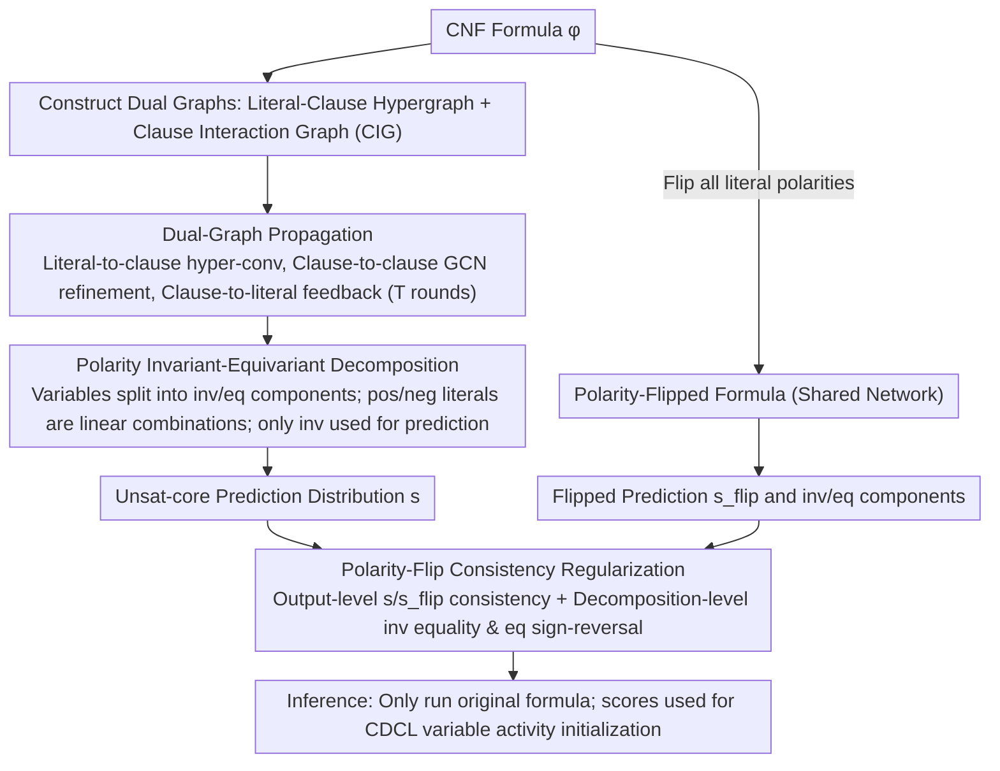

# Unsat Core Prediction through Polarity-Aware Representation Learning over Clause-Literal Hypergraphs

**Conference**: ICML 2026  
**arXiv**: [2605.04819](https://arxiv.org/abs/2605.04819)  
**Code**: None  
**Area**: Graph Learning / Neuro-Symbolic Reasoning / SAT Solving  
**Keywords**: SAT, unsat core, Hypergraph Neural Networks, polarity invariant-equivariant decomposition, consistency regularization

## TL;DR
Ours models CNF formulas as a "clause-literal hypergraph + clause interaction graph" and decomposes variable-level representations into polarity-invariant and polarity-equivariant components. By training with polarity-flip consistency regularization, the prediction accuracy for unsat-core variables is significantly improved.

## Background & Motivation
**Background**: GNN-based SAT learners (NeuroCore, NeuroSAT, SATformer, etc.) usually encode CNF formulas into bipartite graphs or directed acyclic graphs. Nodes represent literals/variables and clauses, while edges connect binary relations such as "literal appears in clause." These learners then acquire embeddings to predict whether a variable belongs to an unsat core, a backbone, or to provide variable activity priors for CDCL solvers.

**Limitations of Prior Work**: The authors point out two systematic limitations. The first is "insufficient structural expressiveness": bipartite graphs only encode pairwise relations, whereas real clauses often contain multiple literals and exhibit high-order coupling through shared variables. Bipartite graphs can only capture these indirectly through deep GNN stacking, leading to over-smoothing. The second is the "lack of polarity modeling": each variable $v_i$ has a pair of complementary literals $l_i, \neg l_i$ with opposite polarities. Existing methods either treat them as independent nodes aggregated by MLPs or add an edge between complementary literals, but none explicitly constrain the intrinsic SAT properties of "source information sharing" and "representation sign reversal under polarity flip."

**Key Challenge**: The contradiction between expressiveness (requiring high-order + polarity awareness) and inductive bias (existing graph structures only express binary relations and ignore the algebraic symmetry of variables). Bypassing this contradiction requires either deeper networks (causing worse over-smoothing) or manual heuristics for edges/labels, both of which are difficult to systematize.

**Goal**: (i) Find a native graph representation that carries multi-literal clauses and multi-clause interactions; (ii) Explicitly model "polarity-invariant" and "polarity-equivariant" properties at the variable level; (iii) Inject polarity constraints into training using a "label-free" dual-view regularization.

**Key Insight**: The authors start from two mathematical observations—flipping the polarities of all literals in a CNF formula leaves its satisfiability and its set of unsat-core variables unchanged (Property 1), while the variable assignments are flipped globally (Property 2). This implies that the unsat-core prediction task is "invariant" to polarity flips, which can serve as a self-supervised training signal.

**Core Idea**: Construct the CNF as a hypergraph where "literals are nodes and clauses are hyperedges," combined with a clause-clause interaction graph for high-order propagation. Decompose variable representations into "invariant + equivariant" parts to form positive/negative literal embeddings. By sharing parameters for both the original and polarity-flipped formulas and applying consistency loss, the model is forced to learn polarity symmetry.

## Method

### Overall Architecture
The core problem paSAT addresses is: how to enable a GNN to both capture the high-order structure of clauses and respect the natural polarity symmetry of SAT formulas for more accurate unsat-core variable prediction. The approach involves placing the CNF formula into two graphs simultaneously—a "literal-clause hypergraph" carrying the high-order containment of multi-literal clauses, and a "clause interaction graph" carrying binary coupling of shared variables between clauses. Representations are then algebraically split at the variable level into "invariant under polarity flip" and "sign-reversed under polarity flip" components. Finally, the polarity-flipped version of the same formula is used as a label-free dual view to constrain training.

Specifically, given a CNF formula $\phi$, it is first converted into a hypergraph $\mathcal{H}=(\mathcal{V}_H,\mathcal{E}_H)$: node $u_i$ corresponds to literal $l_i$ and hyperedge $e_j$ corresponds to clause $c_j$. The incidence matrix $\mathbf{H}\in\mathbb{R}^{2n\times m}$ satisfies $\mathbf{H}_{ij}=1$ if and only if $l_i\in c_j$. Additionally, a clause interaction graph $\mathcal{G}_C$ is constructed where nodes are clauses and edge weights $w^C_{ij}=|\mathcal{L}(c_i)\cap \mathcal{L}(c_j)|/|\mathcal{L}(c_i)\cup \mathcal{L}(c_j)|$ measure clause overlap using Jaccard similarity. During training, two pipelines with shared parameters are run for the original formula $\phi$ and the flipped formula $\phi^{(flip)}$, obtaining variable prediction distributions $\mathbf{s}$ and $\mathbf{s}^{(flip)}$. These are optimized via three losses (task loss + output consistency + decomposition consistency). During inference, only the original formula is processed, and scores are fed into a CDCL solver for variable activity initialization (NeuroCore style, but run once rather than periodically).

### Key Designs

**1. Hypergraph + Clause Interaction Graph: Enabling Direct Dialogue Between Clauses**

Pure hypergraphs have a potential drawback: for clauses to influence each other, they must pass through "shared literals" indirectly. Since unsat cores are products of "joint conflicts between multiple clauses," capturing these high-order dependencies purely through deep GNNs is slow and prone to over-smoothing. paSAT explicitly builds a clause interaction graph (CIG) based on "who shares literals with whom," providing a shortcut for the model to learn clause-level mutual constraints. In each round $t$, propagation consists of three steps: (1) hypergraph convolution $\mathbf{M}^{(t)}_H=\mathbf{D}^{-1}\mathbf{H}\mathbf{B}^{-1}\mathbf{H}^\top \mathbf{L}^{(t)}\mathbf{W}^{(t)}$ to aggregate literal information into clauses and back; (2) clause-side refinement via $\mathbf{C}^{(t)}=\mathbf{B}^{-1}\mathbf{H}^\top \mathbf{L}^{(t)}\mathbf{W}^{(t)}$ fed into a GCN $\Delta\mathbf{C}^{(t)}=\mathbf{D}_C^{-1/2}\mathbf{A}_C\mathbf{D}_C^{-1/2}\mathbf{C}^{(t)}\mathbf{U}$ with residual update $\mathbf{C}'^{(t)}=\mathbf{C}^{(t)}+\alpha\sigma(\Delta\mathbf{C}^{(t)})$; (3) feeding refined clause information back to literals $\mathbf{M}^{(t)}=\mathbf{D}^{-1}\mathbf{H}\mathbf{C}'^{(t)}$ and aggregating complementary literals $\bar{\mathbf{L}}^{(t)}$ via $\mathbf{L}^{(t+1)}=f_{\mathrm{update}}(\mathbf{L}^{(t)},\mathbf{M}^{(t)},\bar{\mathbf{L}}^{(t)})$. This preserves high-order inclusion semantics while allowing clauses to exchange "constraint signals" directly.

**2. Polarity Invariant–Equivariant Decomposition: Hard-coding Algebraic Symmetry**

Every variable $v_i$ has complementary literals $l_i, \neg l_i$. Traditional methods treat them as independent nodes combined via MLP, which muddles the properties of "source information sharing" and "sign reversal." paSAT uses algebraic decomposition: the variable representation $\mathbf{v}_i^{(t)}\in\mathbb{R}^{2d}$ is split into an invariant component $\mathbf{v}_{i,\mathrm{inv}}^{(t)}$ and an equivariant component $\mathbf{v}_{i,\mathrm{eq}}^{(t)}$. Positive/negative literals are obtained via linear addition/subtraction: $\mathbf{l}_{x_i}^{(t)}=\mathbf{v}_{i,\mathrm{inv}}^{(t)}+\mathbf{v}_{i,\mathrm{eq}}^{(t)}$ and $\mathbf{l}_{\neg x_i}^{(t)}=\mathbf{v}_{i,\mathrm{inv}}^{(t)}-\mathbf{v}_{i,\mathrm{eq}}^{(t)}$. After hypergraph propagation, inverse formulas $\mathbf{v}_{\mathrm{inv},i}^{(t+1)}=\tfrac{1}{2}(\mathbf{L}_{2i}+\mathbf{L}_{2i+1})$ and $\mathbf{v}_{\mathrm{eq},i}^{(t+1)}=\tfrac{1}{2}(\mathbf{L}_{2i}-\mathbf{L}_{2i+1})$ are used to recalculate components, followed by MLP recombination. Finally, only the invariant component is passed through a linear head to predict unsat-core probability $\mathbf{s}=g(f'_{\mathrm{inv}}(\mathbf{V}_{\mathrm{inv}}^{(T)}))$. This is effective because unsat-core labels are "structural attributes" invariant to polarity flips; linear "+/-" combinations ensure that "flipping polarity" acts as a group operation on literal embeddings.

**3. Polarity-Flip Consistency Regularization: Label-free Symmetry Injection**

The "+/-" architecture alone does not guarantee semantic separation; the model could collapse all information into one component. paSAT constructs a flipped formula $\phi^{(flip)}$ (reversing literal signs but keeping structure). Both formulas share the network to produce $\mathbf{s}$ and $\mathbf{s}^{(flip)}$. Two consistency constraints are added: output-level $\mathcal{L}_{\mathrm{cons}}=\tfrac{1}{|\mathcal{V}|}\|\mathbf{s}-\mathbf{s}^{(flip)}\|_2^2$ forces identical predictions, and decomposition-level $\mathcal{L}_{\mathrm{decomp}}=\tfrac{1}{|\mathcal{V}|}\sum_i\bigl[\|\mathbf{V}_{i,\mathrm{inv}}^{(T)}-\mathbf{V}_{i,\mathrm{inv}}^{(T)(flip)}\|_2^2 + \|\mathbf{V}_{i,\mathrm{eq}}^{(T)}+\mathbf{V}_{i,\mathrm{eq}}^{(T)(flip)}\|_2^2\bigr]$ enforces the mathematical definitions of invariance and equivariance. Since $\phi^{(flip)}$ requires no human annotation, this is essentially a label-free self-supervised symmetry constraint.

### Loss & Training
The total loss is $\mathcal{L}=\mathcal{L}_{\mathrm{core}}+\lambda_{\mathrm{cons}}\mathcal{L}_{\mathrm{cons}}+\lambda_{\mathrm{decomp}}\mathcal{L}_{\mathrm{decomp}}$. $\mathcal{L}_{\mathrm{core}}$ follows the NeuroCore KL divergence form $D_{\mathrm{KL}}(\mathbf{p}^*\|\mathbf{p})$, where the target distribution uniformly distributes probability over unsat-core variables and 0 elsewhere. The network is trained end-to-end. During CDCL integration, the neural network runs only once before solving to initialize variable activities.

## Key Experimental Results

### Main Results
Evaluation was conducted on SR (Random 3-SAT), CA (Community Structure), and PS (Pigeonhole style) datasets across Easy/Medium/Hard difficulties measuring Precision, PR-AUC, and ROC-AUC.

| Dataset | Metric | GCN | NeuroCore | SATFormer | paSAT |
|--------|------|------|-----------|-----------|-------|
| SR (Avg) | PR-AUC | 0.915 | 0.938 | 0.920 | **0.963** |
| SR (Avg) | ROC-AUC | 0.732 | 0.805 | 0.741 | **0.872** |
| CA (Avg) | PR-AUC | 0.215 | 0.333 | 0.246 | **Significantly Higher** |
| CA (Avg) | ROC-AUC | 0.518 | 0.605 | 0.527 | **Significantly Higher** |

On the challenging CA dataset (sparse community structure, small unsat-core ratio, extreme class imbalance), paSAT significantly outperforms NeuroCore in both PR-AUC and ROC-AUC. This suggests that high-order and polarity modeling provides greater gains in structurally complex scenarios. An improvement of 6–9 points in ROC-AUC on SR also indicates more stable classification ranking.

### Ablation Study

| Configuration | Key Metric | Description |
|------|---------|------|
| Full paSAT | Optimal | Hypergraph + CIG + Polarity decomposition + Consistency loss |
| w/o CIG | Gain Decrease | High-order clause dependencies can only be learned indirectly |
| w/o Polarity Decomposition | Gain Decrease | Degenerates to concat+MLP, losing algebraic symmetry |
| w/o $\mathcal{L}_{\mathrm{decomp}}$ | Gain Decrease | Architecture exists but lacks supervision for semantic split |
| w/o $\mathcal{L}_{\mathrm{cons}}$ | Gain Decrease | Lacks output-level dual-view supervision |

### Key Findings
- The clause interaction graph contributes most on structurally complex CA datasets, showing that explicit modeling of clause-clause dependencies is a bottleneck for high-order problems.
- Architecture-level invariant/equivariant decomposition is insufficient without $\mathcal{L}_{\mathrm{decomp}}$; otherwise, the network "conspires" to mix the two components.
- During CDCL integration, switching from "periodic calls" to "one-time initialization" saves significant GPU time with negligible performance loss.

## Highlights & Insights
- Translating SAT algebraic symmetry into a dual "architecture + loss" constraint is an elegant injection of inductive bias: the architecture uses +/- to make flipping a group action, while the loss prevents information collapse.
- Using polarity flips to construct dual views for label-free self-supervision is similar to "equivariant augmentation" in contrastive learning and can be migrated to any graph task with explicit group symmetry (e.g., molecule mirroring).
- The "Hypergraph + CIG" dual-graph structure suggests that when an object participates in both high-order (clauses) and binary (shared variables) relations, separating them into two graphs is cleaner than forcing them into one.

## Limitations & Future Work
- Experiments focused solely on the unsat-core task; whether polarity-flip consistency is effective for backbone prediction or model counting remains to be proven.
- The CIG has $O(M^2)$ edges; whether this scales to industrial instances with millions of clauses requires further engineering (sparsity, sampling).
- Integration with CDCL used "initial activity" coupling; the potential for periodic re-calls or dynamic search tree integration is unexplored.
- While Property 1 (invariance) is used for unsat cores, Property 2 (assignment flip) should be explored for "assignment-dependent" tasks like backbone prediction by modifying the loss to sign-reversal constraints.

## Related Work & Insights
- **vs NeuroCore (Selsam & Bjørner 2019)**: Ours uses the same KL objective and CDCL integration but replaces bipartite graphs with hypergraphs + CIG and explicitly models polarity. While NeuroCore learns polarity implicitly via LSTM-style messaging, paSAT hard-codes it, yielding better sample efficiency.
- **vs SATFormer**: SATFormer uses Transformers for global attention. Although it theoretically captures arbitrary interactions, paSAT outperforms it on SR/CA, showing that inductive bias (polarity symmetry) is more important than raw model capacity.
- **vs NeuroBack (Wang et al. 2024)**: NeuroBack also uses polarity-flip dual formulas but only at the output level; paSAT extends this to decomposition-level consistency and hypergraphs.

## Rating
- Novelty: ⭐⭐⭐⭐ The invariant-equivariant decomposition + dual-view consistency is a clear demonstration of translating algebraic symmetry into NNs.
- Experimental Thoroughness: ⭐⭐⭐⭐ Systematically compared across SR/CA/PS datasets with full ablation, though lacking end-to-end solving time comparisons.
- Writing Quality: ⭐⭐⭐⭐ Rigorous derivations and clear motivation; Figure 1 provides an intuitive pipeline view.
- Value: ⭐⭐⭐⭐ Advances the SAT × GNN research line with methods transferable to other structured prediction tasks with group symmetry.

<!-- RELATED:START -->

## Related Papers

- [\[ICML 2026\] T-GINEE: A Tensor-Based Multilayer Graph Representation Learning](t-ginee_a_tensor-based_multilayer_graph_representation_learning.md)
- [\[AAAI 2026\] UniHR: Hierarchical Representation Learning for Unified Knowledge Graph Link Prediction](../../AAAI2026/graph_learning/unihr_hierarchical_representation_learning_for_unified_knowledge_graph_link_pred.md)
- [\[ICML 2026\] Generative Representation Learning on Hyper-relational Knowledge Graphs via Masked Discrete Diffusion](generative_representation_learning_on_hyper-relational_knowledge_graphs_via_mask.md)
- [\[AAAI 2026\] Feature-Centric Unsupervised Node Representation Learning Without Homophily Assumption](../../AAAI2026/graph_learning/feature-centric_unsupervised_node_representation_learning_without_homophily_assu.md)
- [\[ICML 2025\] Banyan: Improved Representation Learning with Explicit Structure](../../ICML2025/graph_learning/banyan_improved_representation_learning_with_explicit_structure.md)

<!-- RELATED:END -->
