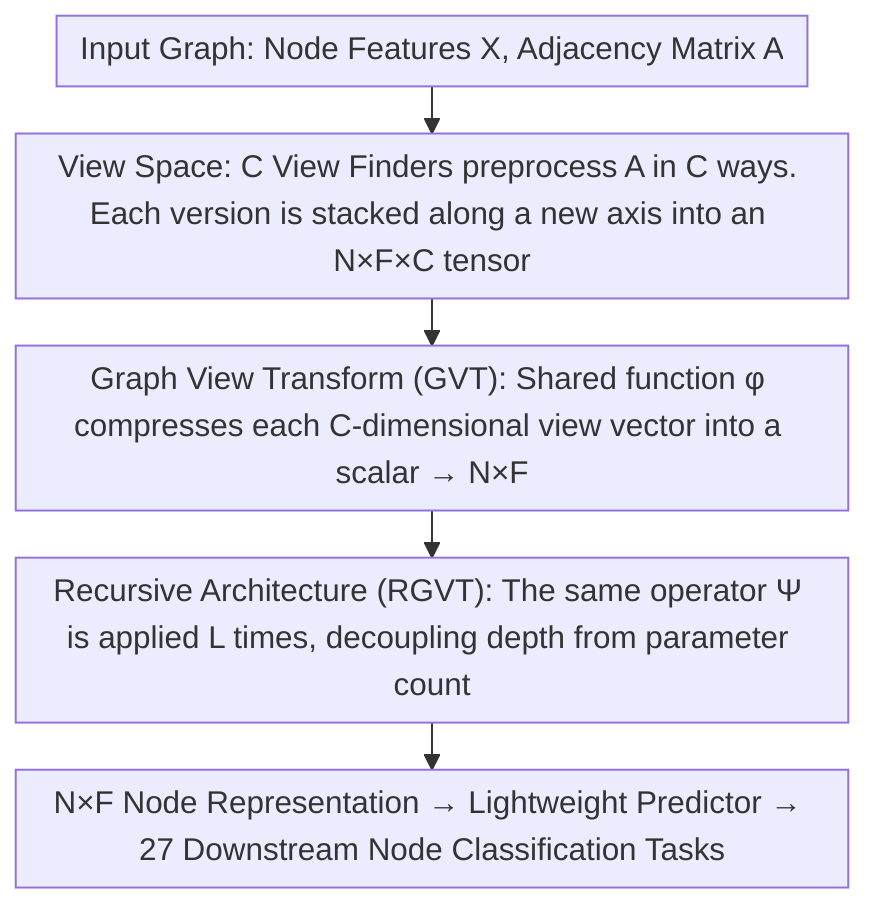

# View Space: Representation Learning Across Arbitrary Graphs

**Conference**: ICML 2026  
**arXiv**: [2512.11561](https://arxiv.org/abs/2512.11561)  
**Code**: To be confirmed  
**Area**: Graph Learning / Graph Neural Networks / Cross-domain Transfer  
**Keywords**: Graph Representation Learning, Feature Heterogeneity, Fully Inductive Learning, View Space

## TL;DR
This paper proposes the concept of View Space, elevating graphs from 2 dimensions (node-feature) to 3 dimensions (node-feature-view) to achieve a unified representation across arbitrary feature dimensions and semantic graphs. This marks the first time a graph model can perform cross-domain reasoning without fine-tuning, similar to NLP/CV foundation models, outperforming GraphAny by an average of 8.93% across 27 downstream tasks.

## Background & Motivation

**Background**: Foundation models in NLP and CV achieve cross-dataset reasoning through large-scale pre-training followed by lightweight adaptation. This is possible due to standardized input formats—all text in NLP is tokenized into a shared vocabulary, and all images in CV can be resized to a fixed resolution.

**Limitations of Prior Work**: Standardization of graph data is extremely challenging. The dimensionality and semantics of node features vary significantly across datasets. Existing GNNs handle this by learning feature transformation matrices, resulting in weak generalization across different feature spaces. Although GraphAny partially addresses fully inductive problems via relative distance spaces, it is restricted to prediction rather than learning representations.

**Key Challenge**: How can a model learn general knowledge across graphs and features while maintaining feature equivariance? Traditional 2D representations cannot simultaneously satisfy node permutation equivariance and feature permutation equivariance.

**Goal**: (1) Formalize "Fully Inductive Node Representation Learning" (FI-NRL); (2) Identify the third representation axis of graphs: View Space; (3) Design the parameterized transformation GVT and prove its dual permutation equivariance; (4) Instantiate it as a recursive architecture, RGVT, to verify cross-task generalization.

**Key Insight**: All graphs share connectivity properties. Different adjacency matrix preprocessing methods emphasize different structural facets of a graph. These "views" can be stacked to form a new dimension, allowing the model to learn representations in a unified view space independent of feature dimensions.

**Core Idea**: Elevate the 2D representation to 3D—mapping each node-feature pair $(n,f)$ to a $C$-dimensional "view vector," where $C$ dimensions correspond to $C$ different graph structural views. A shared learnable function processes these view vectors to automatically adapt to arbitrary dimensions and semantic features.

## Method

### Overall Architecture

To enable a graph model to work across arbitrary graphs like NLP/CV foundation models, the difficulty lies in the misalignment of feature dimensions and semantics across graphs. This work introduces a new dimension to graph representations: first, multiple preprocessing results of the adjacency matrix are stacked into an $N \times F \times C$ 3D tensor, providing each "node-feature" position with a $C$-dimensional "view vector." Next, a shared learnable function compresses these view vectors into scalars, resulting in an $N \times F$ node representation independent of feature dimensionality. Finally, this transformation is applied recursively using shared parameters to match different graph receptive fields. The entire process contains no parameters tied to feature dimensions, naturally accommodating any feature dimension or semantics.

### Key Designs

**1. View Space: Trading the Third Axis for Dual Permutation Equivariance**

Fully inductive learning requires the model to be insensitive to two things: reordering nodes must lead to a corresponding reordering of representations (Node Permutation Equivariance R1), and reordering features must lead to a corresponding reordering of representations (Feature Permutation Equivariance R2). Satisfying both in a traditional 2D node-feature matrix $\bm{X} \in \mathbb{R}^{N \times F}$ is difficult because applying a transformation matrix to the feature dimension breaks feature permutation equivariance. The key observation is that all graphs share the property of "connectivity." Different adjacency matrix preprocessing methods highlight different structural facets, allowing these "views" to be stacked into a new, feature-independent axis. Specifically, for each position, a $C$-dimensional view vector $\bm{v}_{n,f} = \bm{\mathsf{X}}_{n,f,:}$ is extracted, recording the response values of that node-feature pair under $C$ structural perspectives. Since the view dimension $C$ is determined solely by a predefined set of view finders (independent of graph size $N$ and feature dimension $F$), any graph is uniquely represented as $N \times F$ vectors of $C$ dimensions—the "standardized input format" previously missing in graph learning.

**2. Graph View Transform (GVT): Parameterizing in View Space for Dynamic Aggregation**

With View Space, parameters are placed entirely on the view dimension rather than the feature dimension, bypassing explicit feature transformation matrices $\bm{W}$ and automatically satisfying feature permutation equivariance. GVT is formalized as:

$$\Psi(\bm{X}, \bm{A}) = \big[\,\phi(\bm{\mathsf{X}}_{n,f,:} \mid \theta)\,\big]_{n,f},$$

executed in two steps: first, applying $C$ view finders $\{\nu_c\}_{c=1}^C$ to $\bm{A}$ and stacking propagated versions $\nu_c(\bm{A})\bm{X}$ along the new 3D dimension; then, using the same learnable reduction function $\phi$ to compress each position $(n,f,:)$ into a scalar. When $\phi$ is non-linear, a Taylor expansion proves that GVT is equivalent to a "node-feature level dynamic aggregation"—where each $(n,f)$ pair has unique aggregation weights, granting it greater expressive power than static models like GCN that share aggregation coefficients across all nodes.

**3. Recursive Architecture (RGVT): Decoupling Parametrization and Propagation Depth**

Different graphs have varying requirements for receptive fields. If depth is increased by stacking layers with different parameters, it leads to parameter explosion and ties "depth" to "parameter count." Inspired by RNNs, RGVT repeatedly applies $\Psi$ with the same set of shared parameters $L$ times:

$$\bm{Z} = \Psi(\cdot, \bm{A} \mid \theta)^L(\bm{X}).$$

This decouples parameterization from depth—pre-training learns a single $\theta$, and for each new graph, one only needs to select an appropriate recursion depth $L$ without re-optimizing the encoder to accommodate the graph's specific information propagation range.

## Key Experimental Results

### Main Results

Pre-trained on OGBN-Arxiv and transferred to 27 downstream node classification datasets:

| Dataset Group | OGBN-Arxiv | Signed Dense | Unsigned Dense | Sparse | Binary Dense | Binary Sparse | One-hot | Average |
|----------|-----------|-------------|-------------|--------|-----------|-----------|----------|-----|
| Linear Predictor | 52.44 | 53.29 | 75.67 | 66.41 | 72.18 | 57.11 | 38.86 | 59.41 |
| MLP Predictor | 53.80 | 55.08 | 75.86 | 69.02 | 72.88 | 57.65 | 39.34 | 60.43 |
| GraphAny (Wisconsin) | 57.77 | 59.12 | 71.78 | 81.61 | 83.44 | 55.25 | 52.68 | 64.72 |
| GraphAny (Cora) | 58.58 | 59.38 | 71.76 | 81.49 | 83.35 | 53.40 | 53.30 | 64.30 |
| GraphAny (Arxiv) | 58.63 | 59.70 | 72.62 | 81.68 | 83.56 | 54.18 | 53.02 | 64.71 |
| **RGVT + Linear** | **70.14** | **64.95** | **76.44** | **84.33** | **85.11** | **62.77** | **58.85** | **70.03** |
| **RGVT + MLP** | **71.11** | **66.37** | **77.12** | **83.98** | **84.86** | **63.87** | **62.48** | **71.13** |

RGVT outperforms the best GraphAny variant by an average gain of +8.93% (MLP) or +7.24% (Linear).

### Ablation Study

| Configuration | OGBN-Arxiv | Signed Dense | Unsigned Dense | Sparse | Binary Dense | Binary Sparse | One-hot | Average |
|----|-----------|---------|---------|-----|--------|--------|--------|-----|
| RGVT + MLP (Full) | 71.11 | 66.37 | 77.12 | 83.98 | 84.86 | 63.87 | 62.48 | 71.13 |
| w/o Non-linearity | 70.22 | 64.53 | 75.89 | 78.82 | 84.16 | 61.12 | 56.13 | 68.12 |
| w/o Recursion | 70.91 | 63.73 | 73.79 | 82.61 | 83.90 | 53.29 | 54.53 | 65.73 |
| w/o Both | 70.53 | 61.69 | 75.10 | 77.52 | 84.57 | 53.41 | 54.73 | 64.96 |

### Key Findings
- Removing non-linearity results in a 2.31 percentage point drop.
- Removing recursion results in a 5.40 percentage point drop.
- Compared with 12 dataset-specific GNNs, RGVT + MLP outperforms the strongest baseline UniMP by +3.30% on average (71.13 vs 68.86).

## Highlights & Insights
- **The Third Representation Axis of Graphs**: Breaks the limitations of 2D representation by abstracting connectivity into a "view" dimension orthogonal to the feature dimension.
- **Conditions for Dual Permutation Equivariance**: The paper provides formal definitions and necessary/sufficient conditions, serving as a theoretical benchmark for cross-domain graph learning.
- **Node-Feature level Dynamic Aggregation**: Taylor expansion reveals the expressive power of non-linear GVT—each node-feature pair can have its own aggregation weight distribution.
- **Parametrization-Depth Decoupling**: Inspired by RNNs, the model allows for flexible selection of recursion depth post-pre-training.
- **Transferable Knowledge**: View space knowledge learned on arXiv can be directly transferred to 27 downstream tasks with completely different feature sets.

## Limitations & Future Work
- Design trade-off—GVT learns independently in each feature dimension and cannot explicitly model cross-feature interactions.
- Predictor training cost—lightweight predictors must still be trained for each downstream task.
- Recursive depth selection overhead—requires training multiple predictors to select the optimal $L$ for each dataset.
- Scope—primarily focused on node classification; expansion to edge/graph classification or hypergraphs remains to be explored.

## Related Work & Insights
- **vs Traditional GNNs (GCN, GAT, GraphSAGE)**: These rely on explicit transformation matrices that generalize poorly across graphs; this work avoids such parametrization by computing directly in View Space.
- **vs GraphAny**: GraphAny relies on attention in relative distance spaces for prediction and can only output labels; this representation learning scheme is more flexible for various downstream predictors.
- **vs Tabular Foundation Models (TabR, TabM)**: These generalize across feature spaces via synthetic data pre-training but do not utilize graph structure; this work uses connectivity as a new axis beyond the feature space.
- **Insights**: (1) The "elevation" strategy can be applied to other cross-domain problems; (2) The formal framework for permutation equivariance assists in designing other fully inductive models.

## Rating
- Novelty: ⭐⭐⭐⭐⭐ Innovative concept of View Space, first formalization of fully inductive learning.
- Experimental Thoroughness: ⭐⭐⭐⭐⭐ 27 downstream tasks + multiple feature types + detailed ablation + comparison with 12 GNNs.
- Writing Quality: ⭐⭐⭐⭐⭐ Clear logic and rigorous formalization.
- Value: ⭐⭐⭐⭐⭐ Addresses long-standing graph learning challenges and lays the foundation for graph foundation models.

<!-- RELATED:START -->

## Related Papers

- [\[ICML 2026\] Generative Representation Learning on Hyper-relational Knowledge Graphs via Masked Discrete Diffusion](generative_representation_learning_on_hyper-relational_knowledge_graphs_via_mask.md)
- [\[ICML 2026\] T-GINEE: A Tensor-Based Multilayer Graph Representation Learning](t-ginee_a_tensor-based_multilayer_graph_representation_learning.md)
- [\[ICML 2025\] Towards Graph Foundation Models: Learning Generalities Across Graphs via Task-Trees](../../ICML2025/graph_learning/towards_graph_foundation_models_learning_generalities_across_graphs_via_task-tre.md)
- [\[ICML 2026\] Message Tuning Outshines Graph Prompt Tuning: A Prismatic Space Perspective](message_tuning_outshines_graph_prompt_tuning_a_prismatic_space_perspective.md)
- [\[ICML 2026\] Unsat Core Prediction through Polarity-Aware Representation Learning over Clause-Literal Hypergraphs](unsat_core_prediction_through_polarity-aware_representation_learning_over_clause.md)

<!-- RELATED:END -->
