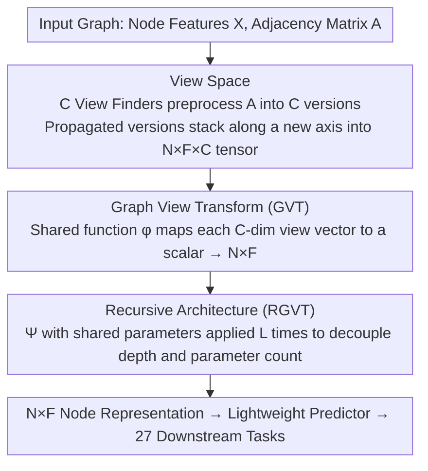

# View Space: Representation Learning Across Arbitrary Graphs

**Conference**: ICML 2026  
**arXiv**: [2512.11561](https://arxiv.org/abs/2512.11561)  
**Code**: TBD  
**Area**: Graph Learning / Graph Neural Networks / Cross-domain Transfer  
**Keywords**: Graph Representation Learning, Feature Heterogeneity, Fully Inductive Learning, View Space

## TL;DR
This paper introduces the concept of View Space by lifting graphs from 2D (node-feature) to 3D (node-feature-view). This enables a unified representation for graphs with arbitrary feature dimensions and semantics—marking the first time a graph model achieves cross-domain reasoning without fine-tuning, akin to NLP/CV foundation models, outperforming GraphAny by an average of 8.93% across 27 downstream tasks.

## Background & Motivation

**Background**: Foundation models in NLP and CV achieve cross-dataset reasoning through large-scale pre-training followed by lightweight adaptation. This success stems from standardized input formats—NLP tokens are mapped to a shared vocabulary, and CV images are resized to a fixed resolution.

**Limitations of Prior Work**: Standardizing graph data is extremely difficult. The dimensions and semantics of node features vary drastically across datasets. Existing GNNs handle this by learning feature transformation matrices, leading to weak generalization across feature spaces. While GraphAny addresses the fully inductive problem via relative distance spaces, it can only perform prediction and cannot learn representations.

**Key Challenge**: How can a model learn universal knowledge across graphs and features while ensuring feature equivariance? Traditional 2D representations cannot simultaneously satisfy node permutation equivariance and feature permutation equivariance.

**Goal**: (1) Formalize "Fully Inductive Node Representation Learning" (FI-NRL); (2) Identify the third axis of graph representation: View Space; (3) Design the parameterized Graph View Transform (GVT) and prove its dual permutation equivariance; (4) Instantiate the recursive architecture RGVT to verify cross-task generalization.

**Key Insight**: All graphs share connectivity properties. Different adjacency matrix preprocessing methods emphasize different structural facets of a graph. These "views" can be stacked to form a new dimension, allowing the model to learn representations in a unified view space independent of feature dimensionality.

**Core Idea**: Elevate 2D representations to 3D—each node-feature pair $(n, f)$ is mapped to a $C$-dimensional "view vector," where the $C$ dimensions correspond to $C$ different graph structural views. A shared learnable function processes these view vectors, automatically adapting to arbitrary dimensions and semantic features.

## Method

### Overall Architecture

To enable a graph model to work across arbitrary graphs like NLP/CV foundation models, the challenge lies in the misalignment of feature dimensions and semantics. This work adds a new dimension to graph representations: first, multiple preprocessing results of the adjacency matrix are stacked into an $N \times F \times C$ 3D tensor, providing each "node-feature" position with a $C$-dimensional "view vector." Next, a shared learnable function processes these view vectors into scalars, resulting in $N \times F$ node representations independent of feature dimensions. Finally, this transformation is applied recursively using shared parameters $L$ times to match different graph receptive fields. The entire process contains no dimension-tied parameters in the feature space, naturally accommodating features of any dimension or semantics.

### Key Designs

**1. View Space: Gaining Dual Permutation Equivariance via the Third Axis**

Fully inductive learning requires a model to be insensitive to two things: node reordering (node permutation equivariance R1) and feature reordering (feature permutation equivariance R2). It is difficult for a traditional 2D node-feature matrix $\bm{X} \in \mathbb{R}^{N \times F}$ to satisfy both, as placing a transformation matrix on the feature dimension destroys feature permutation equivariance. The key observation is that all graphs share "connectivity," and different adjacency matrix prepocessors highlight different structural facets. These "views" can be stacked as a new feature-independent axis. Specifically, for each position, a $C$-dimensional view vector $\bm{v}_{n,f} = \bm{\mathsf{X}}_{n,f,:}$ is extracted, recording the response of the node-feature pair under $C$ structural perspectives. Since $C$ is determined only by the predefined view finder set and is independent of $N$ or $F$, any graph is unified into $N \times F$ vectors of size $C$—the "standardized input format" previously missing in graph learning.

**2. Graph View Transform (GVT): Parametrization in View Space for Dynamic Aggregation**

With View Space, parameters are placed on the view dimension rather than the feature dimension, bypassing explicit feature transformation matrices $\bm{W}$ and satisfying feature permutation equivariance. GVT is formalized as:

$$\Psi(\bm{X}, \bm{A}) = \big[\,\phi(\bm{\mathsf{X}}_{n,f,:} \mid \theta)\,\big]_{n,f},$$

executed in two steps: applying $C$ view finders $\{\nu_c\}_{c=1}^C$ to $\bm{A}$ to stack propagated versions $\nu_c(\bm{A})\bm{X}$ into 3D, then using a shared learnable function $\phi$ to compress each $(n, f, :)$ position into a scalar. When $\phi$ is non-linear, a Taylor expansion proves GVT is equivalent to "node-feature-level dynamic aggregation"—where each $(n, f)$ has unique aggregation weights, exceeding the expressive power of static aggregators like GCN.

**3. Recursive Architecture (RGVT): Decoupling Parameters and Propagation Depth**

Different graphs require different receptive fields. Stacking multiple layers with distinct parameters leads to parameter explosion and ties "depth" to "parameter count." Inspired by RNNs, RGVT applies $\Psi$ repeatedly $L$ times with shared parameters:

$$\bm{Z} = \Psi(\cdot, \bm{A} \mid \theta)^L(\bm{X}).$$

This decouples parameterization from depth—pre-training learns a single $\theta$, while for each new graph, one only needs to select an appropriate $L$ without re-optimizing the encoder to match specific information propagation ranges.

## Key Experimental Results

### Main Results

Pre-trained on OGBN-Arxiv and transferred to 27 downstream node classification datasets:

| Dataset Group | OGBN-Arxiv | Signed Dense | Unsigned Dense | Sparse | Binary Dense | Binary Sparse | One-hot | Average |
|----------|-----------|-------------|-------------|--------|-----------|-----------|----------|-----|
| Linear Predictor | 52.44 | 53.29 | 75.67 | 66.41 | 72.18 | 57.11 | 38.86 | 59.41 |
| MLP Predictor | 53.80 | 55.08 | 75.86 | 69.02 | 72.88 | 57.65 | 39.34 | 60.43 |
| GraphAny (Wisconsin) | 57.77 | 59.12 | 71.78 | 81.61 | 83.44 | 55.25 | 52.68 | 64.72 |
| GraphAny (Cora) | 58.58 | 59.38 | 71.76 | 81.49 | 83.35 | 53.40 | 53.30 | 64.30 |
| GraphAny (Arxiv) | 58.63 | 59.70 | 72.62 | 81.68 | 83.56 | 54.18 | 53.02 | 64.71 |
| **RGVT + Linear** | **70.14** | **64.95** | **76.44** | **84.33** | **85.11** | **62.77** | **58.85** | **70.03** |
| **RGVT + MLP** | **71.11** | **66.37** | **77.12** | **83.98** | **84.86** | **63.87** | **62.48** | **71.13** |

Ours (RGVT) outperforms the best GraphAny variant by +8.93% (MLP) or +7.24% (Linear) on average.

### Ablation Study

| Configuration | OGBN-Arxiv | Signed Dense | Unsigned Dense | Sparse | Binary Dense | Binary Sparse | One-hot | Average |
|----|-----------|---------|---------|-----|--------|--------|--------|-----|
| RGVT + MLP (Full)| 71.11 | 66.37 | 77.12 | 83.98 | 84.86 | 63.87 | 62.48 | 71.13 |
| w/o Non-linearity | 70.22 | 64.53 | 75.89 | 78.82 | 84.16 | 61.12 | 56.13 | 68.12 |
| w/o Recursion | 70.91 | 63.73 | 73.79 | 82.61 | 83.90 | 53.29 | 54.53 | 65.73 |
| w/o Both | 70.53 | 61.69 | 75.10 | 77.52 | 84.57 | 53.41 | 54.73 | 64.96 |

### Key Findings
- Removing non-linearity results in a 2.31 percentage point drop.
- Removing recursion leads to a 5.40 percentage point drop.
- Compared to 12 dataset-specific GNNs, RGVT + MLP outperforms the strongest baseline UniMP by +3.30% (71.13 vs 68.86) on average.

## Highlights & Insights
- **Third Representation Axis**: Breaks the limitations of 2D representations by abstracting connectivity into a "view" dimension orthogonal to features.
- **Dual Permutation Equivariance**: Provides formal definitions and necessary/sufficient conditions, establishing a theoretical benchmark for cross-domain graph learning.
- **Node-Feature-Level Dynamic Aggregation**: Taylor expansion reveals that non-linear GVT allows each node-feature pair to possess its own aggregation weight distribution.
- **Parametrization-Depth Decoupling**: Inspired by RNNs, allowing the model to flexibly choose recursive depth after pre-training.
- **Transferable Knowledge**: View space knowledge learned from arXiv transfers directly to 27 downstream tasks with entirely different feature sets.

## Limitations & Future Work
- Design Trade-offs: GVT learns independently across feature dimensions and cannot explicitly model cross-feature interactions.
- Predictor Training Cost: Requires training a lightweight predictor for each downstream task.
- Recursive Depth Selection: Requires training multiple predictors to select the optimal $L$ for each dataset.
- Scope: Primarily focuses on node classification; extensions to edge/graph classification and hypergraphs remain to be explored.

## Related Work & Insights
- **vs. Traditional GNNs (GCN, GAT, GraphSAGE)**: These struggle with cross-graph generalization due to explicit feature transformation matrices; Ours avoids this by calculating in view space.
- **vs. GraphAny**: GraphAny predicts via attention in relative distance spaces and only outputs labels; Ours is a flexible representation learning scheme supporting various downstream predictors.
- **vs. Tabular Foundation Models (TabR, TabM)**: These generalize across feature spaces via synthetic data but do not exploit graph structure; Ours utilizes connectivity as a new axis beyond the feature space.
- **Insights**: (1) The "lifting" approach can be applied to other cross-domain problems; (2) The formal framework for permutation equivariance aids in designing other fully inductive models.

## Rating
- Novelty: ⭐⭐⭐⭐⭐  Innovative View Space concept; first formalization of fully inductive learning.
- Experimental Thoroughness: ⭐⭐⭐⭐⭐  27 downstream tasks + multiple feature types + detailed ablation + 12 GNN comparisons.
- Writing Quality: ⭐⭐⭐⭐⭐  Clear logic and rigorous formalization.
- Value: ⭐⭐⭐⭐⭐  Addresses long-standing challenges in graph learning; lays the foundation for graph foundation models.

<!-- RELATED:START -->

## Related Papers

- [\[ICML 2026\] Message Tuning Outshines Graph Prompt Tuning: A Prismatic Space Perspective](message_tuning_outshines_graph_prompt_tuning_a_prismatic_space_perspective.md)
- [\[CVPR 2026\] R2G: A Multi-View Circuit Graph Benchmark Suite from RTL to GDSII](../../CVPR2026/graph_learning/r2g_multi_view_circuit_graph_benchmark_suite_from_rtl_to_gdsii.md)
- [\[CVPR 2026\] Graph-to-Frame RAG: Visual-Space Knowledge Fusion for Training-Free and Auditable Video Reasoning](../../CVPR2026/graph_learning/graph-to-frame_rag_visual-space_knowledge_fusion_for_training-free_and_auditable.md)
- [\[CVPR 2025\] Coeff-Tuning: A Graph Filter Subspace View for Tuning Attention-Based Large Models](../../CVPR2025/graph_learning/coeff-tuning_a_graph_filter_subspace_view_for_tuning_attention-based_large_model.md)
- [\[NeurIPS 2025\] Bridging Graph and State-Space Modeling for Intensive Care Unit Length of Stay Prediction](../../NeurIPS2025/graph_learning/bridging_graph_and_state-space_modeling_for_intensive_care_unit_length_of_stay_p.md)

<!-- RELATED:END -->
