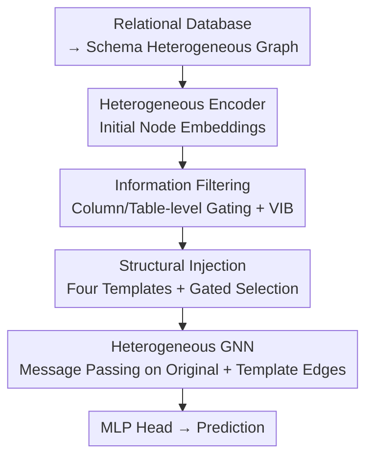

# What Makes a Desired Graph for Relational Deep Learning?

**Conference**: ICML 2026  
**arXiv**: [2606.08491](https://arxiv.org/abs/2606.08491)  
**Code**: https://github.com/cy623/Structural_Optimizer_RDL.git  
**Area**: Graph Learning / GNN / Relational Deep Learning  
**Keywords**: Relational Deep Learning, Heterogeneous Graphs, Graph Structure Learning, Information Bottleneck, Structural Injection

## TL;DR
This paper points out that "mechanically converting database schemas into graphs" is not what GNNs desire, as such graphs systematically suffer from **information overload** and **semantic fragmentation**. The authors propose an end-to-end "Structural Optimizer" that uses learnable gating for **information filtering** and templated **structural injection** to recover task-related edges. Across 26 tasks in RELBench, this approach improves accuracy while frequently reducing inference overhead.

## Background & Motivation
**Background**: The standard practice in Relational Deep Learning (RDL) is to convert a Relational Database (RDB) into a heterogeneous graph based on its schema—where each table is a node type and each foreign key constraint is an edge type—followed by message passing using heterogeneous GNNs. Works such as Fey et al.'s 2024 blueprint, REL-GNN, and RelGT have all focused on advancing model architectures along this path.

**Limitations of Prior Work**: The issue lies in the fact that RDB schemas are designed for "storage integrity + query efficiency" (following normal forms like 2NF/3NF/BCNF to eliminate redundancy). Their organizational goals differ fundamentally from the "short paths and local connectivity" desired by GNNs. Consequently, mechanically mapped graphs exhibit two systematic failures:

- **Information overload**: A large number of fields and entity types in the database (e.g., IDs, log fields) are almost irrelevant to the prediction target. Mapping them into the graph only increases representation complexity without providing predictive signals.
- **Semantic fragmentation**: Normalization splits relationships that should be direct into a sequence of foreign key chains. For example, a "User-Item" interaction is stored as "User → Order → OrderItem → Item." A GNN must traverse 3-4 hops to recover a dependency that is conceptually a single step, which both increases computation and causes signal decay over long paths.

**Key Challenge**: Retaining all tables and relations preserves database semantics but obscures the relational structures most critical for prediction—**schema graph $\neq$ task-faithful graph**.

**Goal**: Instead of "designing yet another stronger model architecture," this work returns to the more fundamental question: What kind of graph is truly desired for RDL?

**Key Insight**: The authors argue that the desired graph is not the raw schema but a **task-related transformation** of it. This requires two complementary operations: **deleting** structures and attributes with low contribution to the target, while **injecting** edges that directly expose the dependencies needed for reasoning. Graph construction is thus not a forward schema $\to$ topology mapping, but a controlled "compression + enhancement" process guided by the learning objective.

**Core Idea**: Treat graph construction as a controlled process involving two operators (filtering + injection). Use an end-to-end trainable structural optimizer to automatically learn "what to remove and what to add," allowing the graph to converge from an overloaded and fragmented state to a compact, task-aligned topology.

## Method

### Overall Architecture
The overall workflow is: Input a relational database $\to$ convert to a temporally consistent heterogeneous graph in the standard way $\to$ use a heterogeneous encoder for initial node embeddings $\to$ sequentially pass through two structural operators (**Information Filtering** to suppress redundant features/tables, and **Structural Injection** to add task-related edges) $\to$ feed the optimized graph into a heterogeneous GNN for message passing $\to$ output predictions via an MLP head. Crucially, both filtering and injection are driven by **learnable gating** + **$\ell_0$ sparsity penalties**, meaning the entire graph structure is "learned" end-to-end via the task loss rather than being manually designed.

The authors emphasize that injection uses **interpretable templates** (such as homophily repair and temporal continuity) rather than freely parameterized arbitrary edges. This trades "maximum flexibility" for "scientific interpretability"—while an unconstrained structural learner might achieve higher scores, it produces a black-box topology that fails to distill reusable "task $\leftrightarrow$ motif" patterns.

### Key Designs

**1. Information Filtering: Filtering as a "Structural Capacity Knob" rather than simple denoising**

To address information overload, the authors use a **two-level hierarchical gating** mechanism to suppress redundancy at different granularities. At the column-level, each node type $T_i$ is assigned a learnable gating vector $g_{T_i}\in[0,1]^{d_i}$, which is element-wise multiplied with initial features $\hat{h}_v = g_{T_i}\odot h_v^{(0)}$. At the table-level, each node type is assigned a scalar gate $s_{T_i}\in[0,1]$, resulting in $\tilde{h}_v = s_{T_i}\cdot\hat{h}_v$. To approximate discrete selection while maintaining differentiability, gates are parameterized using **Hard-Concrete relaxation**:

$$g_{T_i}=\sigma\!\left(\frac{\log u-\log(1-u)+\theta_{T_i}}{\tau}\right)\cdot(\zeta-\gamma)+\gamma,\quad u\sim\text{Uniform}(0,1)^{d_i}$$

During training, gates are stochastic and can be regularized with $\ell_0$-style sparsity penalties; during inference, they collapse into deterministic hard selections $g_{T_i}=\mathbb{I}[\sigma(\theta_{T_i})>\tau_g]$. This design is effective because the authors empirically found that filtering follows an **inverse U-shape**: weak filtering leaves semantic noise leading to over-smoothing/signal dilution, while excessive filtering erases task-relevant evidence. The desired graph is neither the sparsest nor the most complete, but a task-specific balance between "denoising" and "information preservation." A counter-intuitive conclusion is that **semantic sparsification beats statistical pruning**: retaining high-variance features (VarFilter) is not consistently better than the original graph, as many high-variance attributes in RDBs are merely "statistically active but causally irrelevant" operational traces.

**2. Structural Injection: Injection as "Motif Selection" to add only required relational patterns**

Filtering cannot fix semantic fragmentation—when a schema splits interactions into multi-hop chains, GNNs need extreme depth to recover dependencies. Structural injection addresses this by **adding edges to repair missing relational motifs**. However, adding edges is not a free lunch: blind injection can distort neighborhoods and introduce harmful inductive biases. The authors thus design injection using four types of **interpretable templates** and empirically determine which motif suits which task type:

- **Type-wise KNN (Homophily Repair)**: Connects nodes of the same type to their top-$n$ most similar peers (cosine similarity) to strengthen intra-class homophily.
- **Two-hop Shortcuts (Topological Repair)**: Adds shortcut edges directly to long chains (e.g., $A \to B \to C$) to shorten the message-passing depth of high-order dependencies.
- **Behavioral Similarity (Collaborative Repair)**: For node types $A$ and $B$ connected by relation $r$, aggregate the $B$-type neighbors of each $A$ node and calculate pairwise similarity. Edges are added if similarity exceeds a threshold $\tau_{\text{sim}}$, exposing collaborative signals fragmented by join paths.
- **Temporal Continuity (Causal Repair)**: Connects records of the same entity sorted by time $[v_1, \dots, v_m]$ sequentially as $E_{\text{time}}=\{(v_{t-1}, v_t)\}$ to explicitly model state transitions.

The empirical patterns are clear: **Classification tasks** benefit most from homophily repair (KNN), **regression tasks** benefit most from temporal continuity, and **recommendation tasks** benefit most from behavioral similarity. Mismatched motifs can degrade performance (e.g., adding shortcuts to temporal tasks). The conclusion is that a desired graph is characterized not by edge density, but by whether the topology injects task-relevant inductive biases.

**3. Template Gating + Unified Objective: Making "what to add" a learnable, sparse choice**

Within the end-to-end optimizer, each instantiated template $\mathcal{E}_k$ is paired with a learnable gate $g_k\in[0,1]$ (also Hard-Concrete parameterized). During training, $g_k$ serves as a continuous weight for template messages $z_{v,k}^{(l)}=g_k\cdot\text{AGG}(z_u^{(l)}:u\in\mathcal{N}_k(v))$ to ensure differentiability. During inference, hard selection keeps only templates where $g_k>\tau_k$, resulting in a sparsely augmented graph. Each template edge is treated as an independent relation type and enters heterogeneous GNN message passing alongside original foreign key relations. The entire model is trained end-to-end with the following unified objective:

$$\mathcal{L}=\mathcal{L}_{\text{task}}(\hat{Y},Y)+\beta_{\text{vib}}\sum_{T_i}\tfrac{1}{|T_i|}\sum_{v\in T_i}\text{KL}\big(q(z_v\mid\tilde{h}_v)\,\|\,\mathcal{N}(0,I)\big)+\lambda\Big(\sum_{T_i}\mathbb{E}\|g_{T_i}\|_0+\lambda_s\sum_{T_i}\mathbb{E}\|s_{T_i}\|_0\Big)+\lambda_k\sum_{k}\mathbb{E}\|g_k\|_0$$

The four terms are: supervision loss, type-level **Variational Information Bottleneck (VIB)** (adding continuous information compression on top of hard gating by mapping $\tilde{h}_v$ to a stochastic latent variable $z_v$), $\ell_0$ sparsity penalty for filtering gates, and $\ell_0$ sparsity penalty for injection template gates. Thus, "what to remove" and "what to add" are learned jointly within a single differentiable objective.

### Loss & Training
The core theoretical support defines the "desired graph" as $\phi_g^\star\in\arg\min_{\phi_g}\{\mathcal{R}^\star(\phi_g)+\Omega(\phi_g)\}$: it must yield good performance after encoder optimization while remaining sufficiently simple based on the structural sparsity regularizer $\Omega(\phi_g)$. The authors provide two intuitive theorems—**Filtering controls structural capacity**: The expected sparsity $\mu = \mathbb{E}\|M\|_0$ of Bernoulli gates sets an upper bound on the entropy of the gating configuration $H(M)\le J\,h(\mu/J)$, which is monotonic with $\mu$ in the sparse range, explaining the inverse U-shape (too little filtering leaves noisy configurations, too much overly restricts the structure). **Injection expands search space**: When template gates are learnable and penalized, adding candidate edges does not worsen the optimal regularized objective under ideal population settings, as the optimizer can always set harmful template gates to zero.

## Key Experimental Results

### Main Results
Evaluated on 26 RELBench tasks (classification/regression/recommendation), compared against GBDT (LightGBM), heterogeneous GNNs (HAN/GTN/HGSL), RDL-specific models (REL-GNN/RelGT), and LLM structural methods (LLM-Struct). Classification uses ROC-AUC (↑), regression uses MAE (↓), and recommendation uses MAP (↑).

| Task (Metric) | Base | Prev. Best | Ours |
|--------------|------|----------|------|
| study-outcome (AUC↑) | 69.44 | 70.86 (REL-GNN) | **72.35** |
| driver-top3 (AUC↑) | 81.48 | 83.57 (LLM-Struct) | **86.82** |
| user-repeat (AUC↑) | 78.75 | 80.64 (HGSL) | **82.36** |
| driver-position (MAE↓) | 3.88 | 3.69 (LLM-Struct) | **2.13** |
| study-adverse (MAE↓) | 45.50 | 44.62 (RelGT) | **41.28** |

Optimized graphs consistently outperform original schema graphs and existing RDL pipelines across all task types, often while reducing inference costs due to sparsified edges and features.

### Ablation Study
The core "ablation" is the **structural probe experiments** (conducted on 9 RELBench tasks) to reveal filtering/injection patterns:

| Configuration | Phenomenon | Description |
|------|------|------|
| RandFilter | Universal drop (e.g., study-outcome 69.44$\to$63.21) | Random filtering destroys useful structure |
| VarFilter (High Variance) | Unstable, not always better than Base | Variance $\neq$ predictive signal; operational fields often have false high variance |
| FullFilter (Semantic Gating) | Best for most tasks (e.g., driver-top3 84.66) | Semantic sparsification > statistical pruning |
| Injection · Matched Motif | Gain in corresponding task groups | Classification $\leftrightarrow$ KNN, Regression $\leftrightarrow$ Temporal, Rec $\leftrightarrow$ Behavioral Similarity |
| Injection · Mismatched Motif | Neutral or performance drop | Adding shortcuts to temporal tasks actually hurts |

### Key Findings
- **Filtering is a bias-variance knob, exhibiting an inverse U-shape**: As filtering intensity increases (sparsity weight $\lambda$), performance first rises and then falls, with the peak in the middle—the optimal graph is neither the sparsest nor the most complete.
- **Injection must be targeted**: Adding edges is only useful when injecting relational motifs that the task truly depends on; mismatches hurt performance. Value is determined by "exposure of task-related dependencies" rather than edge density.
- **Interpretable templates provide transferable patterns**: Constraining the search space with semantic templates (rather than free edges) sacrifices some upper-bound potential but yields reusable insights: classification needs homophily, regression needs causality, and recommendation needs collaboration.

## Highlights & Insights
- **Treating "graph construction" as a learnable optimization target**: Moves beyond the "architecture race" to point out that RDL performance is bottlenecked by the schema $\to$ graph conversion from the start. Optimizing the graph itself is a fundamental yet overlooked perspective.
- **"Semantic sparsification beats statistical pruning" is counter-intuitive and practical**: High-variance attributes in RDBs are often operational traces like IDs/logs; selecting features based on variance is misleading. This insight transfers to any table $\to$ graph preprocessing.
- **The task $\leftrightarrow$ motif lookup table is a reusable engineering guide**: Classification $\to$ KNN homophily, Regression $\to$ Temporal, Recommendation $\to$ Behavioral Similarity provides a ready-made prior for deciding which edges to add to relational graphs.
- **Inverse U-shape of filtering + entropy bound theorem**: Formalizes "the graph is not better just because it is sparser" through structural capacity entropy bounds, providing theoretical intuition for tuning $\lambda$.

## Limitations & Future Work
- **Templates are a finite set of manual designs**: The four types of semantic repair motifs cover common dependencies but may struggle with complex relational patterns that templates cannot express (e.g., high-order hypergraph structures). The authors admit unconstrained structure learners have a higher ceiling.
- **Reliance on timestamps and time-consistent sampling**: Temporal continuity repair is only instantiated for node types with timestamp columns, offering limited help for databases without temporal information.
- **High number of hyperparameters**: Gating thresholds $\tau_g$, similarity thresholds $\tau_{\text{sim}}$, various sparsity weights $\lambda/\lambda_s/\lambda_k$, and VIB weight $\beta_{\text{vib}}$ all require tuning; robustness across databases needs further verification.
- **Potential improvements**: Upgrade templates from "enumeration + gating" to "automatic motif generation based on task," or make the filtering/injection a plug-and-play preprocessing layer decoupled from the GNN backbone.

## Related Work & Insights
- **vs. REL-GNN / RelGT**: These modify the **model** (atomic paths, graph transformer tokenization), assuming the input graph is fixed. This paper modifies the **graph itself**, noting that the performance ceiling is constrained by the initial conversion—both are orthogonal and can be combined.
- **vs. HGSL / GTN (Heterogeneous Graph Structure Learning)**: These methods assume the input graph has a meaningful base topology and perform fine-tuning. RDB graph connectivity is determined by schema/foreign keys, reflecting data organization rather than task semantics; thus, this paper redefines structural optimization from the RDB-unique perspective of "overload + fragmentation."
- **vs. LightGBM / XGBoost (Traditional Two-step Methods)**: Traditional methods rely on SQL feature engineering + tabular models, failing to capture structural info between entities. This work learns end-to-end on the graph, integrating structural selection into optimization.

## Rating
- Novelty: ⭐⭐⭐⭐⭐ Elevated "what makes a good graph" to a first-class problem; filtering + injection framework is novel.
- Experimental Thoroughness: ⭐⭐⭐⭐⭐ 26 tasks across classification/regression/recommendation, plus systematic structural probe ablations.
- Writing Quality: ⭐⭐⭐⭐ Clear progression from empirical patterns $\to$ theory $\to$ optimizer; notation is slightly dense.
- Value: ⭐⭐⭐⭐⭐ Task $\leftrightarrow$ motif mapping and "semantic sparsification" insights have direct guidance for RDL engineering.

<!-- RELATED:START -->

## Related Papers

- [\[ICLR 2026\] Relatron: Automating Relational Machine Learning over Relational Databases](../../ICLR2026/graph_learning/relatron_automating_relational_machine_learning_over_relational_databases.md)
- [\[ACL 2026\] What Makes AI Research Replicable? Executable Knowledge Graphs as Scientific Knowledge Representations](../../ACL2026/graph_learning/what_makes_ai_research_replicable_executable_knowledge_graphs_as_scientific_know.md)
- [\[ICML 2026\] Deep Neural Sheaf Diffusion](deep_neural_sheaf_diffusion.md)
- [\[ICML 2026\] Generative Representation Learning on Hyper-relational Knowledge Graphs via Masked Discrete Diffusion](generative_representation_learning_on_hyper-relational_knowledge_graphs_via_mask.md)
- [\[ICLR 2026\] Relational Graph Transformer](../../ICLR2026/graph_learning/relational_graph_transformer.md)

<!-- RELATED:END -->
