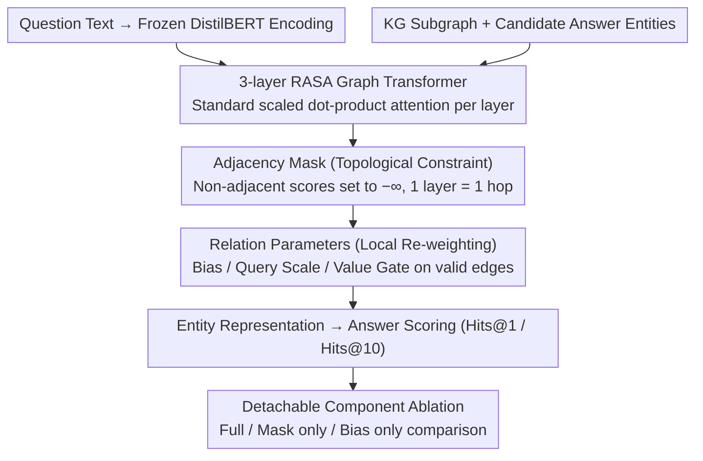

# What Structural Inductive Bias Helps Transformers Reason Over Knowledge Graphs? A Study with Tabula RASA

**Conference**: ICML2026  
**arXiv**: [2602.02834](https://arxiv.org/abs/2602.02834)  
**Code**: No public code  
**Area**: Graph Learning / Knowledge Graph Reasoning  
**Keywords**: Knowledge Graph Question Answering (KGQA), Graph Transformer, Sparse Attention, Structural Inductive Bias, Multi-hop Reasoning  

## TL;DR
Using RASA, a detachable minimal graph Transformer variant, this paper conducts controlled experiments and discovers that the most beneficial structural inductive bias in knowledge graph multi-hop question answering is primarily the topological constraints provided by adjacency masks, rather than learnable relationship parameters such as relation-type bias, query scaling, or value gating.

## Background & Motivation
**Background**: Knowledge Graph Question Answering (KGQA) requires models to perform multi-hop reasoning along chains of entities and relations. Common solutions include Graph Neural Networks (GNNs) like R-GCN/GAT, structured Transformers like Graphormer, and KG+LLM pipelines that delegate subgraph retrieval to Large Language Models (LLMs). The Graph Transformer direction typically bundles multiple structural signals—such as centrality encoding, shortest path encoding, edge type encoding, and sparse attention—reporting only an overall performance gain.

**Limitations of Prior Work**: While these methods are effective, it is difficult to determine which specific structural information is truly responsible for the performance. If a model simultaneously utilizes adjacency masks, edge type embeddings, positional encodings, and relational weights, the gain could stem from a smaller search space, relationship semantics, or simply extra parameters and hyperparameter tuning. For multi-hop reasoning in KGs, this attribution problem is critical because model failure often occurs not because an entity is unknown, but because the model fails to propagate information along the correct graph path.

**Key Challenge**: Global attention in Transformers theoretically allows any node to interact directly, but multi-hop reachability inherently requires the composition of paths layer by layer (one hop per layer). Relation parameters can only weight or scale existing attention scores but cannot guarantee that information flows strictly along graph edges. In contrast, adjacency masks directly restrict the attention space to actual neighbors. The fundamental conflict to be verified is whether the useful bias in KGQA is "knowing the type of the edge" or "knowing that information can only travel along edges."

**Goal**: Instead of seeking a new SOTA system, the authors construct an experimental apparatus with detachable components to separately measure the contributions of topological masks and learnable relationship parameters. They also examine the stability of these contributions across MetaQA, WebQSP, CWQ, and held-out relation settings.

**Key Insight**: The paper starts with a simple logical deduction: if each attention layer extends a node's representation at most to its 1-hop neighbors, then $k$-hop reasoning requires at least $k$ layers of effective propagation. Adjacency masks explicitly implement "one layer per hop," whereas relationship bias, scale, and gate can only re-weight dense attention, which may fail to learn the correct propagation path.

**Core Idea**: Utilize RASA to decompose "topological constraints" and "relational re-weighting" into independently toggleable components, proving that the primary gain in multi-hop KGQA comes from the topological inductive bias of the adjacency mask.

## Method
The method can be understood in two layers: the first is the theoretical intuition explaining why multi-hop KG reasoning requires step-by-step propagation according to the graph structure; the second is RASA, the experimental vehicle that exposes four types of structural signals as ablatable components with minimal architectural changes. RASA is not intended as a new architecture for deployment but as a "microscope" to observe the individual contributions of different structural signals within the same Transformer framework.

### Overall Architecture
The input consists of a knowledge graph subgraph, the question text, and candidate answer entities. The question is encoded using a frozen DistilBERT, while the graph side runs a 3-layer RASA Transformer with a hidden size of 128 and 4 heads. Each attention layer performs standard scaled dot-product attention but reads edge connectivity and types: if two nodes are connected in the graph or possess a self-loop, attention is permitted; otherwise, the corresponding score is set to $-\infty$. On permitted edges, the model can further use relation-type bias, relation-specific query scale, and value gates to fine-tune the influence of different relations. Finally, the model scores answers based on entity representations, evaluated using Hits@1/Hits@10.

In the experimental design, the authors fix the encoder, the answer scoring mechanism, and the hyperparameter tuning budget to compare Vanilla Transformer, Graphormer, R-GCN, GAT, RASA, and RASA's component ablations. The critical comparison is not whether "RASA surpasses all models," but the performance gap between Full, Mask only, and Bias only configurations.

### Key Designs
1.  **Adjacency Mask: Constraining Multi-hop Reasoning to Valid Graph Paths**
    The core question RASA addresses is "along which edge to propagate information." Global dense attention allows any two nodes to interact directly, essentially requiring the model to rediscover graph connectivity within an $O(n^2)$ search space. The adjacency mask pre-encodes this step: while the standard attention score is $S_{ij}=(XW_Q)_i\cdot(XW_K)_j/\sqrt{d_k}$, RASA filters it before the softmax—setting $S_{ij}=-\infty$ if $A_{ij}=0$ and $i \ne j$. Consequently, non-adjacent nodes cannot exchange information directly; one attention layer corresponds exactly to a "1-hop" message propagation, and a $k$-hop answer must be reached through $k$ layers. Its value lies not just in reducing computation from $O(n^2)$ to $O(m)$ in sparse graphs ($m \ll n^2$), but in providing the "valid paths" as a topological prior, sparing the model from relearning connectivity from scratch.

2.  **Relation Parameters: Local Re-weighting on Valid Edges**
    Once the mask defines the valid propagation space, the model needs to distinguish the importance of relationship types (e.g., "director" vs. "birthplace"). This is achieved via three types of relational parameters: learnable edge-type bias $b_r$ added to the score, query scale $s_r$ multiplied by the score, and a value gate $g_r$ (via $\sigma(g_r)$) regulating the information flow of the edge. These add only $3|R|H$ parameters per layer. Crucially, these parameters only modify weights on existing edges and do not alter the attention graph itself—if the mask is removed, they degrade into arbitrary re-weighting within dense attention, unable to prevent the model from attending to irrelevant nodes. This highlights the hierarchy: the mask dictates "connectivity," while relation parameters merely dictate "importance."

3.  **Mechanism: Detachable Component Ablation for Causal Attribution**
    Many Graph Transformers bundle masks, edge types, and weights, making it impossible to identify the source of improvement. RASA's design allows the mask, bias, scale, and gate to be toggled independently without retraining the encoder. Thus, the same architecture can produce three key configurations: **Full** (all four enabled), **Mask only** (binary adjacency mask only, no relational parameters), and **Bias only** (no mask, simple edge-type bias). If **Mask only** recovers most of the gains while **Bias only** performs near Vanilla Transformer levels on complex datasets like CWQ, the credit can be cleanly attributed to topological constraints rather than relational capacity.

### Loss & Training
No special loss functions are introduced; the focus is on fair control of variables. All self-implemented models use a frozen DistilBERT encoder and a unified answer scoring head. RASA uses 3 layers, 128 dimensions, 4 heads on MetaQA, batch size 16, AdamW, a learning rate of $2\times 10^{-5}$ with cosine annealing, and early stopping with a patience of 5. Results are reported as the mean and standard deviation of 3 random seeds. The best configuration for WebQSP uses $d=256, L=4$.

## Key Experimental Results

### Main Results

| Dataset / Setting | Metric | RASA / Ours | Strong Baseline | Vanilla Transformer | Conclusion |
|:---|:---|:---|:---|:---|:---|
| MetaQA 3-hop | Hits@1 | 92.6±0.1 | Graphormer 93.3±0.2 / R-GCN 91.9±0.2 | 12.9±0.2 | RASA is competitive as an ablation vehicle. |
| WebQSP | Hits@1 | 72.5±0.2 | Graphormer 74.0±0.4 / R-GCN 65.7±0.6 | 18.7 | Structured attention significantly outperforms global attention. |
| CWQ | Hits@1 | 59.9±0.2 | Graphormer 64.7±0.1 / R-GCN 58.2±0.0 | 2.7 | Topology remains the core information for complex questions. |
| MetaQA held-out | Perf. Drop | RASA -7.2pp | R-GCN -29.2pp | - | Mask-based topology generalizes better to unseen relations. |

### Ablation Study

| Configuration | Key Metric | Description |
|:---|:---|:---|
| Full RASA | MetaQA 3-hop 92.6±0.1 | All components (mask + bias + scale + gate) enabled. |
| Mask only | MetaQA 3-hop 85.4±0.1 | Adjacency mask only; recovers ~91% of the gain over unmasked models. |
| Bias only | MetaQA 3-hop 12.9±0.2 | Without the mask, relational bias provides virtually no gain. |
| Mask only (WebQSP / CWQ) | 64.2 / 56.6 | Gains of +45.5pp / +53.9pp over Vanilla (18.7 / 2.7). |
| Bias only (CWQ) | 2.1 | Performs worse than Vanilla (2.7), suggesting bias without topology acts as noise. |

### Key Findings
- **The adjacency mask is the dominant contributor**: On MetaQA 3-hop, the jump from Bias only to Mask only is +72.5pp, whereas adding relation parameters onto the mask only adds +7.2pp.
- **Consistency across datasets**: On WebQSP and CWQ, the mask contributes +45.5pp and +53.9pp respectively, accounting for the vast majority of the gain.
- **Relational parameters are refinements**: They act as "fine-tuning" on the correct topological paths. Without a mask to define the propagation space, they can actually hurt performance on complex multi-hop problems like CWQ.
- **Efficiency trade-off**: Current RASA implementation is ~6x slower than Vanilla Transformer because it uses dense adjacency operations rather than specialized sparse kernels.

## Highlights & Insights
- The value lies in positioning RASA as an **ablation tool**. While most papers bundle structural signals, this work explicitly decouples "topology" and "relational semantics," making the conclusion a mechanistic analysis rather than a simple leaderboard report.
- The insight that **"topology precedes relational parameters"** is profound: for multi-hop KGQA, ensuring that information propagates step-by-step along valid edges is more critical than learning fine-grained weights for each relation type. This explains why relation-heavy models often struggle with unseen relations or compositional generalization.
- The **held-out relation** experiment provides independent evidence. R-GCN's relation-specific matrices degrade significantly with unseen edge types, whereas the adjacency mask relies only on connectivity, providing usable paths even for relations with unlearned parameters.
- This paper serves as a reminder for graph learning research: not all "structural encodings" are created equal. Structural constraints that alter the attention pattern are a different level of inductive bias compared to relationship re-weighting.

## Limitations & Future Work
- **Reliance on explicit graph structure**: If the KG is incomplete or the subgraph retrieval is poor, a strict adjacency mask might block information that should have been propagated.
- **Efficiency**: RASA's current latency is 49.0ms vs. Vanilla's 7.9ms. Practical KGQA systems would require mapping this sparse structure to efficient kernels and batching layers.
- **Coarse relational ablation**: The study treats bias, scaling, and gating as a collective "relational parameter" group. It identifies the "Topology vs. Relation" hierarchy but does not pinpoint which specific re-weighting method is most robust.
- **Absolute performance vs. LLMs**: SubgraphRAG+GPT-4o reaches 90.1% on WebQSP. RASA’s findings should guide the design of structural modules rather than serve as a replacement for retrieval-augmented LLM systems.

## Related Work & Insights
- **vs. Graphormer**: Graphormer injects structure into dense attention via centrality and spatial distance. RASA changes the attention pattern via masking. While Graphormer has higher absolute performance, RASA proves the "structural channel" is the critical component.
- **vs. R-GCN**: R-GCN uses relation-specific matrices for message passing, which is effective for seen relations but brittle in held-out settings. RASA's mask is more robust as it depends on topological connectivity.
- **vs. KG+LLM / SubgraphRAG**: LLM-augmented methods focus on final QA performance using textual knowledge; this work controls for external knowledge to study pure structural bias. These can be complementary: mask-based attention can provide interpretable path aggregation after subgraph retrieval.

## Rating
- **Novelty**: ⭐⭐⭐⭐ Evaluates "which structural bias matters most" through clean ablation rather than just proposing a new architecture.
- **Experimental Thoroughness**: ⭐⭐⭐⭐ Comprehensive across MetaQA, WebQSP, and CWQ; however, the internal ablation of relationship parameters could be more granular.
- **Writing Quality**: ⭐⭐⭐⭐⭐ Clear positioning; explicitly markets the model as an experimental vehicle rather than a SOTA system, with well-defined conclusion boundaries.
- **Value**: ⭐⭐⭐⭐ Directly informs the design of structured reasoning models, particularly for tasks requiring compositional generalization.

<!-- RELATED:START -->

## Related Papers

- [\[ICLR 2026\] Graph Tokenization for Bridging Graphs and Transformers](../../ICLR2026/graph_learning/graph_tokenization_for_bridging_graphs_and_transformers.md)
- [\[ACL 2026\] What Makes AI Research Replicable? Executable Knowledge Graphs as Scientific Knowledge Representations](../../ACL2026/graph_learning/what_makes_ai_research_replicable_executable_knowledge_graphs_as_scientific_know.md)
- [\[ACL 2025\] Multimodal Transformers are Hierarchical Modal-wise Heterogeneous Graphs](../../ACL2025/graph_learning/multimodal_transformers_are_hierarchical_modal-wise_heterogeneous_graphs.md)
- [\[AAAI 2026\] PathMind: A Retrieve-Prioritize-Reason Framework for Knowledge Graph Reasoning with Large Language Models](../../AAAI2026/graph_learning/pathmind_a_retrieve-prioritize-reason_framework_for_knowledge_graph_reasoning_wi.md)
- [\[ACL 2026\] STEM: Structure-Tracing Evidence Mining for Knowledge Graphs-Driven Retrieval-Augmented Generation](../../ACL2026/graph_learning/stem_structure-tracing_evidence_mining_for_knowledge_graphs-driven_retrieval-aug.md)

<!-- RELATED:END -->
