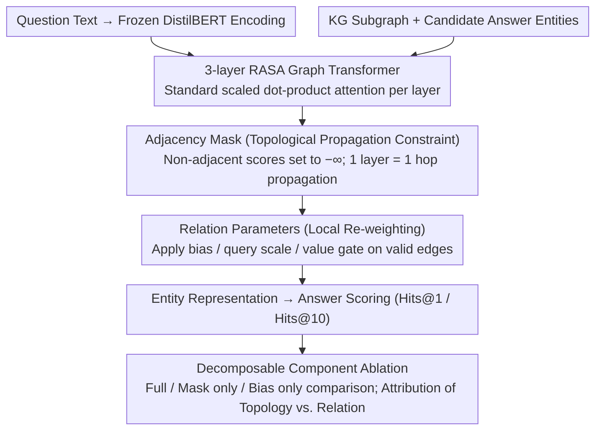

# What Structural Inductive Bias Helps Transformers Reason Over Knowledge Graphs? A Study with Tabula RASA

**Conference**: ICML2026  
**arXiv**: [2602.02834](https://arxiv.org/abs/2602.02834)  
**Code**: No public code  
**Area**: Graph Learning / Knowledge Graph Reasoning  
**Keywords**: Knowledge Graph Question Answering (KGQA), Graph Transformer, Sparse Attention, Structural Inductive Bias, Multi-hop Reasoning  

## TL;DR
This paper employs RASA, a minimalist and decomposable Graph Transformer variant, to conduct controlled experiments. It finds that the most effective structural inductive bias in multi-hop KGQA stems from topological constraints provided by adjacency masks, rather than learnable relation parameters such as relation-type bias, query scaling, or value gating.

## Background & Motivation
**Background**: Knowledge Graph Question Answering (KGQA) requires models to perform multi-hop reasoning along chains of entities and relations. Common solutions include Graph Neural Networks (GNNs) like R-GCN/GAT, structured Transformers like Graphormer, and KG+LLM pipelines that delegate subgraph retrieval to Large Language Models. In the Graph Transformer domain, multiple structural signals (centrality encoding, shortest path encoding, edge type encoding, sparse attention, etc.) are typically bundled together, with only the overall performance reported.

**Limitations of Prior Work**: While these methods are effective, it is difficult to determine "which structural information actually matters." If a model uses adjacency masks, edge type embeddings, positional encodings, and relation weights simultaneously, performance gains might come from a smaller search space, relation semantics, or simply extra parameters and tuning. This attribution problem is crucial for multi-hop reasoning, as model failures often occur because the model does not know which graph path to propagate information along, rather than not knowing the entity itself.

**Key Challenge**: While the global attention of Transformers allows direct interaction between any nodes, multi-hop reachability inherently requires composing paths layer-by-layer. Relation parameters only weight or scale existing attention scores and cannot guarantee that information flows strictly along graph edges. In contrast, adjacency masks directly restrict the attention space to actual neighbors. The contradiction this paper investigates is: whether the useful bias in KGQA is "knowing the edge type" or "knowing it can only move along edges."

**Goal**: The authors do not aim for a new SOTA system but construct an experimental setup with decomposable components to measure the individual contributions of topological masks and learnable relation parameters. The study examines the stability of these contributions across MetaQA, WebQSP, CWQ, and held-out relation settings.

**Key Insight**: The paper starts with a simple depth-based argument: if each attention layer expands a node representation to its one-hop neighbors at most, then $k$-hop reasoning requires at least $k$ layers of effective propagation. Adjacency masks explicitly implement "one layer, one hop," whereas relation bias, scale, and gate can only re-weight dense attention, which may not learn the correct propagation path.

**Core Idea**: Use RASA to decouple "topological constraints" and "relational re-weighting" into independently toggleable components to prove that the primary gain in multi-hop KGQA comes from the topological inductive bias of the adjacency mask.

## Method
The method section can be understood at two levels: the theoretical intuition explaining why multi-hop KG reasoning needs hop-by-hop propagation, and the RASA experimental vehicle, which exposes four types of structural signals as ablatable components with minimal modifications. RASA itself is not intended as a new architecture for sale but as a "microscope" to observe the respective contributions of different structural signals within the same Transformer framework.

### Overall Architecture
The input consists of a KG subgraph, the question text, and candidate answer entities. The question is encoded using a frozen DistilBERT, while the graph side runs a 3-layer RASA Transformer with a hidden size of 128 and 4 heads between entity nodes. Each attention layer integrates edge connectivity and edge types into standard scaled dot-product attention: if two nodes are connected in the graph or share a self-loop, attention is permitted; otherwise, the corresponding score is set to $-\infty$. On permitted edges, the model can refine the influence of different relations using relation-type bias, relation-specific query scale, and value gates. Finally, the model scores answers based on entity representations using Hits@1/Hits@10.

In terms of experimental design, the authors fix the same encoder, answer scoring mechanism, and approximately identical tuning budgets to compare Vanilla Transformer, Graphormer, R-GCN, GAT, RASA, and RASA component ablations. The key comparison is not whether "RASA exceeds all models" but the performance gaps between Full, Mask only, and Bias only configurations.

### Key Designs
1. **Adjacency Mask: Constraining Multi-hop Reasoning to Legal Graph Paths**

	The core question RASA addresses is "along which edge to propagate information." Global dense attention allows any two nodes to interact directly, which leaves the model to rediscover graph connectivity within an $O(n^2)$ search space. Adjacency masks encode this step beforehand: while the standard attention score is $S_{ij}=(XW_Q)_i\cdot(XW_K)_j/\sqrt{d_k}$, RASA filters it with an adjacency matrix before softmax—if $A_{ij}=0$ and $i\ne j$, then $S_{ij}=-\infty$. Thus, non-adjacent nodes cannot exchange information directly, and one attention layer corresponds exactly to a "one-hop" message propagation. $k$-hop answers must rely on hop-by-hop accumulation across layers. Its value lies not only in reducing the search space from $O(n^2)$ to $O(m)$ (where $m\ll n^2$) for sparse graphs but also in providing the "potentially legal paths" as a topological prior, sparing the model from learning connectivity from scratch.

2. **Relation Parameters: Local Re-weighting on Valid Edges Only**

	Once the propagation space is defined by the mask, the model needs to distinguish the importance of relations like "director," "birthplace," or "starring." This is achieved via three types of relation parameters: for each relation and attention head, the model learns an edge-type bias $b_r$ added to the score, a query scale $s_r$ multiplied by the score, and a value gate $g_r$ adapted via $\sigma(g_r)$ to regulate information flow. This increases parameters by only $3|R|H$ per layer. Crucially, these parameters only modify weights on existing edges and do not alter the attention graph itself; without the mask, they degenerate into weight adjustments within dense attention, fail to stop the model from attending to irrelevant nodes. This demonstrates the hierarchical difference: the mask changes "connectivity," while relation parameters merely change "intensity after connection."

3. **Decomposable Component Ablation: Causal Attribution of Topology and Relation**

	Many Graph Transformers bundle masks, edge types, positional encodings, and relation weights together, making it impossible to identify the source of gains. RASA's design allows the mask, bias, scale, and gate components to be toggled independently without retraining the encoder. Thus, the same architecture can produce three key configurations: Full (all four on); Mask only (binary adjacency mask only, all learnable relation parameters removed); and Bias only (mask removed, only simple edge-type bias kept). If Mask only recovers most of the gain while Bias only performs near or worse than a Vanilla Transformer on complex datasets like CWQ, the credit can be cleanly attributed to topological constraints rather than relation parameters or extra capacity. The authors replicated this trend on WebQSP/CWQ and held-out relation settings to rule out dataset-specific coincidences.

### Loss & Training
The paper introduces no special loss functions; the focus is on fair variable control. All self-implemented models use a frozen DistilBERT encoder and uniform answer scoring. RASA uses 3 layers, 128 dimensions, and 4 heads on MetaQA, with a batch size of 16, AdamW, a learning rate of $2\times 10^{-5}$, cosine annealing, and early stopping with a patience of 5. Main results report the mean and standard deviation of 3 random seeds. The best configurations for WebQSP use $d=256, L=4$, while CWQ maintains the same hyperparameters for comparison.

## Key Experimental Results

### Main Results

| Dataset / Setting | Metric | RASA / Ours | Strong Baseline | Vanilla Transformer | Conclusion |
|--------|------|------|----------|------|------|
| MetaQA 3-hop | Hits@1 | 92.6±0.1 | Graphormer 93.3±0.2 / R-GCN 91.9±0.2 | 12.9±0.2 | RASA is not a SOTA claim but a strong ablation vehicle |
| WebQSP | Hits@1 | 72.5±0.2 | Graphormer 74.0±0.4 / R-GCN 65.7±0.6 | 18.7 | Structured attention significantly outperforms unstructured Transformers |
| CWQ | Hits@1 | 59.9±0.2 | Graphormer 64.7±0.1 / R-GCN 58.2±0.0 | 2.7 | Topology remains the core information for complex compositional questions |
| MetaQA held-out relation | Performance Drop | RASA -7.2pp | R-GCN -29.2pp | - | Mask-based topological bias generalizes better to unseen relations than relation-specific weights |

### Ablation Study

| Configuration | Key Metric | Description |
|------|---------|------|
| Full RASA | MetaQA 3-hop 92.6±0.1 | Mask + bias + scale + gate all enabled |
| Mask only | MetaQA 3-hop 85.4±0.1 | Only adjacency mask; recovers ~91% of full gain over unmasked |
| Bias only | MetaQA 3-hop 12.9±0.2 | Without mask, relation bias alone is indistinguishable from Vanilla Transformer |
| Mask only on WebQSP / CWQ | 64.2 / 56.6 | Compared to Vanilla (18.7 / 2.7), mask contributes +45.5pp / +53.9pp |
| Bias only on CWQ | 2.1 | Lower than Vanilla Transformer (2.7), suggesting relation bias without topology may act as noise |

### Key Findings
- Adjacency mask is the primary contributor: On MetaQA 3-hop, the gap from Bias only to Mask only is +72.5pp, while adding relation parameters to the mask only adds +7.2pp.
- This conclusion is consistent across datasets: On WebQSP and CWQ, masks contribute +45.5pp and +53.9pp respectively, accounting for most of the gains relative to the unmasked full model.
- Relation parameters are not useless but act as refinements on the correct topological path; without the mask providing a valid propagation space, they can even hurt performance in long compositional chains like CWQ.
- Efficiency-wise, the current RASA implementation is ~6x slower than Vanilla Transformer, primarily because it does not use optimized sparse kernels and incurs costs during dense adjacency construction.

## Highlights & Insights
- The most valuable aspect is not the proposal of RASA, but its explicit positioning as an ablation tool. While many Graph Transformer papers bundle structural signals, this paper disentangles "topology" and "relational semantics," making the conclusion more of a mechanistic analysis than a leaderboard report.
- The insight that "topology precedes relation parameters" is significant: for multi-hop KGQA, ensuring information flows hop-by-hop along legal edges is more critical than learning fine-grained weights for each relation. This explains why some relation-heavy models are fragile on unseen relations or compositional generalization.
- The held-out relation experiment provides independent evidence. R-GCN’s relation-specific matrices degrade significantly when encountering edge types unseen during training, whereas the adjacency mask relies solely on connectivity, providing usable paths even for new relations without learned parameters.
- This study reminds future graph learning research that not all "structural encodings" are created equal. Structural constraints that change attention patterns and relational re-weighting that only changes scores represent different levels of inductive bias.

## Limitations & Future Work
- The paper relies on explicit knowledge graph structures. If the graph is incomplete, edges are missing, or candidate subgraph recall is insufficient, a strict adjacency mask might block information that should have been propagated.
- RASA's implementation lacks efficient sparse attention kernels, resulting in a latency of 49.0ms, higher than the 7.9ms of the Vanilla Transformer. To become a practical KGQA system, the sparse structure needs to be integrated into kernels and batching.
- The main ablation treats bias, query scaling, and value gating as a collective "relation parameter" set and does not detail their individual contributions. The paper answers the large question of Topology vs. Relations but not which specific relation re-weighting is most robust.
- Absolute performance does not exceed LLM-augmented KGQA. SubgraphRAG+GPT-4o reaches 90.1% on WebQSP, indicating that these findings are better suited for designing structural modules rather than directly replacing retrieval-augmented LLM systems.

## Related Work & Insights
- **vs. Graphormer**: Graphormer injects structure into dense attention via centrality, spatial distance, and edge encoding; RASA changes the attention pattern via adjacency masks. Graphormer has higher absolute performance, but this paper proves that the "structural channel" itself is key, not necessarily the relation parameters.
- **vs. R-GCN**: R-GCN uses relation-specific weight matrices for message passing, making it naturally suited for seen relations, but it suffers more in held-out relation experiments. RASA's mask is more robust to new relations as it relies on topological connectivity.
- **vs. KG+LLM / SubgraphRAG**: LLM-augmented methods use textual knowledge and LLM reasoning, targeting final QA performance; this paper controls external knowledge to focus on pure structural bias. The two can be combined: after subgraph retrieval, use mask-based attention for interpretable path aggregation.
- **Insight**: For other structured reasoning tasks, such as program dependency graphs, molecular graphs, and causal graphs, prioritize explicit structural masks that restrict information flow before layering relation or type parameters.

## Rating
- Novelty: ⭐⭐⭐⭐ Does not invent the adjacency mask, but the clean ablation of "which structural bias is most important" is highly valuable.
- Experimental Thoroughness: ⭐⭐⭐⭐ Coverage of MetaQA, WebQSP, CWQ, held-out relations, and attention entropy is comprehensive, though fine-grained internal ablation of relation parameters remains limited.
- Writing Quality: ⭐⭐⭐⭐⭐ The paper is self-reflective, repeatedly stating RASA is an experimental vehicle rather than a SOTA system, with clear boundary conclusions.
- Value: ⭐⭐⭐⭐ Directly inspires structural designs for Graph Transformers and KGQA, particularly for models requiring compositional generalization.

<!-- RELATED:START -->

## Related Papers

- [\[ICLR 2026\] Graph Tokenization for Bridging Graphs and Transformers](../../ICLR2026/graph_learning/graph_tokenization_for_bridging_graphs_and_transformers.md)
- [\[ACL 2026\] What Makes AI Research Replicable? Executable Knowledge Graphs as Scientific Knowledge Representations](../../ACL2026/graph_learning/what_makes_ai_research_replicable_executable_knowledge_graphs_as_scientific_know.md)
- [\[ACL 2025\] Multimodal Transformers are Hierarchical Modal-wise Heterogeneous Graphs](../../ACL2025/graph_learning/multimodal_transformers_are_hierarchical_modal-wise_heterogeneous_graphs.md)
- [\[AAAI 2026\] PathMind: A Retrieve-Prioritize-Reason Framework for Knowledge Graph Reasoning with Large Language Models](../../AAAI2026/graph_learning/pathmind_a_retrieve-prioritize-reason_framework_for_knowledge_graph_reasoning_wi.md)
- [\[ACL 2026\] STEM: Structure-Tracing Evidence Mining for Knowledge Graphs-Driven Retrieval-Augmented Generation](../../ACL2026/graph_learning/stem_structure-tracing_evidence_mining_for_knowledge_graphs-driven_retrieval-aug.md)

<!-- RELATED:END -->
