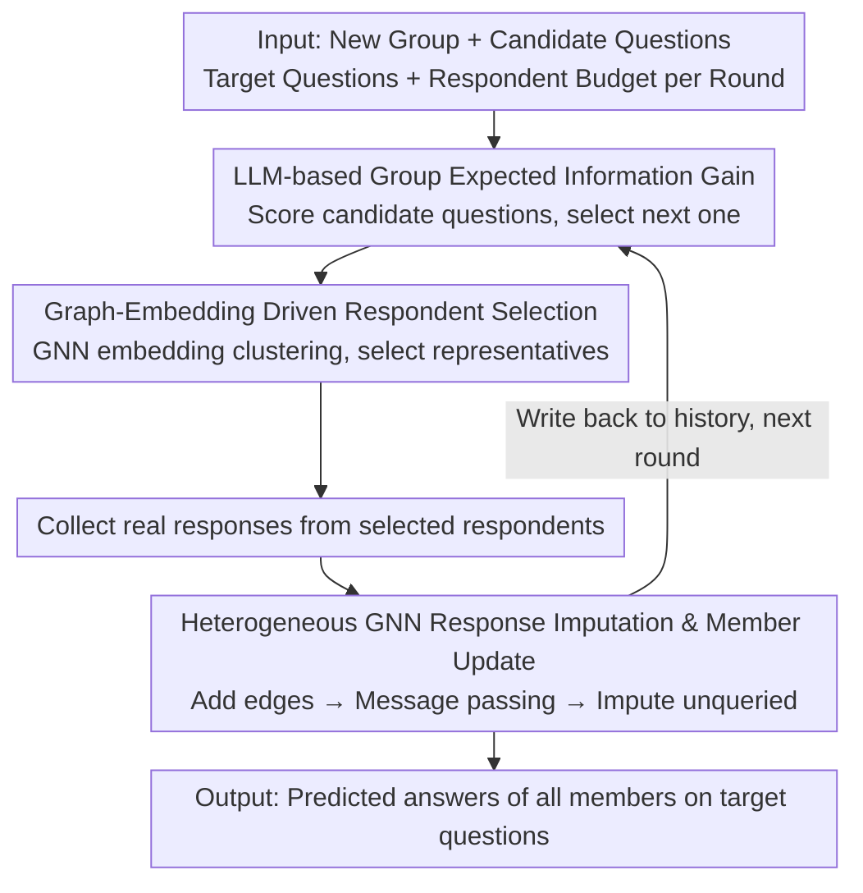

# Whom to Query for What: Adaptive Group Elicitation via Multi-Turn LLM Interactions

**Conference**: ICML 2026  
**arXiv**: [2602.14279](https://arxiv.org/abs/2602.14279)  
**Code**: https://github.com/ZDCSlab/Group-Adaptive-Elicitation  
**Area**: Graph Learning / LLM Interactive Group Modeling  
**Keywords**: Adaptive Elicitation, Group Preferences, Heterogeneous Graph Neural Networks, Information Gain, Missing Response Imputation  

## TL;DR
This paper extends multi-turn questionnaire-style elicitation from the decision of "what question to ask" to a joint decision of "whom to query and what to query." It utilizes LLMs to estimate the information gain of questions and heterogeneous GNNs to propagate and impute missing responses across a group relationship graph, thereby recovering group preferences faster under a limited respondent budget.

## Background & Motivation
**Background**: Adaptive elicitation typically views the goal as a sequential query process for a latent variable, where the next most informative question is determined by previous answers. LLMs make this process more natural as they can process natural language questions, predict subsequent responses based on interaction history, and use predictive entropy or expected information gain to measure the value of a question.

**Limitations of Prior Work**: The bottleneck in real-world group surveys is often not just the number of questions, but how many individuals can be contacted in each round. Existing methods mostly assume a fixed set of respondents and only optimize question selection. Even when using LLMs to impute unobserved responses, they often treat each individual independently, failing to exploit the structures within demographic attributes, group similarities, and partial observations.

**Key Challenge**: Under a limited budget, a question is only truly useful when asked of the right person. Selecting only high-information questions may waste the budget on individuals who are easy to predict or redundant. Conversely, performing group imputation alone might over-propagate uncertain signals, particularly harming high-sensitivity individuals whose opinions are difficult to explain by demographics alone.

**Goal**: The authors aim to formalize adaptive group elicitation: simultaneously selecting a question and a small subset of respondents in each round, such that the observed responses can both update the queried individuals and help predict the responses of unqueried individuals on target questions through the group structure.

**Key Insight**: The paper decouples the natural language prediction capability of LLMs from the group propagation capability of heterogeneous graphs. The LLM is responsible for evaluating "how much a question reduces uncertainty about future target questions," while the GNN is responsible for propagating observed responses across nodes representing respondents, demographic attributes, and "question-option" pairs.

**Core Idea**: Use LLMs for question-level expected information gain selection and heterogeneous GNNs for respondent selection and missing response imputation, coupling "what to ask" and "whom to ask" in a closed-loop.

## Method
The proposed method is a multi-turn closed-loop system. During the training phase, two modules are learned: an LLM capable of predicting the next answer distribution based on an individual's history, and a GNN capable of performing link prediction on a heterogeneous group graph. During the testing phase for a new group, the system first scores candidate questions using the LLM in each round, then selects representative respondents using the GNN's individual embeddings. After receiving a small number of real answers, the GNN imputes answers for unqueried individuals and writes both real and imputed answers back into the history for the next round.

### Overall Architecture
Input includes a new group, a set of candidate questions, a set of target evaluation questions, and a respondent budget per round. The system outputs the predicted answers of group members on the target questions. Each round consists of four steps: estimating group-level information gain for each candidate question based on existing history; using heterogeneous GNN member embedding clustering to select the most representative respondents within the budget; collecting real responses from these individuals; and finally adding new edges to the heterogeneous graph to update member embeddings and impute unqueried responses via message passing.

In this design, the roles of the LLM and GNN are complementary. The LLM does not need to explicitly parameterize complex latent variables like political attitudes or economic preferences; it simply predicts future answers from interaction histories. The GNN does not need to generate natural language; it only utilizes "member-attribute" and "member-question-option" relationships for structural propagation, generalizing sparse observations to the entire population.

### Key Designs

**1. LLM-based Group Expected Information Gain: Replacing manual priors with "future answer entropy reduction"**

This step addresses the "what to ask" problem within the framework—determining which candidate question best compresses group uncertainty without hard-coding prior distributions for group preferences. Following a de Finetti-style predictive view, the authors rewrite the uncertainty of a member $v$'s latent variable $U_v$ as the conditional entropy of future answers to a batch of target questions: $H(U_v|\mathcal{H}_{t-1}^v)=\sum_{x\in\mathcal{X}_h}H(Y_x^v|X=x,\mathcal{H}_{t-1}^v)$. The Expected Information Gain (EIG) of a candidate question is the "entropy before asking" minus the "entropy after simulated asking using LLM," summed over all group members. The question that maximizes the group EIG is selected. Consequently, the LLM only needs to learn predictive distributions from natural language interaction histories without explicit parameterization, while the objective function maintains clear information-theoretic meaning.

**2. Graph-Embedding Driven Respondent Selection: Allocating budget to those hardest to infer from neighbors**

After selecting a question, the system must decide "whom to query" to avoid wasting budget on individuals who are easily predicted or redundant. The system utilizes the final embeddings $h_v$ calculated by the heterogeneous GNN for each member, assuming that individuals with similar embeddings share similar response patterns. Given a budget $k$ per round, it clusters the members in the embedding space and selects the $k$ cluster centers as representative respondents. This ensures observations cover the most informative regions of the group. Upon receiving real answers, new edges are added to the graph, followed by re-propagation and re-selection in the next round. This is particularly valuable for high-sensitivity individuals—those who cannot be accurately imputed through demographic attributes alone and need to be directly queried.

**3. Heterogeneous GNN Response Imputation & Member Representation Update: Generalizing sparse observations via group structure**

Since only a small fraction of individuals are queried, the responses of others must be filled via imputation, which also continuously refreshes the group's structural representation. The graph contains three types of nodes: members, demographic attributes, and question-option pairs. Members are connected to their attributes and the specific question-options they have selected. The GNN learns $p(c|v,q)=\frac{\exp(\langle h_v,h_c\rangle/\tau)}{\sum_{c'}\exp(\langle h_v,h_{c'}\rangle/\tau)}$ via link prediction. During training, a portion of member-option edges are randomly masked, and the GNN recovers these responses using cross-entropy. compared to independent LLM imputation—which may treat weak signals as certainties—graph propagation explicitly incorporates demographics and similar response patterns, providing a structural safeguard for unobserved answers. This is the primary reason why gains in the experiments stem from GNN propagation rather than LLM imputation alone.

### Loss & Training
The LLM is trained via autoregressive prediction to maximize the likelihood of the next answer in a member’s history: $p_\theta(Y_{t+1}^v|X_{t+1}^v,\mathcal{H}_t^v)$. The GNN uses masked link prediction: randomly masking member-question-option edges and obtaining member and option embeddings through R-GCN message passing on the partially observed graph, then recovering the masked options via softmax link prediction.

In experiments, the LLM query strategy uses Llama-3.1-8B + LoRA for meta-training, with the training set from the South region of the US and the test set from the West. The GNN uses a two-layer R-GCN with a hidden dimension of 64, evaluated in a cold-start setting where all user-question edges are initially removed from the message-passing graph.

## Key Experimental Results

### Main Results
The paper evaluates the method on three real opinion datasets: CES, OpinionQA, and Twin-2k. Only one question is asked per round, with a limit on the proportion of respondents allowed. The goal is to predict the answers of all members on held-out target questions. The primary metric is accuracy, supplemented by Brier Score and Perplexity.

| Dataset / Setting | Metric | Ours | Strongest Baseline | Gain |
| :--- | :--- | :--- | :--- | :--- |
| CES, 10% respondent budget, round 1 | Relative Accuracy Gain | Highest | Meta-Greedy / Meta-Greedy-Imp | +17.1% relative |
| CES, 10% respondent budget, round 4 | Relative Accuracy Gain | Highest | Strongest baseline | +12.6% relative |
| CES / OpinionQA / Twin-2k, 10%-50% budget | Accuracy Curve | Overall highest | Meta-Random, Meta-Greedy, Meta-Greedy-Imp | Consistent lead |
| CES / OpinionQA Calibration | Brier Score / Perplexity | Lowest after round 1 | Meta-Greedy-Imp often overconfident | Better calibration |

### Ablation Study
The ablation focuses on two areas: whether respondent selection is more valuable for high-sensitivity groups, and a comparison between greedy querying and multi-step planning. Key figures from round 4 are presented below.

| Configuration | Key Metric | Description |
| :--- | :--- | :--- |
| CES, 50% budget, Random selection | Global 0.793 / Hard 0.714 / Extreme 0.720 | Random selection benefits from more observations but fails to recover high-sensitivity individuals |
| CES, 50% budget, Group-relational selection | Global 0.801 / Hard 0.780 / Extreme 0.826 | Largest improvement in hard-to-predict groups, showing "whom to ask" is more critical than just more observations |
| OpinionQA, 50% budget, Random selection | Global 0.490 / Hard 0.473 / Extreme 0.465 | Multi-choice opinion tasks are harder; random observation provides limited gains |
| OpinionQA, 50% budget, Group-relational selection | Global 0.496 / Hard 0.522 / Extreme 0.529 | Advantage is more pronounced on the most difficult individuals |
| 10% budget, Greedy vs. Multi-step | Global 0.488 vs. 0.485, Extreme 0.322 vs. 0.336 | Multi-step planning only shows slight gains in few sensitive tiers |
| 50% budget, Greedy vs. Multi-step | Global 0.507 vs. 0.507, Extreme 0.561 vs. 0.542 | No stable gain for multi-step planning at high budget; not worth the computational cost |

### Key Findings
- Model gains do not come solely from independent LLM imputation. Meta-Greedy-Imp is not consistently better than Meta-Greedy, indicating that directly using LLM predictions as missing responses can propagate noise; GNN-based group structure propagation is a more reliable imputation mechanism.
- The benefits of respondent selection are concentrated in high-sensitivity individuals. Under the 50% CES budget, the Extreme tier improved from 0.720 (random) to 0.826, proving that graph-embedding selection successfully targets those hardest to explain via group averages.
- Greedy selection is sufficiently practical. While multi-step rollout shows minor improvements in the Extreme tier at 10% budget, it is overall unstable and sometimes reverses at high budgets; this aligns with the author's theoretical discussion on submodular information gain approximations.

## Highlights & Insights
- This paper splits the budget constraint of elicitation into two dimensions: question budget and respondent budget. Many adaptive querying papers only optimize question sequences, but in real surveys, "who is willing to answer and who is most valuable to ask" is often the actual cost center.
- There is a clear division of labor: the LLM handles verbalized prediction and information gain, while the GNN handles relational structure and missing edge recovery. This is more robust than delegating all tasks to an LLM and makes it easier to explain why gains come from group propagation.
- The stratified analysis of high-sensitivity respondents is insightful. It breaks down the heterogeneity behind average accuracy, showing that a good elicitation strategy should prioritize repairing the most difficult-to-impute individuals rather than just improving everyone on average.

## Limitations & Future Work
- The method relies on available demographic attributes or group relationships. If the deployment scenario lacks stable attributes, contains high noise, or has a weak correlation between group structure and target preferences, the advantage of GNN imputation may decrease.
- Experiments are primarily offline replay evaluations; real-world factors like non-response, fatigue, strategic answering, and wording variations have not yet been integrated into the loop.
- The LLM query strategy requires meta-training, and current experiments focus on regional transfer; future research could explore generalization across countries, languages, or organizations.
- Respondent selection may introduce fairness issues. If a system always queries "high-information" populations, it may increase the burden on certain groups or lead to imbalanced sampling of sensitive attributes.

## Related Work & Insights
- **vs. Individual LLM Elicitation**: Existing methods use LLMs to select the next question for a single individual; this work extends latent variable inference to the group level and explicitly includes respondent selection.
- **vs. Traditional Graph Models / CAR Models**: Traditional spatial or group graph models are often heavily parameterized and struggle with natural language; this work uses heterogeneous GNNs to represent mixed relationships of members, attributes, and options, fitting questionnaire data more naturally.
- **vs. LLM Agent Group Simulation**: Multi-agent social simulations focus on generating interaction processes; this work is a budget-constrained statistical inference task where the core is restoring response distributions at minimum cost rather than simulating dialogue.
- **Transferable Insights**: This paradigm of "LLM for question value estimation + graph model for population coverage" can be transferred to user research, educational diagnostics, medical triage questionnaires, and corporate preference surveys.

## Rating
- Novelty: ⭐⭐⭐⭐☆ Unifies adaptive question selection and respondent selection using an LLM+GNN approach; the problem setting is highly realistic.
- Experimental Thoroughness: ⭐⭐⭐⭐☆ Solid evaluation across three real datasets, budget curves, calibration metrics, and sensitivity ablations, though real-time online interaction validation is missing.
- Writing Quality: ⭐⭐⭐⭐☆ Clear motivation; theory and experiments correspond well. Some results rely on curves, with fewer tabulated numbers.
- Value: ⭐⭐⭐⭐☆ Directly applicable to surveys, user modeling, and group decision systems; provides a clean example of LLM and graph learning collaboration.

<!-- RELATED:START -->

## Related Papers

- [\[ECCV 2024\] GKGNet: Group K-Nearest Neighbor Based Graph Convolutional Network for Multi-Label Image Recognition](../../ECCV2024/graph_learning/gkgnet_group_k-nearest_neighbor_based_graph_convolutional_network_for_multi-labe.md)
- [\[ICML 2026\] MedCoG: Maximizing LLM Inference Density in Medical Reasoning via Meta-Cognitive Regulation](medcog_maximizing_llm_inference_density_in_medical_reasoning_via_meta-cognitive_.md)
- [\[ICML 2026\] GILT: An LLM-Free, Tuning-Free Graph Foundational Model for In-Context Learning](gilt_an_llm-free_tuning-free_graph_foundational_model_for_in-context_learning.md)
- [\[AAAI 2026\] Relink: Constructing Query-Driven Evidence Graph On-the-Fly for GraphRAG](../../AAAI2026/graph_learning/relink_constructing_query-driven_evidence_graph_on-the-fly_for_graphrag.md)
- [\[ICML 2025\] Is Complex Query Answering Really Complex?](../../ICML2025/graph_learning/is_complex_query_answering_really_complex.md)

<!-- RELATED:END -->
