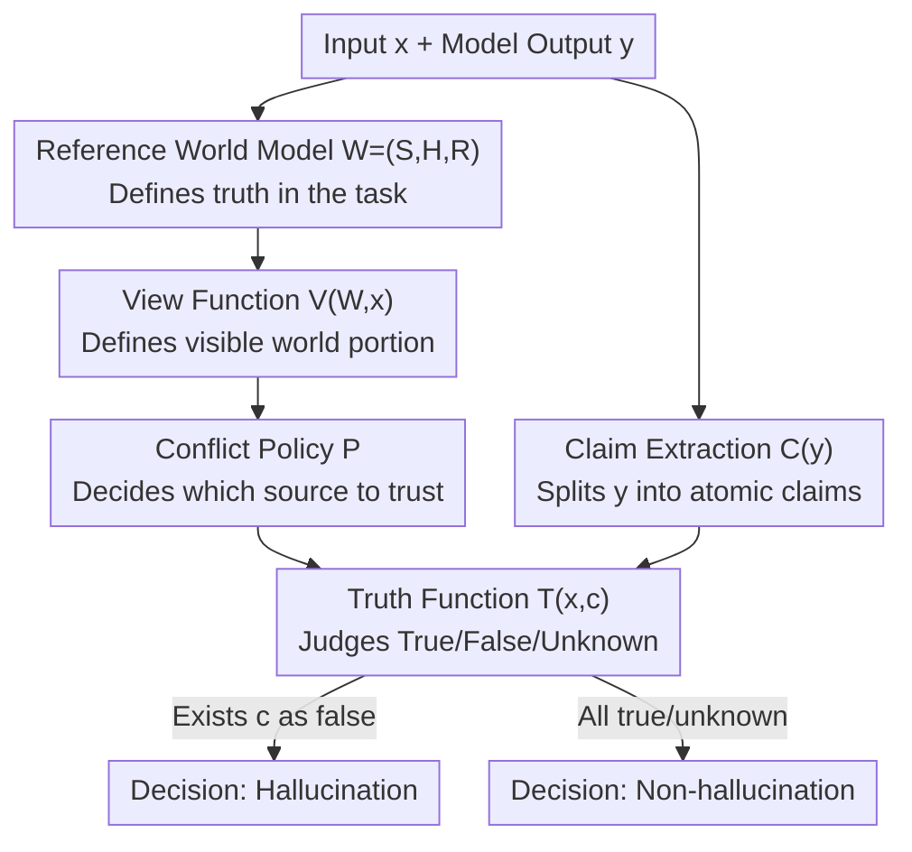

# A Unified Definition of Hallucination: It's The World Model, Stupid!

**Conference**: ICML2026  
**arXiv**: [2512.21577](https://arxiv.org/abs/2512.21577)  
**Code**: To be confirmed (Supporting benchmark is HalluWorld, Liu et al. 2026)  
**Area**: Hallucination / LLM Evaluation Theory  
**Keywords**: Hallucination definition, reference world model, conflict policy, evaluation benchmark, position paper

## TL;DR
This is a position paper advocating that "hallucinations" across various tasks—translation, summarization, open-domain QA, RAG, multimodal, and agents—be unified as one phenomenon: **user-observable, inaccurate world modeling relative to a "reference world model."** Every scenario is simply a different configuration of the "$(W, V, P)$" triplet (Reference World $W$, View Function $V$, Conflict Policy $P$), converging fragmented definitions into a universal template for generating large-scale, comparable benchmarks.

## Background & Motivation
**Background**: Since "hallucination" was first proposed in neural machine translation in 2019, the term has been constantly redefined across tasks. In summarization, it refers to "content not supported by the source text"; in open QA, "discordance with real-world facts"; in VLMs, "conflict with visual evidence"; and in agents, "actions inconsistent with the environment state." Each sub-field has privately defined hallucinations according to its own "source of truth."

**Limitations of Prior Work**: Fragmented definitions prevent answering fundamental questions. The paper opens with a brilliant example: given the context "Sherlock Holmes lives at 221B Baker Street," a model is asked "Where does Holmes live?" and responds "Holmes is a fictional character and has no real address." Is this a hallucination? A summarization researcher would say yes (violates the source text), while an open QA researcher would say no (the statement is factually true). Opposite conclusions for the same output. Consequently, claims like "method X reduced hallucinations by 40%" lack clear measurement across scenarios.

**Key Challenge**: The issue is not the lack of a good definition, but rather **too many definitions capturing different facets of hallucination**, each **implicitly** assuming a "source of truth" without explicitly stating what that source is, what part the model sees, and who to trust when sources conflict.

**Goal**: Not to invent a new definition to compete with old ones, but to provide an overarching framework that "contains" all prior definitions, forcing every evaluation to externalize its implicit assumptions.

**Key Insight**: The authors observe that all scenarios share a common structure: a mismatch between "model output vs. what we deem true." The difference lies only in "what we deem true." By formalizing "truth" as a mutable object, the differences become parameterized.

**Core Idea**: Summarized in one sentence: **Hallucination = user-observable, inaccurate world modeling relative to a reference world model $W$**; old definitions are merely different valuations of the $(W, V, P)$ triplet.

## Method
As a theory/position paper, the "method" is the proposed formal framework itself rather than a trainable algorithm. The framework answers: given a model output, how to **determine** if it is a hallucination in a way that covers all task modalities.

### Overall Architecture
The framework decomposes "detecting hallucination" into a clear pipeline: First, a **Reference World Model** $W=(\mathcal{S}, \mathcal{H}, \mathcal{R})$ characterizes "what is objectively true in this task." Second, a **View Function** $V(W, x)$ defines "which part of the world the model should be able to see given input $x$." Third, a **Conflict Policy** $P$ dictates "who to trust when multiple sources (knowledge base / context / parametric memory) conflict." Fourth, a **Truth Function** $T_{W,P}(x, c) \in \{\text{true}, \text{false}, \text{unknown}\}$ judges the truth of any atomic claim $c$. Finally, the output $y$ is split via **Claim Extraction** $C(y)$ into atomic claims for verification. The criterion is concise: if there exists an observable claim $c \in C(y)$ such that $T_{W,P}(x, c) = \text{false}$, then $y$ is a hallucination.

### Key Designs

**1. Reference World Model $W=(\mathcal{S}, \mathcal{H}, \mathcal{R})$: Turning "Truth" from Vague "Knowledge" into Specified Structure**

The root cause of old definition issues is treating "truth" as an amorphous "world knowledge." This paper makes it explicit as a triplet: $\mathcal{S}$ is the set of possible world states, $\mathcal{H}$ is the possible interaction history (instructions, dialogues, logs), and $\mathcal{R}$ are the rules constraining valid $(s, h) \in \mathcal{S} \times \mathcal{H}$. Crucially, the authors emphasize that $W$ is the "gold standard we **wish** the model's internal world model to align with," not the model's own potentially flawed internal representation. $W$ is **not bound to a specific representation**—it can be instantiated as a simulator, database, state machine, formal grammar, knowledge base, source document, or executable program. This flexibility allows it to accommodate both source documents in summarization and real-world facts in open QA. The paper also clarifies that fixed ground-truth labels are a special case of $W$ (where $W$ is static and $T$ reduces to a table lookup), whereas in partially observable scenarios like agents, truth depends on state, history, and actions—dependencies that static labels cannot express.

**2. View Function $V$ and Conflict Policy $P$: Explicitly Separating "What the Model Can See" from "Who to Listen To"**

For the same world $W$, how much the model is allowed to see and how conflicts are adjudicated directly change what constitutes a hallucination. The view function $V(W, x) \subseteq \mathcal{S} \times \mathcal{H}$ selects the world portion relevant to input $x$ that should be visible; the conflict policy $P$ specifies rules such as "knowledge base overrides context," "retrieved documents override parametric memory," or "the DOM is the sole truth of the visible page." This decomposition explains the Holmes paradox: in summarization, $P$ = source document is the sole truth, so "no real address" violates the source and is a hallucination; in open QA, $P$ = real world is the truth, so the same sentence is not a hallucination. In other words, **disagreements over conclusions are actually disagreements over $V$ and $P$ values**.

**3. Truth Function $T_{W,P}$ and Atomic Claims $C(y)$: Mapping Free Text to Testable Units**

To make detection operational, free text $y$ must be broken into atomic claims $C(y)$ assignable to $\{\text{true}, \text{false}, \text{unknown}\}$. The formal definition of hallucination is:

$$\exists\, c\in C(y)\ \text{s.t.}\ T_{W,P}(x,c)=\text{false}.$$

The authors emphasize that claim extraction must **preserve epistemic states**: "X is true" and "X is probably true" should not collapse into the same claim. A claim is only included if the model makes a falsifiable statement (e.g., "X has a 70% probability of being true"). Unverifiable claims should be marked `unknown` rather than automatically penalized. This distinguishes "unverifiable" from "incorrect," preventing the framework from misidentifying honest uncertainty as hallucination.

**4. Isolating Hallucination from "All Errors": Delineating Planning and Incentive/Reward Errors**

Current usage lumps multiple failure modes into "hallucination." This paper uses $W$ as a ruler to separate them: **World Modeling Error**—the model's internal map of the world is wrong (this is true hallucination); **Planning Error**—the map is correct, but a poor action or plan is chosen; **Incentive/Reward Error**—the model knows it is uncertain but is trained/prompted to provide a confident answer regardless. The framework only classifies the first as hallucination. Core insight: **Errors are about the outputs; hallucinations are about the world implied by the outputs.** If an agent chooses a suboptimal plan faithful to its environment, it is a planning error; if it claims to click a button that does not exist in the DOM, it is a hallucination (its world model is wrong).

### A Complete Example: Running Four Domains Through One Ruler

The paper demonstrates the framework across four cases, explicitly defining $W, V,$ and $P$:

- **Summarization**: Source says "TechCorp revenue 2.1B, missing 2.3B expectation." Model outputs "Exceeded expectations, CEO praised strong performance." $P$ = Source is the sole truth → "Exceeded expectations" is false → Intrinsic hallucination.
- **Open QA**: Question "2023 Nobel Prize in Literature winner," model answers "Haruki Murakami." $V(W, x)$ is empty (relying on parameters), but $W$ still exists; the real winner is Jon Fosse → Claim is false → Factuality hallucination.
- **RAG**: Document states "Freedonia is a fictional country with no capital." Model claims "Capital is Freedstadt, population 2M." $P$ = Document overrides memory → "Capital is Freedstadt" is false; "population 2M" is **unknown** (unspecified in fictional world) — demonstrating the necessity of the `unknown` label.
- **Agent Web Navigation**: DOM contains only `confirm-btn` / `cancel-btn`. Model outputs `click(button#submit-btn)` and states "I am clicking Submit." $P$ = DOM is the sole truth → Claim "Exists button with id submit-btn" is false → Model hallucinated a non-existent element (planned action vs. world belief).

## Key Experimental Results
As a position paper, it excludes traditional model comparison experiments. Its "empirical evidence" lies in: (1) unified review of the four domains; (2) using the framework as a diagnostic checklist for existing benchmarks; (3) using Chess to demonstrate **automatic** generation of large-scale, ground-truth-checked hallucination benchmarks from a fully specified world.

### Scenarios Reduction Under Unified Framework

| Scenario | Reference World $W$ | View $V$ (Visible Input) | Conflict Policy $P$ | Hallucination Type |
| :--- | :--- | :--- | :--- | :--- |
| Summarization | Source Document | Full Document | Document is truth | Intrinsic |
| Open QA | Real-world facts | Parametric memory only | Real world is truth | Factuality |
| RAG | Retrieval corpus + World knowledge | Retrieved docs (+ memory) | Doc overrides memory | Knowledge conflict |
| Agent | Environment DOM | DOM Observation | Environment is truth | Observation hallucination |

### Analyzing Benchmarks as a "Diagnostic Checklist"

| Benchmark | Is $V$ (View) Explicit? | Is $W$ (Ref World) Explicit? | Framework Diagnosis |
| :--- | :--- | :--- | :--- |
| FavaBench | Explicit (log exposes $V$) | Highly explicit | Good grounding |
| HALoGEN | Partial (structured tasks) | Partially needs specification | Partially grounded |
| HaluEval | Weak | Weak (multi-hop ambiguity) | Needs explicit $C(y)$, some cases ambiguous |

### Key Findings
- **Benchmark disagreement often stems from "explicitness of world modeling" rather than model behavior**: Placing existing benchmarks into the framework reveals inconsistencies in defining $W$, $V$, and $P$, or verifiable $C(y)$.
- **Fully Specifiable Worlds → Automated Benchmark Generation**: In Chess, $W$ is the state space + rules. $s$ is a position, $h$ is move history. Textual board descriptions or PGN logs serve as context. Queries like "Can Black mate in one?" are adjudicated via truth functions based on chess rules. Because labels are determined by construction, one can **actively search for settings where models are more prone to hallucination** to increase difficulty. This is scalable to NetHack, Crafter, and other environments.
- **Distinction from "Probing Internal World Models"**: Scholarly work on Chess LLMs often asks if the model learned internal representations to play strong moves (measured by Elo or linear decodability). This paper uses the environment as an **explicit external reference world** to judge output claim truth.

## Highlights & Insights
- The most significant "aha" moment is **shifting the debate forward**: Disagreements between researchers are often not about the model's correctness but about different implicit $W/V/P$ assumptions.
- The `unknown` category is crucial: It separates "honest uncertainty" from "confident fabrication," preventing the penalization of abstention or probabilistic expressions.
- The "Errors are about output, hallucinations are about the world" boundary is directly applicable to agent evaluation: tracking hallucinations, planning errors, and instruction-following errors separately enables precise root-cause analysis of agent failures.
- The "fully specifiable world → label by construction" path provides a viable methodology for creating large-scale, difficulty-controllable, and automatically scorable hallucination benchmarks.

## Limitations & Future Work
- **Claim Extraction $C(y)$ remains an external design decision**: The framework assumes $y$ can be mapped to atomic claims, but the accuracy of extraction—especially for free text—remains a source of noise.
- **Framework as "Language" rather than "Algorithm"**: It makes evaluations comparable and explicit but does not inherently provide a new mitigation algorithm; mitigation works are simply re-categorized by it (e.g., modifying $V$, $T$, or internal $W$).
- **Coverage of Specifiable Worlds is Limited**: While Chess and grid worlds can be fully specified, the $W$ of open-domain real-world facts remains difficult to capture without ambiguity.
- **Future Directions**: Integrating claim extraction into the formal constraints (e.g., protocols for maintaining epistemic states) and exploring how to approximate $T$ in "partially specifiable worlds" to extend the benefits beyond closed environments.

## Related Work & Insights
- **vs. Mechanism-oriented Unification (Fang et al. 2024)**: That work focuses on **why** hallucinations occur; this paper is complementary—focusing on formalizing **what** constitutes a hallucination to make benchmarks comparable.
- **vs. Factuality / Span-level Benchmarks (Ji et al. 2023, etc.)**: These works implicitly define hallucination on fixed reference sources. This paper argues they are special cases of $(W, V, P)$ and critiques their failure to account for dynamic world representations or temporal decision-making.
- **vs. VLM Hallucination Frameworks (HallusionBench, Guan et al. 2024)**: HallusionBench frames hallucination as a conflict between parametric priors and context. This paper subsumes this conflict into $P$ (adjudicating priors vs. visual evidence) within the same structure.

## Rating
- **Novelty**: ⭐⭐⭐⭐⭐ Unifies fragmented definitions into a parameterizable $(W, V, P, T, C)$ framework, effectively shifting the debate to world assumptions.
- **Experimental Thoroughness**: ⭐⭐⭐ As a position paper, it lacks traditional comparative experiments but compensates with cross-domain reduction, benchmark diagnosis, and a chess-based case study.
- **Writing Quality**: ⭐⭐⭐⭐⭐ Uses progressive examples (Holmes, Nobel Prize, Freedonia, DOM) to make abstract formalization vivid.
- **Value**: ⭐⭐⭐⭐ Provides a universal language for hallucination evaluation and a methodology for automated benchmark generation, offering practical guidance for future research.

<!-- RELATED:START -->

## Related Papers

- [\[ICLR 2026\] Copy-Paste to Mitigate Large Language Model Hallucinations](../../ICLR2026/hallucination/copy-paste_to_mitigate_large_language_model_hallucinations.md)
- [\[CVPR 2025\] Stop Learning It All to Mitigate Visual Hallucination, Focus on the Hallucination Target](../../CVPR2025/hallucination/stop_learning_it_all_to_mitigate_visual_hallucination_focus_on_the_hallucination.md)
- [\[ICLR 2026\] Mitigating Hallucination in Vision-Language Model with Depth and Spatial-aware Key-Value Refinement](../../ICLR2026/hallucination/mitigating_hallucination_in_vision-language_model_with_depth_and_spatial-aware_k.md)
- [\[CVPR 2026\] Tell Model Where to Look: Mitigating Hallucinations in MLLMs by Vision-Guided Attention](../../CVPR2026/hallucination/tell_model_where_to_look_mitigating_hallucinations_in_mllms_by_vision-guided_att.md)
- [\[CVPR 2026\] One Token, Two Fates: A Unified Framework via Vision Token Manipulation Against MLLMs Hallucination](../../CVPR2026/hallucination/one_token_two_fates_a_unified_framework_via_vision_token_manipulation_against_ml.md)

<!-- RELATED:END -->
## Related Papers

- [\[CVPR 2025\] Stop Learning It All to Mitigate Visual Hallucination, Focus on the Hallucination Target](../../CVPR2025/hallucination/stop_learning_it_all_to_mitigate_visual_hallucination_focus_on_the_hallucination.md)
- [\[ICLR 2026\] Copy-Paste to Mitigate Large Language Model Hallucinations](../../ICLR2026/hallucination/copy-paste_to_mitigate_large_language_model_hallucinations.md)
- [\[ACL 2025\] Hallucination Detox: Sensitivity Dropout (SenD) for Large Language Model Training](../../ACL2025/hallucination/hallucination_detox_send.md)
- [\[CVPR 2026\] Tell Model Where to Look: Mitigating Hallucinations in MLLMs by Vision-Guided Attention](../../CVPR2026/hallucination/tell_model_where_to_look_mitigating_hallucinations_in_mllms_by_vision-guided_att.md)
- [\[CVPR 2026\] One Token, Two Fates: A Unified Framework via Vision Token Manipulation Against MLLMs Hallucination](../../CVPR2026/hallucination/one_token_two_fates_a_unified_framework_via_vision_token_manipulation_against_ml.md)

<!-- RELATED:END -->
