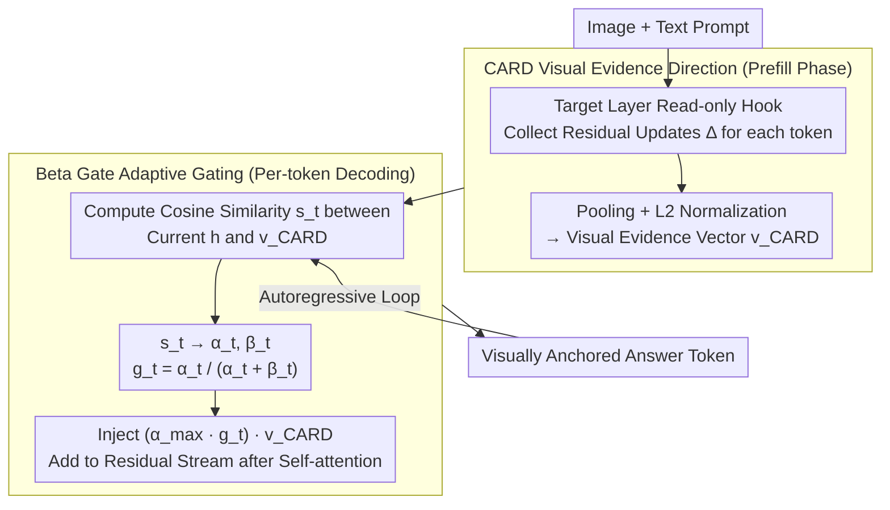

# Adaptive Residual-Update Steering for Low-Overhead Hallucination Mitigation in Large Vision Language Models

**Conference**: ICML 2026  
**arXiv**: [2511.10292](https://arxiv.org/abs/2511.10292)  
**Code**: Yes (referred to as RUDDER in the paper, URL not fully provided in cache)  
**Area**: Hallucination Detection  
**Keywords**: LVLM hallucination, inference-time steering, residual stream, Beta Gate, vision grounding  

## TL;DR
This paper proposes RUDDER, which extracts per-sample visual evidence directions from residual updates during the prefill stage of LVLMs and adaptively injects them via a Beta Gate during decoding, mitigating object hallucinations with overhead close to a single forward pass.

## Background & Motivation
**Background**: Large Vision Language Models (LVLMs) typically treat image tokens as prefixes for a language decoder to generate text autoregressively. As generation steps increase, information from the image prefix is gradually diluted by language priors, leading the model to hallucinate objects not present in the image.

**Limitations of Prior Work**: Existing inference-time intervention methods often perform contrastive decoding on logits or refine outputs through iterative feedback. While effective in reducing hallucinations, these methods usually require extra forward passes, image perturbations, external classifiers, or multiple rounds of refinement, resulting in high latency and low throughput. This cost is prohibitive for real-world deployment, especially for long-form generation.

**Key Challenge**: Reducing hallucinations requires constantly reminding the model to focus on visual evidence, but forcefully injecting fixed steering may damage fluency, recall, and general multimodal capabilities. The model needs a lightweight control mechanism that "reminds it of visual evidence only on the appropriate tokens."

**Goal**: The authors aim to convert existing visual information from the prefill stage into a sustainable visual anchor and suppress object hallucinations during decoding at a low cost, without modifying model weights or adding extra forward passes.

**Key Insight**: It is observed that the residual updates of self-attention sub-layers during the prefill stage represent the net impact of the image on the text representations. Since prefill is a mandatory step in LVLM generation, caching a visual evidence direction from it incurs almost zero extra cost.

**Core Idea**: Extract a CARD (Contextualized Adaptive Residual Direction) visual evidence vector from prefill residual updates, and utilize a Beta distribution gate to adaptively inject it per token during decoding.

## Method
The key to RUDDER is not retraining the LVLM but attaching two lightweight modules to the standard generation pipeline. The first module reads the self-attention residual update of a specific decoder layer during prefill to aggregate an input-dependent CARD vector. The second module calculates a Beta Gate at each decoding step based on the similarity between the current hidden state and the CARD vector to decide whether and how strongly to inject CARD into the residual stream.

### Overall Architecture
Given an image and a text prompt, the LVLM first executes prefill, processing image tokens and prompt tokens to build the KV cache. RUDDER places a read-only hook at a target layer to collect self-attention outputs (residual updates) for each token in the prefill span. It performs mean or norm-weighted mean pooling on these updates followed by $L_2$ normalization to obtain the per-sample visual evidence direction $v_{\mathrm{CARD}}$.

During autoregressive decoding, RUDDER operates continuously at the same target layer. For each generated answer token, it first computes the cosine similarity $s_t$ between the current hidden state $h_{l,t}$ and $v_{\mathrm{CARD}}$; it then maps $s_t$ to the two parameters of a Beta distribution, using $g_t=\alpha_t/(\alpha_t+\beta_t)$ as the gate. The final injection vector is $(\alpha_{\max}g_t)v_{\mathrm{CARD}}$, which is added to the residual stream after self-attention. Both CARD extraction and Beta Gate injection occur within a standard forward pass without weight modifications or extra forward passes.

### Key Designs

**1. CARD Visual Evidence Direction: Caching strong prefill signals as persistent anchors**

The root cause of hallucination is the dilution of image prefixes by language priors during generation, whereas vision-text fusion is strongest during prefill. RUDDER leverages this by placing a read-only hook at a target layer during prefill—a mandatory step—to cache the self-attention residual updates $\Delta_i^l$ for all tokens. By performing pooling (mean or norm-weighted) and $L_2$ normalization, it derives $v_{\mathrm{CARD}}=\mathrm{Pool}(\{\Delta_i^l\})/\|\mathrm{Pool}(\{\Delta_i^l\})\|_2$. Residual updates encode the "net effect" of visual context on each text representation. The norm naturally emphasizes informative semantic tokens over syntax words, allowing the aggregated direction to filter noise into a visual evidence summary for the current image-prompt pair. Extracting this is effectively zero-cost.

**2. Beta Gate Adaptive Gating: Deciding "whether and how much" to remind visual evidence per token**

Injecting $v_{\mathrm{CARD}}$ at a fixed strength for every token would result in over-intervention on grammatical words or non-visual content, harming fluency and recall. The Beta Gate adaptively adjusts injection strength: at each decoding step, the cosine similarity $s_t$ between the hidden state $h_{l,t}$ and $v_{\mathrm{CARD}}$ is calculated. Using $\alpha_t=\mathrm{softplus}(ks_t+c)$ and $\beta_t=\mathrm{softplus}(-ks_t+c)$, the gate $g_t=\alpha_t/(\alpha_t+\beta_t)$ is derived to inject $(\alpha_{\max}g_t)v_{\mathrm{CARD}}$. This acts as a "trust mechanism"—treating $s_t$ as a pseudo-count for a Beta-Bernoulli posterior. High similarity indicates the current trajectory is already aligned with visual evidence, making reinforcement safe. Low similarity suggests functional words or unstable trajectories, suppressing injection to avoid breaking fluency.

**3. Single Forward Pass Integration: Resolving the effectiveness-efficiency trade-off**

Existing ITI methods trade latency for performance via multiple forwards or refinement. RUDDER integrates all computations into the existing path: CARD is derived from the necessary prefill (zero extra forwards), and Beta Gate adds only minimal vector operations per decoding step. The process requires no weight changes or additional forward passes, with overhead $<4\%$. Hyperparameters (target layer $L$, max strength $\alpha_{\max}$, sensitivity $k$) are calibrated only once on 100 held-out images with a constraint to maintain 95% of vanilla recall. This transforms hallucination mitigation from an offline research trick into a deployable online control.

### Loss & Training
RUDDER is a training-free inference-time intervention and introduces no training loss. Calibration is used only for hyperparameter selection: LLaVA-1.5 uses a late layer $L=30$, Idefics2 uses $L=28$, and InstructBLIP uses an early layer $L=1$. Corresponding $(\alpha_{\max},k)$ are $(20,5.0)$, $(8.0,5.0)$, and $(6.5,8.0)$ respectively. The concentration $c=1$ is used, and the gate is clamped to $[0.05, 1]$.

## Key Experimental Results

### Main Results
The paper evaluates hallucinations, object QA, and general multimodal capabilities on CHAIR, POPE, and MME. Representative results under greedy decoding are shown below.

| Dataset/Metric | Model | Vanilla | RUDDER-Beta | Change |
|----------------|-------|---------|-------------|--------|
| CHAIR $C_S/C_I$ ↓ | LLaVA-1.5 | 48.6 / 13.6 | 39.5 / 10.5 | Reduction in sentence/object level |
| CHAIR $C_S/C_I$ ↓ | Idefics2 | 46.6 / 14.9 | 28.4 / 10.9 | Significant sentence-level reduction |
| CHAIR $C_S/C_I$ ↓ | InstructBLIP | 39.2 / 12.8 | 27.1 / 8.5 | Lower hallucination with recall constraint |
| POPE Acc/F1 ↑ | LLaVA-1.5 | 85.34 / 84.91 | 86.53 / 86.03 | Slight improvement in recognition |
| POPE Acc/F1 ↑ | Idefics2 | 78.40 / 74.86 | 78.74 / 76.52 | Pronounced F1 improvement |
| POPE Acc/F1 ↑ | InstructBLIP | 85.74 / 84.75 | 86.02 / 84.93 | Minimal impact on QA performance |
| MME ↑ | Idefics2 | 1518.84 | 1540.56 | Improvement in general capability |
| MME ↑ | InstructBLIP | 1566.77 | 1592.07 | Improvement in general capability |

### Ablation Study
Analysis focuses on adaptive gating, layer selection, strength sensitivity, and efficiency.

| Configuration | Key Metric | Description |
|---------------|------------|-------------|
| RUDDER-Beta vs RUDDER-Add | Beta is more stable on CHAIR | Token-wise gating is better for precise inhibition in open captioning |
| RUDDER-Add | Sometimes stronger for InstructBLIP on POPE | Fixed strength is effective for short yes/no tasks on some architectures |
| Idefics2 Layer Ablation | Optimal layer around $L=28$ | Mid-late layers best affect output while preserving visual semantics |
| Idefics2 Hyperparameter Heatmap | $\alpha_{\max}=8.0,k=5.0$ most balanced | Higher strength reduces CHAIR but risks recall loss |
| Throughput (tokens/s) | Vanilla 56.7/47.8/62.3, VISTA 36.1/31.9/28.9, RUDDER-Beta 54.9/45.8/59.5 | RUDDER-Beta maintains ~96.0% throughput, significantly faster than multi-forward methods |
| Scaling to LLaVA-13B/Qwen2.5-VL | LLaVA-13B POPE F1 85.5, Qwen2.5-VL $C_I=7.0$ | Scalable to larger models and diverse architectures |

### Key Findings
- The greatest value of RUDDER lies in efficiency: it matches the hallucination mitigation of VISTA while maintaining ~96% vanilla throughput, whereas VISTA averages ~58.1%.
- The per-sample nature of CARD is critical. It extracts visual evidence from the current image-prompt residual update rather than learning a generic hallucination direction offline.
- Adaptive gating is ideal for long-form text as it reinforces visual evidence on content words while avoiding over-intervention on non-visual tokens.

## Highlights & Insights
- Using prefill residual updates as a "visual evidence cache" is ingenious. The signal is already computed; RUDDER simply makes it explicit and reusable.
- The Beta Gate interpretation is more semantic than a standard sigmoid: it treats similarity as a pseudo-count, outputting an estimate of how strongly the current trajectory aligns with visual evidence.
- The evaluation is conservative, checking recall constraints, POPE, MME, and throughput to ensure low hallucination is not achieved simply by "saying less" or "being slower."

## Limitations & Future Work
- The method still requires tuning target layers and strengths for different architectures; the paper acknowledges hyperparameter sensitivity. Future work could explore automated layer selection.
- CARD comes from a single layer's residual update, which might not cover complex errors requiring multi-layer or multi-scale reasoning. Effectiveness on non-object hallucinations (relations, counting, OCR) needs further analysis.
- The high-similarity-reinforcement assumption is reasonable for object description but may be insufficient to correct the model if it is already confidently generating along a wrong visual direction.
- As an inference-time steering method, it does not replace training-stage grounding or safety alignment; it is best suited for low-cost deployment-time mitigation.

## Related Work & Insights
- **vs VCD / PAI / HALC**: These work on logits or contrastive context, often requiring extra forward passes; RUDDER modifies the hidden residual stream directly with lower overhead.
- **vs VISTA / ASD**: These steering methods also modify representations but rely on predefined directions or extra computations; RUDDER's CARD is extracted per-sample on-the-fly.
- **vs DeGF**: DeGF uses iterative feedback for correction, which may be stronger but has higher latency; RUDDER favors lightweight online control.
- **Inspiration**: Prefill phases might harbor many reusable task evidences beyond visual grounding, applicable to multimodal safety, OCR fidelity, and long-context video memory.

## Rating
- Novelty: ⭐⭐⭐⭐☆ The combination of CARD and Beta Gate is simple yet effective.
- Experimental Thoroughness: ⭐⭐⭐⭐⭐ Covers multiple models, decoding strategies, hallucinations, capabilities, and efficiency.
- Writing Quality: ⭐⭐⭐⭐☆ Clear structure; though some tables are dense across models.
- Value: ⭐⭐⭐⭐⭐ Directly addresses deployment pain points for LVLM hallucination mitigation.

<!-- RELATED:START -->

## Related Papers

- [\[ICML 2026\] Revis: Sparse Latent Steering to Mitigate Object Hallucination in Large Vision-Language Models](revis_sparse_latent_steering_to_mitigate_object_hallucination_in_large_vision-la.md)
- [\[ICLR 2026\] Dynamic Multimodal Activation Steering for Hallucination Mitigation in Large Vision-Language Models](../../ICLR2026/hallucination/dynamic_multimodal_activation_steering_for_hallucination_mitigation_in_large_vis.md)
- [\[CVPR 2026\] Residual Decoding: Mitigating Hallucinations in Large Vision-Language Models via History-Aware Residual Guidance](../../CVPR2026/hallucination/residual_decoding_mitigating_hallucinations_in_large_vision-language_models_via_.md)
- [\[ICLR 2026\] Look Carefully: Adaptive Visual Reinforcements in Multimodal Large Language Models for Hallucination Mitigation](../../ICLR2026/hallucination/look_carefully_adaptive_visual_reinforcements_in_multimodal_large_language_model.md)
- [\[CVPR 2026\] CausalLens: Sensitivity-Guided Multi-Head Causal Intervention for Hallucination Mitigation in Large Vision-Language Models](../../CVPR2026/hallucination/causallens_sensitivity-guided_multi-head_causal_intervention_for_hallucination_m.md)

<!-- RELATED:END -->
