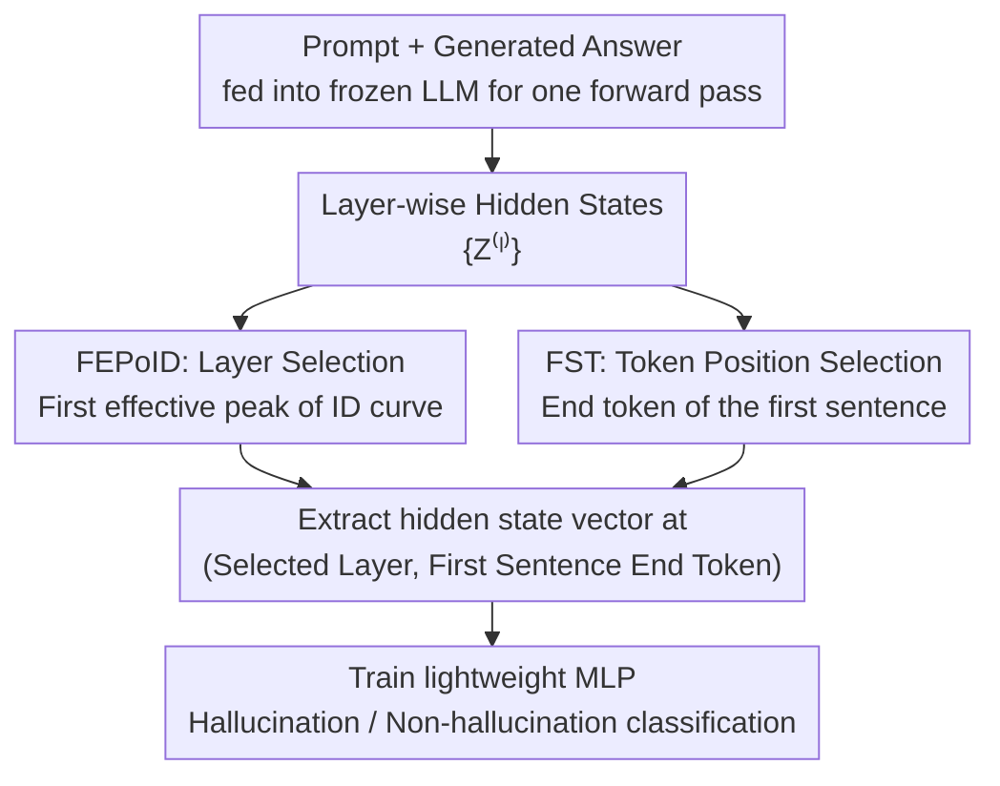

# Automatic Layer Selection for Hallucination Detection

**Conference**: ICML 2026  
**arXiv**: [2605.26366](https://arxiv.org/abs/2605.26366)  
**Code**: https://github.com/DesoloYw/Automatic-Layer-Selection-for-Hallucination-Detection  
**Area**: Hallucination Detection  
**Keywords**: Hallucination Detection, Intermediate Layer Selection, Intrinsic Dimension, Hidden-state Probing, Large Language Models

## TL;DR
FEPoID (First Effective Peak of Intrinsic Dimension) is proposed as a training-free automatic layer selection criterion. Combined with the First Sentence Truncation (FST) strategy, it consistently selects near-optimal intermediate layers across various QA and summarization hallucination detection benchmarks, significantly outperformed existing baseline methods.

## Background & Motivation

**Background**: Large Language Models (LLMs) often produce fluent but factually incorrect outputs (hallucinations) in practical deployments. Detecting these hallucinations without modifying the model itself is a critical practical issue. Existing research indicates that hidden states of intermediate layers in LLMs encode hallucination-related signals more strongly than the final layer, leading to the hidden-state probing detection paradigm.

**Limitations of Prior Work**: Although intermediate layers contain richer hallucination signals, the position of the optimal layer varies significantly across different model architectures and datasets. Existing methods either use fixed intermediate layers (e.g., the middle layer) or evaluate all candidate layers one by one; the former is unreliable, while the latter is computationally expensive. There is a lack of an efficient and principled automatic layer selection method.

**Key Challenge**: The location of the optimal layer depends on the model and the data, and there is no universal fixed selection rule. Furthermore, existing metrics used to measure layer quality (such as RankMe, curvature, gradient norm, etc.), while useful in other scenarios, perform inconsistently for layer selection in hallucination detection.

**Goal**: (1) Systematically evaluate the effectiveness of various layer selection criteria in hallucination detection; (2) Propose a training-free, computationally efficient, and cross-model/dataset robust automatic layer selection method; (3) Solve the token position selection problem during representation extraction.

**Key Insight**: The authors observe that the evolution curve of Intrinsic Dimension (ID) across layers exhibits a stable multi-modal pattern: a first peak appears in the intermediate layers, followed by a second, higher peak near the output layer. The authors hypothesize that the first peak captures abstract semantic information (relevant to hallucination detection), while the second peak primarily reflects surface lexical complexity (unhelpful for detection).

**Core Idea**: Selecting the "First Effective Peak" (FEPoID) on the intrinsic dimension curve as the layer selection criterion, combined with First Sentence Truncation (FST) to remove noise at the end of the generation. Together, they achieve unsupervised, efficient hallucination detection.

## Method

### Overall Architecture
This paper addresses two problems in hidden-state probing for hallucination detection that are typically decided arbitrarily: which model layer and which token position to extract representations from. The entire process is lightweight—the pre-trained LLM remains frozen throughout. The prompt and the generated answer are concatenated and fed into the model for a single forward pass to obtain layer-wise hidden states $\{\mathbf{Z}^{(\ell)}\}$. Then, a hidden state vector is extracted from a specific intermediate layer and token position to train a lightweight MLP for binary classification (hallucination vs. non-hallucination). The real challenge lies not in the classifier, but in the preceding two selections: if the layer or token position is wrong, even a strong classifier cannot recover the performance.

The motivation stems from a series of failed attempts: the authors first applied six existing layer quality criteria across three categories (Information Theory, Gradient, Geometry)—namely RankMe, Validation Loss / RGN / SNR, Curvature, and Intrinsic Dimension—to the hallucination detection scenario. These correspond to four intuitive hypotheses: "rich semantics / task alignment / information compression / efficient information capacity." Results showed that none could stably select good layers across models and datasets—this is the gap being filled. The final solution consists of two complementary training-free designs: FEPoID for layer selection and FST for token position selection.

### Key Designs

**1. FEPoID: Automatically locating the optimal intermediate layer using the "First Effective Peak" of the ID curve**

The position of the optimal layer drifts significantly across different models and datasets. Fixed middle layers are unreliable, and layer-wise testing is too costly. The authors take Intrinsic Dimension (ID) as the entry point: using the TwoNN estimator to calculate the intrinsic dimension $d_{\text{ID}}^{(\ell)}$ of the representation matrix $\mathbf{Z}^{(\ell)} \in \mathbb{R}^{N \times d}$ for each layer. Plotting this curve against the layers reveals a stable bimodal shape—one peak in the middle layers and another higher peak near the output layer. The key hypothesis is that the first peak captures abstract semantic information (needed for hallucination detection), whereas the second peak reflects surface lexical complexity (useless for detection). Therefore, one cannot simply select the layer with the maximum ID, as it would almost always fall on the second peak at the end.

The FEPoID approach scans all local maxima of the ID curve from shallow to deep and uses a forward window $w$ (defaulting to 7) to filter out spurious small peaks: if a candidate peak layer $\ell$ satisfies $d_{\text{ID}}^{(\ell)} < d_{\text{ID}}^{(\min(\ell+w, L))}$ and the ID within the window is monotonically increasing, it indicates a small fluctuation on an upward slope and is discarded. The earliest remaining peak corresponds to the selected layer. The layer selected this way precisely falls on the position where abstract semantics are richest. In experiments, it aligns highly with the oracle optimal layer, and the computation involves only one ID estimation plus one scan, making the overhead negligible.

**2. FST (First Sentence Truncation): Taking the token at the end of the first sentence instead of the last token of the entire generation**

Taking the "last token" is the default habit for probing methods, but the authors found this to be a primary source of noise. LLMs (especially LLaMA) often provide the answer in the first sentence but continue writing, leading to three types of degradation: inconsistent continuation (the later text contradicts the first sentence answer), semantic drift (writing moves off-topic), and degenerate repetition (repeatedly restating the same sentence). These subsequent contents contaminate the final token's representation, causing the classifier to learn noise rather than answer signals.

The FST solution is direct: use a rule-based sentence boundary detector to find the end token of the first generated sentence and extract the hidden state from this position. It requires no ground-truth answer labels or auxiliary LLMs—it is purely rule-based and zero-cost. Since the answer information is mostly concentrated in the first sentence, truncating here preserves the signal while discarding subsequent noise. Experiments show it brings consistent improvements to all baselines, serving as a "method-agnostic" gain.

## Key Experimental Results

### Main Results (QA Task)

AUROC comparison on 5 QA datasets and 2 instruction-tuned models (extracting the last generated token representation, $w=7$):

| Method | CoQA | SQuAD | HotpotQA | TriviaQA | PsiLoQA | Average |
|------|------|-------|----------|----------|---------|------|
| Pred. Entropy | 0.583 | 0.570 | 0.710 | 0.686 | 0.360 | 0.582 |
| Semantic Entropy | 0.500 | 0.552 | 0.445 | 0.551 | 0.608 | 0.531 |
| Lexical Similarity | 0.678 | 0.599 | 0.729 | 0.684 | 0.408 | 0.620 |
| EigenScore | 0.525 | 0.530 | 0.599 | 0.588 | 0.508 | 0.550 |
| Probing + Val Loss | 0.671 | 0.616 | 0.768 | **0.786** | 0.784 | 0.725 |
| Probing + Curvature | 0.632 | 0.618 | 0.741 | 0.737 | 0.757 | 0.697 |
| Probing + ID | 0.671 | 0.613 | 0.693 | 0.707 | 0.737 | 0.684 |
| **Probing + FEPoID** | **0.671** | **0.638** | **0.781** | 0.752 | **0.786** | **0.725** |

*The above are LLaMA-3.1-8B-Instruct results. FEPoID achieves the best average AUROC and also ranks first on Mistral-7B with an average AUROC of 0.853.*

### Summarization Task and Computation Efficiency

| Method | HaluEval | CNN/DM | Average | Computation Time (s) |
|------|----------|--------|------|-------------|
| RankMe | 0.608 | 0.577 | 0.592 | 27.3 |
| Curvature | 0.549 | 0.592 | 0.571 | 45.2 |
| Val Loss | 0.596 | 0.586 | 0.591 | 29.6 |
| RGN | 0.571 | 0.582 | 0.577 | 58.2 |
| SNR | 0.553 | 0.547 | 0.550 | 57.9 |
| **FEPoID** | **0.617** | **0.600** | **0.608** | **10.1** |

*Results on LLaMA-3.1-8B-Instruct. FEPoID not only has the best detection performance but its computation time is only 1/3 to 1/6 of other methods.*

### Key Findings
- FEPoID consistently performs best or near-best across QA and summarization tasks, 5 model scales (1B-8B), and two tuning strategies (base and instruct), demonstrating strong generalization capability.
- FST provides consistent AUROC improvements (method-agnostic gains) for all baseline methods, with particularly significant gains on LLaMA (as LLaMA generations are more prone to end-of-sequence noise). Fisher separation and Silhouette scores are also greatly improved.
- The strategy of directly selecting the maximum ID layer would select layers that are too deep on datasets like HotpotQA and TriviaQA, leading to performance drops; FEPoID stably avoids this trap through the forward window mechanism.
- Sensitivity analysis for hyperparameter $w$ indicates that FEPoID is very robust to the choice of $w$, with performance remaining stable over a wide range.

## Highlights & Insights
- The design of FEPoID is exceptionally elegant—it achieves training-free, label-free automatic layer selection relying only on TwoNN intrinsic dimension estimation and a forward window. The computational overhead is negligible (about 10 seconds for all 32 layers), making it highly attractive for practical deployment.
- The "method-agnostic" nature of FST is very practical: it improves not only hidden-state probing but also baselines from entirely different paradigms like uncertainty methods and lexical similarity, indicating that "end-of-sequence noise" is a universal and underestimated problem.
- The "ID curve bimodal hypothesis" provides a new perspective for understanding hierarchical representations in Transformers: Middle Peak = Abstract Semantics, End Peak = Surface Complexity. This insight can be migrated to other downstream tasks requiring the selection of intermediate layer representations.

## Limitations & Future Work
- Experiments only covered models in the 1B-8B scale. Layer selection behavior in larger models (70B+) might differ, and whether the bimodal ID curve hypothesis still holds remains to be verified.
- FST relies on rule-based sentence boundary detection, which might not apply to non-English languages or generations with non-natural sentence structures (e.g., code, mathematical derivations).
- Currently verified only on QA and summarization tasks. The definition and distribution of hallucinations in open-ended generation (e.g., dialogue, creative writing) are different, and generalization needs testing.
- Exploring dynamic layer selection for FEPoID—selecting different layers for different input samples or combining multi-layer representations to further enhance detection performance.

## Related Work & Insights
- **INSIDE** (Chen et al., 2024): Utilizes LLM internal states for hallucination detection with a fixed intermediate layer choice; FEPoID provides a superior automated alternative.
- **Semantic Entropy** (Farquhar et al., 2024): Estimates uncertainty at the semantic level but requires multiple samplings; the hidden-state probing method in this paper requires only a single forward pass.
- **EigenScore** (Chen et al., 2024): Evaluates representation quality based on the covariance spectral properties of hidden states, but its layer selection strategy is sub-optimal.
- **Relationship between ID and Layer Selection**: Cheng et al. (2025) found that layers near the maximum ID transfer first to downstream tasks; this paper further refines this to "the first effective peak is the optimal choice."

<!-- RELATED:START -->

## Related Papers

- [\[NeurIPS 2025\] Robust Hallucination Detection in LLMs via Adaptive Token Selection](../../NeurIPS2025/hallucination/robust_hallucination_detection_in_llms_via_adaptive_token_selection.md)
- [\[ICML 2026\] From Out-of-Distribution Detection to Hallucination Detection: A Geometric View](from_out-of-distribution_detection_to_hallucination_detection_a_geometric_view.md)
- [\[ICML 2026\] Finding the Correct Visual Evidence Without Forgetting: Mitigating Hallucination in LVLMs via Inter-Layer Visual Attention Discrepancy](finding_the_correct_visual_evidence_without_forgetting_mitigating_hallucination_.md)
- [\[ICML 2026\] Harnessing Reasoning Trajectories for Hallucination Detection via Answer-agreement Representation Shaping](harnessing_reasoning_trajectories_for_hallucination_detection_via_answer-agreeme.md)
- [\[ICML 2026\] Zero-source LLM Hallucination Detection with Human-like Criteria Probing](zero-source_llm_hallucination_detection_with_human-like_criteria_probing.md)

<!-- RELATED:END -->
