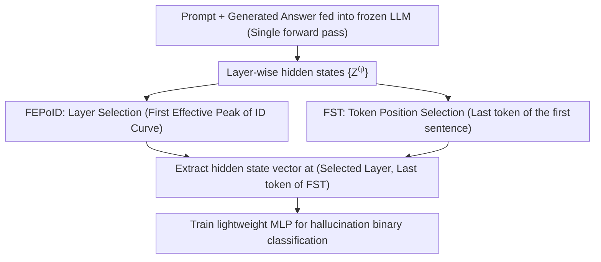

# Automatic Layer Selection for Hallucination Detection

**Conference**: ICML 2026  
**arXiv**: [2605.26366](https://arxiv.org/abs/2605.26366)  
**Code**: https://github.com/DesoloYw/Automatic-Layer-Selection-for-Hallucination-Detection  
**Area**: Hallucination Detection  
**Keywords**: Hallucination Detection, Intermediate Layer Selection, Intrinsic Dimension, Hidden State Probing, Large Language Models

## TL;DR
FEPoID (First Effective Peak of Intrinsic Dimension) is proposed as a training-free automatic layer selection criterion. Combined with the First Sentence Truncation (FST) strategy, it consistently selects near-optimal intermediate layers across various QA and summarization hallucination detection benchmarks, significantly outperforming existing baseline methods.

## Background & Motivation

**Background**: Large Language Models (LLMs) often generate fluent but factually incorrect outputs (hallucinations) in practical deployments. Detecting these hallucinations without modifying the model itself is a critical practical issue. Existing research indicates that hidden states in the intermediate layers of LLMs encode signals related to hallucinations more strongly than the final layer, leading to the emergence of the hidden-state probing detection paradigm.

**Limitations of Prior Work**: Although intermediate layers contain richer hallucination signals, the position of the optimal layer varies significantly across different model architectures and datasets. Existing methods either use a fixed layer (e.g., the middle layer) or evaluate all candidate layers one by one; the former is unreliable, and the latter is computationally expensive. There is a lack of an efficient and principled automatic layer selection method.

**Key Challenge**: The position of the optimal layer depends on the model and data, and no universal fixed selection rule exists. Moreover, existing metrics used to measure layer quality (e.g., RankMe, curvature, gradient norms) are unstable when applied to layer selection for hallucination detection, despite being useful in other scenarios.

**Goal**: (1) Systematically evaluate the effectiveness of various layer selection criteria in hallucination detection; (2) Propose a training-free, computationally efficient, and cross-model/dataset robust automatic layer selection method; (3) Address the token position selection problem during representation extraction.

**Key Insight**: The authors observe that the evolution curve of Intrinsic Dimension (ID) across layers exhibits a stable multimodal pattern—a first peak appears in the intermediate layers, followed by a second, higher peak near the output layer. The authors hypothesize that the first peak captures abstract semantic information (relevant to hallucination detection), while the second peak primarily reflects surface lexical complexity (unhelpful for detection).

**Core Idea**: Selecting the "First Effective Peak of Intrinsic Dimension" (FEPoID) on the ID curve as the layer selection criterion, combined with First Sentence Truncation (FST) to remove noise at the end of generations, achieves unsupervised and efficient hallucination detection.

## Method

### Overall Architecture
This paper addresses two problems in hidden-state probing for hallucination detection that are typically decided heuristically: which model layer and which token position to extract representations from. The entire process is lightweight—the pre-trained LLM remains frozen throughout. The prompt and generated answer are concatenated and fed into the model for a single forward pass to obtain layer-wise hidden states $\{\mathbf{Z}^{(\ell)}\}$. A hidden state vector is then extracted from a specific intermediate layer and token position to train a lightweight MLP for binary classification (hallucination vs. non-hallucination). The core challenge lies not in the classifier, but in the two selection steps: if the layer or token position is chosen incorrectly, the classifier cannot compensate.

The motivation stems from a series of failed attempts: the authors initially applied six existing layer quality criteria from information theory, gradients, and geometry (RankMe, Validation Loss / RGN / SNR, Curvature, ID) to the hallucination detection scenario. These correspond to four intuitive hypotheses—"rich semantics / task alignment / information compression / efficient information capacity"—but none could stably select good layers across models and datasets. The final solution consists of two complementary training-free designs: FEPoID for layer selection and FST for token position selection.

### Key Designs

**1. FEPoID: Automatically Locating the Optimal Intermediate Layer via the "First Effective Peak" of the ID Curve**

The optimal layer position fluctuates heavily across different models and datasets. Picking a fixed middle layer is unreliable, and testing every layer is too expensive. The authors use Intrinsic Dimension (ID) as an entry point: employing the TwoNN estimator to calculate the intrinsic dimension $d_{\text{ID}}^{(\ell)}$ of the representation matrix $\mathbf{Z}^{(\ell)} \in \mathbb{R}^{N \times d}$ for each layer. The resulting ID curve reveals a stable bimodal shape—one peak in the middle layers and another higher peak near the output. The key hypothesis is that the first peak captures abstract semantic information required for detection, while the second reflects surface lexical complexity. Simply selecting the layer with the maximum ID would almost always lead to the second peak at the end.

FEPoID scans all local maxima of the ID curve from shallow to deep layers and uses a forward window $w$ (defaulting to 7) to filter out spurious small peaks. If a candidate peak layer $\ell$ satisfies $d_{\text{ID}}^{(\ell)} < d_{\text{ID}}^{(\min(\ell+w, L))}$ and the ID increases monotonically within the window, it is considered a small fluctuation on an upward slope and discarded. The earliest remaining peak defines the selected layer. The layers selected this way align closely with the oracle optimal layer, and the computation cost—consisting only of ID estimation and a single scan—is negligible.

**2. FST (First Sentence Truncation): Extracting the First Sentence End Token Instead of the Last Token**

Extracting the "last token" is the default convention for probing methods, but the authors found this to be a primary source of noise. LLMs (especially LLaMA) often provide the answer in the first sentence but continue writing, leading to three types of degradation: inconsistent continuation (contradicting the first sentence), semantic drift (deviating from the topic), and degenerative repetition (repeating the same sentence). These subsequent contents contaminate the final token's representation, causing the classifier to learn noise rather than the actual answer signal.

The FST solution is straightforward: use a rule-based sentence boundary detector to find the last token of the first generated sentence and extract the hidden state at that position. It requires no ground-truth labels or auxiliary LLMs and is entirely rule-based and zero-cost. Since answer information is concentrated in the first sentence, truncating here preserves the signal while discarding subsequent noise—providing consistent gains across all baselines as a "method-agnostic" improvement.

## Key Experimental Results

### Main Results (QA Tasks)

AUROC comparison on 5 QA datasets and 2 instruction-tuned models (extracting the last generated token, $w=7$):

| Method | CoQA | SQuAD | HotpotQA | TriviaQA | PsiLoQA | Avg |
|------|------|-------|----------|----------|---------|------|
| Pred. Entropy | 0.583 | 0.570 | 0.710 | 0.686 | 0.360 | 0.582 |
| Semantic Entropy | 0.500 | 0.552 | 0.445 | 0.551 | 0.608 | 0.531 |
| Lexical Similarity | 0.678 | 0.599 | 0.729 | 0.684 | 0.408 | 0.620 |
| EigenScore | 0.525 | 0.530 | 0.599 | 0.588 | 0.508 | 0.550 |
| Probing + Val Loss | 0.671 | 0.616 | 0.768 | **0.786** | 0.784 | 0.725 |
| Probing + Curvature | 0.632 | 0.618 | 0.741 | 0.737 | 0.757 | 0.697 |
| Probing + ID | 0.671 | 0.613 | 0.693 | 0.707 | 0.737 | 0.684 |
| **Probing + FEPoID** | **0.671** | **0.638** | **0.781** | 0.752 | **0.786** | **0.725** |

*Results for LLaMA-3.1-8B-Instruct. FEPoID achieves the best average AUROC. On Mistral-7B, it also ranks first with an average AUROC of 0.853.*

### Summarization Tasks and Computational Efficiency

| Method | HaluEval | CNN/DM | Avg | Computation Time (s) |
|------|----------|--------|------|-------------|
| RankMe | 0.608 | 0.577 | 0.592 | 27.3 |
| Curvature | 0.549 | 0.592 | 0.571 | 45.2 |
| Val Loss | 0.596 | 0.586 | 0.591 | 29.6 |
| RGN | 0.571 | 0.582 | 0.577 | 58.2 |
| SNR | 0.553 | 0.547 | 0.550 | 57.9 |
| **FEPoID** | **0.617** | **0.600** | **0.608** | **10.1** |

*Results for LLaMA-3.1-8B-Instruct. FEPoID not only achieves the best detection performance but also maintains a computation time 1/3 to 1/6 that of other methods.*

### Key Findings
- FEPoID consistently performs optimally or near-optimally across both QA and summarization tasks, 5 model scales (1B-8B), and two tuning strategies (base and instruct), demonstrating strong generalization.
- FST brings consistent AUROC gains to all baseline methods (method-agnostic gain), particularly on LLaMA (which is more prone to trailing noise), significantly improving Fisher separation and silhouette coefficients.
- Selecting the maximum ID layer directly leads to performance drops on datasets like HotpotQA and TriviaQA by choosing layers too deep; FEPoID avoids this trap via the forward window mechanism.
- Sensitivity analysis for the hyperparameter $w$ shows that FEPoID is robust to its choice, maintaining stable performance across a wide range.

## Highlights & Insights
- The design of FEPoID is elegant—achieving training-free and label-free automatic layer selection using only TwoNN ID estimation and a forward window. The negligible computational overhead (approx. 10s for all 32 layers) makes it highly attractive for practical deployment.
- The "method-agnostic" nature of FST is highly practical: it improves not only hidden-state probing but also uncertainty-based and lexical similarity baselines, suggesting that "trailing noise" is a widespread and underestimated issue.
- The "Bimodal ID Curve Hypothesis" provides a new perspective on hierarchical representations in Transformers: intermediate peak = abstract semantics, terminal peak = surface complexity. This insight can be transferred to other downstream tasks requiring intermediate layer representations.

## Limitations & Future Work
- Experiments only cover models of 1B-8B scale. Layer selection behavior in larger models (70B+) might differ, and the validity of the bimodal hypothesis in those cases needs verification.
- FST relies on rule-based sentence boundary detection, which may not apply to non-English languages or non-natural sentence structures (e.g., code, mathematical derivations).
- Currently only validated on QA and summarization tasks; the definition and distribution of hallucinations in open-ended generation (e.g., dialogue, creative writing) are different and require testing for generalization.
- Future work could explore dynamizing layer selection—choosing different layers for different input samples—or combining multi-layer representations to further enhance detection performance.

## Related Work & Insights
- **INSIDE** (Chen et al., 2024): Uses LLM internal states for hallucination detection with a fixed middle layer selection; FEPoID provides a superior automated alternative.
- **Semantic Entropy** (Farquhar et al., 2024): Estimates uncertainty at the semantic level but requires multiple samplings; the hidden-state probing method in this paper requires only a single forward pass.
- **EigenScore** (Chen et al., 2024): Evaluates representation quality based on the covariance spectrum properties of hidden states, but its layer selection strategy is sub-optimal.
- **ID and Layer Selection**: Cheng et al. (2025) found that layers near the maximum ID transfer to downstream tasks first; this paper further refines this as "the first effective peak is the optimal choice."

<!-- RELATED:START -->

## Related Papers

- [\[NeurIPS 2025\] Robust Hallucination Detection in LLMs via Adaptive Token Selection](../../NeurIPS2025/hallucination/robust_hallucination_detection_in_llms_via_adaptive_token_selection.md)
- [\[ICML 2026\] From Out-of-Distribution Detection to Hallucination Detection: A Geometric View](from_out-of-distribution_detection_to_hallucination_detection_a_geometric_view.md)
- [\[ICML 2026\] Finding the Correct Visual Evidence Without Forgetting: Mitigating Hallucination in LVLMs via Inter-Layer Visual Attention Discrepancy](finding_the_correct_visual_evidence_without_forgetting_mitigating_hallucination_.md)
- [\[ICML 2026\] Harnessing Reasoning Trajectories for Hallucination Detection via Answer-agreement Representation Shaping](harnessing_reasoning_trajectories_for_hallucination_detection_via_answer-agreeme.md)
- [\[CVPR 2026\] TriDF: Evaluating Perception, Detection, and Hallucination for Interpretable DeepFake Detection](../../CVPR2026/hallucination/tridf_evaluating_perception_detection_and_hallucination_for_interpretable_deepfa.md)

<!-- RELATED:END -->
